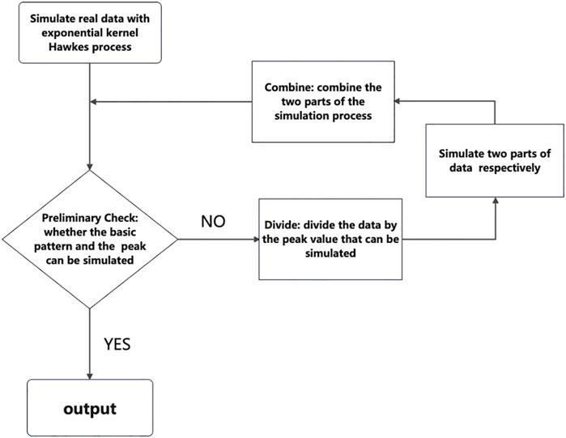

In the rapidly changing world of algorithmic trading, mathematical models have become crucial for predicting market behavior with high precision. Among these models, the Hawkes process stands out due to its self-exciting nature, making it particularly effective for modeling market events. Originally used for analyzing seismic activity, this stochastic process is now vital in financial markets for understanding trade sequences and price changes.

The Hawkes process operates on the principle that each event increases the likelihood of subsequent events, capturing the inherent clustering nature of occurrences. This self-excitation is characterized by an intensity function that evolves based on past events, effectively modeling feedback loops found in financial markets. In trading, where milliseconds count, the ability to predict sequences of trades or price movements can provide a significant strategic advantage.

Traders leverage the clustering feature of the Hawkes process to gain insights into market dynamics, such as identifying periods of heightened activity or potential price surges. By modeling these dynamics accurately, traders can optimize their strategies, refine execution, and manage risks more effectively.

This article will explore the roles and applications of the Hawkes process in algorithmic trading, highlighting its mathematical foundations, practical applications, benefits, challenges, and how it contributes to a competitive edge in financial markets.

## Table of Contents

## Understanding the Hawkes Process

The Hawkes process is a self-exciting stochastic process where the occurrence of each event increases the probability of subsequent events in the near future. This is achieved through an intensity function, which is a fundamental component of the process, typically expressed in terms of time and the history of past events. Mathematically, the intensity function $\lambda(t)$ can be defined as:

$$
\lambda(t) = \mu + \sum_{t_i < t} \phi(t - t_i)
$$

where $\mu$ represents the baseline intensity, and $\phi(t - t_i)$ is a response or triggering function that accounts for the impact of previous events occurring at times $t_i$. The triggering function often decays over time, indicating that the influence of an earlier event on the likelihood of future events decreases as time passes.

A critical aspect of the Hawkes process is the branching ratio, $\eta$, which indicates the average number of events triggered by an initial event. It is computed as the integral of the response function over time:

$$
\eta = \int_0^\infty \phi(s) \, ds
$$

The branching ratio provides insight into the long-term behavior of the process. If $\eta < 1$, the process is subcritical, meaning that the event sequence dissipates over time. If $\eta = 1$, it is critical, meaning the sequence maintains a steady-state. Conversely, if $\eta > 1$, the process is supercritical, leading to a proliferating sequence of events.

This mathematical structure enables Hawkes processes to effectively model event clusters, an essential feature when analyzing systems with inherent feedback loops. In financial markets, for example, the clustering of trades can lead to periods of heightened [volatility](/wiki/volatility-trading-strategies) or significant price movements, all of which can be captured by the Hawkes process. This attribute is invaluable for traders and analysts who need to understand and predict the dynamics of such sequences in real-time environments.

## Mathematical Foundation

The Hawkes process is a sophisticated extension of the conventional Poisson process, designed to model the occurrence of events that are clustered in time. Unlike the Poisson process, where events occur independently, the Hawkes process introduces a self-exciting mechanism whereby each event increases the likelihood of subsequent events. This characteristic is mathematically introduced through its intensity function, which is central to understanding the process.

The intensity function of a Hawkes process is typically defined as:

$$
\lambda(t) = \lambda_0 + \sum_{t_i < t} g(t - t_i)
$$

Here, $\lambda(t)$ represents the intensity at time $t$, $\lambda_0$ is the baseline intensity, and $g(\cdot)$ is the response function that quantifies how past events influence the likelihood of future occurrences. The self-exciting nature of the Hawkes process is encapsulated in the response function $g(t - t_i)$, which typically takes a form that decays over time, signifying that the influence of an event diminishes as time progresses.

A crucial parameter in the Hawkes process is the branching ratio, denoted as $n$. The branching ratio represents the expected number of offspring events generated by a single event and is derived as the integral of the response function over time:

$$
n = \int_0^{\infty} g(t) \, dt
$$

This ratio is pivotal for assessing the long-term behavior of the process. If $n < 1$, the process is subcritical, leading to event sequences that naturally decay over time. Conversely, when $n = 1$, the process is critical, and events occur in a sustained manner. For $n > 1$, the process is supercritical, and events can proliferate indefinitely, potentially leading to explosive dynamics.

The mathematical foundation of the Hawkes process, with its intensity function and branching ratio, provides a potent framework for modeling systems where past occurrences influence future events. Its ability to dynamically adjust based on historical data makes it particularly effective for applications requiring an understanding of temporal event clusters, such as in [algorithmic trading](/wiki/algorithmic-trading) and other fields where feedback loops are present.

## Applications in Algorithmic Trading

Hawkes processes have gained prominence in the field of algorithmic trading, particularly within high-frequency trading ([HFT](/wiki/high-frequency-trading-strategies)) environments. Their ability to model clusters of trade events provides valuable insights into the underlying market dynamics. These processes allow traders to detect and anticipate spikes in trading activity and sudden price fluctuations, which are crucial for understanding market behavior under stress conditions.

In practice, Hawkes processes model the self-exciting nature of trades, where the occurrence of an event increases the probability of subsequent events occurring shortly thereafter. This characteristic mirrors real-world trading scenarios where large trades or rapid sequences of transactions create ripples through the market, influencing future trades. By capturing these clusters, Hawkes models facilitate the prediction of periods of heightened trading activity and potential volatility, essential for both risk management and tactical decision-making in trading strategies.

The utility of Hawkes processes extends to refining execution strategies. By identifying patterns of trade clustering, traders can determine optimal trade windows, timing their trades to align with periods of lower expected market impact. This capability is particularly advantageous in high-frequency contexts, where milliseconds matter, and executing trades with minimal market disruption can lead to significant cost savings.

Moreover, risk management benefits as traders utilizing Hawkes models are better equipped to anticipate and respond to market stress points. These models, through their intensity functions and branching ratios, provide estimates of how likely future trading sequences are to occur based on observed activity. This foresight enables traders to preemptively adjust their positions or employ hedging strategies to mitigate potential losses.

Implementing Hawkes processes in algorithmic trading involves leveraging advanced statistical methods and computing power. The calibration of the model to accurately reflect market conditions requires continuous data feeds and real-time analysis capabilities. Despite these challenges, the rewards for employing such models are substantial, offering traders a critical edge in fast-paced trading environments where quick, informed decisions are paramount.

## Benefits and Challenges

The use of the Hawkes process in algorithmic trading brings several benefits, most notably its ability to model temporal clusters with high precision. Temporal clustering is critical for accurately predicting trading volumes and price movements, as financial markets often exhibit clustered activity due to various factors such as economic announcements, market sentiment shifts, and institutional trading strategies. By leveraging the self-exciting nature of the Hawkes process, traders can gain insights into periods of increased market activity and volatilities, providing a competitive advantage in formulating trading strategies.

One of the core strengths of the Hawkes process is its flexibility in adapting to various market conditions. This adaptability not only enhances predictive accuracy but also allows for better management of market impact and slippage. When applied to high-frequency trading, the Hawkes process's ability to identify clusters of trade events enables traders to optimize trade execution, minimize costs, and enhance profitability. The process's intensity function can be fine-tuned to reflect specific market dynamics, thereby improving the granularity of market models.

However, alongside these benefits lie challenges, primarily in model calibration and computational demands. Accurately calibrating a Hawkes process to reflect real-world data requires a meticulous approach to parameter estimation. This involves advanced statistical methods, often necessitating maximum likelihood estimation or least squares techniques to ensure the model accurately captures the inherent dynamics of the financial market. Moreover, the computational complexity of fitting and updating Hawkes models can be significant, particularly when dealing with large, high-frequency data sets. This requires substantial computational resources and sophisticated algorithms to maintain real-time responsiveness.

The need for continuous data updates presents another challenge, as market conditions change rapidly and necessitate frequent recalibration of the model parameters to maintain accuracy. Integrating [machine learning](/wiki/machine-learning) algorithms with traditional statistical methods can aid in managing these dynamics, allowing for automated adjustments and improving model resilience to market changes. Additionally, the choice of kernel functions in the Hawkes process can influence the outcome, necessitating careful selection based on empirical data characteristics.

Overall, the successful implementation of the Hawkes process in algorithmic trading requires a deep understanding of both its mathematical foundations and the practicalities of financial markets. The combination of sophisticated statistical techniques and advanced computing infrastructure is essential to fully leverage its capabilities and integrate them seamlessly into trading systems. As computational power and data processing techniques continue to advance, the application of Hawkes processes is poised to become even more integral in the quest for trading efficiency and accuracy.

## Conclusion

The Hawkes process is an indispensable tool in quantitative finance due to its robust ability to offer insights into market behaviors and intricate trading dynamics. Its self-exciting nature allows it to model temporal clusters of financial events, which is particularly useful for analyzing patterns in trading activity. By leveraging historical market data, traders can achieve a more profound understanding of price movement trends and trading volumes, leading to the formulation of more effective trading strategies. The mathematical foundation of the Hawkes process, with its dynamic intensity function and branching ratio, supports the identification of event clustering, making it a suitable model for predicting sudden changes in market conditions.

In rapidly evolving market environments, the adaptability of the Hawkes process provides a crucial advantage. Its capability to adjust predictions based on incoming data means that traders can continuously refine their strategies in response to new market information, thus maintaining a competitive edge. This adaptability extends beyond mere prediction, as the Hawkes process also assists in risk management and optimization of trading executions. 

As markets become more complex and data-driven, the role of the Hawkes process is likely to expand, offering further opportunities for innovation in trading strategy development. The continuous evolution of financial markets will test the limits of current models, but the inherent flexibility and comprehensive framework of the Hawkes process make it a pivotal area of focus for future advancements in algorithmic trading.

## Further Reading and References

Key resources for understanding the Hawkes process and its application in financial markets can be traced back to foundational papers by Alan G. Hawkes. His pioneering work on the concept of self-exciting processes laid the groundwork for extending this mathematical model to various domains, including finance. For a comprehensive exploration, readers are encouraged to refer to Hawkes' seminal papers that introduce the mathematical intricacies of the Hawkes process, particularly the derivation and implications of its intensity function and branching ratio.

In the context of high-frequency trading, recent studies have emphasized the utility of the Hawkes process in modeling and predicting market dynamics. These studies not only highlight the process's capability in capturing the temporal clustering of market events but also in assessing systemic risk. Through empirical and theoretical analysis, researchers have demonstrated how the Hawkes process can be utilized to identify patterns of trading activity, price movements, and even the formation of market bubbles or crashes. Some notable works include the application of the Hawkes process to [order book](/wiki/order-book-trading-strategies) dynamics, where the model is used to simulate and predict the ebb and flow of trade orders, aiding in the development of execution algorithms.

For traders aiming to excel in algorithmic strategies, acquiring a profound understanding of these processes involves delving into quantitative finance textbooks that cover stochastic processes, high-frequency data analysis, and algorithmic trading frameworks. Key texts and papers provide detailed methodologies for implementing the Hawkes process and interpreting results within the context of financial data, offering practical guidance on model calibration and computational implementation.

To further assist in practical applications, several open-source libraries in Python, such as `tick` or `PyHawkes`, offer tools for simulating and fitting Hawkes process models to data. These libraries encompass functions for estimating model parameters, visualizing event sequences, and conducting statistical testing, thus serving as invaluable resources for financial analysts and data scientists. By leveraging these resources, traders and researchers can enhance their analytical toolkit, ensuring sophisticated trading strategies that capitalize on the predictive prowess of the Hawkes process.

## References & Further Reading

[1]: Hawkes, A.G. (1971). ["Spectra of Some Self-Exciting and Mutually Exciting Point Processes."](https://www.dcscience.net/Hawkes-Biometrika-1971.pdf) Biometrika, 58(1), 83-90.

[2]: Bacry, E., Mastromatteo, I., & Muzy, J.-F. (2015). ["Hawkes Processes in Finance."](https://arxiv.org/abs/1502.04592) Market Microstructure and Liquidity, 1(1).

[3]: Bowsher, C.G. (2007). ["Modelling Security Market Events in Continuous Time: Intensity Based, Multivariate Point Process Models."](https://www.sciencedirect.com/science/article/pii/S030440760600251X) The Review of Financial Studies, 20(2), 376-414.

[4]: Filimonov, V., & Sornette, D. (2012). ["Quantifying Reflexivity in Financial Markets: Towards a Prediction of Flash Crashes."](https://link.aps.org/doi/10.1103/PhysRevE.85.056108) SSRN Electronic Journal.

[5]: Large, J. (2007). ["Measuring the Resiliency of an Electronic Limit Order Book."](https://www.sciencedirect.com/science/article/pii/S1386418106000528) The Review of Economic Studies, 74(4), 1075-1107.

[6]: Rambaldi, M., Bacry, E., & Lillo, F. (2017). ["The Role of Volume in Order Book Dynamics: A Multivariate Hawkes Process Analysis."](https://www.tandfonline.com/doi/full/10.1080/14697688.2016.1260759) Journal of Applied Econometrics, 32(5), 938-955.