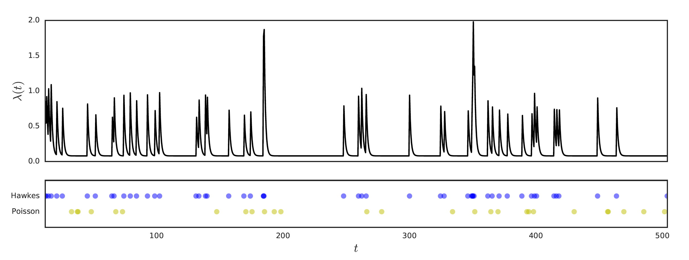
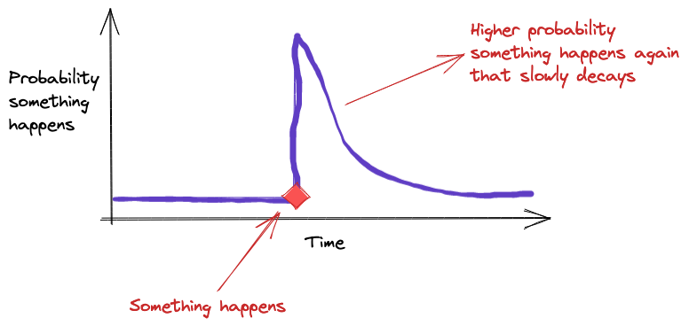
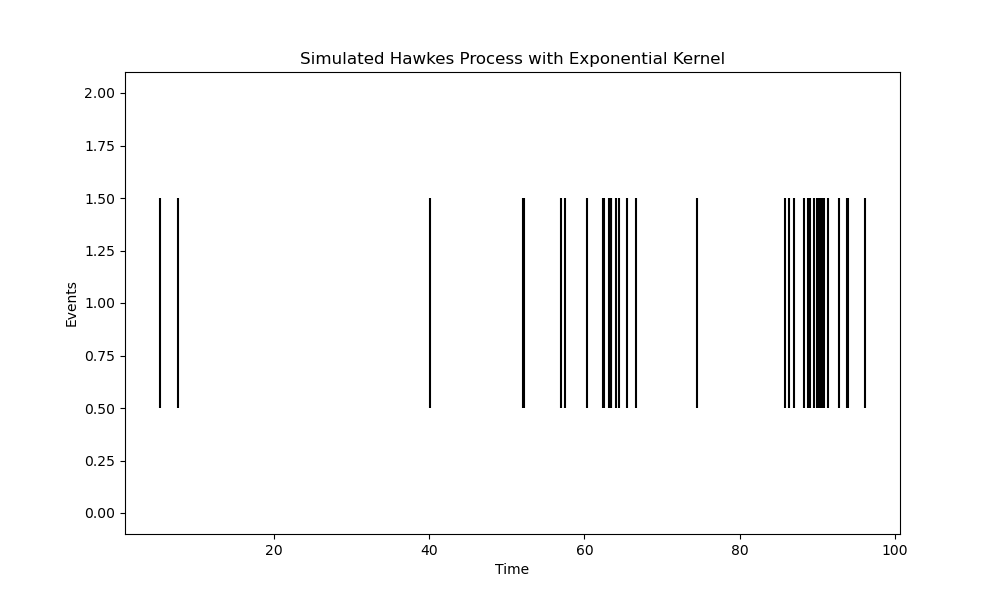

## Table of Contents

## What is a Hawkes process in simple terms?

A Hawkes process is a way to model events that tend to cluster together in time, where one event can trigger more events. Imagine a social media post going viral: the initial post gets attention, which leads to more shares and comments, each sparking even more activity. Unlike a steady, random drip of events (like raindrops on a roof), a Hawkes process captures this "self-exciting" behavior, where past events increase the chances of new ones happening soon after. It’s a tool used to understand and predict patterns in things like earthquakes, stock trades, or even crime waves—anything where events seem to bunch up and influence each other.



## Who developed the Hawkes process, and when?

The Hawkes process was developed by Alan G. Hawkes, a British statistician, in the early 1970s. He introduced it in a pair of papers published in 1971, with the first one titled "Spectra of Some Self-Exciting and Mutually Exciting Point Processes" appearing in the journal *Biometrika*. Hawkes was working on ways to model events that don’t happen randomly but instead influence each other, building on earlier ideas about point processes. His work laid the groundwork for what we now call the Hawkes process, a tool that’s since found its way into fields like seismology, finance, and beyond.

## What real-world phenomena can the Hawkes process model?

The Hawkes process is great for modeling real-world phenomena where events cluster together and trigger more events, thanks to its self-exciting nature. Here are some key examples:

- **Earthquakes**: It captures how an initial quake often leads to aftershocks, with each aftershock potentially sparking more in a cascading pattern.
- **Financial Markets**: It can model bursts of trading activity, like when a big trade or market news triggers a flurry of buy or sell orders.
- **Social Media Activity**: It tracks how a viral post or tweet spurs likes, retweets, and replies, each amplifying the spread further.
- **Crime Patterns**: It’s used to analyze how one crime, like a burglary, might inspire copycat incidents in the same area soon after.
- **Epidemics**: It can represent disease spread, where one infection leads to more cases in a short time frame.
- **Neuroscience**: It models neuron firing, where one spike can excite nearby neurons to fire in quick succession.

In short, any situation where events don’t just happen randomly but seem to “feed off” each other—whether it’s shaking ground, buzzing markets, or spreading rumors—the Hawkes process can step in to make sense of the chaos.

## What are the applications of Hawkes process in algorithmic trading?

Hawkes processes are particularly well-suited for modeling high-frequency trading data, where the timing and sequence of trades play a critical role in understanding market dynamics. These stochastic processes account for the clustering of trade events, recognizing that trades often trigger subsequent trades in short succession. This characteristic is vital for understanding market microstructure dynamics, as it allows financial analysts to identify patterns within trading activities that can have significant implications on price movements.

By capturing the self-exciting nature of trades, Hawkes models help in predicting spikes in trading activity and sudden price changes. For instance, following an initial trade, the increased intensity function in a Hawkes model signals a higher probability of further trades occurring shortly thereafter. This makes it a valuable tool for predicting future trading [volume](/wiki/volume-trading-strategy)s and potential price [volatility](/wiki/volatility-trading-strategies), enabling traders to anticipate stress points within the market and adjust their strategies accordingly.

Traders and financial analysts utilize Hawkes processes to enhance their decision-making processes and optimize trading strategies. These models can be implemented in various [algorithmic trading](/wiki/algorithmic-trading) strategies to identify optimal trade execution windows based on anticipated market activity. Moreover, they assist in the detection of market trends and reversals by analyzing the sequences and frequencies of trade events.

Beyond individual trading strategies, Hawkes processes also have applications in risk management and portfolio optimization. By analyzing trade data, financial institutions can better assess market risk, recognizing periods when trading activity and thus market risk are likely to increase. This supports more informed decision-making regarding asset allocation and exposure limits.

Overall, the application of Hawkes processes in high-frequency trading environments underscores their utility in decoding complex market behaviors. By embedding these models in algorithmic trading frameworks, professionals in finance gain a more nuanced understanding of the market dynamics, which can be critical in maintaining a competitive edge in fast-paced trading scenarios.

## How does the Hawkes process differ from a Poisson process?

The Hawkes process and the Poisson process are both ways to model events over time, but they differ fundamentally in how they handle event patterns.

A Poisson process assumes events happen randomly and independently at a constant average rate—like raindrops hitting a window with no influence from one drop to the next. If you know the average rate (say, 5 drops per minute), the timing of each drop doesn’t depend on when the last one fell. It’s steady, predictable, and lacks memory.

The Hawkes process, on the other hand, is all about memory and clustering. It’s "self-exciting," meaning past events increase the likelihood of future ones happening soon after—like how a viral tweet sparks more tweets. Instead of a constant rate, its intensity (the expected rate of events) ramps up after each event and then fades over time. For example, an earthquake might trigger aftershocks, making events bunch together rather than spread out evenly.

So, while a Poisson process gives you a flat, random scatter of events, a Hawkes process creates bursts and waves, capturing how real-world happenings often snowball instead of staying independent. That’s the big difference: independence versus influence.

## What are the key components of a Hawkes process?

A Hawkes process has a few key components that work together to model how events cluster and trigger each other. Here’s what makes it tick:

1. **Background Intensity (λ₀)**: This is the base rate at which events happen randomly, even without any triggering. Think of it as the quiet “hum” of activity—like occasional tweets on a slow news day—before anything exciting kicks off.

2. **Triggering Kernel (g(t))**: This is the heart of the self-excitation. It describes how much a past event boosts the chance of new events and how that influence fades over time. For example, it might be a sharp spike that drops off fast (like an exponential decay) or a slower fade (like a power-law), depending on the situation—say, aftershocks dying down after an earthquake.

3. **Event History**: The process keeps track of when past events happened because they shape what’s coming next. Each event adds a little “push” to the intensity, stacking up based on the kernel. It’s like a memory bank that says, “Hey, something just happened, so expect more soon.”

4. **Conditional Intensity Function (λ(t))**: This ties it all together. It’s the rate at which events are expected to occur at any given moment, combining the background rate with the piled-up effects of past events. If a bunch of events just happened, this spikes up; if things have been quiet, it settles back toward the background.

In essence, the Hawkes process starts with a steady trickle (background intensity), then layers on bursts of activity (via the kernel and event history), all reflected in a dynamic intensity function. That’s how it captures the ripple effects you see in things like market trades or social media storms.

## How does the intensity function work in a Hawkes process?

The intensity function in a Hawkes process, often written as λ(t), is the engine that drives the model. It tells you the expected rate of events at any given moment, adjusting dynamically based on what’s happened before. Here’s how it works in simple terms:

At its core, the intensity function has two parts that add up:
- **Background Rate (λ₀)**: This is the constant baseline rate of events that would happen even if nothing exciting was going on. It’s like the steady drip of a faucet—always there, no matter what.
- **Excitation from Past Events**: This is where the magic happens. Every past event adds a boost to the intensity, but that boost fades over time. The size and duration of each boost depend on a “triggering kernel” (usually called g(t)), which acts like a rulebook for how much influence an event has and how long it lasts.

So, mathematically, it looks something like this:  
λ(t) = λ₀ + Σ g(t - tᵢ), where the sum is over all past events at times tᵢ (where tᵢ < t).  
- If t is right after an event, the kernel g(t - tᵢ) is big, spiking the intensity up.  
- As time passes (t gets farther from tᵢ), g(t - tᵢ) shrinks, and the intensity drops back toward λ₀.

Picture it like a social media frenzy: a big post happens at time t₁, and the intensity (chance of more posts) jumps because g(t - t₁) is high. As hours pass, the hype dies down, and the intensity eases back to the quiet background rate—unless another post stirs things up again.

In short, the intensity function is a live tracker: it starts with a baseline, then piles on temporary surges from each past event, making it perfect for modeling bursts like aftershocks or trading spikes.

## What is the role of the triggering kernel in the Hawkes process?

The triggering kernel in a Hawkes process, usually written as g(t), is the rule that decides how much a past event stirs up new ones and how long that influence lasts. It’s the key to the “self-exciting” part of the model, shaping the way events cluster together.

Here’s its role in plain terms:  
- **Boosting Effect**: When an event happens, the kernel kicks in to increase the intensity—the rate at which new events occur. Think of it like a splash in a pond: the event is the splash, and the kernel says how big the ripples are.
- **Time Decay**: The kernel also controls how those ripples fade. It’s a function of time (t), so g(t - tᵢ) measures how much an event at time tᵢ still matters at the current time t. If t is close to tᵢ, the effect is strong; if t is far away, it’s weak or gone.
- **Shape of Influence**: The kernel’s form decides the pattern of clustering. For example, an exponential kernel (like g(t) = αe^(-βt)) means the influence drops off fast, like a quick burst of retweets after a post. A power-law kernel (like g(t) = k/t^(1+θ)) fades slower, fitting longer-lasting effects like earthquake aftershocks.

In the intensity function, λ(t) = λ₀ + Σ g(t - tᵢ), the kernel gets applied to every past event, stacking their contributions. So, if a bunch of events happen close together, the kernel amps up the intensity a lot, creating that bursty, cascading feel—like a market panic or a viral trend.

In short, the triggering kernel is the Hawkes process’s way of saying, “Here’s how one event sparks others, and here’s how that spark dies out.” It’s what makes the model flexible enough to fit real-world chaos.

## Can you provide a basic mathematical formula for a Hawkes process?

The Hawkes process is a stochastic process known for its self-exciting property, meaning that each event increases the probability of future events occurring. This feature is particularly useful for modeling occurrences that have clustered patterns over time, as is often seen in fields like finance and social networks.

Mathematically, a Hawkes process is defined by an intensity function that modulates over time. The intensity function, denoted as $\lambda(t)$, determines the rate at which events are expected to happen at any given time $t$. For a linear Hawkes process, this intensity function is typically expressed as:

$$

\lambda(t) = \mu + \sum_{t_i < t} \phi(t - t_i) 
$$

Here, $\mu$ represents the baseline intensity, which is the rate of events when no other events have occurred recently. The sum $\sum_{t_i < t} \phi(t - t_i)$ captures the influence of past events on the current rate through a kernel function $\phi$. This kernel often takes forms like exponential decay, indicating that the influence of an event diminishes over time. A common choice is:

$$
\phi(t - t_i) = \alpha \cdot \exp(-\beta (t - t_i))
$$

where $\alpha$ signifies the magnitude of influence per event, and $\beta$ reflects the decay rate.

The propagation of events within a Hawkes process is often described using a branching structure where each initial event (or 'parent' event) may spawn subsequent 'daughter' events, contributing to further clustering of occurrences. This aspect can be quantified using the branching ratio $n$, defined as:

$$
n = \int_{0}^{\infty} \phi(t) \, dt
$$

The branching ratio $n$ indicates the average number of offspring events triggered by a single past event. A critical threshold exists where $n < 1$, suggesting that the process is sub-critical and events will eventually die out, while $n = 1$ corresponds to a critical branching process, and $n > 1$ signifies a super-critical process where events could proliferate exponentially.

The self-exciting nature of the Hawkes process, captured through these mathematical formulations, makes it highly applicable and insightful for analyzing systems with feedback loops and clustering of events over time. Its ability to model how past events influence future occurrences provides a versatile framework across various domains.


## What types of data are typically analyzed using a Hawkes process?

The Hawkes process is tailor-made for analyzing data where events cluster together and influence each other over time. It shines with datasets that show bursts or cascades rather than random, evenly spaced occurrences. Here are the types of data it typically tackles:

- **Timestamps of Discrete Events**: The Hawkes process works with "point process" data—lists of when events happen. Think of earthquake times, trade execution times, or tweet posting times. It doesn’t care about the “size” of events (like magnitude or trade volume) unless you extend it; it just needs the moments they occur.

- **Clustered or Bursty Patterns**: It’s ideal for data where events bunch up. For example:
  - **Earthquake Records**: Timestamps of quakes and aftershocks, where one jolt triggers more.
  - **Financial Transactions**: Times of trades or price jumps, like during a market frenzy.
  - **Social Media Activity**: Posting times of tweets, retweets, or comments during a viral spike.

- **Temporal Sequences with Memory**: Data where past events seem to “remember” and spark future ones. This could be:
  - **Crime Logs**: Times of incidents like burglaries, where one might inspire copycats nearby.
  - **Epidemiological Data**: Infection times, where one case leads to a cluster of others.
  - **Neuron Firing**: Spike times in brain activity, where one neuron firing excites others.

- **Real-Time or Historical Logs**: Whether it’s live streams (like trades ticking in) or historical records (like seismic archives), the data just needs to mark when things happen, not why or how big.

The catch? The data should show some self-excitation—events triggering more events. If it’s too random or steady (like a metronome), a simpler model like a Poisson process might fit better. But for anything with a ripple effect—quakes, trades, tweets, crimes—the Hawkes process is a go-to tool.

## How do you simulate a Hawkes process computationally?

Simulating a Hawkes process computationally involves generating a sequence of event times where each event can trigger more, based on a background rate and a triggering kernel. One common method is the **thinning algorithm** (also called Ogata’s modified thinning), which is efficient and intuitive. Below, I’ll explain the steps and provide Python code to simulate a univariate Hawkes process with an exponential kernel.

### How It Works
1. **Start with Background Events**: Events occur at a constant baseline rate (λ₀), like a Poisson process.
2. **Add Self-Excitation**: Each event increases the intensity via the kernel (e.g., g(t) = αe^(-βt)), and new events are accepted or rejected based on this updated intensity.
3. **Thin the Candidates**: Generate potential event times and keep them if they fit the current intensity; otherwise, discard them.

### Steps in Detail
- Initialize with a time horizon (T) and background rate (λ₀).
- Use an upper bound of the intensity (initially λ₀) to propose event times.
- For each proposed time, compute the true intensity (λ(t)) based on past events.
- Accept the event with a probability proportional to λ(t) divided by the upper bound.
- Update the intensity and repeat until you exceed T.

### Python Code
Here’s a simulation with an exponential kernel (g(t) = αe^(-βt)):

```python
import numpy as np
import matplotlib.pyplot as plt

def simulate_hawkes(T, lambda_0, alpha, beta):
    """
    Simulate a Hawkes process with exponential kernel.
    Parameters:
        T: Time horizon (float)
        lambda_0: Background intensity (float)
        alpha: Excitation strength (float, alpha < beta for stability)
        beta: Decay rate (float)
    Returns:
        events: List of event times
    """
    events = []
    t = 0
    
    while t < T:
        # Initial upper bound is background rate if no events yet
        if not events:
            lambda_upper = lambda_0
        else:
            # Compute current intensity from all past events
            lambda_t = lambda_0 + sum(alpha * np.exp(-beta * (t - ti)) for ti in events)
            lambda_upper = max(lambda_t, lambda_0)  # Use current intensity as upper bound
        
        # Generate next candidate time (exponential waiting time)
        t += np.random.exponential(1 / lambda_upper)
        if t > T:
            break
        
        # Compute true intensity at candidate time
        lambda_t = lambda_0 + sum(alpha * np.exp(-beta * (t - ti)) for ti in events)
        
        # Accept event with probability lambda_t / lambda_upper
        if np.random.uniform(0, 1) < lambda_t / lambda_upper:
            events.append(t)
    
    return np.array(events)

# Parameters
T = 100          # Simulate up to time 100
lambda_0 = 0.1   # Background rate
alpha = 0.5      # Excitation strength (how much each event boosts intensity)
beta = 1.0       # Decay rate (how fast the boost fades)

# Simulate
event_times = simulate_hawkes(T, lambda_0, alpha, beta)

# Plot
plt.figure(figsize=(10, 6))
plt.eventplot(event_times, color='black')
plt.xlabel("Time")
plt.ylabel("Events")
plt.title("Simulated Hawkes Process with Exponential Kernel")
plt.show()

# Print number of events
print(f"Number of events: {len(event_times)}")
```

### Explanation of the Code
- **Parameters**: 
  - `lambda_0` sets the baseline event rate.
  - `alpha` controls how much each event excites the process (keep α < β to ensure stability, avoiding infinite events).
  - `beta` sets how fast the excitement decays.
  - `T` is the time window.
- **Thinning**: We propose times using an exponential distribution with an upper-bound intensity, then accept them if a random draw beats the ratio of true intensity to the upper bound.
- **Output**: A list of event times, plotted as a timeline to show clustering.




## What are the differences between a univariate and multivariate Hawkes process?

A Hawkes process is a type of self-exciting point process used to model events that cluster in time, where the occurrence of one event increases the likelihood of subsequent events. The distinction between *univariate* and *multivariate* Hawkes processes lies in the number of event types or dimensions they consider.

A **univariate Hawkes process** deals with a single type of event. It models a single sequence of events where the timing of each event influences the probability of future events of the same type. The intensity function, which governs the rate at which events occur, depends only on the history of that single event type. Mathematically, the intensity function for a univariate Hawkes process can be written as:

$$
\lambda(t) = \mu + \sum_{t_i < t} g(t - t_i)
$$

Here, $\mu$ is the baseline intensity (a constant rate of events occurring independently of past events), and $g(t - t_i)$ is the triggering function (or kernel) that describes how past events at times $t_i$ increase the intensity at time $t$. For example, $g$ might decay exponentially, like $g(u) = \alpha e^{-\beta u}$, where $\alpha$ controls the magnitude of the excitation and $\beta$ controls the decay rate.

In contrast, a **multivariate Hawkes process** models multiple types of events that can influence each other. Imagine a system with several event streams (e.g., trades in different stocks, or posts across multiple social media topics), where an event in one stream can trigger events in the same stream (self-excitation) *and* in other streams (cross-excitation). The intensity function for each event type depends not only on its own past events but also on the histories of the other event types. For a multivariate Hawkes process with $K$ event types, the intensity for the $k$-th type is:

$$
\lambda_k(t) = \mu_k + \sum_{j=1}^K \sum_{t_{j,i} < t} g_{kj}(t - t_{j,i})
$$

Here, $\mu_k$ is the baseline intensity for type $k$, and $g_{kj}(t - t_{j,i})$ is the triggering function describing how an event of type $j$ at time $t_{j,i}$ affects the intensity of type $k$. The key difference is the cross-term: $g_{kj}$ allows events of type $j$ to influence type $k$, capturing interactions between different processes. If $k = j$, it’s self-excitation; if $k \neq j$, it’s cross-excitation.

To summarize:
- **Univariate**: One event type, self-excitation only, simpler model. Think of it as modeling a single contagious phenomenon, like earthquake aftershocks.
- **Multivariate**: Multiple event types, both self- and cross-excitation, more complex. It’s like modeling a network of interacting phenomena, such as information spreading across different communities.

The multivariate version is more flexible but harder to fit due to the increased number of parameters (e.g., a separate $g_{kj}$ for each pair of event types). Both are widely used in fields like seismology, finance, and social media analysis, depending on whether you’re studying one process or a system of interrelated ones.

## How is parameter estimation performed for a Hawkes process (e.g., maximum likelihood estimation)?

Parameter estimation for a Hawkes process, such as through maximum likelihood estimation (MLE), is a fascinating exercise in modeling temporal point processes.

The goal of MLE is to find the parameter set $\theta = (\mu, \alpha, \beta)$ (assuming an exponential kernel) that maximizes the likelihood of observing the given sequence of event times $t_1, t_2, ..., t_n$ over some interval $[0, T]$.

### Step 1: Construct the Likelihood Function
For a point process like the Hawkes process, the likelihood function is derived from the conditional intensity. Given a set of event times $\{t_i\}_{i=1}^n$ in $[0, T]$, the log-likelihood function is:

$$
L(\theta) = \sum_{i=1}^n \log \lambda(t_i) - \int_0^T \lambda(s) \, ds
$$

- The first term, $\sum_{i=1}^n \log \lambda(t_i)$, accounts for the probability density of each event occurring at its observed time.
- The second term, $-\int_0^T \lambda(s) \, ds$, is the negative log of the survival probability over the interval, representing the total expected number of events.

Substituting the intensity function:

$$
L(\mu, \alpha, \beta) = \sum_{i=1}^n \log \left( \mu + \alpha \sum_{t_j < t_i} \beta e^{-\beta (t_i - t_j)} \right) - \int_0^T \left( \mu + \alpha \sum_{t_j < s} \beta e^{-\beta (s - t_j)} \right) ds
$$

### Step 2: Simplify the Integral
The integral can be computed explicitly for an exponential kernel. Split it into the baseline and excitation components:
- Baseline: $\int_0^T \mu \, ds = \mu T$,
- Excitation: $\int_0^T \sum_{t_j < s} \alpha \beta e^{-\beta (s - t_j)} \, ds$.

For each event $t_j$, compute the contribution from $t_j$ to $T$:

$$
\int_{t_j}^T \alpha \beta e^{-\beta (s - t_j)} \, ds = \alpha \beta \int_0^{T - t_j} e^{-\beta u} \, du = \alpha \left[ -e^{-\beta u} \right]_0^{T - t_j} = \alpha (1 - e^{-\beta (T - t_j)})
$$

Summing over all events $t_j < T$, the integral becomes:

$$
\int_0^T \lambda(s) \, ds = \mu T + \alpha \sum_{j: t_j < T} (1 - e^{-\beta (T - t_j)})
$$

### Step 3: Maximize the Log-Likelihood
The log-likelihood is now:

$$
L(\mu, \alpha, \beta) = \sum_{i=1}^n \log \left( \mu + \alpha \sum_{t_j < t_i} \beta e^{-\beta (t_i - t_j)} \right) - \mu T - \alpha \sum_{j=1}^n (1 - e^{-\beta (T - t_j)})
$$

This is a nonlinear function of $\mu$, $\alpha$, and $\beta$, and there’s no closed-form solution. Instead, numerical optimization techniques are used:
- **Gradient-based methods**: Compute the partial derivatives (gradients) of $L$ with respect to $\mu$, $\alpha$, and $\beta$, then use an algorithm like gradient ascent or Newton-Raphson.
- **Software tools**: Libraries like Python’s `scipy.optimize` or R’s `optim` can handle this, often with the log-likelihood and its gradients provided.
- **Constraints**: Ensure $\mu > 0$, $\alpha \geq 0$, $\beta > 0$, and typically $\alpha < 1$ for stationarity (if exponential decay is assumed).

### Step 4: Practical Considerations
- **Initial values**: Start with reasonable guesses (e.g., $\mu$ as the average rate $n/T$, $\alpha$ small, $\beta$ based on expected decay).
- **Computational efficiency**: The nested sums over past events can be optimized using recursive formulations.
- **Diagnostics**: After estimation, check goodness-of-fit (e.g., via residual analysis or compensating processes).

In practice, packages like `hawkes` in Python or `ptproc` in R implement MLE for Hawkes processes, abstracting much of this complexity. The beauty of MLE here is how it balances the trade-off between baseline activity and the self-exciting influence, all tailored to the observed data.

Would you like a deeper dive into the gradients or an example with simulated data?

## What challenges arise when fitting a Hawkes process to real-world data?

Fitting a Hawkes process to real-world data can be tricky due to a few practical and theoretical hurdles. A Hawkes process is a self-exciting point process, meaning that past events increase the likelihood of future events—like how one earthquake might trigger aftershocks. While it’s a powerful model for phenomena like financial trades, social media activity, or crime patterns, the real world doesn’t always play nice with its assumptions.

One big challenge is **parameter estimation**. The model typically involves a baseline intensity (the rate of events without any triggering) and a triggering kernel (how much past events boost the intensity). With real data, you often have to infer these from noisy, incomplete, or irregularly sampled observations. Maximum likelihood estimation is common, but the likelihood function can get computationally messy, especially if the kernel has a complex shape—like an exponential or power-law decay—and you’re dealing with lots of events. Numerical optimization can bog down or get stuck in local optima if the data’s messy.

Then there’s the **data quality** issue. Real-world data often comes with missing events, measurement errors, or timestamps that aren’t precise. For example, if you’re modeling retweets on social media, not every retweet gets logged instantly or accurately, and some might be missing entirely due to platform limits or privacy settings. This throws off the model’s ability to capture the true triggering effect, leading to biased estimates.

Another snag is **model specification**. The standard Hawkes process assumes a specific form for how events excite each other, but in reality, the triggering mechanism might not follow a neat exponential decay or might depend on factors the model doesn’t account for—like external shocks (say, a news event) or inhibitory effects where some events dampen future ones. Picking the wrong kernel or missing these dynamics can make the fit poor. And if you try to make the model more flexible, you risk overfitting, especially with limited data.

**Heterogeneity** in the data is also a headache. A Hawkes process often assumes events come from a single process, but real-world systems—like stock trades or crime reports—might mix multiple processes with different intensities or triggering patterns. Disentangling these without extra context is tough and can lead to misleading results.

Finally, there’s the **computational cost**. When you’ve got thousands or millions of events—like in high-frequency trading data—the simulations or likelihood calculations can take forever. Approximations or thinning algorithms help, but they introduce their own trade-offs in accuracy.

In short, fitting a Hawkes process to real-world data means wrestling with noisy inputs, questionable assumptions, and heavy computation. It’s doable with enough care—think good preprocessing, robust stats, and maybe some domain knowledge to guide the model—but it’s rarely a plug-and-play affair. What kind of data are you thinking of applying this to? That might narrow down which challenges hit hardest.

## How does the branching structure relate to the Hawkes process?

The branching structure is a neat way to think about the Hawkes process—it’s essentially the backbone of how the model works. A Hawkes process models events where past occurrences can trigger future ones, like a chain reaction. The branching structure is a conceptual and mathematical framework that breaks this down into a "family tree" of events, splitting them into two types: **immigrant events** and **offspring events**.

Here’s how it ties in: In a Hawkes process, you start with a baseline intensity, often called λ₀(t), which generates the "immigrants"—events that happen spontaneously, not triggered by anything else. Think of these as the root nodes of the tree. Then, each immigrant can spawn "offspring"—additional events triggered by it—according to a triggering kernel, usually written as g(t), which dictates how the influence of an event decays over time (e.g., exponentially or as a power law). These offspring can, in turn, trigger their own offspring, and so on, creating a branching cascade.

The connection comes from how the Hawkes process can be represented as a **cluster process**. Each cluster starts with an immigrant, and the branching structure describes the generations of triggered events within that cluster. Mathematically, the total intensity at any time t, denoted λ(t), is the sum of the baseline intensity plus the contributions from all past events:

λ(t) = λ₀(t) + Σ g(t - tᵢ),

where tᵢ are the times of past events, and the sum captures how each event’s influence piles up. The branching structure emerges because this self-excitation mimics a branching process, like in epidemiology or population dynamics, where each "parent" event has a random number of "children" based on the kernel.

A key metric here is the **branching ratio**, often called η, which is the expected number of offspring per event. It’s the integral of the triggering kernel over time: η = ∫ g(t) dt. If η < 1, the process is stable (subcritical), and clusters eventually die out. If η ≥ 1, it can explode (supercritical), with infinite events in finite time, which doesn’t usually match real-world data unless truncated somehow.

This structure is super useful for analysis and simulation. For instance, you can simulate a Hawkes process by first generating immigrants via a Poisson process with rate λ₀(t), then recursively adding offspring with probabilities tied to g(t). It also helps with inference: when fitting to data, you can think of disentangling immigrants from offspring to estimate the baseline and triggering effects separately.

In short, the branching structure is the Hawkes process’s secret sauce—it’s what makes it self-exciting and lets you model cascading phenomena. It’s both a way to understand the mechanics and a tool to work with it practically. Does that spark any questions about applying it?

## What are some common choices for the triggering kernel (e.g., exponential, power-law), and how do they affect the model?

In a Hawkes process, the triggering kernel—often denoted g(t)—is the heartbeat of the self-excitation mechanism. It describes how the influence of a past event decays over time, shaping the pattern of triggered events. The choice of kernel has a big impact on the model’s behavior, from the clustering of events to how fast or slow the effects fade. Let’s walk through some common choices—exponential and power-law are the big hitters—and see how they play out.

### Exponential Kernel
The exponential kernel is the go-to for simplicity:  
g(t) = α e^(-βt), where t ≥ 0, α > 0 controls the amplitude (how strong the triggering is), and β > 0 sets the decay rate (how fast the influence drops off).  
- **Behavior**: Events trigger a burst of offspring that fades quickly. The faster β is, the shorter the memory—think of a quick ripple after a stone hits water.  
- **Branching Ratio**: η = ∫ g(t) dt = α/β. If α/β < 1, the process stays stable; if it’s ≥ 1, it blows up.  
- **Effect on Model**: You get tight, short-lived clusters of events. It’s great for systems with fast feedback, like high-frequency trading or neuron firing, where effects don’t linger long. The downside? It assumes memory decays smoothly and rapidly, which might not fit data with long tails or persistent effects.  
- **Practicality**: Easy to compute and simulate, since the exponential has nice analytical properties (e.g., memoryless decay).

### Power-Law Kernel
The power-law kernel is trickier but captures longer memory:  
g(t) = k (t + θ)^(-p), where t ≥ 0, k > 0 scales the intensity, θ > 0 avoids a singularity at t = 0, and p > 1 controls the decay steepness.  
- **Behavior**: The influence decays much slower than an exponential—events can trigger offspring far into the future. For p close to 1, you get heavy-tailed effects, like aftershocks in earthquakes that linger for days or weeks.  
- **Branching Ratio**: η = ∫ g(t) dt depends on p. If p > 2, the integral converges, and η is finite; if 1 < p ≤ 2, it might diverge unless cut off, making stability harder to ensure. In practice, you often truncate it or tweak θ to keep things manageable.  
- **Effect on Model**: You see broader, more spread-out clusters with long-range dependence. It’s a natural fit for social media cascades (e.g., retweets echoing for days) or seismic activity, but it can overcomplicate systems with short-lived dynamics.  
- **Practicality**: Tougher to work with—numerical integration and simulation get messy, and fitting p, k, and θ to data can be a headache due to the slow tail.

### Other Options
- **Gaussian Kernel**: g(t) = α e^(-(t-μ)²/(2σ²)). Rare, but used for events peaking at some delay μ before fading. It’s symmetric and smooth, good for stylized models, but less common in real-world fits.  
- **Cut-Off Variants**: Sometimes exponential or power-law kernels get a hard stop (g(t) = 0 for t > T) to limit memory, simplifying computation and mimicking finite influence.  
- **Mixed Kernels**: Combine exponential and power-law (e.g., g(t) = α₁e^(-βt) + k(t+θ)^(-p)) for both short- and long-term effects, though this piles on parameters to estimate.

### How They Affect the Model
1. **Cluster Shape**: Exponential gives compact, quick clusters; power-law stretches them out with fat tails. A Gaussian might clump events around a specific lag.  
2. **Memory**: Exponential forgets fast; power-law remembers longer. This matters for how well the model matches your data’s autocorrelation—short-memory systems hate power-laws, and vice versa.  
3. **Stability**: The branching ratio η ties directly to the kernel’s integral. Exponential’s easier to keep subcritical (η < 1); power-law can flirt with instability if not tuned right.  
4. **Fit to Data**: Exponential’s simplicity might miss complex dynamics, while power-law’s flexibility can overfit or confuse noise for signal. Picking the right one often means testing both and checking residuals or likelihood scores.  
5. **Computation**: Exponential wins for speed and ease; power-law demands more horsepower, especially with big datasets.

In practice, the choice depends on what you’re modeling. Financial trades? Exponential’s quick decay often fits. Social media? Power-law’s long tail might catch the viral spread. Earthquake data? Power-law’s been the champ since seismic aftershocks scream heavy tails. You’d typically pick based on domain knowledge, then validate with stats like AIC or by eyeballing simulated vs. real event patterns. What system are you eyeing for this? That could steer the kernel pick.

## How can you test whether a dataset fits a Hawkes process model?

Testing whether a dataset fits a Hawkes process model involves assessing if the observed event times align with the characteristics of a Hawkes process, which is a type of self-exciting point process where the occurrence of past events increases the likelihood of future events. Here’s a step-by-step approach to do this:

First, you’d want to familiarize yourself with the Hawkes process. It’s defined by an intensity function, often written as a baseline rate plus a term that accounts for the influence of past events. The simplest form might look like a constant background rate plus a sum of decaying effects from previous events, where the decay is typically exponential. The key idea is that events cluster in time due to this self-excitation.

To test if your dataset fits this model, start by estimating the model parameters from your data. You’ll need the event timestamps—say, a sequence of times when something like earthquakes, tweets, or trades happened. You can fit a Hawkes process by maximizing the likelihood function, which measures how well the model explains the timing of these events. Software libraries like Python’s `tick` or R’s `hawkes` can handle this, requiring you to input your event times and letting them estimate parameters like the baseline rate and the excitation decay rate.

Next, check the goodness-of-fit. One powerful method is the time-rescaling theorem. If the Hawkes model is correct, the transformed event times—called compensators or residual times—should behave like a stationary Poisson process with a rate of 1. To do this, compute the cumulative intensity up to each event time based on your fitted model, then take the differences between these values. These differences should be independent and exponentially distributed with a mean of 1. You can test this using a Kolmogorov-Smirnov (KS) test or a Q-Q plot: if the transformed times match an exponential distribution, your model fits well.

Another angle is to examine the residual process. Plot the cumulative number of events against the transformed times—if it’s a straight line with a slope of 1, that’s a good sign. Deviations suggest the model isn’t capturing the data’s structure, like missing clustering or overestimating the background rate.

You could also look at the event clustering itself. Hawkes processes predict bursts of activity, so compare the inter-event times in your data to what the fitted model simulates. If your data has more or less clustering than the model suggests (e.g., via a statistic like the coefficient of variation of inter-event times), that’s a clue about fit.

Finally, simulate data from your fitted Hawkes model and compare it to your original dataset. Generate synthetic event times using the estimated parameters, then visually or statistically check if the simulated patterns—say, the distribution of event counts over time bins—resemble your data. Tools like Monte Carlo tests can quantify this similarity.

Each of these steps builds evidence. No single test is definitive, but together they tell you if the Hawkes process captures your data’s temporal dynamics. If the residuals aren’t exponential, or the clustering doesn’t match, you might need a different model—like a self-correcting process or a marked point process if additional factors influence the events. What kind of dataset are you working with? That might help tailor the approach.

## What are the limitations or criticisms of the Hawkes process in statistical modeling?

The Hawkes process is a powerful tool for modeling temporal events with self-excitation, but it’s not without its shortcomings. Critics and practitioners have pointed out several limitations that can affect its applicability or reliability, depending on the context. Here’s a rundown of the main issues:

One big limitation is its assumption of a specific form of self-excitation. The classic Hawkes process assumes that past events increase the intensity of future events in a way that’s typically additive and decays over time—often exponentially. This works well for phenomena like earthquake aftershocks or social media cascades, but it can oversimplify reality. For instance, if the influence of past events doesn’t decay smoothly or if it’s inhibitory rather than excitatory (think of crime rates dropping after a police crackdown), the standard Hawkes model struggles to adapt without significant modifications.

Another critique is its reliance on stationarity in the baseline intensity. The vanilla version assumes a constant background rate, which doesn’t hold for systems with trends or seasonality—like stock trades spiking at market open or close. You can tweak the model to include time-varying baselines, but that adds complexity and risks overfitting, especially with limited data.

Parameter estimation is a practical headache too. Fitting a Hawkes process involves maximizing a likelihood function that depends on all past events, which can get computationally expensive for large datasets. Plus, the estimates can be sensitive to misspecification. If the decay function (say, exponential) doesn’t match the true process, or if you’ve got unobserved events, your parameters might be way off. This ties into identifiability issues: different combinations of parameters can sometimes produce similar event patterns, making it hard to pin down the “true” model.

The model also assumes events are point-like and memory is cumulative, which doesn’t always fit. In some systems, events might have duration or saturation effects—like a market that can’t handle infinite trades no matter how excited it gets. The Hawkes process doesn’t naturally account for upper bounds or nonlinear feedback, so you might miss key dynamics.

Data quality is a sneaky limitation. The Hawkes process assumes you’ve observed all relevant events, but in reality, you might have missing data or measurement noise. For example, if you’re modeling disease spread and some cases go unreported, the self-excitation could be underestimated. There’s no built-in robustness to this, so preprocessing or model extensions are needed.

Critics also point out its struggles with causality and heterogeneity. The model treats excitation as a temporal correlation, but it doesn’t distinguish between true causal triggers and spurious coincidences. And if your events come from diverse sources—like users with different behaviors on a platform—the single-process assumption can average things out in a way that obscures real patterns. Multivariate Hawkes processes exist to handle this, but they explode in complexity with more dimensions.

Finally, there’s the interpretability trade-off. While the Hawkes process gives you a neat story about self-excitation, that simplicity can mask underlying mechanisms. In neuroscience, say, where spikes might reflect complex network interactions, fitting a Hawkes model might gloss over biophysical details better captured by a more tailored approach.

These limitations don’t make the Hawkes process useless—far from it. They just mean it’s not a one-size-fits-all solution. It shines where clustering is clear and assumptions align, but you’d want to stress-test it against alternatives (like renewal processes or autoregressive models) or pair it with diagnostics to catch where it falters. What’s the context you’re thinking of applying it to? That could highlight which of these critiques bites hardest.

## References & Further Reading

[1]: Hawkes, A. G. (1971). ["Spectra of some self-exciting and mutually exciting point processes."](https://www.dcscience.net/Hawkes-Biometrika-1971.pdf) Biometrika, 58(1), 83–90.

[2]: Bacry, E., Mastromatteo, I., & Muzy, J.F. (2015). ["Hawkes Processes in Finance."](https://arxiv.org/abs/1502.04592) Market Microstructure and Liquidity, 1(1).

[3]: Aït-Sahalia, Y., Cacho-Diaz, J., & Laeven, R.J.A. (2015). ["Modeling Financial Contagion Using Mutually Exciting Jump Processes."](https://www.sciencedirect.com/science/article/pii/S0304405X15000264) Journal of Econometrics, 183(2), 125–140.

[4]: Errais, E., Giesecke, K., & Goldberg, L.R. (2010). ["Pricing Credit from the Top Down with Affine Point Processes."](https://www.semanticscholar.org/paper/Pricing-Credit-from-the-Top-Down-with-Affine-Point-Errais-Giesecke/4bf353cde51733359b35ff3274891417292d0d69) Journal of Financial Economics, 91(2), 184–192.

[5]: Chavez-Demoulin, V., Davison, A.C., & McNeil, A.J. (2005). ["Estimating Value-at-Risk: A Point Process Approach."](https://www.semanticscholar.org/paper/Estimating-value-at-risk%3A-a-point-process-approach-Chavez-Demoulin-Davison/238d1c2ea052b188be69ec328b49b2c4bea5b517) Journal of the American Statistical Association, 100(472), 1003-1016.

[6]: [Hawkes Process from Wolfram MathWorld](https://mathworld.wolfram.com/HawkesProcess.html)

[7]: [Hawkes process Wikipedia page](https://en.wikipedia.org/wiki/Hawkes_process)

[8]: [Hawkes Processes arXiv survey](https://arXiv.org/abs/1507.02822)

[9]: [Tutorial Hawkes Processes hawkeslib documentation](https://hawkeslib.readthedocs.io/en/latest/tutorial.html)

[10]: [Hawkes Models And Their Applications arXiv review](https://arXiv.org/html/2405.10527v1)

[11]: [Point process Wikipedia page](https://en.wikipedia.org/wiki/Point_process)