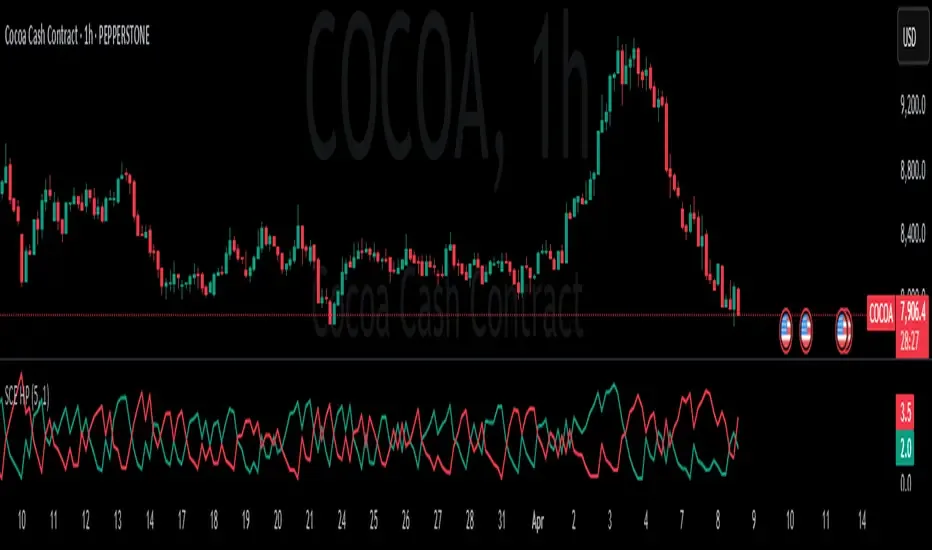

## Table of Contents

## What is a Hawkes process?

A Hawkes process is a type of mathematical model used to study events that happen over time, like earthquakes or stock market trades. It's special because it considers how past events can influence the likelihood of future events. Imagine if one event, like a big earthquake, makes it more likely that another earthquake will happen soon after. That's what a Hawkes process helps to explain.

In simple terms, the Hawkes process works by saying that each event can trigger more events. The more events that happen, the more likely it is that even more events will follow. This is different from other models where events happen randomly and don't affect each other. Because of this, Hawkes processes are really useful for understanding things like how news spreads on social media or how diseases might spread in a population.

## How does a Hawkes process model order flow?

A Hawkes process can help us understand how orders come in at a stock market. Imagine that when someone places an order, it's like sending a signal to others. This signal can make other people more likely to place their own orders soon after. So, if there's a big order, it might lead to a bunch of smaller orders following it, kind of like a chain reaction. The Hawkes process captures this by saying that each order increases the chance of more orders happening.

In this model, the time between orders isn't just random. Instead, it depends on what happened before. If there were a lot of orders recently, the next order is more likely to come sooner. This is useful for traders and market analysts because it helps them predict when more orders might come in, based on what they've seen already. By using a Hawkes process, they can better understand the flow of orders and make smarter decisions.

## What are the basic components of a Hawkes process?

A Hawkes process has two main parts: the events themselves and how they affect each other. The events are things that happen at specific times, like orders in a stock market or earthquakes. Each event in a Hawkes process can make it more likely that other events will happen soon after. This is called the "triggering effect." Imagine if one person starts clapping at a quiet event; others might start clapping too because of that first clap.

The second part is the "intensity function," which tells us how likely it is that an event will happen at any given moment. This function changes over time based on past events. If there have been a lot of events recently, the intensity function goes up, meaning more events are likely to happen soon. If it's been quiet for a while, the intensity function goes down, and events become less likely. This way, the Hawkes process can show how events can cluster together or spread out over time.

## Can you explain the self-exciting property of Hawkes processes?

The self-exciting property of Hawkes processes means that each event can make more events happen. It's like if one person starts laughing in a quiet room, others might start laughing too. In a Hawkes process, when an event happens, it increases the chance that more events will follow. This is because the event changes something called the intensity function, which is like a measure of how likely more events are to happen.

Think of it this way: if you see a lot of people buying a certain stock, you might be more likely to buy it too. That's the self-exciting property at work. The more events that happen, the more the intensity function goes up, making even more events likely. This can lead to clusters of events happening close together, which is why Hawkes processes are good at modeling things like earthquakes or social media trends where events often come in bursts.

## How are Hawkes processes applied in financial markets?

Hawkes processes are used in financial markets to understand how orders come in. Imagine you're watching the stock market, and you see a big order come in. This big order can make other people more likely to place their own orders soon after. A Hawkes process helps us see this pattern. It shows how one order can lead to more orders, kind of like a chain reaction. This is helpful for traders because it lets them guess when more orders might come in, based on what they've seen already.

This model is especially useful because it takes into account how past orders affect future ones. If there's been a lot of trading activity recently, a Hawkes process tells us that more trading is likely to happen soon. Traders and analysts use this information to make smarter decisions about buying or selling stocks. By understanding these patterns, they can better predict market movements and manage their risks.

## What is the difference between a univariate and multivariate Hawkes process in the context of order flow?

In the context of order flow, a univariate Hawkes process looks at just one type of event, like buy orders. Imagine you're watching only the buy orders coming into the market. Each buy order can make more buy orders likely to happen soon after. This model helps traders understand how one type of order can lead to more of the same type of order, creating patterns in the market.

On the other hand, a multivariate Hawkes process looks at different types of events at the same time, like both buy and sell orders. It's like watching both buy and sell orders and seeing how they affect each other. A buy order might make a sell order more likely, or vice versa. This model is useful because it shows how different kinds of orders can interact and influence each other, giving a fuller picture of the market's behavior.

## How can Hawkes processes be used to predict order flow?

Hawkes processes can help predict order flow in the stock market by looking at how past orders affect future ones. Imagine you're watching the market and you see a big order come in. A Hawkes process tells us that this big order can make it more likely that other orders will follow soon after. It's like a chain reaction where one order leads to more orders. Traders use this information to guess when more orders might come in, based on what they've seen already. By understanding these patterns, they can make smarter decisions about buying or selling stocks.

In a more detailed way, Hawkes processes use something called the intensity function, which changes over time based on past orders. If there have been a lot of orders recently, the intensity function goes up, meaning more orders are likely to happen soon. If it's been quiet for a while, the intensity function goes down, and orders become less likely. This helps traders see when the market might get busy or slow down. By using a Hawkes process, they can better predict market movements and manage their risks more effectively.

## What are the challenges in estimating parameters for Hawkes processes in order flow?

Estimating the parameters for Hawkes processes in order flow can be tricky because the market is always changing. Imagine trying to guess how fast a river is flowing when the water level keeps going up and down. The parameters we need to estimate, like how much one order affects future orders, can be hard to pin down because they depend on many things that are hard to measure, like how traders react to news or other market events. If we get these parameters wrong, our predictions about future order flow might not be very accurate.

Another challenge is dealing with the huge amount of data that comes from the stock market. Every day, there are thousands of orders, and each one can affect the next. Sorting through all this data to find the patterns we need can be like looking for a needle in a haystack. Plus, the data can be noisy, meaning there might be a lot of random stuff happening that makes it harder to see the real patterns. To handle this, we often need special math tools and computers that can process a lot of information quickly.

## How do Hawkes processes handle the clustering of order flow events?

Hawkes processes are really good at showing how orders in the stock market can bunch up together. Imagine you're watching the market and you see a lot of orders coming in one after another. A Hawkes process says that each order can make more orders happen soon after. It's like if one person starts clapping at a quiet event, others might start clapping too because of that first clap. This way, the Hawkes process helps us see why orders can come in groups, or clusters, instead of being spread out evenly.

The key part of a Hawkes process that helps with this is something called the intensity function. This function changes over time based on what orders have happened before. If there have been a lot of orders recently, the intensity function goes up, meaning more orders are likely to happen soon. It's like the market gets excited and more people want to buy or sell. By understanding how this function works, traders can better guess when more orders might come in and plan their moves in the market.

## What advanced techniques can be used to improve the accuracy of Hawkes process models in order flow?

To make Hawkes process models better at predicting order flow, one advanced technique is using [machine learning](/wiki/machine-learning). Machine learning can look at a lot of data and find patterns that might be hard for people to see. It can learn from past orders and use that to guess what might happen next. This can help make the model more accurate by adjusting how much one order affects future orders based on all the data it sees.

Another technique is using something called a Markov Chain Monte Carlo (MCMC) method. This helps us figure out the best values for the model's parameters by trying out lots of different values and seeing which ones fit the data best. It's like trying different keys in a lock until you find the one that works. By using MCMC, we can make sure our model is as close to the real market behavior as possible, which helps us predict order flow better.

## How do Hawkes processes compare to other models used for order flow analysis?

Hawkes processes are special because they look at how one order can make other orders more likely to happen. It's like if one person starts clapping at a quiet event, others might start clapping too. This is different from other models, like Poisson processes, which think that orders happen randomly and don't affect each other. Hawkes processes are better at showing why orders can come in groups or clusters, which is really common in the stock market. This makes them useful for traders who want to guess when more orders might come in.

Other models, like autoregressive conditional duration (ACD) models, also try to predict order flow but in different ways. ACD models focus on the time between orders and how it changes, but they don't look at how one order can cause another like Hawkes processes do. This means Hawkes processes can be better at showing the chain reactions in the market. However, ACD models can be simpler to use and understand, so they might be easier for some people to work with. Both types of models have their own strengths, and which one is better depends on what you're trying to do with your analysis.

## What are the current research trends and future directions for Hawkes processes in order flow modeling?

Current research in Hawkes processes for order flow modeling is focusing a lot on using machine learning to make these models better. Researchers are trying to use big data and computer algorithms to find patterns that are hard to see with just math. This can help make the models more accurate by adjusting how much one order affects future orders based on all the data they see. Another trend is looking at how to use Hawkes processes with other types of models, like ACD models, to get a fuller picture of the market. By combining different models, researchers hope to make predictions that are more reliable and useful for traders.

In the future, one direction for Hawkes processes might be to make them work in real-time. Imagine if a model could predict what's going to happen in the market as it's happening. This could be really helpful for traders who need to make quick decisions. Another future direction could be using Hawkes processes to understand not just how orders affect each other, but also how other things like news or social media can influence the market. By looking at all these different factors, the models could become even better at predicting order flow and helping people make smarter choices in the stock market.

## What is the Mathematical Foundation?

The mathematical foundation of the Hawkes process is rooted in its representation as a self-exciting point process. This model extends the conventional Poisson process, introducing a dynamic adjustment feature that reflects the influence of past events on current event probabilities. Unlike the Poisson process, where events are independent and occur at a constant rate, the Hawkes process incorporates past events to modulate the occurrence rate over time.

Central to the Hawkes process is its intensity function, denoted as $\lambda(t)$, which varies depending on historical event patterns. Mathematically, this function is described by:

$$
\lambda(t) = \mu + \sum_{t_i < t} \phi(t - t_i)
$$

Here, $\mu$ represents the baseline intensity, which is the base rate of events in the absence of recent occurrences. The component $\sum_{t_i < t} \phi(t - t_i)$ signifies a summation over the influence of all preceding events, adjusting the intensity function according to a specified kernel function $\phi$. This kernel function often takes an exponential form, $\phi(x) = \alpha e^{-\beta x}$, where $\alpha$ and $\beta$ are parameters determining the impact and decay rate of past events on the current intensity.

A fundamental characteristic of the Hawkes process is its branching structure, which frames the process as a combination of both endogenous and exogenous events. The process can be viewed as a branching process where each event can spawn subsequent events, akin to an infectious process. This aspect is instrumental in modeling scenarios where events inherently follow clustered patterns, as seen in financial markets or social interactions.

For practical implementation, calibrating a Hawkes process involves estimating the parameters $\mu$, $\alpha$, and $\beta$, typically utilizing maximum likelihood estimation techniques. These parameters are essential for accurately reflecting the underlying event dynamics and predicting future occurrences. Here is a basic outline in Python to simulate a univariate Hawkes process:

```python
import numpy as np

def simulate_hawkes(mu, alpha, beta, T):
    events = []
    t = 0
    intensity = mu

    while t < T:
        delta = -np.log(np.random.uniform()) / intensity
        t += delta

        # Intensity calculation
        intensity_decay = sum(alpha * np.exp(-beta * (t - np.array(events))))
        current_intensity = mu + intensity_decay

        if np.random.uniform() < current_intensity / intensity:
            events.append(t)

        intensity = mu + sum(alpha * np.exp(-beta * (t - np.array(events))))

    return events

# Example usage
mu, alpha, beta, T = 0.5, 0.8, 1.0, 100
events = simulate_hawkes(mu, alpha, beta, T)
print("Hawkes Process Events:", events)
```

This code outlines a basic simulation of a Hawkes process, providing a practical insight into how such processes are computed. The branching nature and dynamic intensities make the Hawkes process a powerful tool for modeling sequences where past influences significantly affect future event probabilities.

## What are the applications in algorithmic trading?

Hawkes processes are a powerful tool for modeling high-frequency trading data, where the timing, sequence, and clustering of trades significantly influence market dynamics. These stochastic processes adeptly capture the self-exciting nature of trading events, meaning that the occurrence of a trade can increase the likelihood of subsequent trades happening in a short timeframe. This clustering behavior is pivotal for understanding market microstructure dynamics, as it enables financial analysts to discern patterns in trading activity that can substantially impact price movements.

Mathematically, the capacity of Hawkes processes to model trade sequences lies in their intensity function, which reflects how past events affect the future likelihood of additional events. This function can be expressed as:

$$
\lambda(t) = \mu + \sum \phi(t-t_i)
$$

Here, $\mu$ denotes the baseline intensity, which represents the rate of trades when no other events have occurred recently, and $\phi(t-t_i)$ models the influence of past trades on the current probability of future trades.

This predictive capability is crucial for traders and financial analysts who depend on understanding and anticipating market [volatility](/wiki/volatility-trading-strategies). By leveraging Hawkes processes, they can foresee spikes in trading activity and abrupt price shifts, allowing for more informed decision-making and the optimization of trading strategies.

Additionally, incorporating Hawkes models into trading systems empowers financial professionals to anticipate market responses to significant trades and events, thereby enhancing the accuracy of market forecasts and improving the timing of trades within high-frequency trading strategies. The ability to model and predict the cascading effect of trades offers traders a strategic advantage, enabling them to better manage risk and enhance returns.

## References & Further Reading

[1]: Hawkes, A.G. (1971). "Spectra of Some Self-Exciting and Mutually Exciting Point Processes." Biometrika, 58(1), 83-90. [Link to publication](https://www.dcscience.net/Hawkes-Biometrika-1971.pdf)

[2]: Bacry, E., Mastromatteo, I., & Muzy, J.F. (2015). "Hawkes Processes in Finance." Market Microstructure and Liquidity, 1(1), 1550005. [Link to publication](https://arxiv.org/abs/1502.04592)

[3]: Aït-Sahalia, Y., Cacho-Diaz, J., & Laeven, R.J.A. (2015). "Modeling Financial Contagion Using Mutually Exciting Jump Processes." Journal of Financial Economics, 117(3), 585-606. [Link to publication](https://www.sciencedirect.com/science/article/pii/S0304405X15000264)

[4]: Errais, E., Giesecke, K., & Goldberg, L.R. (2010). "Affine Point Processes and Portfolio Credit Risk." SIAM Journal on Financial Mathematics, 1(1), 642-665. [Link to publication](https://epubs.siam.org/doi/10.1137/090771272)

[5]: Embrechts, P., Liniger, T., & Lin, L. (2011). "Multivariate Hawkes Processes: An Application to Financial Data." Journal of Applied Probability, 48(A), 367-378. [Link to publication](https://www.jstor.org/stable/pdf/44806678.pdf)