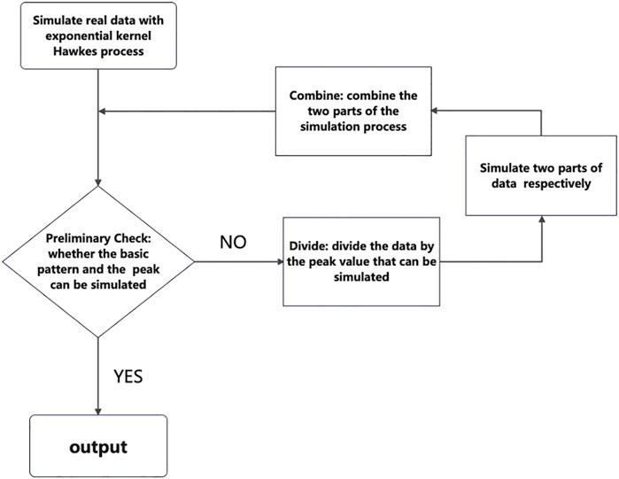

In the fast-evolving world of algorithmic trading, the integration of mathematical models and processes has become indispensable for predicting financial market movements with precision and speed. The Hawkes process, a sophisticated stochastic model named after the statistician Alan G. Hawkes, plays a pivotal role in this landscape due to its unique self-exciting properties. Unlike traditional models, the Hawkes process accounts for the likelihood that the occurrence of an event may trigger or increase the probability of future events. This characteristic makes it especially useful in modeling financial events such as trades and market movements, where the occurrence of one trade can influence the likelihood of subsequent trades. Originally developed in the 1970s for analyzing earthquake aftershocks, the Hawkes process has found diverse applications across finance, insurance, neuroscience, and other domains.

## Table of Contents



## Understanding the Hawkes Process

The Hawkes process is a stochastic model characterized by its self-exciting nature, where each event increases the likelihood of subsequent events. This feature makes it particularly effective for modeling phenomena with clustered occurrences over time, commonly observed in fields such as finance and social networks. 

Central to the Hawkes process is the intensity function, which evolves over time and denotes the rate of expected occurrences of events at any given point. Mathematically, the intensity function is represented as λ(t), dictating the occurrence rate influenced by past events. 

For a linear Hawkes process, the intensity function is typically expressed as λ(t) = μ + Σϕ(t−ti). In this expression, μ signifies the baseline intensity, reflecting the rate of events in the absence of recent occurrences. The summation Σϕ(t−ti) accounts for the influence of past events on the current intensity, encapsulating the self-exciting property of the process.

The Hawkes process offers versatility in applications where understanding the sequence and clustering of events is critical, providing a robust framework for analyzing temporal patterns in dynamic systems.

## Mathematical Foundation

The mathematical foundation of the Hawkes process is rooted in its representation as a self-exciting point process. This model extends the conventional Poisson process, introducing a dynamic adjustment feature that reflects the influence of past events on current event probabilities. Unlike the Poisson process, where events are independent and occur at a constant rate, the Hawkes process incorporates past events to modulate the occurrence rate over time.

Central to the Hawkes process is its intensity function, denoted as $\lambda(t)$, which varies depending on historical event patterns. Mathematically, this function is described by:

$$
\lambda(t) = \mu + \sum_{t_i < t} \phi(t - t_i)
$$

Here, $\mu$ represents the baseline intensity, which is the base rate of events in the absence of recent occurrences. The component $\sum_{t_i < t} \phi(t - t_i)$ signifies a summation over the influence of all preceding events, adjusting the intensity function according to a specified kernel function $\phi$. This kernel function often takes an exponential form, $\phi(x) = \alpha e^{-\beta x}$, where $\alpha$ and $\beta$ are parameters determining the impact and decay rate of past events on the current intensity.

A fundamental characteristic of the Hawkes process is its branching structure, which frames the process as a combination of both endogenous and exogenous events. The process can be viewed as a branching process where each event can spawn subsequent events, akin to an infectious process. This aspect is instrumental in modeling scenarios where events inherently follow clustered patterns, as seen in financial markets or social interactions.

For practical implementation, calibrating a Hawkes process involves estimating the parameters $\mu$, $\alpha$, and $\beta$, typically utilizing maximum likelihood estimation techniques. These parameters are essential for accurately reflecting the underlying event dynamics and predicting future occurrences. Here is a basic outline in Python to simulate a univariate Hawkes process:

```python
import numpy as np

def simulate_hawkes(mu, alpha, beta, T):
    events = []
    t = 0
    intensity = mu

    while t < T:
        delta = -np.log(np.random.uniform()) / intensity
        t += delta

        # Intensity calculation
        intensity_decay = sum(alpha * np.exp(-beta * (t - np.array(events))))
        current_intensity = mu + intensity_decay

        if np.random.uniform() < current_intensity / intensity:
            events.append(t)

        intensity = mu + sum(alpha * np.exp(-beta * (t - np.array(events))))

    return events

# Example usage
mu, alpha, beta, T = 0.5, 0.8, 1.0, 100
events = simulate_hawkes(mu, alpha, beta, T)
print("Hawkes Process Events:", events)
```

This code outlines a basic simulation of a Hawkes process, providing a practical insight into how such processes are computed. The branching nature and dynamic intensities make the Hawkes process a powerful tool for modeling sequences where past influences significantly affect future event probabilities.

## Applications in Algorithmic Trading

Hawkes processes are a powerful tool for modeling high-frequency trading data, where the timing, sequence, and clustering of trades significantly influence market dynamics. These stochastic processes adeptly capture the self-exciting nature of trading events, meaning that the occurrence of a trade can increase the likelihood of subsequent trades happening in a short timeframe. This clustering behavior is pivotal for understanding market microstructure dynamics, as it enables financial analysts to discern patterns in trading activity that can substantially impact price movements.

Mathematically, the capacity of Hawkes processes to model trade sequences lies in their intensity function, which reflects how past events affect the future likelihood of additional events. This function can be expressed as:

$$
\lambda(t) = \mu + \sum \phi(t-t_i)
$$

Here, $\mu$ denotes the baseline intensity, which represents the rate of trades when no other events have occurred recently, and $\phi(t-t_i)$ models the influence of past trades on the current probability of future trades.

This predictive capability is crucial for traders and financial analysts who depend on understanding and anticipating market [volatility](/wiki/volatility-trading-strategies). By leveraging Hawkes processes, they can foresee spikes in trading activity and abrupt price shifts, allowing for more informed decision-making and the optimization of trading strategies.

Additionally, incorporating Hawkes models into trading systems empowers financial professionals to anticipate market responses to significant trades and events, thereby enhancing the accuracy of market forecasts and improving the timing of trades within high-frequency trading strategies. The ability to model and predict the cascading effect of trades offers traders a strategic advantage, enabling them to better manage risk and enhance returns.

## Benefits and Challenges

One of the significant benefits of employing Hawkes processes in trading is their capacity to accurately model temporal clusters of market events. This capability arises from the self-exciting nature of these processes, which reflects the inherent tendencies within financial transactions to influence subsequent market movements. By incorporating this self-exciting characteristic, Hawkes processes provide a more precise representation of trading dynamics, enabling a deeper understanding of how trades and events impact market behavior over time.

Despite these advantages, implementing Hawkes models to reflect real-world market data is fraught with several challenges. One major issue is the calibration of these models, which requires advanced statistical techniques and a thorough comprehension of market behaviors. Calibration involves determining the optimal parameters that align the model closely with observed data. Given the complexity and non-linearity of financial markets, this process requires careful statistical analysis and fine-tuning.

Additionally, computational complexity presents another significant hurdle. As new events unfold, Hawkes processes necessitate continuous recalculations of the intensity function, denoted as $\lambda(t)$, which depicts the rate of future events conditioned on past occurrences. This continuous update mechanism is computationally intensive, particularly when dealing with high-frequency trading data where events happen in rapid succession.

For instance, in Python, such continuous recalculations can be implemented using the following pseudo-code:

```python
import numpy as np

def hawkes_intensity(mu, kernel, past_events, t):
    intensity = mu
    for event_time in past_events:
        intensity += kernel(t - event_time)
    return intensity

# Example usage
mu = 0.5
kernel = lambda x: 0.8 * np.exp(-1.5 * x)
past_events = [0.1, 0.4, 0.9]  # Event times
current_time = 1.2

intensity_at_t = hawkes_intensity(mu, kernel, past_events, current_time)
```

In this example, continuous updates of the intensity function are necessary as new data comes in. This ongoing recalibration process can put a strain on computational resources, making the implementation of Hawkes processes demanding in terms of both time and computational power.

Despite these challenges, the precision and insight afforded by Hawkes processes continue to make them a valuable tool in the field of [algorithmic trading](/wiki/algorithmic-trading), provided adequate resources and expertise are applied to their implementation.

## Conclusion

The Hawkes process remains a crucial instrument in quantitative finance, particularly for analyzing and predicting the temporal dynamics of financial markets. Its self-exciting nature allows for a detailed understanding of event clustering, which is essential for capturing real-world trading behaviors such as bursts of activity or price spikes. In financial markets, these clusters of events can significantly impact market volatility and [liquidity](/wiki/liquidity-risk-premium), thereby providing traders with an edge in decision-making processes.

Traders equipped with a profound understanding of these processes can leverage them for enhanced market predictions and strategy optimization. By modeling the temporal structure of trading events, Hawkes processes enable traders to anticipate periods of increased trading activity or potential market shifts. This forecasting ability is instrumental in developing strategies that minimize risk and maximize returns.

The predictive power inherent in Hawkes processes means that traders can identify potential future events based on historical activity, thereby creating more effective and data-informed trading strategies. These processes make it feasible to quantify the impact of past events on future occurrences, allowing for the construction of predictive models that consider the history-dependent nature of financial transactions. Consequently, traders can utilize this information to inform their trading decisions and adapt to evolving market conditions with greater precision.

## Further Reading and References

For those looking to explore further, several key resources provide invaluable insights into the Hawkes process and its financial applications. 

Alan G. Hawkes' seminal papers establish the foundational understanding of self-exciting processes, elaborating on their mechanics and mathematical underpinnings. His work offers a comprehensive introduction to the Hawkes process, detailing its innovative approach to modeling event probabilities that increase with prior occurrences.

Contemporary research has expanded upon Hawkes' original concepts, particularly within the financial markets. A notable contribution is the paper 'Hawkes Processes in Finance' by Bacry, Muni Toke, and Muzy (2015). This work explores the application of Hawkes processes in high-frequency trading scenarios, underscoring their effectiveness in modeling market dynamics through a detailed examination of trade events and their temporal dependencies.

Another influential reference is 'Modelling Systemic Risk with Self-exciting Point Processes' by Aït-Sahalia, Cacho-Diaz, and Laeven (2015), which applies the Hawkes process to understand systemic risks in financial networks. The study emphasizes the process's utility in capturing the propagation of financial distress through interconnected networks.

For a broader perspective, 'The Econometrics of High-Frequency Data' by B. Errais et al. (2010) offers a comprehensive overview of various statistical methods used in high-frequency data analysis, including the Hawkes process. This text serves as a valuable resource for those interested in the statistical techniques applicable to financial data and the detailed modeling of market microstructures.

## References & Further Reading

[1]: Hawkes, A.G. (1971). "Spectra of Some Self-Exciting and Mutually Exciting Point Processes." Biometrika, 58(1), 83-90. [Link to publication](https://www.dcscience.net/Hawkes-Biometrika-1971.pdf)

[2]: Bacry, E., Mastromatteo, I., & Muzy, J.F. (2015). "Hawkes Processes in Finance." Market Microstructure and Liquidity, 1(1), 1550005. [Link to publication](https://arxiv.org/abs/1502.04592)

[3]: Aït-Sahalia, Y., Cacho-Diaz, J., & Laeven, R.J.A. (2015). "Modeling Financial Contagion Using Mutually Exciting Jump Processes." Journal of Financial Economics, 117(3), 585-606. [Link to publication](https://www.sciencedirect.com/science/article/pii/S0304405X15000264)

[4]: Errais, E., Giesecke, K., & Goldberg, L.R. (2010). "Affine Point Processes and Portfolio Credit Risk." SIAM Journal on Financial Mathematics, 1(1), 642-665. [Link to publication](https://epubs.siam.org/doi/10.1137/090771272)

[5]: Embrechts, P., Liniger, T., & Lin, L. (2011). "Multivariate Hawkes Processes: An Application to Financial Data." Journal of Applied Probability, 48(A), 367-378. [Link to publication](https://www.jstor.org/stable/pdf/44806678.pdf)