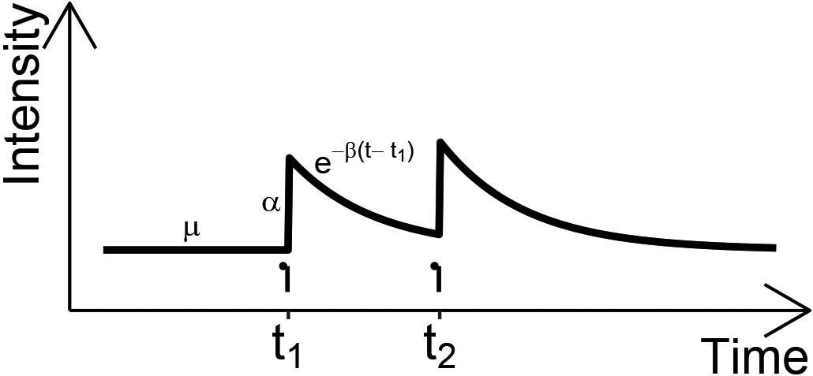

In today's dynamic landscape of algorithmic trading, mathematical models play a pivotal role in aiding traders to make informed decisions. Among these models, the Hawkes process has emerged as an essential tool due to its self-exciting properties. This process provides a sophisticated approach to capturing and analyzing the correlations between discrete financial events, allowing for a deeper understanding of market dynamics.

Originally formulated by statistician Alan G. Hawkes, the Hawkes process was developed for applications beyond finance, such as seismology, where it models the occurrence of earthquakes and their aftershocks. Its adaptability has allowed it to be effectively applied to financial markets, where it helps capture the intricacies of market events that influence subsequent occurrences.

This article focuses on exploring the Hawkes process and its applications specifically in algorithmic trading. The self-excitatory nature of the Hawkes process allows it to model the temporal clustering of market events such as trades, news releases, or price movements. By incorporating these processes, traders can enhance their trading strategies, optimizing decision-making and predicting market behavior more accurately. As a result, the Hawkes process not only enhances the predictability of market events but also provides traders with a strategic edge in executing better-informed trading strategies.

## Table of Contents

## Understanding the Hawkes Process

The Hawkes process is characterized by its self-exciting nature, which is a fundamental aspect that differentiates it from other stochastic processes. In this process, the occurrence of an event increases the probability of future events, creating a clustering effect over time. This feature makes it particularly valuable for modeling phenomena where events tend to trigger subsequent occurrences, such as in finance, where one trade can influence the timing and likelihood of future trades.

Mathematically, the Hawkes process is defined by its intensity function, denoted as λ(t). The intensity function represents the instantaneous rate at which events are expected to occur at time t. This function is typically expressed as a sum of a base intensity, often constant, and a term that accounts for the cumulative influence of past events:

$$

\lambda(t) = \lambda_0 + \int_{-\infty}^{t} \phi(t - s) dN(s) 
$$

In this equation:

- $\lambda_0$ is the base intensity, representing the inherent probability of an event occurring independently of prior events.
- $dN(s)$ denotes a differential event count at time s, capturing past events up to time t.
- The integral term sums the influences of all previous events on the current intensity.

The kernel function, $\phi(t - s)$, is crucial in determining the influence of past events on current event likelihood. It dictates how the effect of a previous event fades over time, often modeled as an exponential function:

$$
\phi(t - s) = \alpha e^{-\beta (t - s)}
$$

Here, $\alpha$ represents the degree of excitation or impact each event has on future events, while $\beta$ indicates the rate of decay over time. The exponential decay model is widely used due to its simplicity and computational efficiency, rendering it suitable for applications where past events have diminishing influence over time.

The overall dynamics of a Hawkes process can be simulated through various computational approaches, including discrete-time simulations or event-driven methods. For instance, a simple Python implementation might initialize an intensity function and iteratively compute upcoming events based on its evolving values. This adaptability allows the Hawkes process to model a variety of real-world scenarios efficiently, making it a potent tool for analyzing event-driven data, especially in the context of high-frequency trading and market analysis.

## Mathematical Foundation

Rooted in the Poisson process, the Hawkes process introduces a feedback mechanism that allows each event to increase the likelihood of future events. This self-exciting property is characterized by an intensity function $\lambda(t)$, which can be expressed as:

$$
\lambda(t) = \mu + \int_{-\infty}^{t} \phi(t-s) \, dN(s)
$$

where $\mu$ is the base intensity, and $\phi(t-s)$ is the kernel function that models the temporal influence of past events on the current intensity. The kernel function often takes an exponential form, $\phi(t-s) = \alpha e^{-\beta(t-s)}$, where $\alpha$ represents the scaling factor of influence, and $\beta$ controls the rate of decay.

A critical aspect of the Hawkes process is the branching ratio $n$, which quantifies the average number of offspring events generated by each event. This ratio determines the nature of the process: 

- Sub-critical ($n < 1$): The process will eventually die out over time.
- Critical ($n = 1$): The process achieves a balance between new events and decay, maintaining a constant intensity.
- Super-critical ($n > 1$): The process will lead to an explosion of events, with intensity growing over time.

This framework makes the Hawkes process particularly suitable for modeling high-intensity clusters, such as those observed in financial markets. In these scenarios, the self-exciting nature of trades and orders creates bursts of market activity that are well-captured by the Hawkes process. The ability to model and anticipate such clusters provides traders with insights into potential spatiotemporal patterns in trading behavior, enabling them to refine their market strategies.

## Applications in Algorithmic Trading

In high-frequency trading ([HFT](/wiki/high-frequency-trading-strategies)), Hawkes models play an instrumental role in analyzing and interpreting sequences of trades to gain insights into market microstructure. These models are particularly valuable in identifying the intricate web of cause and effect relationships among trades, which is essential for traders seeking to optimize their strategies.

One of the primary applications of Hawkes processes in HFT is predicting trading volumes and potential price [volatility](/wiki/volatility-trading-strategies). By analyzing the self-exciting nature of these processes, traders can assess when trading volumes might surge and how prices may fluctuate in response to various market stimuli. The Hawkes process captures temporal correlations between trades, making it an excellent tool for forecasting periods of intense trading activity. Through modeling the arrival of trades as a point process with an intensity function, traders are able to determine the likelihood of future trades occurring, thus timing their actions more effectively to exploit market opportunities.

The formula for the intensity of events in a Hawkes process is generally represented as:

$$
\lambda(t) = \mu + \sum_{t_i < t} \phi(t - t_i)
$$

where $\lambda(t)$ is the intensity at time $t$, $\mu$ is the base intensity, and $\phi(\cdot)$ is the kernel function representing the impact of past events.

Hawkes models also contribute significantly to risk management by predicting periods of increased market activity. This predictive capability is vital for portfolio managers and those involved in asset allocation, as it enables them to anticipate and react to potential market volatility. By integrating real-time data into Hawkes models, traders can dynamically adjust their risk exposure, hedge effectively, and optimize their portfolio strategies to mitigate potential losses.

Moreover, these models assist in identifying endogenous risks within the market, elucidating how internal market dynamics can lead to bursts of activity rather than relying solely on external news or shocks. This insight allows for a refined understanding of market behavior, leading to better-informed decision-making processes.

In practice, implementing Hawkes processes in HFT involves sophisticated computational techniques, often necessitating the use of high-performance computing and advanced algorithms to handle the vast amounts of data and the complexity of the models. By leveraging the power of Hawkes processes, traders and financial institutions enhance their ability to predict market movements, tailor their strategies, and gain a competitive advantage in the highly dynamic arena of [algorithmic trading](/wiki/algorithmic-trading).

## Benefits and Challenges

Hawkes processes serve as potent tools for modeling the temporal clusters of trades observed in financial markets. By effectively capturing the self-exciting nature of financial events, they provide valuable insights into the patterns and bursts of trading activity. A key benefit of employing Hawkes models in algorithmic trading is their ability to identify and model events that occur in close succession, offering a more nuanced understanding of market dynamics compared to traditional methods.

However, the implementation of these processes is not without its challenges. The calibration of Hawkes processes requires sophisticated methods that must be tailored to real market data, as the process parameters can significantly influence the model's accuracy. Each financial market possesses unique characteristics, demanding bespoke calibration techniques to ensure the model's predictive power and reliability.

Another significant hurdle is the computational demand associated with these models. Calculating the intensity function λ(t), which comprises a base intensity and the accumulated effect of past events, can be computationally intensive, particularly in high-frequency trading environments. Efficient algorithms and robust high-performance computing resources are essential to manage these demands, enabling the real-time processing required in live trading scenarios.

To sustain the accuracy and relevance of Hawkes processes, it is crucial to continuously update models with new market data. Market conditions and participant behaviors evolve rapidly, necessitating a dynamic approach to model updating. This entails integrating new data seamlessly into existing models, a process that can be complex and resource-intensive. Consequently, maintaining an updated model can pose an ongoing challenge, requiring consistent effort and investment in advanced computational techniques.

In summary, while Hawkes processes offer significant advantages for modeling trade clusters and understanding market fluctuations, they require sophisticated calibration and computational resources to address their inherent challenges. With advancements in computing and algorithmic techniques, these challenges may be mitigated, enhancing the power and applicability of Hawkes models in financial markets.

## Conclusion

The Hawkes process is a powerful tool in the financial sector, particularly for enhancing the predictability of market events. Its self-exciting nature allows traders to model the temporal dependence in sequences of financial events, capturing patterns and shifts in trading activities with greater precision. Given its adaptability, the Hawkes process is instrumental in forecasting and flagging potential bursts of market activity that often precede significant price changes.

Traders with expertise in these processes can leverage them for better market forecasts, adding a strategic edge to their trading arsenal. By understanding the underlying mechanics of event clustering and propagation, traders can develop more refined strategies for entry and [exit](/wiki/exit-strategy) points in high-frequency trading environments. The ability to anticipate periods of increased volatility or trade [volume](/wiki/volume-trading-strategy) aids in crafting strategies that optimize returns while managing risk effectively.

As algorithmic trading evolves, the relevance and applications of the Hawkes process are likely to expand, offering new insights into market dynamics. With the continuous advancement in computational capabilities and [machine learning](/wiki/machine-learning) algorithms, the integration of Hawkes processes stands to benefit from increased data acquisition and processing capabilities, thereby enhancing accuracy and decision-making in real-time trading scenarios. Consequently, the ongoing research and refinement in this field suggest a promising trajectory for its applications in financial markets, potentially uncovering new dimensions of market behavior and interrelations among financial events.

## Further Reading and References

Key resources include the foundational works of Alan G. Hawkes, who first introduced the self-exciting process that bears his name. His original papers outline the mathematical underpinnings and applications in various fields, providing a comprehensive introduction to the Hawkes process. For more recent insights, contemporary research has examined the role of the Hawkes process in high-frequency trading, highlighting its utility in analyzing sequences of trades and market dynamics.

Several [books](/wiki/algo-trading-books) provide in-depth exploration of high-frequency data and its econometric analysis, such as "The Econometrics of High-Frequency Data." This text elucidates how mathematical models like the Hawkes process can be implemented to interpret market microstructure effectively. Additionally, "Quantitative Analysis, Derivatives Modeling, and Trading Strategies" discusses the broader applications of such models in trading strategies, merging theoretical concepts with practical implementations.

For those interested in computational aspects, papers discussing algorithmic efficiency and real-time data integration offer essential knowledge for managing the computational demands of Hawkes processes. Prominent researchers such as Rama Cont and Sergey Haas in the field have contributed significantly to this area, offering published works that explore the coding and calibration nuances necessary for applying Hawkes models effectively in high-frequency trading scenarios.

For further enhancement of understanding, the suggested reading list includes articles and books from these and other researchers, encompassing theoretical developments, practical implementations, and case studies that show the potential of Hawkes processes in financial markets. These resources provide essential insights for both novices and seasoned professionals looking to integrate self-exciting processes into their algorithmic trading toolkits.

## References & Further Reading

[1]: Hawkes, A. G. (1971). ["Spectra of Some Self-Exciting and Mutually Exciting Point Processes."](https://www.dcscience.net/Hawkes-Biometrika-1971.pdf) Biometrika, 58(1), 83–90.

[2]: Bacry, E., Mastromatteo, I., & Muzy, J.-F. (2015). ["Hawkes Processes in Finance."](https://arxiv.org/abs/1502.04592) Market Microstructure and Liquidity, 1(01), 1550005.

[3]: Rambaldi, M., Pennesi, A., Lillo, F., & Lillo, S. (2015). ["Modeling FX market activity around macroeconomic news: Hawkes-process approach."](https://arxiv.org/abs/1405.6047) Journal of Statistical Mechanics: Theory and Experiment, 2015, P04013.

[4]: Embrechts, P., Liniger, T., & Lu, Y. (2011). ["Multivariate Hawkes processes: An application to financial data."](https://www.jstor.org/stable/pdf/44806678.pdf) Journal of Applied Probability, 48(A), 367–378.

[5]: Gerhard, F. (2019). ["The Econometrics of High-Frequency Data."](https://www.researchgate.net/publication/328869922_The_econometrics_of_high-frequency_data) Journal of Business & Economic Statistics.

[6]: Hawkes, A. G. (1971). ["Point Spectra of Some Mutually Exciting Point Processes."](https://www.dcscience.net/Hawkes-Biometrika-1971.pdf) Journal of the Royal Statistical Society. Series B (Methodological), 33(3), 438–443.