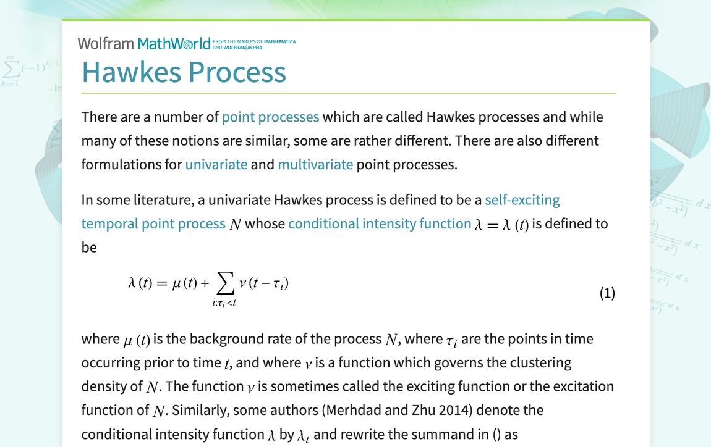

## Table of Contents

## What is a Hawkes process?

A Hawkes process is a type of mathematical model used to describe how events happen over time. It's like a special kind of clock that ticks not just based on time, but also on how many events have happened before. Imagine you're waiting for buses. If buses come more often when there are already lots of buses around, that's a bit like a Hawkes process. Each event, like a bus arriving, can make more events more likely to happen soon after.

In simple terms, a Hawkes process is useful for understanding things like earthquakes, where one quake can trigger others nearby, or financial markets, where a big trade can lead to more trades. The key idea is that events are not independent; they influence each other. This model helps scientists and researchers predict when and where these events might happen next, based on what's happened before.

## Who developed the Hawkes process and when was it first introduced?

The Hawkes process was developed by a man named Alan G. Hawkes. He introduced this idea in a paper he wrote back in 1971. Alan Hawkes was a mathematician who was interested in how events happen over time and how they might affect each other.

In his 1971 paper, Hawkes explained that this process could be used to understand things like how earthquakes trigger other earthquakes or how one person's action might lead to others doing the same thing. His work has been really helpful for people studying all sorts of things, from finance to social behavior, because it shows how events are connected.

## What are the key components of a Hawkes process?

A Hawkes process has two main parts that help it work. The first part is called the background rate, which is like the steady ticking of a clock. This is the rate at which events happen without being influenced by other events. Imagine it as the number of buses that would come if no other buses were around to affect things. The second part is the triggering function, which shows how one event can make other events more likely to happen soon after. It's like how one bus arriving can lead to more buses coming because the first bus triggered more activity.

The triggering function is important because it tells us how strong the influence of one event is on future events, and how long that influence lasts. If the influence is strong and lasts a long time, then one event can lead to a whole bunch of other events happening close together. But if the influence is weak or doesn't last long, then events will happen more spread out. By understanding these two parts, scientists can use the Hawkes process to predict when and where events might happen next, based on what's happened before.

## How does a Hawkes process differ from a Poisson process?

A Hawkes process and a Poisson process are both used to predict when events will happen, but they work in different ways. A Poisson process is like a steady clock where events happen at a constant rate, no matter what. Imagine it as buses coming at the same time every hour, no matter how many buses were there before. In a Poisson process, the timing of one event doesn't affect the timing of the next one. They're all independent, like flipping a coin where each flip doesn't care about the last one.

On the other hand, a Hawkes process is more like a clock that speeds up or slows down based on what's happening around it. If an event happens, it can make other events more likely to happen soon after. Think of it as buses coming more often if there's already a lot of traffic. In a Hawkes process, events are not independent; they influence each other. This makes the Hawkes process really useful for understanding things like earthquakes or stock market trades, where one event can trigger others.

## What is the mathematical formulation of a Hawkes process?

A Hawkes process can be thought of as a mathematical clock that ticks based on two main parts: the background rate and the triggering function. The background rate, often called lambda_0, is like the steady ticking of the clock. It's the rate at which events happen when there are no other events influencing them. For example, if you're waiting for buses and no other buses have come yet, this rate tells you how often buses come on average. The triggering function, on the other hand, shows how one event can make other events more likely to happen soon after. It's like how one bus arriving can lead to more buses coming because the first bus triggered more activity. This function is usually written as h(t), where t is the time since the last event.

The way a Hawkes process works is by adding these two parts together. At any moment, the rate at which an event might happen is the background rate plus the sum of all the triggering functions from past events. If you think of each past event as a little push that makes more events more likely, the current rate is the background rate plus all these pushes combined. Mathematically, this is written as lambda(t) = lambda_0 + sum from i=1 to N of h(t - t_i), where lambda(t) is the rate at which an event might happen at time t, lambda_0 is the background rate, h(t - t_i) is the triggering function from the i-th past event that happened at time t_i, and N is the total number of past events. This formula shows how the Hawkes process keeps track of all past events to predict when the next one might happen.

## Can you explain the concept of self-excitation in Hawkes processes?

Self-excitation in Hawkes processes is like a chain reaction where one event can make more events happen soon after. Imagine you're playing a game where knocking over one domino makes other dominos fall. In a Hawkes process, if an event happens, it can increase the chance of another event happening right after it. This is called self-excitation because the process excites itself, making more events likely to occur.

This idea is really useful for understanding things like earthquakes or stock market trades. When an earthquake happens, it can cause more earthquakes nearby because the first one shakes things up. In the stock market, a big trade can lead to more trades because it gets people excited or worried. Self-excitation helps us see how events are connected and can help predict what might happen next based on what's already happened.

## What are some common applications of Hawkes processes?

Hawkes processes are used in many fields to understand how events happen and affect each other. One common area is in studying earthquakes. When an earthquake happens, it can cause more earthquakes nearby because the first one shakes things up. Scientists use Hawkes processes to predict where and when these aftershocks might happen, helping to keep people safe. Another big use is in finance, especially in understanding how stock market trades work. If someone makes a big trade, it can lead to more trades because it gets other people excited or worried. By using Hawkes processes, people in finance can better predict how the market might move based on what's already happened.

Another field where Hawkes processes are helpful is in social media and online behavior. For example, if someone posts something popular on social media, it can lead to more posts or comments because it gets people talking. This self-excitation can help companies understand how ideas spread online and how to engage with their audience better. In healthcare, Hawkes processes can be used to study how diseases spread. If one person gets sick, it can lead to more people getting sick because of how diseases spread from person to person. This can help public health officials predict and manage outbreaks better.

## How can Hawkes processes be used to model financial markets?

Hawkes processes are really useful for understanding how things work in financial markets. Imagine you're watching the stock market, and you see someone make a big trade. That trade can make other people want to trade too, because it gets them excited or worried. A Hawkes process helps us see how one trade can lead to more trades. It's like a chain reaction where the first trade pushes more trades to happen soon after. By using a Hawkes process, people in finance can predict how the market might move based on what's already happened. This can help them make better decisions about when to buy or sell stocks.

For example, if there's a sudden big drop in a stock price, a Hawkes process can show how that drop might cause more selling, leading to even lower prices. This is because the first drop makes people nervous, and they start selling their stocks too, which pushes the price down even more. By understanding this self-excitation, financial experts can figure out when the market might calm down or get even more excited. This helps them plan their next moves, like whether to wait for the market to settle or to sell before prices drop further. Using Hawkes processes, they can better navigate the ups and downs of the financial world.

## What are the challenges in estimating the parameters of a Hawkes process?

Estimating the parameters of a Hawkes process can be tricky because it's like trying to predict the future based on a bunch of past events that all affect each other. One big challenge is figuring out the background rate, which is how often events happen without being influenced by other events. It's hard to separate this steady rate from the effects of past events, especially when events are happening close together. Another challenge is understanding the triggering function, which shows how one event can make other events more likely to happen soon after. This function can be complicated because it depends on how strong the influence of one event is and how long that influence lasts.

Another difficulty is that the more events you have, the harder it gets to estimate the parameters accurately. Each event adds more information, but it also adds more complexity because you need to consider how all these events are connected. This can make the math really tough, especially when you're trying to use computers to do the calculations. It's like trying to solve a big puzzle where each piece affects all the others. If you don't have enough data, or if the data is messy, it can be even harder to get good estimates. That's why people often need special methods and lots of computing power to work with Hawkes processes.

## How do multivariate Hawkes processes work and what are their uses?

A multivariate Hawkes process is like a more complicated version of a regular Hawkes process. Instead of just one type of event, it looks at several different types of events at the same time. Imagine you're watching different kinds of buses, like red buses and blue buses, and how they affect each other. If a red bus comes, it might make more red buses come soon after, but it could also make blue buses more likely to come. This means each type of event can trigger other types of events, not just itself. The math behind it is similar to a regular Hawkes process, but you have to keep track of how all these different types of events are connected and influence each other.

Multivariate Hawkes processes are really useful for understanding things where different kinds of events happen and affect each other. For example, in social media, you might want to see how a popular tweet can lead to more tweets, retweets, and likes. Each of these actions is a different type of event, and they can all influence each other. In finance, a multivariate Hawkes process can help you understand how different kinds of trades, like buying and selling different stocks, can affect each other. By using this model, people can predict how one event might lead to a whole bunch of other events across different types, helping them make better decisions in areas like social media, finance, and even healthcare, where different types of diseases might spread and affect each other.

## What advanced techniques exist for simulating Hawkes processes?

Simulating Hawkes processes can be tricky because they depend on how past events affect future ones. One way to do this is by using a method called thinning. Imagine you're trying to predict when buses will come, but you know that each bus can make more buses come soon after. Thinning works by starting with a simple clock that ticks at a steady rate, like a Poisson process. Then, you adjust this clock to speed up or slow down based on the past events. If an event happens, you increase the chance of the next event happening soon after, just like how one bus can lead to more buses. This way, you can simulate how events in a Hawkes process happen over time.

Another advanced technique is called the Ogata's modified thinning algorithm. This method is a bit more complicated but can be more accurate. It works by not just adjusting the rate after an event happens, but also by taking into account how long the influence of past events lasts. Think of it like buses coming more often after one bus arrives, but the effect of that first bus fades over time. By using this algorithm, you can simulate how events in a Hawkes process cluster together or spread out, depending on how strong and how long-lasting the influence of past events is. This can be really helpful for understanding things like earthquakes or stock market trades, where the timing of events matters a lot.

## What are the current research trends and future directions in the field of Hawkes processes?

Current research in Hawkes processes is focused on making these models better and more useful for real-world problems. One big trend is trying to make Hawkes processes work with more complicated data, like data that changes over time or has different types of events happening at once. This is important because the world is full of complex events, and understanding them can help us predict things like how diseases spread or how people behave on social media. Researchers are also working on new ways to estimate the parameters of Hawkes processes more accurately, using things like machine learning and advanced statistical methods. This can make the models more reliable and easier to use in practical situations.

Another trend is using Hawkes processes to understand and predict how different systems interact with each other. For example, scientists are looking at how financial markets in different countries affect each other or how social media trends in one part of the world can spread to another. By understanding these connections, we can better predict how events in one place might cause events in another. Looking to the future, researchers are excited about using Hawkes processes to tackle big problems like climate change and global health. By modeling how events like natural disasters or disease outbreaks influence each other, we can make better plans to keep people safe and protect our planet.

## What is the Hawkes Process and how can it be understood?

The Hawkes process is characterized by its self-exciting nature, which is a fundamental aspect that differentiates it from other stochastic processes. In this process, the occurrence of an event increases the probability of future events, creating a clustering effect over time. This feature makes it particularly valuable for modeling phenomena where events tend to trigger subsequent occurrences, such as in finance, where one trade can influence the timing and likelihood of future trades.

Mathematically, the Hawkes process is defined by its intensity function, denoted as λ(t). The intensity function represents the instantaneous rate at which events are expected to occur at time t. This function is typically expressed as a sum of a base intensity, often constant, and a term that accounts for the cumulative influence of past events:

$$

\lambda(t) = \lambda_0 + \int_{-\infty}^{t} \phi(t - s) dN(s) 
$$

In this equation:

- $\lambda_0$ is the base intensity, representing the inherent probability of an event occurring independently of prior events.
- $dN(s)$ denotes a differential event count at time s, capturing past events up to time t.
- The integral term sums the influences of all previous events on the current intensity.

The kernel function, $\phi(t - s)$, is crucial in determining the influence of past events on current event likelihood. It dictates how the effect of a previous event fades over time, often modeled as an exponential function:

$$
\phi(t - s) = \alpha e^{-\beta (t - s)}
$$

Here, $\alpha$ represents the degree of excitation or impact each event has on future events, while $\beta$ indicates the rate of decay over time. The exponential decay model is widely used due to its simplicity and computational efficiency, rendering it suitable for applications where past events have diminishing influence over time.

The overall dynamics of a Hawkes process can be simulated through various computational approaches, including discrete-time simulations or event-driven methods. For instance, a simple Python implementation might initialize an intensity function and iteratively compute upcoming events based on its evolving values. This adaptability allows the Hawkes process to model a variety of real-world scenarios efficiently, making it a potent tool for analyzing event-driven data, especially in the context of high-frequency trading and market analysis.

## What is the Mathematical Foundation?

Rooted in the Poisson process, the Hawkes process introduces a feedback mechanism that allows each event to increase the likelihood of future events. This self-exciting property is characterized by an intensity function $\lambda(t)$, which can be expressed as:

$$
\lambda(t) = \mu + \int_{-\infty}^{t} \phi(t-s) \, dN(s)
$$

where $\mu$ is the base intensity, and $\phi(t-s)$ is the kernel function that models the temporal influence of past events on the current intensity. The kernel function often takes an exponential form, $\phi(t-s) = \alpha e^{-\beta(t-s)}$, where $\alpha$ represents the scaling factor of influence, and $\beta$ controls the rate of decay.

A critical aspect of the Hawkes process is the branching ratio $n$, which quantifies the average number of offspring events generated by each event. This ratio determines the nature of the process: 

- Sub-critical ($n < 1$): The process will eventually die out over time.
- Critical ($n = 1$): The process achieves a balance between new events and decay, maintaining a constant intensity.
- Super-critical ($n > 1$): The process will lead to an explosion of events, with intensity growing over time.

This framework makes the Hawkes process particularly suitable for modeling high-intensity clusters, such as those observed in financial markets. In these scenarios, the self-exciting nature of trades and orders creates bursts of market activity that are well-captured by the Hawkes process. The ability to model and anticipate such clusters provides traders with insights into potential spatiotemporal patterns in trading behavior, enabling them to refine their market strategies.

## What are the applications in algorithmic trading?

In high-frequency trading ([HFT](/wiki/high-frequency-trading-strategies)), Hawkes models play an instrumental role in analyzing and interpreting sequences of trades to gain insights into market microstructure. These models are particularly valuable in identifying the intricate web of cause and effect relationships among trades, which is essential for traders seeking to optimize their strategies.

One of the primary applications of Hawkes processes in HFT is predicting trading volumes and potential price [volatility](/wiki/volatility-trading-strategies). By analyzing the self-exciting nature of these processes, traders can assess when trading volumes might surge and how prices may fluctuate in response to various market stimuli. The Hawkes process captures temporal correlations between trades, making it an excellent tool for forecasting periods of intense trading activity. Through modeling the arrival of trades as a point process with an intensity function, traders are able to determine the likelihood of future trades occurring, thus timing their actions more effectively to exploit market opportunities.

The formula for the intensity of events in a Hawkes process is generally represented as:

$$
\lambda(t) = \mu + \sum_{t_i < t} \phi(t - t_i)
$$

where $\lambda(t)$ is the intensity at time $t$, $\mu$ is the base intensity, and $\phi(\cdot)$ is the kernel function representing the impact of past events.

Hawkes models also contribute significantly to risk management by predicting periods of increased market activity. This predictive capability is vital for portfolio managers and those involved in asset allocation, as it enables them to anticipate and react to potential market volatility. By integrating real-time data into Hawkes models, traders can dynamically adjust their risk exposure, hedge effectively, and optimize their portfolio strategies to mitigate potential losses.

Moreover, these models assist in identifying endogenous risks within the market, elucidating how internal market dynamics can lead to bursts of activity rather than relying solely on external news or shocks. This insight allows for a refined understanding of market behavior, leading to better-informed decision-making processes.

In practice, implementing Hawkes processes in HFT involves sophisticated computational techniques, often necessitating the use of high-performance computing and advanced algorithms to handle the vast amounts of data and the complexity of the models. By leveraging the power of Hawkes processes, traders and financial institutions enhance their ability to predict market movements, tailor their strategies, and gain a competitive advantage in the highly dynamic arena of [algorithmic trading](/wiki/algorithmic-trading).

## References & Further Reading

[1]: Hawkes, A. G. (1971). ["Spectra of Some Self-Exciting and Mutually Exciting Point Processes."](https://www.dcscience.net/Hawkes-Biometrika-1971.pdf) Biometrika, 58(1), 83–90.

[2]: Bacry, E., Mastromatteo, I., & Muzy, J.-F. (2015). ["Hawkes Processes in Finance."](https://arxiv.org/abs/1502.04592) Market Microstructure and Liquidity, 1(01), 1550005.

[3]: Rambaldi, M., Pennesi, A., Lillo, F., & Lillo, S. (2015). ["Modeling FX market activity around macroeconomic news: Hawkes-process approach."](https://arxiv.org/abs/1405.6047) Journal of Statistical Mechanics: Theory and Experiment, 2015, P04013.

[4]: Embrechts, P., Liniger, T., & Lu, Y. (2011). ["Multivariate Hawkes processes: An application to financial data."](https://www.jstor.org/stable/pdf/44806678.pdf) Journal of Applied Probability, 48(A), 367–378.

[5]: Gerhard, F. (2019). ["The Econometrics of High-Frequency Data."](https://www.researchgate.net/publication/328869922_The_econometrics_of_high-frequency_data) Journal of Business & Economic Statistics.

[6]: Hawkes, A. G. (1971). ["Point Spectra of Some Mutually Exciting Point Processes."](https://www.dcscience.net/Hawkes-Biometrika-1971.pdf) Journal of the Royal Statistical Society. Series B (Methodological), 33(3), 438–443.