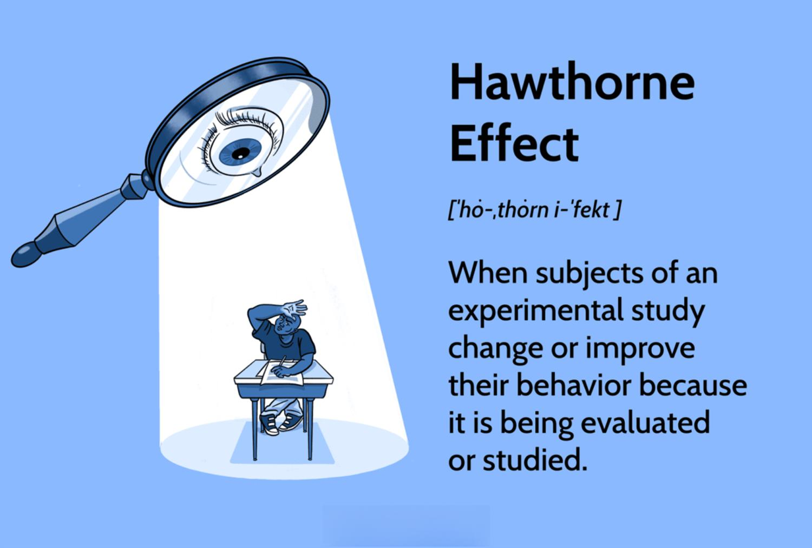

Understanding how observations influence behavior has been a cornerstone of behavioral research. This fundamental concept has been extensively studied to ascertain how awareness of being observed can lead to significant behavioral changes in subjects. Two pivotal concepts, the Observer Effect and the Hawthorne Effect, encapsulate this phenomenon, illustrating how the sheer act of observation can alter the behavior of the observed subjects.

The Observer Effect, with its roots in physics, highlights how the mere act of observing a phenomenon can influence its outcomes. This principle extends into behavioral research, where individuals may adapt their actions simply due to the consciousness of being watched. Similarly, the Hawthorne Effect, emerging from early 20th-century industrial studies, showcases how subjects may modify their behavior in response to attention from researchers, often improving performance during periods of observation.



In behavioral research, the potential distortions introduced by these effects necessitate meticulous study design and implementation. To mitigate these influences, researchers often employ strategies such as double-blind studies, where neither the participants nor the experimenters are aware of critical aspects of the study, thus preserving the authenticity of the observed behaviors. A nuanced understanding of these effects is critical, serving as a lens through which researchers can interpret human behavior with greater accuracy.

On another front, algorithmic trading (often referred to as algo trading) represents a contemporary financial strategy that might initially appear insulated from human behavioral biases, given its reliance on data and algorithms. Yet, it is increasingly evident that algo trading is not devoid of such influences. Behavioral finance suggests that human biases can permeate these systems, indirectly shaping market outcomes through the algorithms' programming and operational decisions.

This article aims to explore the intersection of the Observer Effect, the Hawthorne Effect, and algorithmic trading, offering insights into how these observational effects extend beyond traditional human subjects into automated systems. By examining this intersection, we can better understand how behavioral insights can be integrated into the fabric of modern trading systems, potentially leading to more robust and efficient financial markets.

## Table of Contents

## The Observer Effect in Behavioral Research

The Observer Effect, originally a concept from physics, describes the phenomenon where the mere act of observation influences the state or behavior of the entity being observed. In the context of behavioral research, this concept highlights a critical challenge: subjects often modify their behavior due to the awareness of being observed, which can lead to skewed research outcomes. 

To illustrate, consider a study where participants know they are part of an experiment. They might consciously or subconsciously alter their actions or responses, deviating from their natural behaviors. This presents a significant impediment to achieving authentic results that accurately represent typical behavior outside the experimental conditions.

To mitigate the Observer Effect in behavioral studies, researchers employ various strategies. One common approach is the implementation of double-blind study designs, where neither the participants nor the researchers interacting directly with them are aware of critical aspects of the study. This reduces bias and helps maintain the integrity of the observed data.

Furthermore, advancements in unobtrusive measurement techniques, such as using hidden cameras or sensors, allow for the collection of data discreetly, minimizing the effect of observation awareness. Sophisticated statistical methods and models are also used to adjust for any biases introduced by the Observer Effect, enhancing the reliability of the findings.

Understanding and addressing the Observer Effect is crucial for any research involving human subjects. It ensures that the behaviors observed and recorded are as close to the true, unaltered behaviors as possible. Consequently, researchers are continually developing innovative methodologies and technologies to reduce this effect, striving for the most accurate and authentic data in their studies.

## The Hawthorne Effect: A Historical Perspective

The Hawthorne Effect originated from a series of studies conducted at the Western Electric Hawthorne Works in Cicero, Illinois, between the 1920s and 1930s. Initially aimed at examining the relationship between workplace conditions and employee productivity, the studies unexpectedly revealed that the mere act of observing workers led to temporary increases in their performance. This phenomenon was noted even when environmental factors, such as lighting, were deliberately altered in non-beneficial ways.

The key discovery was not necessarily linked to the physical changes in the work environment but to the psychological impact of being observed. Workers altered their behavior because they became aware that their performance was being watched, leading to improved productivity regardless of the changes implemented in their working conditions.

This observation was initially made during what is known as the "Illumination Experiments," where varying lighting levels were found to affect productivity. Paradoxically, similar levels of productivity were recorded even when lighting returned to previous lower standards, underscoring the influence of observation rather than physical conditions.

Understanding the historical context of the Hawthorne Effect aids in developing more effective research methodologies. It emphasizes the importance of considering psychological and environmental factors that might affect study outcomes. Researchers began to realize that the nature of observation itself—whether participants are aware that they are being observed or not—could significantly influence results.

The Hawthorne Effect has extended its relevance beyond its initial industrial setting, playing crucial roles in diverse fields like organizational behavior, education, and psychology. In these areas, it highlights the necessity of meticulous study design and execution to limit bias introduced by participants' perceptions of being observed.

Consequently, contemporary research often employs strategies such as unobtrusive measures, blind or double-blind study designs, and advanced statistical techniques to mitigate the impact of the Hawthorne Effect. These approaches help ensure that the observed behavior remains authentic and that the findings accurately reflect true conditions or responses devoid of observational bias.

## Behavioral Implications in Algorithmic Trading

Algorithmic trading, often characterized by its reliance on complex models and vast datasets, might seem insulated from human psychological and behavioral influences. However, this is a misconception as behavioral biases can permeate these systems. The field of behavioral finance provides insight into how traders, consciously or unconsciously, exert influence over algorithmic decisions.

Traders, like all individuals, are prone to biases such as overconfidence, loss aversion, and herding behavior. These biases can ripple through to the algorithms they design or manage. For instance, an overconfident trader may configure an algorithm with an overly aggressive risk profile, reflecting their personal bias rather than objective data analysis. Consequently, the algorithm might execute trades that align more with the trader's inflated expectations than with market realities, leading to inefficiencies or potential losses.

Moreover, human behavior plays a crucial role in shaping algorithms that successfully adapt to market anomalies triggered by human interactions. As markets evolve, so too does the complexity of interactions between human traders and automated systems. Traders’ decisions to override algorithmic suggestions or to manually intervene at certain market conditions illustrate this complexity. Algorithms must therefore be designed with an awareness of these possible interventions, incorporating flexibility to accommodate such human influences.

Consider the Python example below that demonstrates how a basic trading algorithm can be adjusted based on observed human sentiment in the market:

```python
def trade_decision(market_data, sentiment_score):
    # Market data processing
    base_signal = analyze_market_data(market_data)

    # Adjust base signal with sentiment score
    adjusted_signal = base_signal * (1 + sentiment_score)

    # Decision logic
    if adjusted_signal > 0.7:
        return "Buy"
    elif adjusted_signal < -0.7:
        return "Sell"
    else:
        return "Hold"

# Example usage
market_data = fetch_market_data()  # Assume this fetches relevant data
sentiment_score = calculate_sentiment_score()  # Assume this provides a human sentiment index
decision = trade_decision(market_data, sentiment_score)
```

This code snippet illustrates how a sentiment score, which could be a numeric representation of human emotions or attitudes towards the market, can adjust trading decisions, thereby incorporating behavioral insights into algorithmic strategies.

Beyond sentiment analysis, behavioral insights can mitigate potential biases within algorithmic strategies. For example, [machine learning](/wiki/machine-learning) models can be trained to recognize patterns associated with common human biases and adapt their trading strategies accordingly. This can reduce the impact of biases such as fear-induced over-selling in downturns or greed-driven overbuying in bullish periods.

As financial markets become more integrated with technology, understanding the interplay between human and algorithmic [agents](/wiki/agents) becomes more critical. Behavioral insights serve as a powerful tool to refine these systems, enhancing their robustness and enabling them to perform optimally even amidst the inherently unpredictable nature of human behavior.

## The Overlap: Observer Effects and Algorithmic Trading

The act of observing algorithmic trades can significantly influence market behavior, closely resembling the Observer Effect found in physics and behavioral research. In financial markets, [algorithmic trading](/wiki/algorithmic-trading) systems may modify their trading patterns when under scrutiny. This is particularly evident when thorough monitoring prompts strategic changes within these algorithms. Such an alteration in behavior is not purely a technical adjustment; it often stems from the anticipation of market participants’ reactions to the observed trades. 

When traders and market analysts closely examine algorithms, a feedback loop of observation and reaction often occurs. This feedback loop can destabilize market patterns, as the algorithms react not only to market data but also to the perception of their activity by other market actors. This phenomenon is analogous to quantum physics, where the act of observation can change the state of the subject being observed. Algorithmic systems, while designed to function on predefined logic and data inputs, can be influenced by anticipation of observations, leading to paradoxical outcomes in market dynamics.

These implications underscore the importance of transparency and ethical considerations within algorithmic trading. Market participants need to implement robust regulatory frameworks to mitigate adverse effects stemming from these observer-induced behavioral changes. Transparency ensures that all market participants have equal access to information, while ethical guidelines help prevent manipulative practices that leverage observed data for unfair advantage.

The intersection of observer effects and algorithmic trading demands further research to ensure both market efficiency and fairness. The development of regulations and ethical standards which keep pace with technological advancements in trading systems is essential. Continuing exploration into this overlap is critical for refining market practices, enhancing the resilience of trading platforms, and maintaining the integrity of financial systems.

## Conclusion

Both the Observer Effect and the Hawthorne Effect illustrate the profound influence observation can have on behavior. These phenomena, well-documented in behavioral research, are equally relevant to the domain of algorithmic trading. Recognizing how awareness and observation alter behaviors offers valuable insights for improving the design and efficacy of trading systems and algorithms. 

Algorithmic trading, which fundamentally operates on data, is not inherently free from the biases of its human developers and users. The subjective elements that humans contribute can manifest as unforeseen biases within the algorithms themselves. By integrating behavioral insights, developers can devise trading systems that are not only more robust but also resilient to anomalies and unpredictable market behaviors stemming from human intervention.

Future research should persist in examining the intersection of observation effects and algorithmic trading. There is substantial potential in refining both behavioral studies and financial technologies through a comprehensive understanding of these overlaps. Such efforts could lead to the development of more sophisticated algorithms that anticipate and adjust for human-induced market perturbations, thereby enhancing market efficiency and fairness. 

Addressing the psychological and observational components in algorithmic design can guide the evolution of trading technologies, ensuring they are better equipped to handle the complexities of modern financial markets. This alignment of behavioral science and technological innovation promises to fortify the foundations of trading systems, ensuring they adapt and thrive in the face of continuous market dynamics.

## References & Further Reading

[1]: McCarney, R., Warner, J., Iliffe, S., van Haselen, R., Griffin, M., & Fisher, P. (2007). ["The Hawthorne Effect: a randomised, controlled trial."](https://pubmed.ncbi.nlm.nih.gov/17608932/) BMC Medical Research Methodology.

[2]: Chiesa, M., & Hobbs, S. (2008). ["Making Sense of Social Research: How Useful is the Hawthorne Effect?"](https://psycnet.apa.org/record/2008-02564-005) Sociological Research Online.

[3]: Roethlisberger, F. J., & Dickson, W. J. (1939). ["Management and the Worker."](https://psycnet.apa.org/record/1940-00509-000) Harvard University Press.

[4]: Lopez de Prado, M. (2018). ["Advances in Financial Machine Learning."](https://www.amazon.com/Advances-Financial-Machine-Learning-Marcos/dp/1119482089) Wiley.

[5]: Aronson, D. R. (2006). ["Evidence-Based Technical Analysis: Applying the Scientific Method and Statistical Inference to Trading Signals."](https://www.amazon.com/Evidence-Based-Technical-Analysis-Scientific-Statistical/dp/0470008741) Wiley.

[6]: Chan, E. P. (2009). ["Quantitative Trading: How to Build Your Own Algorithmic Trading Business."](https://github.com/ftvision/quant_trading_echan_book) Wiley.