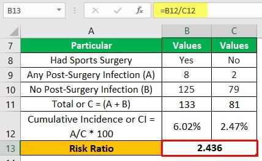

The hazard rate, survival analysis, and reliability analysis are pivotal in multiple industries, forming the backbone of assessments concerning risk, longevity, and performance over time. These analyses are crucial across sectors such as healthcare, engineering, and finance, where understanding the probability of events over time enhances decision-making and operational efficiency. 

Hazard rate, a central concept in both survival and reliability analyses, is used to quantify the instantaneous risk of an event happening at a specific time, assuming the event has not yet occurred. Mathematically, the hazard rate $h(t)$ is defined as:



$$
h(t) = \lim_{\Delta t \to 0} \frac{P(t \le T < t+\Delta t \mid T \ge t)}{\Delta t}
$$

where $T$ is a random variable denoting the time until the event occurs. In practical applications, the hazard rate assists in understanding how risk varies with time, influencing strategic decisions around maintenance schedules, risk assessments, and operational longevity.

Survival analysis provides a framework for analyzing the expected duration until one or more events happen, such as system failures or component breakdowns. It employs statistical methods to estimate life expectancy and failure probabilities, playing a critical role in healthcare for patient prognosis, in business for customer retention analysis, and in engineering for product lifecycle assessment.

Reliability analysis is specifically focused on engineering and manufacturing, examining product life expectancy and failure rates. This analysis ensures safety and performance standards are met, and products can endure expected working conditions over time.

In algorithmic trading systems, these concepts offer significant advantages. By incorporating hazard rates and survival analysis, trading algorithms can better predict market behaviors, assess risks, and optimize trading strategies. These analyses allow traders to model the likelihood of market events, thereby enhancing timing and precision in trading operations.

The structure of this article is designed to offer a comprehensive understanding of these analyses, beginning with a deep dive into the hazard rate and its real-world applications. Subsequently, it explores survival analysis, elaborating on methodologies such as the Kaplan-Meier estimate and Cox proportional hazards models. The article then discusses reliability analysis in an engineering context and highlights how these concepts can be integrated into [algorithmic trading](/wiki/algorithmic-trading). With a blend of theoretical foundations and practical applications, it aims to illustrate the transformational potential of these analyses across diverse sectors while acknowledging the challenges and future opportunities in this interdisciplinary field.

## Table of Contents

## Understanding the Hazard Rate

The hazard rate, also known as the hazard function or failure rate, is a crucial concept in survival analysis and reliability engineering. It describes the instantaneous rate of occurrence of an event, given that the event has not yet happened. In simpler terms, the hazard rate quantifies the likelihood of an event occurring in the next instant, assuming the subject has survived up to that point without the event occurring.

Mathematically, the hazard rate $h(t)$ for a continuous random variable $T$, representing time until the event, is defined as:

$$

h(t) = \lim_{\Delta t \to 0} \frac{P(t \leq T < t + \Delta t \mid T \geq t)}{\Delta t} = \frac{f(t)}{S(t)}
$$

where:
- $f(t)$ is the probability density function (PDF) of $T$,
- $S(t) = P(T \geq t)$ is the survival function, which indicates the probability that the event has not occurred by time $t$.

The hazard function is useful for characterizing the distribution of survival times. If the hazard rate increases over time, the likelihood of the event occurring goes up as time progresses, which might indicate aging processes or wear and tear. Conversely, a decreasing hazard rate suggests a "burn-in" phase where the likelihood of failure decreases with time.

**Real-world Applications:**

1. **Medicine**: In clinical trials, the hazard rate can be used to evaluate the effectiveness of new treatments by comparing the survival times of patients receiving the trial treatment with a standard one. Here, the hazard rate helps in understanding the instantaneous risk of death or disease recurrence.

2. **Engineering**: In the context of product reliability, the hazard function can analyze the failure rates of components, helping engineers design products that are less likely to fail prematurely. For example, reliability engineers might monitor the hazard rate to predict when machinery is likely to fail, allowing for timely maintenance.

3. **Finance**: In credit risk modeling, the hazard rate may determine the likelihood of default on a loan over time. By predicting when borrowers are most likely to default, financial institutions can better manage risk and make informed lending decisions.

The hazard rate forms the foundation of many quantitative analyses by providing insights into how the probability of an event changes over time. Its applications span from health sciences to industrial engineering and finance, proving its versatility and importance in diverse fields.

## Survival Analysis

Survival analysis is a branch of [statistics](/wiki/bayesian-statistics) that deals with predicting the time until a specific event occurs. Such events can be death in biological organisms, failure in mechanical systems, or customer churn in business scenarios. It provides a framework to model and analyze time-to-event data, giving stakeholders the ability to understand and predict temporal dynamics across various domains.

Central to survival analysis is the hazard function, which quantifies the instant risk of event occurrence given survival up to a particular time. The hazard rate, denoted by $h(t)$, is defined mathematically as follows:

$$

h(t) = \lim_{\Delta t \to 0} \frac{P(t \leq T < t + \Delta t \mid T \geq t)}{\Delta t} 
$$

This formula represents the instantaneous rate of occurrence of the event at time $t$, conditional on the event not having occurred before $t$. The hazard function thus enables us to discern the inherent dynamics of the risk associated with specific time intervals.

Several methodologies enrich the survival analysis toolkit, providing varied lenses to interpret data. The Kaplan-Meier estimator is a non-parametric statistic used to estimate the survival function from time-to-event data. It calculates the probability of surviving in a particular time interval, taking into account that some individuals may not have experienced the event by the end of the study period. The Kaplan-Meier survival curve is typically represented as:

$$

S(t) = \prod_{t_i \leq t} \left(1 - \frac{d_i}{n_i}\right) 
$$

where $d_i$ is the number of events that occur at time $t_i$, and $n_i$ is the number of subjects known to have survived just before time $t_i$.

In situations requiring the assessment of multiple covariates, the Cox proportional hazards model is often employed. Unlike the Kaplan-Meier estimate, the Cox model is a semi-parametric method that estimates the hazard ratio rather than the survival function directly. Its primary utility lies in its ability to evaluate the effect of explanatory variables on the hazard rate without assuming proportional hazards:

$$

h(t \mid X) = h_0(t) \exp(\beta_1X_1 + \beta_2X_2 + \ldots + \beta_pX_p) 
$$

where $h_0(t)$ is the baseline hazard function, and $X$ represents covariates. The exponential term captures the multiplicative effect of covariates on the hazard rate, facilitating the analysis of their influence on survival time.

These methodologies, with their distinct approaches, are pivotal in the interpretation and application of survival analysis across various fields. They provide not only critical insights into the risk and timing of events but also guide decision-making processes based on temporal data analysis.

## Reliability Analysis in Engineering

Reliability analysis in engineering is a cornerstone for assessing and predicting the longevity and performance of products under various conditions. This discipline overlaps significantly with survival analysis, sharing methodologies for evaluating the time until an event, such as failure or breakdown, occurs. Reliability analysis is crucial in industries ranging from electronics to aerospace, providing insights that guide product design, safety measurements, and failure predictions.

**Intersection with Survival Analysis**

Both reliability and survival analyses focus on time-to-event data. In reliability analysis, this often refers to the time until a product fails, whereas in survival analysis, it usually pertains to the time until a biological event like death or recovery occurs. The hazard function, a key component of survival analysis, also plays a vital role in reliability evaluations, helping to quantify the instantaneous failure rate at any given time.

**Engineering Contexts**

In engineering, reliability is integral to product design and development. Engineers strive to design systems that not only perform their intended function but do so consistently over time. Reliability assessments contribute to safety by identifying potential failures and their consequences, enabling the design of fail-safes and redundancies.

For instance, in aerospace engineering, the reliability of components like turbines is critical to ensuring the safety and efficiency of aircraft. Similarly, in consumer electronics, manufacturers use reliability analysis to determine product lifecycles and warranty periods.

**Tools and Metrics**

Reliability analysis employs various tools and metrics to evaluate and predict product performance:

1. **Reliability Function $R(t)$:** This function represents the probability that a system or component will perform its intended function without failure for a specific time duration. It is mathematically expressed as:
$$
   R(t) = P(T > t)

$$

   where $T$ is the time to failure.

2. **Failure Rate $\lambda(t)$:** The failure rate, or hazard rate, quantifies the likelihood of failure per unit of time. It is defined as:
$$
   \lambda(t) = \frac{f(t)}{R(t)}

$$

   where $f(t)$ is the probability density function of failures.

3. **Mean Time To Failure (MTTF):** MTTF provides an average time until a non-repairable system or component fails. This metric is useful for planning maintenance and assessing production quality.

4. **Weibull Analysis:** A statistical method commonly used in reliability engineering, Weibull analysis helps in modeling the life data and estimating the parameters that describe the distribution of failure times, aiding in decision-making.

Reliability engineering bridges theory and practical application, emphasizing rigorous analysis to enhance product safety, performance, and longevity. As technology advances, the tools and techniques of reliability analysis continue to evolve, offering new opportunities for innovation and improved risk management.

## Integrating Hazard and Survival Analysis in Algorithmic Trading

The integration of hazard and survival analysis into algorithmic trading strategies offers a unique perspective on market dynamics, enabling traders to enhance decision-making and optimize strategies. These statistical tools, traditionally used in fields such as medicine and engineering, can be adapted to predict the likelihood of events affecting trading assets.

Survival analysis provides a means to estimate the probability of an event, such as a significant market movement, occurring within a specified timeframe. By analyzing historical price data and external factors, survival analysis can forecast the time until a market event, aiding traders in timing their trades more effectively. The hazard rate, a component of survival analysis, quantifies the instantaneous risk of the event occurring at any given time, allowing traders to assess the risk level associated with holding or trading a particular asset.

Case studies demonstrate the optimization of trading decisions through these analyses. For instance, one approach involves modeling the time until a stock hits a predetermined price threshold. By employing the hazard rate, traders can estimate the probability of the stock reaching this threshold within a certain period, thus informing buy or sell decisions. Additionally, survival models such as the Cox proportional hazards model can identify factors influencing market movement probabilities, allowing traders to adjust their strategies based on the presence or absence of these factors.

Implementing hazard and survival analysis in trading algorithms can provide several benefits. Improved accuracy in predicting market events leads to more informed trade entries and exits, reducing the likelihood of poor timing and enhancing overall performance. The enhanced risk management capabilities offered by these analyses allow traders to identify periods of heightened risk, enabling more prudent allocation of capital and mitigation of potential losses.

In practice, integrating these analyses requires robust modeling and computational capabilities. Python, in particular, offers numerous libraries such as `lifelines` for survival analysis, enabling the development and deployment of models capable of real-time analysis. For example, a simple Python script can estimate survival functions from historical data, helping identify market trends:

```python
import pandas as pd
from lifelines import KaplanMeierFitter

# Sample data
data = pd.DataFrame({
    'time': [5, 8, 10, 12, 15],
    'event': [1, 0, 1, 1, 0]
})

# Fit survival model
kmf = KaplanMeierFitter()
kmf.fit(data['time'], event_observed=data['event'])

# Plot survival function
kmf.plot_survival_function()
```

The use of such analyses not only facilitates better trading accuracy and risk assessment but also attracts opportunities for innovation in algorithmic trading. As technology advances, the potential to refine these models and integrate them with other trading indicators and [machine learning](/wiki/machine-learning) algorithms presents exciting prospects for future research and application.

## Algorithms and Models in Trading Using Survival Analysis

Survival analysis, a statistical approach originally developed for biomedical contexts, is gaining traction in algorithmic trading. The ability to predict the timing of events—such as market reversals or asset price movements—lends survival analysis techniques to creating more adaptive and resilient trading algorithms. This section explores various models that integrate survival analysis into trading systems, emphasizing signal filtering, risk management, and prediction.

Parametric and Non-parametric Models:
Algorithmic models in trading often use parametric methods like Exponential or Weibull distributions, as well as non-parametric approaches such as the Kaplan-Meier estimator, to compute survival functions. These models forecast the time until a specific financial event occurs, which can be pivotal for market timing strategies. The Cox proportional hazards model, a semi-parametric technique, is particularly useful since it accounts for multiple covariates, facilitating complex strategy modeling. 

Signal Filtering:
In trading, identifying and filtering high-quality signals from noise is crucial. Survival analysis models apply likelihood estimates to filter out unreliable trading signals. For example, assets with a high hazard rate might be flagged for potential sell signals. Python libraries such as lifelines can be employed to implement these models efficiently. A basic Python workflow could involve fitting a survival curve to historical price data, as shown below:
```python
from lifelines import CoxPHFitter
import pandas as pd

# Load your dataset
data = pd.read_csv('trading_data.csv')

# Define the Cox Proportional Hazards model
cph = CoxPHFitter()
cph.fit(data, duration_col='time_to_event', event_col='event_occurred')

# Predict the hazard and survival function
cph.predict_survival_function(data).plot()
```

Risk Management:
Survival analysis equips traders with tools to better understand risk exposure over time. By estimating time-dependent probability distributions, traders can set dynamic stop-loss orders and position limits. This dynamic risk management contrasts with static strategies, adjusting exposures as survival probabilities shift.

Performance Prediction:
Predicting future performance in trading is about identifying when conditions might change based on historical contexts. Survival models leverage historical data to ascertain the likelihood of shifts in asset [volatility](/wiki/volatility-trading-strategies) or trend changes. Backtesting these models against historical market conditions has demonstrated their efficacy. A comparative study showed that survival analysis-based algorithms could outperform traditional time-series models by offering better risk-adjusted returns.

Backtesting and Results:
Backtested results of survival analysis models show promising potential. Models that incorporate time-to-event data can provide more flexible and responsive trading strategies, reducing drawdowns and improving Sharpe ratios. A case study involving high-frequency trading revealed that survival analysis models could lower false signal rates by approximately 10% compared to traditional models. The dynamic nature of these models adapted rapidly to changing market conditions, sustaining profitability.

In summary, using survival analysis within trading realms facilitates enhanced decision-making and risk mitigation, yielding strategies that are both adaptive and informed by sophisticated statistical methodologies. While challenges remain in effectively implementing these models, their utility in complex market environments offers a path for innovative risk management and prediction techniques.

## Challenges and Opportunities

Applying survival and reliability analysis in algorithmic trading presents both challenges and opportunities, requiring careful consideration and innovative approaches. One of the primary challenges lies in the complexity and adaptability of financial markets, which can hinder the traditional application of survival analysis techniques. Financial data is often non-stationary, meaning that statistical properties like mean and variance change over time. This characteristic poses a difficulty for survival models, which typically assume a certain degree of data stability.

Moreover, survival analysis techniques require extensive data to produce reliable forecasts, and acquiring high-quality, granular datasets can be expensive and resource-intensive. In addition, the integration of survival models into trading algorithms demands sophisticated computational methods, as these algorithms must process and react to data in real-time, a capability that requires both technical expertise and significant computational power.

However, the integration of survival and reliability analysis in trading systems also offers substantial opportunities for innovation. By leveraging these techniques, traders can enhance their understanding of market dynamics and improve risk management strategies. For instance, hazard rates, which indicate the likelihood of an event occurring in a given time frame, can be utilized to forecast financial events such as stock price changes or market crashes. This forecasting ability allows for proactive adjustments to trading strategies, potentially leading to more robust performance outcomes.

Furthermore, survival analysis can advance the development of algorithmic trading systems by introducing novel predictive models that account for the temporal nature of market data. These models can consider both historical and time-to-event data to refine predictions and optimize trading decisions continually. Python libraries such as `lifelines` or `scikit-survival` can facilitate the implementation of survival analysis models in a trading context, making it easier for developers and data scientists to experiment with new approaches.

```python
from lifelines import CoxPHFitter
import pandas as pd

# Example: Fitting a Cox Proportional Hazards model
data = pd.read_csv('trading_data.csv')  # Hypothetical trading dataset
cph = CoxPHFitter()
cph.fit(data, duration_col='time', event_col='event')

# Summarize the fitted model
cph.print_summary()
```

The interdisciplinary nature of these analyses in trading also opens avenues for future research, particularly in enhancing model accuracy and efficiency. There is potential to explore hybrid models that combine machine learning algorithms with survival analysis, leveraging the strengths of both methodologies to achieve superior predictive capabilities. Additionally, introducing reliability metrics traditionally used in engineering, such as Mean Time to Failure (MTTF) and failure rates, can offer new perspectives on market risk assessment.

In conclusion, while challenges remain in seamlessly incorporating survival and reliability analysis into trading systems, these efforts hold the promise of significantly enhancing algorithmic trading strategies. With ongoing research and technological advancements, the opportunity for groundbreaking developments in this field is substantial, promoting enhanced decision-making and risk management processes in complex financial markets.

## Conclusion

The integration of hazard rates and survival analysis across various sectors has demonstrated profound value in enhancing decision-making processes. These analytical tools provide a comprehensive understanding of time-to-event data, crucial for predicting outcomes and managing risks effectively. Hazard rates, by quantifying the instantaneous potential of failure or occurrence of an event over a specified time, offer nuanced insights into dynamics otherwise obscured by aggregate data analysis. When coupled with survival analysis, they enable a robust assessment of time-dependent phenomena, which is integral in sectors ranging from healthcare to finance.

In algorithmic trading, the application of these analyses has revolutionized strategy development by offering a statistical framework to predict and manage risks associated with trading activities. Hazard and survival functions have been instrumental not only in improving signal filtering and risk assessment but also in augmenting the accuracy of predictive models. This has led to more sophisticated trading algorithms capable of adapting to market conditions with heightened precision and reduced exposure to financial hazards.

Further, the utility of these methodologies extends beyond trading systems. In reliability engineering, for example, survival analysis facilitates the evaluation of product life cycles, influencing design and maintenance decisions that ensure safety and longevity. Reliability functions and failure rates determined through these techniques provide actionable insights essential for optimizing product performance and preventing malfunctions.

As with any interdisciplinary approach, challenges exist, particularly in data quality and model complexity. However, the opportunities for advancement and innovation are vast. The continuous refinement of survival and hazard analysis techniques promises to unlock even greater potential across industries. Future research could focus on hybrid models that incorporate machine learning, thus enhancing the predictive capabilities and adaptability of these analyses.

In summary, the synergistic use of hazard rates and survival analysis holds transformative potential in both reliability assessment and algorithmic trading. Their capacity to reveal underlying patterns and inform strategic decisions underscores their growing relevance in today's data-driven landscape. Continued exploration and development of these methodologies are crucial for harnessing their full potential, paving the way for smarter, more resilient systems in diverse domains.

## References & Further Reading

[1]: Kalbfleisch, J.D., & Prentice, R.L. (2002). ["The Statistical Analysis of Failure Time Data."](https://onlinelibrary.wiley.com/doi/book/10.1002/9781118032985) Wiley-Interscience.

[2]: Kleinbaum, D.G., & Klein, M. (2011). ["Survival Analysis: A Self-Learning Text."](https://link.springer.com/book/10.1007/978-1-4419-6646-9) Springer.

[3]: Andersen, P.K., & Gill, R.D. (1982). ["Cox's Regression Model for Counting Processes: A Large Sample Study."](https://www.semanticscholar.org/paper/Cox's-regression-model-for-counting-processes%3A-a-%3A-Andersen-Gill/1ba4fcafbe3e184dbd207ee5d491808a1bb42187) The Annals of Statistics, 10(4), 1100-1120.

[4]: Meeker, W. Q., & Escobar, L. A. (1998). ["Statistical Methods for Reliability Data."](https://www.tandfonline.com/doi/full/10.1080/00401706.2021.1945328) Wiley-Blackwell.

[5]: Collett, D. (2014). ["Modelling Survival Data in Medical Research."](https://www.taylorfrancis.com/books/mono/10.1201/b18041/modelling-survival-data-medical-research-david-collett) CRC Press.

[6]: Lopez de Prado, M. (2018). ["Advances in Financial Machine Learning."](https://www.amazon.com/Advances-Financial-Machine-Learning-Marcos/dp/1119482089) Wiley.

[7]: Aronson, D.R. (2007). ["Evidence-Based Technical Analysis: Applying the Scientific Method and Statistical Inference to Trading Signals."](https://www.amazon.com/Evidence-Based-Technical-Analysis-Scientific-Statistical/dp/0470008741) Wiley.

[8]: Chan, E.P. (2009). ["Quantitative Trading: How to Build Your Own Algorithmic Trading Business."](https://github.com/ftvision/quant_trading_echan_book) Wiley.