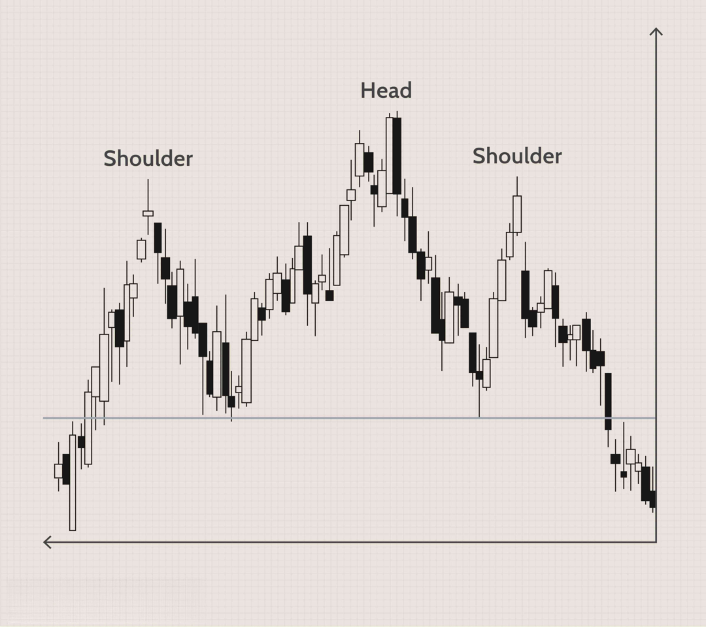

## Table of Contents

## What is the Head and Shoulders pattern in technical analysis?

The Head and Shoulders pattern is a chart formation used in technical analysis to predict a reversal in the trend of a stock or other financial asset. It looks like a person's head and shoulders, with three peaks where the middle peak (the head) is higher than the two on either side (the shoulders). This pattern usually forms after an uptrend and signals that the trend might be ending and a downtrend could start. Traders watch for this pattern because it can help them decide when to sell their investments before the price goes down.

To spot a Head and Shoulders pattern, you need to see the left shoulder, the head, and the right shoulder. The left shoulder is formed when the price reaches a peak and then falls. The head is the next peak, which is higher than the left shoulder. After the head, the price falls again and then rises to form the right shoulder, which is lower than the head but around the same level as the left shoulder. A key part of this pattern is the neckline, which is a line drawn connecting the lows after the left shoulder and the head. When the price breaks below this neckline after forming the right shoulder, it confirms the pattern and suggests that a downtrend is likely to follow.

## How can you identify a Head and Shoulders pattern on a price chart?

To identify a Head and Shoulders pattern on a price chart, you need to look for three main peaks. The first peak is called the left shoulder, the second and highest peak is the head, and the third peak, which is about the same height as the left shoulder, is the right shoulder. These peaks should happen one after the other. The left shoulder forms when the price goes up to a high point and then drops down. Then, the price goes up again to form the head, which is higher than the left shoulder, before dropping down again. Finally, the price rises one more time to form the right shoulder, which is lower than the head but around the same height as the left shoulder.

The next important thing to look for is the neckline. This is a line you draw connecting the lowest points after the left shoulder and the head. These low points are called troughs. The neckline can be flat or it can slope up or down a bit. The pattern is confirmed when the price breaks below this neckline after forming the right shoulder. This break below the neckline is a signal that the price might start going down, suggesting that the uptrend is over and a downtrend could be starting.

## What are the key components of a Head and Shoulders pattern?

The Head and Shoulders pattern has three main parts: the left shoulder, the head, and the right shoulder. These parts are peaks on a price chart. The left shoulder is the first peak. It happens when the price goes up and then comes back down. The head is the second peak and it's the highest one. It forms when the price goes up again after the left shoulder and then falls back down. The right shoulder is the third peak. It's about as high as the left shoulder. It forms when the price goes up one more time after the head and then drops.

Another important part of the Head and Shoulders pattern is the neckline. The neckline is a line you draw to connect the lowest points, or troughs, after the left shoulder and the head. The neckline can be flat or it can go up or down a little bit. The pattern is confirmed when the price breaks below this neckline after the right shoulder forms. This break is a sign that the price might start going down. It tells traders that the trend could be changing from going up to going down.

## What does the Head and Shoulders pattern indicate about future price movements?

The Head and Shoulders pattern on a price chart tells traders that the price of a stock or asset might start going down soon. This pattern shows up after the price has been going up for a while. It looks like a person's head with shoulders on both sides. The middle peak, or the head, is the highest point. When you see this pattern, it means the upward trend is probably getting tired and might be about to change direction. The key moment is when the price drops below the neckline, a line drawn between the lowest points after the left shoulder and the head. That's when traders think it's time to sell because the price is likely to keep going down.

The Head and Shoulders pattern is important because it helps traders make decisions. If they see this pattern forming, they might decide to sell their investments before the price starts to fall. This can help them avoid losing money. The pattern is confirmed when the price breaks the neckline after the right shoulder forms. This break is a strong sign that the price trend is reversing from up to down. By watching for this pattern, traders can try to predict when the price will change and plan their next moves accordingly.

## How does the inverse Head and Shoulders pattern differ from the standard one?

The inverse Head and Shoulders pattern is the opposite of the standard Head and Shoulders pattern. Instead of predicting a change from an uptrend to a downtrend, the inverse pattern suggests that the price might start going up after being in a downtrend. In this pattern, you'll see three troughs instead of peaks. The middle trough, called the head, is the lowest point, and the troughs on either side, called the left and right shoulders, are higher but about the same level as each other.

The key part of the inverse Head and Shoulders pattern is the neckline, just like in the standard pattern. But here, the neckline is drawn by connecting the highest points, or peaks, after the left shoulder and the head. When the price breaks above this neckline after the right shoulder forms, it confirms the pattern. This break above the neckline tells traders that the price might keep going up, signaling the start of an uptrend. So, while the standard Head and Shoulders pattern warns traders to sell, the inverse pattern encourages them to buy.

## What are the steps to trade a Head and Shoulders pattern effectively?

To trade a Head and Shoulders pattern effectively, you need to wait for the pattern to fully form and confirm before making any moves. Start by watching the price chart to see the left shoulder, the head, and the right shoulder. The left shoulder is the first peak, the head is the highest peak, and the right shoulder is the third peak that's about as high as the left shoulder. Draw the neckline by connecting the lowest points after the left shoulder and the head. The pattern is confirmed when the price breaks below this neckline after the right shoulder forms. This break is your signal to start thinking about selling or going short on the stock because the price is likely to go down.

Once the pattern is confirmed, you can place a sell order. Set your target price for selling by measuring the distance from the head to the neckline and then subtracting that distance from the point where the price breaks the neckline. This gives you an idea of how far the price might fall. It's also smart to set a stop-loss order just above the right shoulder to limit your losses in case the price goes back up instead of down. By following these steps, you can use the Head and Shoulders pattern to make better trading decisions and try to make a profit from the expected downtrend.

## How do you set stop-loss and take-profit levels when trading a Head and Shoulders pattern?

When trading a Head and Shoulders pattern, setting a stop-loss level is important to protect yourself from losing too much money. After the price breaks below the neckline and you decide to sell or go short, you should set your stop-loss just above the right shoulder. This means if the price goes back up and reaches this level, your trade will close automatically, limiting your losses. The idea is that if the price goes above the right shoulder, it might mean the pattern didn't work out as expected, and the price could keep going up instead of down.

To set your take-profit level, you need to measure the distance from the head to the neckline. Once you have this distance, you subtract it from the point where the price breaks the neckline. This gives you a target price where you think the price might stop falling. Setting your take-profit at this level means if the price goes down to this point, your trade will close, and you'll make a profit. This way, you can plan ahead and decide when to take your profits based on how the Head and Shoulders pattern usually works.

## What are common mistakes traders make when interpreting Head and Shoulders patterns?

One common mistake traders make when interpreting Head and Shoulders patterns is jumping into a trade too soon. They might see the pattern starting to form and think it's a good time to sell, but if they act before the price breaks the neckline, they could be wrong. The pattern isn't confirmed until the price goes below the neckline after the right shoulder forms. If traders sell too early, they might miss out on more gains or even lose money if the price keeps going up instead of down.

Another mistake is not setting proper stop-loss and take-profit levels. Traders might forget to set a stop-loss above the right shoulder, which leaves them open to big losses if the price goes back up. They also might not measure the distance from the head to the neckline to set a good take-profit level. Without these levels, traders don't have a plan for when to get out of the trade, which can lead to holding onto a losing position for too long or missing out on profits.

## How can volume be used to confirm a Head and Shoulders pattern?

Volume can help confirm a Head and Shoulders pattern by showing how strong the price movements are. When the left shoulder forms, the volume should be pretty high because lots of people are buying the stock, pushing the price up. But when the head forms, the volume might start to drop a bit. This shows that fewer people are buying, and the upward trend is getting weaker. When the right shoulder forms, the volume should be even lower than it was during the head. This lower volume means even fewer people are buying, and it's a sign that the price might start to go down soon.

The most important volume signal comes when the price breaks the neckline. If the price goes below the neckline on high volume, it's a strong sign that the Head and Shoulders pattern is confirmed. High volume at this point means a lot of people are selling the stock, which pushes the price down even more. If the volume is low when the price breaks the neckline, it might not be a good sign, and the pattern might not be as reliable. So, watching the volume can help traders decide if it's a good time to sell or not.

## What are the statistical success rates of Head and Shoulders patterns in different markets?

The success rate of Head and Shoulders patterns can be different depending on the market you're looking at. In the stock market, studies have shown that the Head and Shoulders pattern can be right about 70-80% of the time. This means that if you see this pattern and the price breaks the neckline, there's a good chance the price will go down like you expect. But this can change based on things like how long you're looking at the chart for and what kind of stocks you're trading.

In the forex market, the success rate can be a bit lower, around 60-70%. Forex markets can be more unpredictable because they're affected by things like interest rates, economic news, and global events. So, even though the Head and Shoulders pattern can still be helpful, it might not work as well as it does in the stock market. It's always a good idea to use other tools and signs along with the Head and Shoulders pattern to make better trading choices.

## How can the Head and Shoulders pattern be integrated with other technical indicators for better accuracy?

To make the Head and Shoulders pattern more reliable, traders often use it together with other technical indicators. One common tool is the Relative Strength Index (RSI). The RSI helps traders see if a stock is overbought or oversold. When you see a Head and Shoulders pattern forming, you can check the RSI. If the RSI is above 70 when the pattern is forming, it might mean the stock is overbought and due for a price drop. If the RSI is below 30 when the price breaks the neckline, it can confirm that the stock is oversold and the price is likely to keep going down.

Another helpful indicator is the Moving Average Convergence Divergence (MACD). The MACD can show you when the trend might be changing. If you see the Head and Shoulders pattern and the MACD line crosses below the signal line around the same time the price breaks the neckline, it's a strong sign that the price will go down. By combining the Head and Shoulders pattern with these indicators, traders can feel more confident about their decisions and improve their chances of making the right move at the right time.

## What advanced techniques can be used to enhance the reliability of Head and Shoulders pattern predictions?

To make Head and Shoulders pattern predictions more reliable, traders can use advanced techniques like multiple time frame analysis. This means looking at the pattern on different time frames, such as daily, weekly, and monthly charts. If the pattern shows up on more than one time frame, it's a stronger sign that the price will go down. Another technique is to pay attention to the volume profile. Volume should be high when the left shoulder forms, lower during the head, even lower during the right shoulder, and then spike when the price breaks the neckline. This pattern in volume can confirm the Head and Shoulders pattern and make traders more confident in their predictions.

Traders can also use Fibonacci retracement levels to predict how far the price might fall after breaking the neckline. After the price breaks the neckline, traders can measure the distance from the head to the neckline and then look for key Fibonacci levels like 38.2%, 50%, and 61.8% below the neckline. These levels can act as targets for where the price might stop falling. By combining these advanced techniques with the basic Head and Shoulders pattern, traders can get a clearer picture of what the market might do next and make better trading decisions.

## How does the Head and Shoulders Pattern work?

The head and shoulders pattern is a technical analysis tool used to predict the reversal of a bullish trend into a bearish one. It is identified by a sequence of three peaks: an initial peak (left shoulder), followed by a higher peak (head), and then a lower peak (right shoulder). The significance of this pattern lies in its ability to indicate a shift in market sentiment from bullish to bearish.

In a classic head and shoulders pattern, the connecting line drawn between the lowest points of the two troughs between the peaks is called the neckline. This neckline serves as a critical boundary for traders. The neckline can either be horizontal or slightly sloped. A sloping neckline suggests varying degrees of trend reversal strength.

Mathematically, the pattern is completed when the price falls below the neckline after forming the right shoulder. This movement is typically referred to as a "[breakout](/wiki/breakout-trading)". When the price breaks out past the neckline, it suggests a reversal, and traders may utilize this signal to enter a sell position as the market is expected to move downward.

To quantify potential target levels after a breakout, traders often measure the vertical distance from the top of the head to the neckline. This distance is then projected downward from the breakout point to establish a price target. Formulaically, this can be represented as:

$$
\text{Target Price} = \text{Breakout Price} - (\text{Head Price} - \text{Neckline Price})
$$

This calculation provides traders with an estimated level where the price might move after the breakout, enabling them to set profit targets or stop losses effectively.

In summary, the head and shoulders pattern operates as an early warning signal for trend reversals. Its successful application depends on accurately identifying the pattern elements and reacting promptly to price movements that confirm a breakout below the neckline.

## References & Further Reading

[1]: Bergstra, J., Bardenet, R., Bengio, Y., & Kégl, B. (2011). ["Algorithms for Hyper-Parameter Optimization."](https://dl.acm.org/doi/10.5555/2986459.2986743) Advances in Neural Information Processing Systems 24.

[2]: ["Advances in Financial Machine Learning"](https://www.amazon.com/Advances-Financial-Machine-Learning-Marcos/dp/1119482089) by Marcos Lopez de Prado

[3]: ["Evidence-Based Technical Analysis: Applying the Scientific Method and Statistical Inference to Trading Signals"](https://www.amazon.com/Evidence-Based-Technical-Analysis-Scientific-Statistical/dp/0470008741) by David Aronson

[4]: ["Machine Learning for Algorithmic Trading"](https://github.com/stefan-jansen/machine-learning-for-trading) by Stefan Jansen

[5]: ["Quantitative Trading: How to Build Your Own Algorithmic Trading Business"](https://www.amazon.com/Quantitative-Trading-Build-Algorithmic-Business/dp/1119800064) by Ernest P. Chan