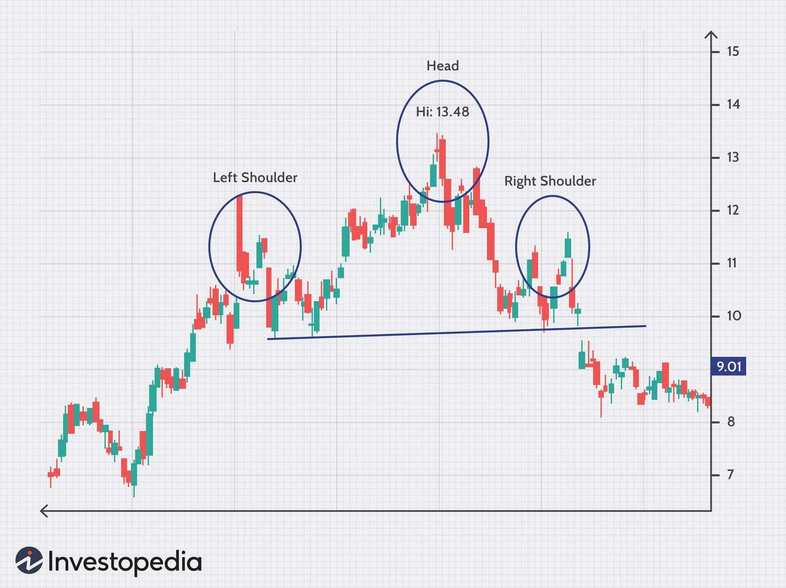

## Table of Contents

## What is the Head and Shoulders pattern in trading?

The Head and Shoulders pattern is a chart formation used in trading to predict when a trend might be ending. It looks like a person's head with shoulders on either side. This pattern usually shows up at the top of an upward trend, signaling that the price might start going down soon. It has three main parts: the left shoulder, the head, and the right shoulder. The left shoulder forms when the price goes up and then drops a bit. The head is the highest point, where the price goes even higher before falling again. The right shoulder happens when the price rises one more time but not as high as the head, and then it falls again.

When traders see this pattern, they often get ready for a change in the market. The key part of the Head and Shoulders pattern is the "neckline," which is a line drawn across the lowest points of the two shoulders. When the price falls below this neckline after the right shoulder forms, it's a strong sign that the trend is reversing. Traders might then decide to sell their stocks or other assets, expecting the price to keep going down. The opposite of this pattern, called the Inverse Head and Shoulders, can signal that a downward trend is about to turn upward.

## How can you identify a Head and Shoulders pattern on a chart?

To spot a Head and Shoulders pattern on a chart, you need to look for three main peaks. The first peak is the left shoulder, which happens when the price goes up and then drops a bit. After that, the price climbs higher to form the head, which is the tallest peak. Then, the price falls again before rising one last time to create the right shoulder. This last peak is usually not as high as the head but might be about the same height as the left shoulder. The key is to see these three peaks in a row, with the middle one being the highest.

Once you see these three peaks, draw a line called the neckline. This line connects the lowest points right after the left shoulder and the right shoulder. If the price drops below this neckline after the right shoulder forms, it's a strong hint that the trend might be changing from going up to going down. This is when traders might start thinking about selling their stocks or other things they own, expecting the price to keep falling.

## What are the key components of a Head and Shoulders pattern?

The Head and Shoulders pattern has three main parts: the left shoulder, the head, and the right shoulder. The left shoulder forms when the price goes up and then drops a bit. Next, the price climbs higher to make the head, which is the highest point in the pattern. After the head, the price falls again before going up one last time to create the right shoulder. This last peak is usually not as high as the head but might be about the same height as the left shoulder.

Another important part of the Head and Shoulders pattern is the neckline. The neckline is a line you draw to connect the lowest points after the left shoulder and the right shoulder. When the price drops below this neckline after the right shoulder forms, it's a big sign that the price might start going down. Traders watch for this drop below the neckline to decide if they should sell their stocks or other things they own, expecting the price to keep falling.

## How does the Head and Shoulders pattern indicate a trend reversal?

The Head and Shoulders pattern shows that a trend might be changing from going up to going down. It looks like a person's head with shoulders on both sides. First, the price goes up and then drops a bit, making the left shoulder. Then, it goes up even higher to make the head, which is the tallest part. After the head, the price falls again and then goes up one more time to make the right shoulder. This last peak is usually not as high as the head but might be about the same as the left shoulder.

The key to knowing if the trend is really changing is the neckline. The neckline is a line you draw to connect the lowest points after the left shoulder and the right shoulder. When the price drops below this neckline after the right shoulder forms, it's a big sign that the price might start going down. Traders watch for this drop below the neckline to decide if they should sell their stocks or other things they own, expecting the price to keep falling.

## What is the difference between a Head and Shoulders top and a Head and Shoulders bottom?

A Head and Shoulders top is a pattern that shows up at the end of an upward trend. It looks like a person's head with shoulders on both sides. The price goes up to make the left shoulder, then goes up even higher to make the head, and then goes up one last time to make the right shoulder. The right shoulder is usually not as high as the head. When the price drops below a line called the neckline, which connects the lowest points after the left and right shoulders, it means the trend might be changing from going up to going down. Traders see this as a sign to sell their stocks, expecting the price to keep falling.

A Head and Shoulders bottom, also called an Inverse Head and Shoulders, is the opposite. It shows up at the end of a downward trend. The price goes down to make the left shoulder, then goes down even lower to make the head, and then goes down one last time to make the right shoulder. The right shoulder is usually not as low as the head. When the price goes above the neckline, which connects the highest points after the left and right shoulders, it means the trend might be changing from going down to going up. Traders see this as a sign to buy stocks, expecting the price to start rising.

## How do you set a price target using the Head and Shoulders pattern?

To set a price target using the Head and Shoulders pattern, you first need to find the height of the pattern. The height is the distance from the top of the head to the neckline. Once you know the height, you measure it down from the point where the price breaks below the neckline. This new point is your price target. It's where traders think the price might go after the pattern finishes.

For example, if the head of the pattern reaches $100 and the neckline is at $90, the height of the pattern is $10. When the price breaks below the neckline, say at $89, you subtract the height of the pattern from this [breakout](/wiki/breakout-trading) point. So, $89 minus $10 gives you a price target of $79. Traders use this target to plan their trades, deciding when to sell their stocks or other things they own, expecting the price to reach this level.

## What are the common entry points when trading a Head and Shoulders pattern?

When trading a Head and Shoulders pattern, a common entry point is when the price breaks below the neckline after the right shoulder forms. This break below the neckline is a strong sign that the trend is changing from going up to going down. Traders often wait for this moment to enter a trade, selling their stocks or other assets because they expect the price to keep falling.

Another entry point some traders use is when the price starts to pull back to the neckline after it has already broken below it. This is called a retest. If the price touches the neckline again but doesn't go above it, it can be another good time to enter a trade. Traders might see this as a second chance to sell, still expecting the price to go down to the price target they calculated from the height of the pattern.

## How do you manage risk when trading the Head and Shoulders pattern?

When trading the Head and Shoulders pattern, managing risk is important to protect your money. One way to do this is by setting a stop-loss order. A stop-loss is like a safety net that tells your broker to sell your stocks if the price goes up a bit after breaking the neckline. You can set it just above the right shoulder or the neckline. This way, if the price goes back up and the pattern doesn't work out, you won't lose too much money.

Another way to manage risk is by not putting all your money into one trade. It's smart to only use a small part of your money for each trade. This is called position sizing. If the trade doesn't go as planned, you won't lose everything. Also, always have a clear plan for how much you're willing to lose before you start trading. This helps you stay calm and make better choices, even if the market moves against you.

## What are some common mistakes traders make when using the Head and Shoulders pattern?

One common mistake traders make when using the Head and Shoulders pattern is jumping into a trade too early. They might see the pattern forming and get excited, but they enter the trade before the price actually breaks the neckline. This can lead to losses if the pattern doesn't complete as expected. It's important to wait for the price to clearly break the neckline before making a move.

Another mistake is not setting a stop-loss or setting it too far away. A stop-loss helps limit losses if the trade goes the wrong way. If traders don't use one or set it too far from the entry point, they might lose more money than they planned. It's smart to set a stop-loss just above the right shoulder or the neckline to protect your money.

Lastly, some traders ignore the possibility of a neckline retest. After the price breaks the neckline, it might come back to touch it again before continuing down. If traders don't wait for this retest and enter the trade too soon, they might miss out on a better entry point. Being patient and waiting for a clear signal can help avoid these mistakes and improve trading success.

## How can volume be used to confirm a Head and Shoulders pattern?

Volume can help traders feel more sure about a Head and Shoulders pattern. When the left shoulder forms, the [volume](/wiki/volume-trading-strategy) is usually high because lots of people are buying. But when the head forms, the volume might be a bit less. This shows that fewer people are buying at the higher price. When the right shoulder forms, the volume should be even lower than when the head formed. This lower volume tells traders that the buying power is getting weaker, and the trend might be ready to change.

After the right shoulder forms, the volume becomes really important again. When the price breaks the neckline, the volume should go up a lot. This high volume means more people are selling, which makes the break more powerful. If the volume doesn't go up when the price breaks the neckline, traders might not trust the pattern as much. So, watching the volume can help traders decide if the Head and Shoulders pattern is a good sign that the trend is really going to reverse.

## What are the advanced techniques for trading the Head and Shoulders pattern?

One advanced technique for trading the Head and Shoulders pattern is to use multiple time frames to confirm the pattern. Traders can look at the pattern on a daily chart and then check a shorter time frame, like an hourly chart, to see if the pattern is also clear there. This helps make sure the pattern is strong and not just a fluke. Another technique is to combine the Head and Shoulders pattern with other indicators, like moving averages or the Relative Strength Index (RSI). If these other tools also show that the trend might be changing, it can give traders more confidence in their trade.

Another advanced approach is to watch for a neckline retest after the price breaks below it. Sometimes, the price might come back to touch the neckline again before it continues to drop. If the price touches the neckline but doesn't go above it, it's a good sign that the pattern is still valid. Traders can use this retest as a second chance to enter the trade at a better price. Also, some traders use the Head and Shoulders pattern to set more precise price targets. They might look at the height of the pattern and then adjust the target based on other market factors or the strength of the breakout, making their trading plan more detailed and potentially more profitable.

## How can you combine the Head and Shoulders pattern with other technical indicators for better trading decisions?

Combining the Head and Shoulders pattern with other technical indicators can help traders make better trading decisions. One way to do this is by using moving averages. If the price breaks below the neckline of the Head and Shoulders pattern and is also below a key moving average, like the 50-day or 200-day moving average, it can confirm that the trend is likely to keep going down. Another useful indicator is the Relative Strength Index (RSI). If the RSI shows that the market is overbought when the Head and Shoulders pattern forms, it can add more weight to the idea that the trend is about to reverse. By looking at these other indicators, traders can feel more confident in their trades.

Another way to use other indicators with the Head and Shoulders pattern is by watching volume. When the price breaks the neckline, a high volume can confirm that the pattern is strong and the trend is really changing. Traders can also use the Moving Average Convergence Divergence (MACD) to spot when the [momentum](/wiki/momentum) is shifting. If the MACD line crosses below the signal line around the same time the price breaks the neckline, it can be a powerful sign that it's time to sell. Using these extra tools helps traders make smarter choices and avoid jumping into trades based only on one pattern.

## References & Further Reading

[1]: Bergstra, J., Bardenet, R., Bengio, Y., & Kégl, B. (2011). ["Algorithms for Hyper-Parameter Optimization."](https://proceedings.neurips.cc/paper/2011/file/86e8f7ab32cfd12577bc2619bc635690-Paper.pdf) Advances in Neural Information Processing Systems 24.

[2]: ["Advances in Financial Machine Learning"](https://www.amazon.com/Advances-Financial-Machine-Learning-Marcos/dp/1119482089) by Marcos Lopez de Prado

[3]: ["Evidence-Based Technical Analysis: Applying the Scientific Method and Statistical Inference to Trading Signals"](https://www.wiley.com/en-us/Evidence+Based+Technical+Analysis%3A+Applying+the+Scientific+Method+and+Statistical+Inference+to+Trading+Signals-p-9780470008744) by David Aronson

[4]: ["Machine Learning for Algorithmic Trading"](https://github.com/PacktPublishing/Machine-Learning-for-Algorithmic-Trading-Second-Edition) by Stefan Jansen

[5]: ["Quantitative Trading: How to Build Your Own Algorithmic Trading Business"](https://www.amazon.com/Quantitative-Trading-Build-Algorithmic-Business/dp/1119800064) by Ernest P. Chan