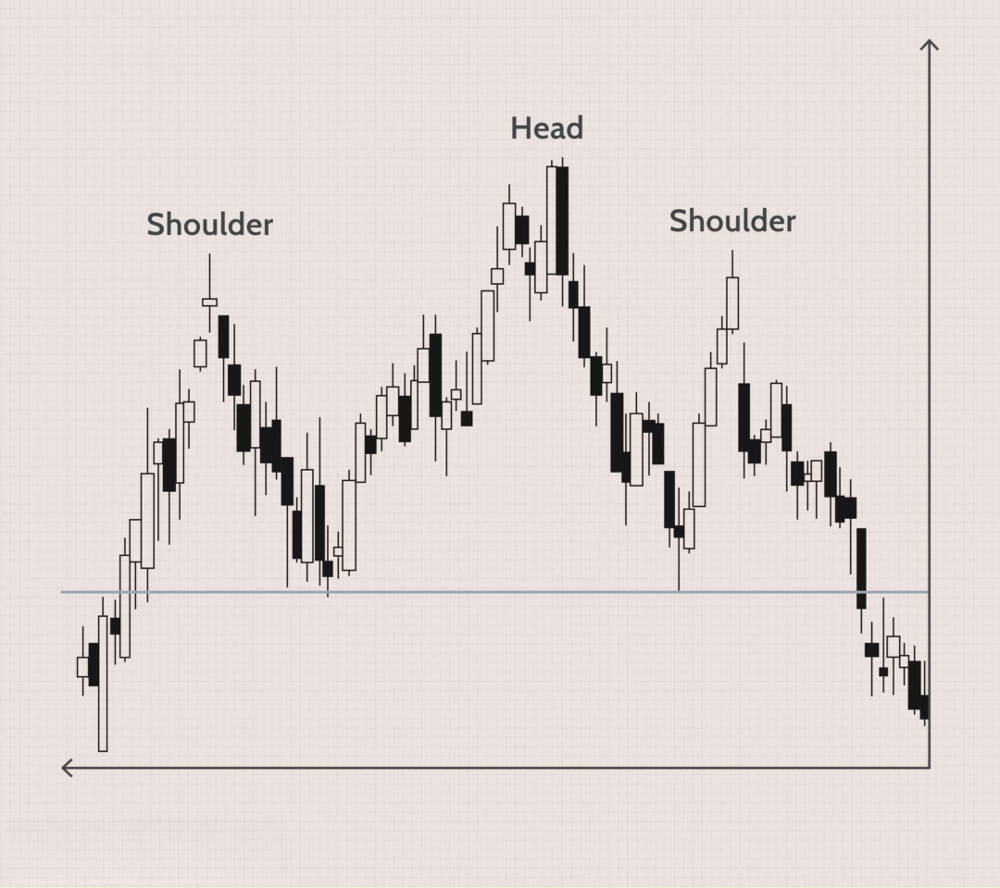

## Table of Contents

## What is the Head and Shoulders pattern in trading?

The Head and Shoulders pattern is a chart formation used in trading to predict when a trend might be ending. It looks like a person's head and shoulders, with three peaks. The middle peak, or the "head," is the highest, and the two side peaks, or the "shoulders," are lower and about the same height. A line called the "neckline" connects the lowest points of the two valleys between the peaks. When the price falls below this neckline after forming the right shoulder, it signals that the trend might reverse.

This pattern is important because it helps traders decide when to sell. If you see a Head and Shoulders pattern forming during an uptrend, it could mean the price will start going down soon. Traders often sell their stocks when the price breaks below the neckline. The opposite of this pattern is called an "Inverse Head and Shoulders," which can signal that a downtrend might be ending and prices could start going up. Both patterns help traders make better decisions about buying and selling.

## How can you identify a Head and Shoulders pattern on a chart?

To spot a Head and Shoulders pattern on a chart, you need to look for three main peaks. The middle peak, called the head, should be the tallest. On either side of the head, there are two smaller peaks, called the left and right shoulders. These shoulders should be about the same height but lower than the head. Between these peaks, there are two valleys. You draw a line, called the neckline, connecting the lowest points of these two valleys. This line can be straight or slightly sloped.

Once you see this pattern forming during an uptrend, watch for the price to break below the neckline after the right shoulder forms. This break below the neckline is a signal that the trend might be reversing, and it's time to think about selling. The pattern helps traders see when a price might start going down after going up for a while. If you see the opposite pattern, with the head at the bottom and the shoulders above it, that's called an Inverse Head and Shoulders, and it might mean the price will start going up after going down.

## What does a Head and Shoulders pattern indicate about market trends?

A Head and Shoulders pattern tells traders that a market trend might be changing. It looks like a person's head and shoulders on a chart. The middle peak, which is the highest, is called the head. On both sides of the head, there are two smaller peaks called the left and right shoulders. These shoulders are about the same height but not as tall as the head. When you see this pattern during a time when prices have been going up, it means the prices might start going down soon.

The key moment to watch is when the price drops below a line called the neckline. This line connects the lowest points between the head and the shoulders. When the price falls below this neckline after the right shoulder forms, it's a signal that the trend is likely to reverse. Traders often use this signal to decide when to sell their stocks. If you see the opposite pattern, called an Inverse Head and Shoulders, it means prices might start going up after they've been going down. Both patterns help traders make better choices about when to buy or sell.

## Can you explain the difference between a Head and Shoulders top and a Head and Shoulders bottom?

A Head and Shoulders top happens when prices have been going up for a while. It looks like a person's head and shoulders on a chart. The middle peak, called the head, is the tallest. On both sides of the head, there are two smaller peaks called the left and right shoulders. These shoulders are about the same height but not as tall as the head. When you see this pattern, it means the prices might start going down soon. The important part is when the price drops below a line called the neckline, which connects the lowest points between the head and the shoulders. When the price falls below this line after the right shoulder forms, it's a signal that the trend is likely to reverse, and traders might want to sell their stocks.

A Head and Shoulders bottom, also called an Inverse Head and Shoulders, is the opposite. It happens when prices have been going down for a while. This pattern looks like an upside-down head and shoulders. The middle part, the head, is the lowest point. On both sides of the head, there are two higher points called the left and right shoulders. These shoulders are about the same height but not as low as the head. When you see this pattern, it means the prices might start going up soon. The key moment is when the price goes above the neckline, which connects the highest points between the head and the shoulders. When the price rises above this line after the right shoulder forms, it's a signal that the trend might reverse, and traders might want to buy stocks.

## What are the key components of a Head and Shoulders pattern?

A Head and Shoulders pattern has three main parts: the left shoulder, the head, and the right shoulder. The left shoulder is the first peak that forms during an uptrend. After the left shoulder, the price drops a bit and then goes up again to form the head, which is the highest peak. After the head, the price drops again and then rises one more time to form the right shoulder, which is about the same height as the left shoulder but not as high as the head. Between these peaks, there are two valleys, and a line called the neckline connects the lowest points of these valleys.

When you see this pattern during an uptrend, it means the price might start going down soon. The important moment to watch is when the price falls below the neckline after the right shoulder forms. This break below the neckline is a signal that the trend might be reversing, and it's time for traders to think about selling their stocks. The opposite pattern, called an Inverse Head and Shoulders, looks like an upside-down version of this and can signal that a downtrend might be ending and prices could start going up.

## How do you confirm a Head and Shoulders pattern?

To confirm a Head and Shoulders pattern, you need to watch the price closely after the right shoulder forms. The key moment is when the price drops below the neckline. The neckline is a line that connects the lowest points between the head and the shoulders. If the price goes below this line after the right shoulder, it's a strong sign that the pattern is confirmed and the trend might be reversing. Traders often wait for this break below the neckline before deciding to sell their stocks.

Sometimes, traders also look for more signs to be sure. They might wait for the price to close below the neckline, not just touch it. Another sign they might look for is a big increase in trading [volume](/wiki/volume-trading-strategy) when the price breaks the neckline. This means more people are selling, which makes the signal stronger. By waiting for these extra signs, traders can feel more confident that the Head and Shoulders pattern is really happening and that it's time to act.

## What is the significance of the neckline in a Head and Shoulders pattern?

The neckline is a very important part of the Head and Shoulders pattern. It is a line that connects the lowest points between the head and the shoulders. When the price drops below this neckline after the right shoulder forms, it's a big sign that the pattern is working and the trend might be changing. This break below the neckline tells traders that it might be a good time to sell their stocks because the price could start going down soon.

Traders often wait for the price to not just touch but also close below the neckline to be sure the pattern is confirmed. They might also look for a lot more people selling, which is shown by a big increase in trading volume when the price breaks the neckline. This extra sign makes traders feel more sure that the Head and Shoulders pattern is really happening and it's time to make a move.

## What are the common entry and exit points when trading a Head and Shoulders pattern?

When trading a Head and Shoulders pattern, the common entry point for selling is when the price breaks below the neckline after the right shoulder forms. Traders often wait for the price to close below the neckline to be sure the pattern is confirmed. They might also look for a big increase in trading volume when the price breaks the neckline. This extra sign helps traders feel more confident that the pattern is really happening and it's time to sell their stocks.

The common [exit](/wiki/exit-strategy) point, or where traders might decide to buy back the stocks they sold, is based on how far the price might drop after breaking the neckline. A simple way to guess this is to measure the distance from the top of the head to the neckline. Traders then expect the price to drop at least that far below the neckline. This helps them decide when to buy back their stocks at a lower price, hoping to make a profit from the difference.

## How can volume be used to validate a Head and Shoulders pattern?

Volume can help traders feel more sure about a Head and Shoulders pattern. When the price breaks below the neckline after the right shoulder forms, traders look for a big increase in trading volume. This means more people are selling their stocks, which makes the signal stronger. If the volume is high when the price breaks the neckline, it's a good sign that the pattern is really happening and the trend might be changing.

Traders often wait for this high volume to confirm the pattern before they decide to sell. If the volume stays low when the price breaks the neckline, traders might not be as sure about the pattern and might wait longer before selling. By looking at the volume, traders can make better decisions about when to act on the Head and Shoulders pattern.

## What are some common mistakes traders make when using the Head and Shoulders strategy?

One common mistake traders make when using the Head and Shoulders strategy is not waiting for the price to break the neckline before selling. They might see the pattern forming and get excited, but if they sell too early, they could miss out on better prices. It's important to wait for the price to actually go below the neckline and maybe even close below it to be sure the pattern is real. Another mistake is not paying attention to the volume. If the volume isn't high when the price breaks the neckline, the signal might not be as strong, and traders might be selling too soon.

Another mistake is not setting a clear exit point. Traders should measure the distance from the top of the head to the neckline and expect the price to drop at least that far below the neckline. If they don't do this, they might not know when to buy back their stocks and could miss out on profits. Also, some traders might see the Head and Shoulders pattern in every little up and down on the chart, which can lead to too many false signals. It's better to wait for a clear pattern with strong signs like high volume and a solid break of the neckline before making a move.

## How can the Head and Shoulders pattern be used in different time frames?

The Head and Shoulders pattern can be used on different time frames, like daily, weekly, or even hourly charts. No matter the time frame, the pattern looks the same: a left shoulder, a higher head, and a right shoulder, with a neckline connecting the lows between them. On a daily chart, traders might use the pattern to make decisions that they hold for days or weeks. On a shorter time frame like an hourly chart, the pattern can help traders make quicker trades that last just a few hours or a day.

The key is to wait for the price to break the neckline on whatever time frame you're using. If you're looking at a weekly chart, you might wait for the price to close below the neckline at the end of the week before selling. On an hourly chart, you might sell as soon as the price goes below the neckline on an hourly basis. The pattern works the same way, but the time you hold your trade changes based on the chart you're using. This makes the Head and Shoulders pattern a useful tool for traders no matter how long they plan to hold their trades.

## What are advanced techniques for enhancing the effectiveness of the Head and Shoulders strategy?

One way to make the Head and Shoulders strategy work better is to use other tools along with it. Traders can look at things like moving averages or the Relative Strength Index (RSI) to see if the pattern's signal is strong. For example, if the RSI shows the stock is overbought when the Head and Shoulders pattern forms, it might mean the price will really drop soon. Also, using different time frames can help. If you see the Head and Shoulders pattern on both a daily and a weekly chart, it's a stronger sign that the price might go down. This can make traders feel more sure about selling their stocks.

Another advanced trick is to pay close attention to how the price acts after it breaks the neckline. Sometimes, the price might come back up to the neckline after breaking it, which is called a retest. If the price touches the neckline again but doesn't go above it, it's a good sign that the pattern is still working and the price will keep going down. Traders can also use stop-loss orders to protect themselves. They can set a stop-loss just above the right shoulder or the neckline. This way, if the price goes up instead of down, they won't lose too much money. By using these extra steps, traders can make better choices and maybe make more money with the Head and Shoulders strategy.

## What is Backtesting and Performance Analysis?

Backtesting is a critical aspect of evaluating the head and shoulders pattern's effectiveness as a trading tool across diverse market conditions. This retrospective analysis allows traders to simulate trading strategies based on historical data, helping to estimate potential future performance.

To measure the efficacy of the head and shoulders pattern, traders can deploy sophisticated [backtesting](/wiki/backtesting) software. These tools facilitate the calculation of critical performance metrics such as win rates and risk-reward ratios. The win rate is determined by the formula:

$$
\text{Win Rate} = \left(\frac{\text{Number of Winning Trades}}{\text{Total Number of Trades}}\right) \times 100
$$

Partnering the win rate with the risk-reward ratio, an essential metric, helps traders understand the relationship between potential risk and reward. This ratio is calculated as follows:

$$
\text{Risk-Reward Ratio} = \frac{\text{Average Profit per Trade}}{\text{Average Loss per Trade}}
$$

By using these metrics, traders can pinpoint the head and shoulders pattern's success rate and profitability under different market scenarios. Furthermore, backtesting enables the examination of variables such as the time frame of data used, the size of price movements, or even the frequency of pattern occurrence.

Algorithmic efficiency is another critical [factor](/wiki/factor-investing) that is enhanced during the backtesting process. By coding algorithms to detect head and shoulders patterns within the historical data, traders can optimize entry and exit strategies. For instance, a simple Python script to identify and backtest this pattern might include libraries like NumPy for numerical operations and Pandas for data manipulation. A very basic structure could involve:

```python
import numpy as np
import pandas as pd

def identify_head_and_shoulders(data):
    # Example data manipulation and pattern identification
    data['SMA'] = data['Price'].rolling(window=10).mean()  # Example of simple moving average
    # A placeholder logic for identifying head and shoulders
    return data[data['Price'] > data['SMA']]

# Historical data loading
historical_data = pd.read_csv('market_data.csv')  # Assuming CSV file for historical market data
patterns = identify_head_and_shoulders(historical_data)
```

Through such scripts, traders can simulate trades based on various strategy criteria, adjust the parameters, and iterate quickly, maximizing the efficiency of algorithmic strategies.

Ultimately, the backtesting process equips traders with data-driven insights into the applicability and performance of the head and shoulders pattern. By routinely adapting and refining these strategies in response to backtesting results, traders are better positioned to optimize their [algorithmic trading](/wiki/algorithmic-trading) operations and achieve enhanced trading outcomes.

## References & Further Reading

[1]: Bulkowski, T. (2005). ["Encyclopedia of Chart Patterns"](https://books.google.com/books/about/Encyclopedia_of_Chart_Patterns.html?id=tIwlEAAAQBAJ). John Wiley & Sons.

[2]: Pring, M. J. (2014). ["Technical Analysis Explained, Fifth Edition: The Successful Investor's Guide to Spotting Investment Trends and Turning Points"](https://www.amazon.com/Technical-Analysis-Explained-Fifth-Successful/dp/0071825177). McGraw-Hill Education.

[3]: ["Technical Analysis of the Financial Markets: A Comprehensive Guide to Trading Methods and Applications"](https://www.amazon.com/Technical-Analysis-Financial-Markets-Comprehensive/dp/0735200661) by John J. Murphy

[4]: Jansen, S. (2018). ["Machine Learning for Algorithmic Trading: Predictive models to extract signals from market and alternative data for systematic trading strategies with Python"](https://www.amazon.com/Machine-Learning-Algorithmic-Trading-alternative/dp/1839217715). Packt Publishing.

[5]: Chan, E. (2009). ["Quantitative Trading: How to Build Your Own Algorithmic Trading Business"](https://github.com/ftvision/quant_trading_echan_book). Wiley Trading.

[6]: De Prado, M. L. (2018). ["Advances in Financial Machine Learning"](https://www.amazon.com/Advances-Financial-Machine-Learning-Marcos/dp/1119482089). Wiley.

[7]: Aronson, D. R. (2006). ["Evidence-Based Technical Analysis: Applying the Scientific Method and Statistical Inference to Trading Signals"](https://www.amazon.com/Evidence-Based-Technical-Analysis-Scientific-Statistical/dp/0470008741). Wiley.