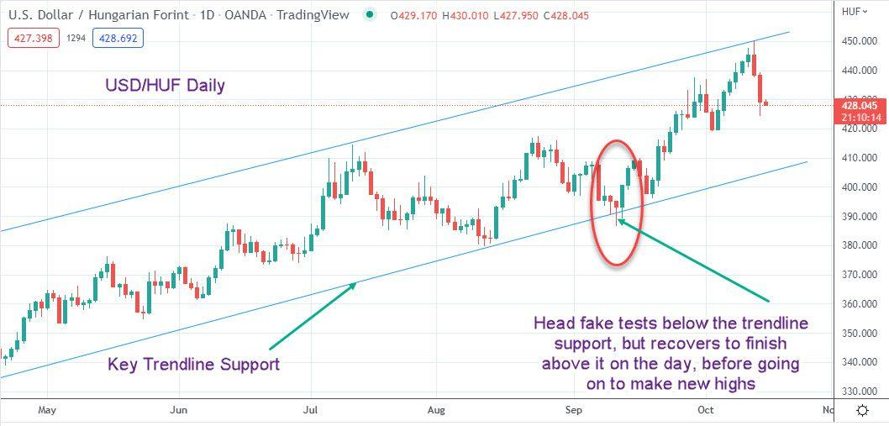

In the fast-paced world of financial markets, traders encounter numerous challenges that require strategic navigation. Among these challenges, the concept of the head-fake trade holds particular significance. Head-fake trades refer to scenarios where the price of a security initially moves in one direction, only to reverse sharply thereafter. This can often mislead traders who rely on breakout strategies, causing unexpected losses.

In recent years, as algorithmic trading has gained prominence, understanding head-fake trades has become increasingly crucial. Algo trading, characterized by rapid decision-making and execution driven by complex algorithms, can both cause and exploit head-fake situations. This article will explore the mechanics behind these deceptive market movements, analyze their causes, and provide insights into effective strategies to mitigate their impacts. By grasping this knowledge, traders can enhance their ability to navigate the intricacies of market dynamics, making more informed and strategic decisions in the face of potential head-fake trades.



## Table of Contents

## Understanding Head-Fake Trades

A head-fake trade is a scenario in which the price of a security initially moves in a particular direction, creating an impression of a trend, only to swiftly reverse its course. This behaviour can mislead traders, especially those who depend predominantly on breakout strategies. Traders employing breakout strategies aim to exploit price movements that surpass defined support or resistance levels. When such expectations do not materialize, a head-fake occurs, often leading to unexpected losses.

This phenomenon of head-fakes is primarily due to the market dynamics that include fluctuations in trading volume, directional momentum, and volatility. For instance, a security might experience a significant price shift, causing numerous breakout traders to enter positions. When these traders push the price to its perceived breakout point, liquidity providers or larger market participants may capitalize on this increased buying or selling pressure to reverse the price, thus triggering a head-fake.

Moreover, head-fake trades can be attributed to algorithmic trading and market manipulation, which may exacerbate price moves beyond natural equilibrium temporarily. Such actions are designed to hit stop-loss orders or trick less-experienced traders into unfavorable positions before reverting prices to the prior range.

Understanding these dynamics requires an appreciation of the market environment, including technical indicators and patterns that often precede head-fakes. Recognizing signals such as spikes in trading volume without corresponding price movement or quick retracements following a breakout can help traders anticipate and manage potential head-fake trades effectively.

## The Relationship Between Head-Fake Trades and Breakouts

Breakouts are critical junctures in trading where the price of a security moves beyond a defined resistance or support level, often triggering trading signals and eliciting substantial interest from traders. These moments are highly anticipated because they can signify the start of strong price trends. However, not all breakouts result in sustained trends; some are false indicators that lead to head-fake trades.

A head-fake trade occurs when a security's price initially moves past a resistance or support level, suggesting a [breakout](/wiki/breakout-trading), but soon reverses direction. This can trap traders who expected the breakout to lead to a significant directional move. These false breakouts might stem from a lack of [volume](/wiki/volume-trading-strategy) confirmation or manipulation by larger market participants.

To understand the relationship between breakouts and head-fake trades, consider the importance of volume. Genuine breakouts are usually accompanied by a surge in trading volume, providing the [liquidity](/wiki/liquidity-risk-premium) needed to sustain the new price level. In contrast, a head-fake trade typically displays a lackluster volume, indicating insufficient interest or conviction to maintain the move.

Besides volume, psychological factors play a significant role in the occurrence of head-fakes. Traders often exhibit herd behavior, quickly reacting to price movements that appear to indicate a breakout. This can create temporary price spikes that don't hold up, as the initial enthusiasm wanes and more experienced traders capitalize on the false signal to enter positions in the opposite direction.

To anticipate and identify head-fake trades, traders can employ various technical analysis techniques. Monitoring [momentum](/wiki/momentum) indicators, such as the Relative Strength Index (RSI) or Moving Average Convergence Divergence (MACD), can provide insights into the strength of a breakout. Divergences between these indicators and price movements can signal potential head-fakes. Additionally, using multiple time frames in analysis can help verify the validity of a breakout by ensuring it aligns with broader market trends.

By understanding how false breakouts can lead to head-fake trades, traders equip themselves with the knowledge to better navigate these false signals. It allows for more informed decision-making and effective risk management, reducing the potential impact of such deceptive moves in financial markets.

## Algorithmic Trading and Head-Fake Trades

Algorithmic trading has revolutionized financial markets by enabling rapid and efficient execution of trades. However, it has also led to an increase in head-fake trades, where an initial price movement misleads traders before reversing direction. Automated systems, particularly High-Frequency Trading ([HFT](/wiki/high-frequency-trading-strategies)), play a significant role in creating and capitalizing on these head-fake opportunities.

HFT, characterized by executing a large number of orders in fractions of a second, can exacerbate head-fakes by amplifying initial price signals. Algorithms designed to detect breakouts might trigger buy or sell orders when prices breach specific thresholds, but these movements can mislead due to their transitory nature. The speed and volume of HFT can cause a rapid price surge, attracting other automated and human traders. Once these traders follow the perceived trend, the algorithm might then reverse its position, leading to a sudden price [course](/wiki/best-algorithmic-trading-courses) correction.

Understanding the interaction between algorithms and market trends is crucial for managing the risks associated with head-fake trades. The algorithms often rely on technical indicators and patterns, such as moving averages or momentum oscillators, which can give false signals. For instance, a simple moving average (SMA) crossover might not always indicate a genuine trend. If an SMA of a shorter time frame moves above that of a longer time frame, a trader might take this as a signal to buy. However, without sufficient market sentiment or volume to support this move, the price may quickly revert, resulting in a head-fake.

To minimize the impact of such trades, traders and developers can adjust their algorithms to include filters for trade confirmation and market sentiment analysis. Python, a popular language for developing trading algorithms, can be used to implement such checks efficiently:

```python
import pandas as pd

# Sample function for SMA crossover with confirmation
def sma_crossover_with_filter(data, short_window=40, long_window=100):
    signals = pd.DataFrame(index=data.index)
    signals['price'] = data['price']
    signals['short_mavg'] = data['price'].rolling(window=short_window, min_periods=1, center=False).mean()
    signals['long_mavg'] = data['price'].rolling(window=long_window, min_periods=1, center=False).mean()

    # Generate signals
    signals['signal'] = 0.0
    signals['signal'][short_window:] = np.where(signals['short_mavg'][short_window:] > signals['long_mavg'][short_window:], 1.0, 0.0)
    signals['position'] = signals['signal'].diff()

    # Filter signals by additional criteria (e.g., volume, RSI)
    filtered_signals = signals[(signals['position'] == 1) & (data['volume'] > data['volume'].mean()) & (rsi(data) < 70)]

    return filtered_signals

# Function to calculate Relative Strength Index (RSI)
def rsi(data, window=14):
    delta = data['price'].diff()
    gain = (delta.where(delta > 0, 0)).rolling(window=window).mean()
    loss = (-delta.where(delta < 0, 0)).rolling(window=window).mean()
    rs = gain / loss
    rsi = 100 - (100 / (1 + rs))
    return rsi
```

In the provided Python code, the `sma_crossover_with_filter` function not only identifies potential buy signals based on SMA crossovers but also applies additional criteria such as volume and a Relative Strength Index (RSI) filter to validate these signals. This multi-[factor](/wiki/factor-investing) approach helps mitigate risks by ensuring a more robust assessment of market conditions.

By incorporating comprehensive checks and understanding the mechanics of algorithmic strategies, traders can better navigate the risks posed by head-fake trades and enhance the effectiveness of their trading systems.

## Common Indicators and Causes of Head-Fake Trades

In the fast-moving environment of financial markets, recognizing head-fake trades is pivotal for traders aiming to make informed decisions. A head-fake trade is often preceded by specific indicators and conditions, making early detection crucial to avoid potential pitfalls.

**Lack of Follow-Through**

One prominent indicator of a head-fake trade is the lack of follow-through in the price movement. When prices break through a significant support or resistance level, the expectation is for the momentum to continue in the breakout direction. However, if the volume fails to support the movement or the price quickly reverses, it may signal a head-fake. The absence of substantial trading volume accompanying the price breakout suggests a deficiency in buying or selling interest to sustain the new price levels. Traders should critically analyze volume patterns in conjunction with price changes to evaluate the authenticity of breakouts.

**Psychological Barriers**

Human psychology also plays a considerable role in head-fake trades. Market participants often set psychological barriers, such as round numbers, which can serve as resistance or support levels. These levels sometimes trigger automatic buying or selling, leading to temporary price movements. Once these barriers are reached, the initial momentum may fade, resulting in a reversal. Understanding these psychological thresholds can assist traders in foreseeing potential head-fakes.

**Algorithmic Manipulation**

Algorithmic trading has become an integral part of the financial landscape, and with it comes the risk of market manipulation. Algorithms can be programmed to create artificial price movements, such as sudden spikes, to trigger stop-loss orders and disrupt market stability. These manipulations often result in head-fake trades, as the initial price direction is quickly reversed. Identifying unusual trading patterns and inexplicable price surges can alert traders to possible algorithmic influence.

**News Events and Sentiment Shifts**

External factors like news events and sudden sentiment shifts significantly contribute to head-fake patterns. Announcements regarding economic indicators, corporate earnings, or geopolitical events can lead to abrupt market reactions. The immediate surge or drop in prices might be based on initial emotions rather than data-driven analysis, causing short-term price reversals. Traders who closely monitor news and market sentiment can anticipate these sharp movements and adjust their strategies accordingly.

Recognizing these indicators early requires vigilance and an analytical approach. Traders should rely on comprehensive market analysis, incorporating technical indicators and monitoring external influences, to discern potential head-fake situations. By doing so, they can remain agile and prepared to respond to the deceptive moves that characterize financial markets.

## Mitigating the Impact of Head-Fake Trades

Effective risk management strategies are crucial in minimizing losses from head-fake trades, which can disrupt trading strategies and lead to financial setbacks. One of the primary tactics traders employ to counteract the effects of head-fake trades is setting stop-loss orders. These are predefined levels at which positions are automatically sold off to prevent further losses. By implementing stop-loss orders, traders can protect their capital from significant downturns resulting from false breakout signals.

Volume and pattern analysis are also essential techniques for mitigating head-fake trade impacts. Analyzing trading volume helps traders discern genuine market interest from manipulative movements typically associated with head-fake trades. A breakout accompanied by low trading volume might indicate a potential head-fake, as opposed to a breakout supported by significant volume, suggesting stronger market conviction.

Furthermore, pattern analysis can aid traders in recognizing head-fakes by identifying common reversal patterns such as bearish or bullish traps. These patterns often emerge when prices temporarily move outside established support or resistance levels but then revert, indicating that the breakout was not sustainable.

Diversification, another vital strategy, spreads risk across various instruments or markets, reducing the potential impact of any single head-fake trade. By allocating trades across a broad spectrum of assets, traders can mitigate the adverse effects of unexpected market movements, maintaining a more stable portfolio performance.

Algorithmic adjustments are also instrumental in managing head-fake risks. Traders can incorporate algorithms that detect anomalies in price movements, helping identify possible head-fake scenarios. Python, a widely used programming language in [algorithmic trading](/wiki/algorithmic-trading), provides libraries such as pandas and numpy that facilitate real-time data analysis to identify irregular patterns indicating head-fakes. Here is a simple example in Python that demonstrates how an algorithm might flag potential head-fakes by analyzing sudden price reversals:

```python
import numpy as np
import pandas as pd

def detect_head_fake(prices, threshold=0.01):
    changes = prices.pct_change()
    reversals = (changes.shift(1) > threshold) & (changes < -threshold)
    return prices[reversals].index.tolist()

# Example usage
price_data = pd.Series([100, 102, 101, 99, 101, 100.5, 100.2])
head_fake_signals = detect_head_fake(price_data)
print("Potential head-fake detected at indices:", head_fake_signals)
```

This code assesses percentage changes and identifies instances where a notable positive shift is immediately followed by a negative one, reflecting a typical head-fake pattern.

Overall, these strategies—stop-loss orders, volume and pattern analysis, diversification, and algorithmic adjustments—are vital tools that help traders navigate the complexities of head-fake trades while safeguarding their investments. Applying these methods equips traders with a robust framework to handle deceptive market moves effectively.

## Real-World Examples of Head-Fake Trades

Historically, head-fake trades have been exemplified through significant market events such as the Flash Crash of 2010 and the [volatility](/wiki/volatility-trading-strategies) observed in cryptocurrencies. These instances offer valuable insights into how head-fakes manifest and offer lessons for traders aiming to mitigate similar risks.

The Flash Crash of 2010 remains one of the most prominent examples of head-fake trades. On May 6, 2010, the U.S. stock market experienced a dramatic and rapid decline, only to recover most of the losses within minutes. This event was partly attributed to algorithmic trading activities that exacerbated the volatility. High-frequency trading firms accumulated sell orders based on preliminary downward price movements, which served as false signals for further selling pressure. This magnification of market sentiments led to a temporary liquidity vacuum, causing prices to plummet drastically. An essential takeaway for traders is the necessity to consider the potential for rapid algorithmic response to market signals, which can instigate head-fakes, especially during high-stress conditions.

In the [cryptocurrency](/wiki/cryptocurrency) markets, fluctuations often present head-fake trade scenarios due to their inherent volatility and lack of regulation compared to traditional financial markets. An example occurs when news triggers rapid price movements in cryptocurrencies like Bitcoin or Ethereum. For instance, announcements regarding regulatory updates or influential endorsements can lead to sharp initial price reactions. These reactions often lack follow-through due to speculative trading or manipulative strategies by large traders or "whales." Such movements draw traders towards breakout opportunities, which quickly reverse once the initial excitement dissipates, creating a head-fake. Traders can learn to identify these setups by analyzing price-volume divergences and being wary of decisions based primarily on preliminary news-induced price spikes.

Through these examples, it becomes evident that head-fake trades are often catalyzed by external events that trigger sudden market reactions without substantial follow-through. Recognizing patterns like those seen during the Flash Crash or cryptocurrency fluctuations arms traders with the foresight to navigate head-fake scenarios. By maintaining a focus on comprehensive market signals and avoiding overreliance on initial price movements, traders can better position themselves to avoid the pitfalls associated with head-fake trades.

## Conclusion

Head-fake trades are a significant challenge in financial trading, particularly in the context of breakouts and algorithmic trading (algo trading). These deceptive maneuvers often mislead traders by initially indicating a market direction that quickly reverses. To navigate these complexities, it is essential for traders to understand the contributing factors and to employ tactical responses.

Key factors contributing to head-fake trades include market volatility, the influence of high-frequency trading (HFT), and the psychological barriers faced by traders. Volatility can create rapid price movements that mimic breakouts, leading traders to commit capital based on false signals. HFT algorithms can exacerbate these situations by exploiting short-term price changes for profit, often contributing to the initial false move.

To better manage head-fake trades, traders must adopt strategic measures aimed at minimizing potential losses. This involves using technical indicators to identify and confirm genuine breakout patterns before acting. For example, volume analysis can provide additional clues about the strength of a price movement, while stop-loss orders can help limit downside risk.

Moreover, awareness and preparation are crucial in navigating the deceptive moves inherent in financial markets. Staying informed about the latest technological trends and regulatory changes in financial trading can also aid in anticipating and responding to head-fake scenarios. By integrating these considerations into their trading strategies, individuals and institutions can better shield themselves from the pitfalls of head-fake trades and improve their overall market performance.

## References & Further Reading

[1]: Bergstra, J., Bardenet, R., Bengio, Y., & Kégl, B. (2011). ["Algorithms for Hyper-Parameter Optimization."](https://papers.nips.cc/paper/4443-algorithms-for-hyper-parameter-optimization) Advances in Neural Information Processing Systems 24.

[2]: ["Advances in Financial Machine Learning"](https://www.amazon.com/Advances-Financial-Machine-Learning-Marcos/dp/1119482089) by Marcos Lopez de Prado

[3]: ["Evidence-Based Technical Analysis: Applying the Scientific Method and Statistical Inference to Trading Signals"](https://www.amazon.com/Evidence-Based-Technical-Analysis-Scientific-Statistical/dp/0470008741) by David Aronson

[4]: ["Machine Learning for Algorithmic Trading"](https://github.com/stefan-jansen/machine-learning-for-trading) by Stefan Jansen

[5]: ["Quantitative Trading: How to Build Your Own Algorithmic Trading Business"](https://www.amazon.com/Quantitative-Trading-Build-Algorithmic-Business/dp/1119800064) by Ernest P. Chan