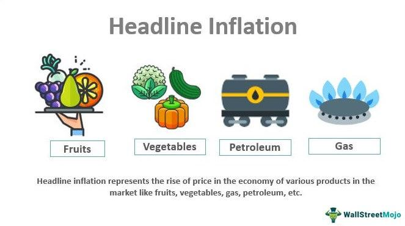

The influence of media on human decision-making is profound and pervasive, often driven by sensational headlines designed to attract attention and elicit emotional responses. This phenomenon, known as the 'headline effect,' plays a critical role in shaping consumer behavior and investor decisions. Whether the headlines are positive or negative, they hold the power to sway public opinion and market trends significantly.

In financial markets, the headline effect often results in swift and, occasionally, irrational reactions. Investors, influenced by the immediate emotional impact of news headlines, may alter their trading strategies abruptly. Such hasty decisions can lead to drastic movements in financial markets, with potential economic repercussions on a broader scale. The immediacy and accessibility of news amplify these effects, with digital platforms often serving as the primary source for breaking headlines.



Algorithmic trading, now a cornerstone of financial market operations, is particularly affected by media reports and news events. These automated trading systems execute trades based on pre-defined rules and algorithms that frequently incorporate real-time data from news headlines. The algorithms are designed to respond instantly to market changes, which may, in turn, be sparked by the latest news stories. As a result, algorithmic trading can accelerate and intensify market reactions, sometimes exacerbating volatility.

The intersection of media psychology and algorithmic trading invites scrutiny into the broader implications of information dissemination on market stability and trader strategies. Understanding how the media influences investor behavior is crucial for developing resilient trading systems. This involves not only anticipating the immediate effects of news headlines but also devising strategies that mitigate potential risks associated with such media-induced volatility.

This dynamic interplay suggests that a deeper analysis is necessary to unravel the complexities of media's impact on financial markets. By examining the psychological underpinnings of the headline effect and its manifestation in algorithmic trading, stakeholders can better comprehend how to harness or counteract these influences effectively.

## Table of Contents

## Understanding the Headline Effect

The headline effect refers to the phenomenon where news headlines, particularly those with negative connotations, elicit immediate and often exaggerated responses from financial markets. This effect occurs when market participants react to the initial headline without conducting a thorough analysis of the underlying information, leading to increased market volatility. Media sensationalism plays a crucial role in heightening this effect, as headlines with negative news are more likely to attract attention and provoke stronger reactions than their positive counterparts. The prominence of adverse news can be partly explained by the psychological bias of loss aversion, where investors tend to fear losses more than they value equivalent gains, thus responding more intensely to negative information.

In the context of financial markets, the headline effect can lead to price distortions as traders and investors adjust their positions based on incomplete information. For example, a sudden headline about geopolitical tensions or corporate scandals may trigger a rapid sell-off, even if subsequent details reveal a less severe impact. This overreaction is often fueled by [algorithmic trading](/wiki/algorithmic-trading) systems that automatically execute trades based on real-time news feeds. Consequently, the effect of such reactions can lead to short-term market inefficiencies.

Understanding these dynamics is imperative for traders and investors as they develop strategies to capitalize on or mitigate the impacts of market reactions provoked by headline news. By recognizing the potential for overreaction, market participants can position themselves advantageously, either by exploiting temporary price dislocations or by employing risk management techniques to shield against [volatility](/wiki/volatility-trading-strategies). By acknowledging the influence of headlines, strategies can be crafted to respond more judiciously to news, minimizing the emotional and irrational responses that often accompany sensationalist media coverage.

## The Role of Algorithmic Trading

Algorithmic trading employs automated systems designed to execute trades based on predefined criteria, leveraging the high-speed processing capabilities of computers to make rapid market decisions. This method has become integral to modern financial markets, offering benefits such as increased efficiency and the ability to process vast amounts of data in real-time. However, it also brings challenges, particularly its susceptibility to the influence of media headlines.

Trading algorithms rely heavily on real-time news feeds to inform their trading decisions. These feeds provide instantaneous updates on market-moving events, allowing algorithms to adjust trading positions rapidly in response to emerging headlines. For instance, if a news article reports a major geopolitical event, algorithms can trigger buy or sell orders based on the anticipated market reaction. This rapid-response capability is crucial in maintaining a competitive edge in the fast-paced environment of financial trading.

A key component in algorithmic trading systems is the integration of sentiment analysis tools. These tools utilize natural language processing (NLP) techniques to evaluate the tone and sentiment of news content. By assigning a sentiment score — positive, negative, or neutral — to news articles, algorithms can make informed decisions. For example, a negative sentiment might prompt the algorithm to sell assets or adjust portfolios to mitigate potential losses.

However, the reliance on headlines can significantly contribute to market volatility. When multiple algorithms process the same news story simultaneously, the effect can be amplified, leading to sudden and sharp market movements. This phenomenon was evident during events such as the 'flash crash' and other rapid market corrections triggered by automated trading systems reacting to the same stimuli.

Research continues to be conducted to enhance algorithmic trading strategies by refining sentiment analysis tools. One approach involves developing more sophisticated NLP models that incorporate contextual and broader market conditions, enabling algorithms to differentiate between short-lived market reactions and news with genuine long-term implications. Machine learning techniques, such as supervised learning with labeled data, are used to train models that can better assess the impact of news events on market prices.

The ongoing goal in algorithmic trading research is to create robust and resilient systems. These systems aim to reduce knee-jerk trading reactions and provide more stable investment returns. Advances in this field hold considerable potential for improving the accuracy and reliability of trading decisions, contributing to a more stable financial market environment.

## Psychological Impacts of Media on Traders

Traders' psychological reactions to media headlines significantly influence their decision-making processes, often leading to market instability. The influence of negative headlines is particularly pronounced, as they can induce fear and prompt traders to sell off assets, contributing to market declines. This behavior aligns with the concept of loss aversion, a cognitive bias where the pain of losses outweighs the pleasure of equivalent gains, as proposed by Kahneman and Tversky in their Prospect Theory.[^1]

Conversely, overly optimistic headlines might lead to speculative bubbles, causing traders to rush and buy perceived undervalued assets. This behavior reflects the impact of cognitive biases such as overconfidence and herd mentality. During periods of optimistic media coverage, traders may overestimate their ability to predict market movements, resulting in increased risk-taking and potential market excesses.

Understanding these psychological effects is crucial for traders aiming to manage cognitive biases and remain grounded in data-driven analyses. By recognizing the impact of headlines on emotional responses, traders can develop strategies to avoid impulsive decisions based on fleeting sentiments.

The development of cognitive-behavioral strategies can help traders mitigate the emotional impact of sensational headlines. Techniques such as mindfulness, self-reflection, and structured decision-making processes can assist traders in maintaining focus on [fundamental analysis](/wiki/fundamental-analysis), rather than succumbing to emotional reactions prompted by media coverage. Implementing systematic approaches to trading, such as pre-defined entry and [exit](/wiki/exit-strategy) criteria, can further reduce the influence of emotional biases, leading to more stable and consistent decision-making in financial markets.

[^1]: Kahneman, D., & Tversky, A. (1979). Prospect Theory: An Analysis of Decision under Risk. *Econometrica*, 47(2), 263-292.

## Case Studies and Examples

The Brexit referendum, held on June 23, 2016, serves as a prime example of the headline effect's influence on financial markets. The unexpected decision for the United Kingdom to exit the European Union resulted in immediate and significant market reactions. As the news broke, algorithmic trading systems played a critical role in accelerating the market dynamics by parsing headlines for specific keywords and executing trades at unprecedented speeds. This rapid response contributed to a swift sell-off in various markets, particularly impacting currency markets. Consequently, the British pound experienced substantial depreciation, plummeting to its lowest level in 31 years against major currencies such as the US dollar. This event illustrated how news headlines, amplified through automated trading systems, can induce high volatility and significant currency fluctuations.

Similarly, the Greek debt crisis offers another insightful case study into the effects of media-induced market volatility. During the height of the crisis, extensive media coverage about Greece's fiscal instability and the potential repercussions for the eurozone intensified fears regarding the euro's viability. Despite Greece having a relatively small economic footprint within the eurozone, media exaggeration contributed to a heightened perception of risk, affecting global markets. Investors, driven by the fear of a euro collapse, reacted by adjusting their portfolios, which exacerbated the instability in European and international markets. This scenario underscores the disproportionate impact media can have, independent of underlying economic fundamentals.

These examples underscore the critical importance of understanding media's influence on financial markets. Algorithmic trading, driven by quick assessments of news content, magnifies the headline effect. As such, developing strategies to better anticipate or counteract these effects becomes indispensable for market participants. Approaches might include improving the algorithms' capability to evaluate the broader context of news stories or employing sophisticated sentiment analysis to gauge the potential market impact of headlines more accurately. By enhancing these strategies, traders could potentially mitigate the adverse effects resulting from impulsive, headline-driven market movements.

## Integrating Media Analysis in Trading Algorithms

Advanced trading algorithms are integrating natural language processing (NLP) and [machine learning](/wiki/machine-learning) to enhance the interpretation of news content, thereby improving trading strategies and market response. These systems are designed to discern between ephemeral headline-driven market fluctuations and news events that bear substantial long-term financial consequences.

One of the primary tools in this integration is sentiment analysis, which involves quantifying the tone of a given piece of news—whether it's positive, negative, or neutral. By assigning sentiment scores, algorithms can gauge the likely market reaction and adjust trading strategies accordingly. This helps mitigate the risk of impulsive trades prompted by sudden news stories and instead focus on systematic, data-driven decisions.

For instance, let's consider a sentiment analysis model that predicts stock movement based on news sentiment. The basic structure can be described using linear regression:

$$
\text{Price Change} = \beta_0 + \beta_1 \times \text{Sentiment Score} + \epsilon
$$

Where:
- $\text{Price Change}$ indicates the change in stock price.
- $\text{Sentiment Score}$ reflects the tone of the news.
- $\beta_0$ and $\beta_1$ are regression coefficients.
- $\epsilon$ represents the error term.

Implementing such models often requires the use of Python, due to its robust libraries like NLTK or TextBlob for NLP, and Scikit-learn for machine learning. Here is a simplified example of how sentiment analysis can be incorporated into an algorithm:

```python
from textblob import TextBlob
from sklearn.linear_model import LinearRegression
import numpy as np

# Sample data: Sentiment scores and corresponding price changes
sentiments = np.array([0.2, 0.4, -0.3, 0.1])
price_changes = np.array([1.5, 2.0, -1.5, 0.5])

# Reshape for sklearn
sentiments = sentiments.reshape(-1, 1)

# Initialize and fit the regression model
model = LinearRegression()
model.fit(sentiments, price_changes)

# Predict price change for a new sentiment score
new_sentiment = np.array([[0.3]]) # New sentiment score
predicted_change = model.predict(new_sentiment)

print(predicted_change)
```

This evolving field continues to seek advancements that can handle complex linguistic nuances and contextual variables, which are crucial for accurately assessing media influence. Currently, the emphasis is on refining these algorithms to differentiate between transient market noise and news with substantial financial impact, contributing to the construction of robust trading systems that promise more consistent investment returns. Such innovations aim to enhance the fidelity of media analysis, providing the financial industry with tools that not only anticipate media-induced volatility but also strategize robustly against it.

## Conclusion and Future Outlook

The interaction between media influence, psychological effects, and algorithmic trading underscores the increasing necessity for sophisticated analysis tools in financial decision-making. As digital media continues to evolve, the speed and magnitude of the headline effect are expected to escalate, presenting both challenges and opportunities for traders. This phenomenon necessitates a strategic adaptation in trading methodologies to cope with rapid shifts prompted by headlines. Enhancements in [artificial intelligence](/wiki/ai-artificial-intelligence) (AI) and data analytics offer promising prospects for reliably predicting the effects of media on market dynamics. These technologies enable the development of algorithms capable of processing vast amounts of information swiftly, thus providing a competitive advantage in high-frequency trading environments.

Moreover, stakeholders in the finance industry must strive for a deeper understanding of media psychology and its influence on market behaviors. The psychological responses of traders and investors to news headlines can lead to significant market shifts, thus recognizing and mitigating these effects is critical. The development of intelligent systems that incorporate sentiment analysis and natural language processing (NLP) can aid in assessing the true impact of media reports, differentiating between temporary market noise and news with substantial implications.

By fostering collaboration between finance professionals, psychologists, and data scientists, the industry can advance its capability to navigate the complexities introduced by media influence. This interdisciplinary approach aims to construct resilient trading systems capable of withstanding the volatility induced by aggressive media effects. Ultimately, a thoughtful and adaptive strategy will be paramount in effectively managing the influence of media headlines on financial markets and trading strategies, ensuring more stable investment returns and contributing to overall market stability.

## References & Further Reading

[1]: Kahneman, D., & Tversky, A. (1979). ["Prospect Theory: An Analysis of Decision under Risk."](http://web.mit.edu/curhan/www/docs/Articles/15341_Readings/Behavioral_Decision_Theory/Kahneman_Tversky_1979_Prospect_theory.pdf) Econometrica, 47(2), 263-292.

[2]: Loughran, T., & McDonald, B. (2011). ["When is a Liability Not a Liability? Textual Analysis, Dictionaries, and 10‐Ks"](https://onlinelibrary.wiley.com/doi/10.1111/j.1540-6261.2010.01625.x). The Journal of Finance, 66(1), 35-65.

[3]: Tetlock, P. C. (2007). ["Giving Content to Investor Sentiment: The Role of Media in the Stock Market."](https://onlinelibrary.wiley.com/doi/abs/10.1111/j.1540-6261.2007.01232.x) The Journal of Finance, 62(3), 1139-1168.

[4]: Barber, B. M., & Odean, T. (2001). ["The Internet and the Investor"](https://faculty.haas.berkeley.edu/odean/Papers%20current%20versions/InternetAndInvestor.pdf). Journal of Economic Perspectives, 15(1), 41-54.

[5]: Yang, S. J., & Mo, S. J. (2020). ["The impact of news sentiment on index return and volatility: Evidence from Korea."](https://www.semanticscholar.org/paper/The-Impact-of-Abnormal-News-Sentiment-on-Financial-Yang-Song/a6305178634e5e201b2ce9110e366b7e1e4a3778) International Review of Economics & Finance, 68, 193-211.