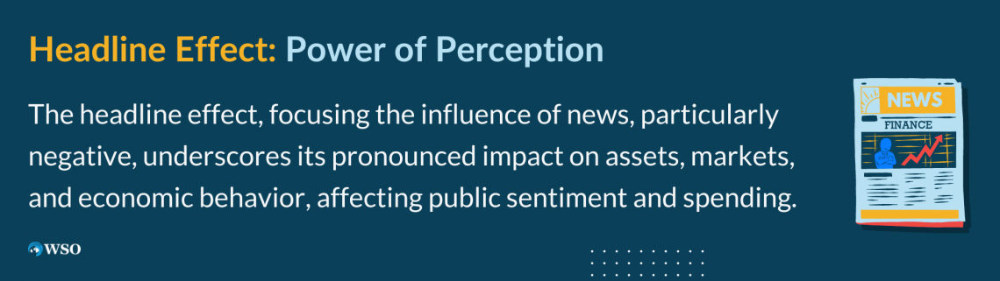

## Table of Contents

## What is the Headline Effect?

The Headline Effect is when people only read the headlines of news articles and don't read the whole story. This can cause misunderstandings because headlines often don't tell the full story. They might be short and catchy, but they can leave out important details.

When people share news based only on headlines, it can spread false information. This is a big problem because it can make people believe things that aren't true. It's important to read the whole article before deciding if the news is real or not.

## How does the Headline Effect influence reader behavior?

The Headline Effect makes people quickly judge a news story just by reading the headline. They might think they know the whole story, but they don't. This can lead to wrong ideas about what's really happening. For example, if a headline says "New Study Shows Coffee is Bad for Health," people might stop drinking coffee without knowing that the study might only apply to a small group of people.

Because of the Headline Effect, people often share news on social media without reading the full article. This can spread wrong information fast. When many people see a headline and share it, the wrong information can go viral. It's important for people to take a moment to read the whole story before they decide to share it. This way, they can help stop the spread of false news.

## Can you explain the psychological mechanisms behind the Headline Effect?

The Headline Effect is driven by the way our brains work. We like things that are quick and easy to understand. Headlines are short and catchy, so they grab our attention fast. This is because of something called the "availability heuristic," which means we make decisions based on the information that's easiest to remember. When we see a headline, it's the first thing we remember about the story, so it shapes what we think.

Another reason for the Headline Effect is that we often feel the need to share information quickly, especially on social media. This is driven by our need to belong and be part of a group. When we see a headline that matches what our friends believe, we're more likely to share it without reading the whole story. This can make us feel like we're part of the group, but it can also spread wrong information if the headline isn't telling the full truth.

## What are some common elements of effective headlines?

Effective headlines often use strong, emotional words that grab people's attention. They might use words like "shocking," "amazing," or "urgent" to make readers feel like they need to read the story right away. Headlines also often promise to give readers useful information or solve a problem. For example, a headline might say "5 Easy Ways to Save Money" to make readers think they'll learn something helpful.

Another important part of good headlines is that they're short and clear. People usually only spend a few seconds looking at a headline, so it needs to be easy to understand quickly. Effective headlines also often ask a question or use numbers, like "Can You Really Lose Weight Fast?" or "Top 10 Tips for Better Sleep." These kinds of headlines make people curious and more likely to click and read the whole story.

## How can the Headline Effect be measured?

The Headline Effect can be measured by looking at how many people click on an article just because of its headline. Researchers can compare the number of clicks a headline gets to how many people actually read the whole article. If lots of people click but few read the whole story, that shows the Headline Effect is strong. They can also see if people share the article on social media without reading it, which is another sign of the Headline Effect.

Another way to measure the Headline Effect is by doing surveys or experiments. Researchers can ask people what they think about a news story based only on its headline. Then, they can show them the full article and see if their opinions change. If people's views change a lot after reading the full story, it means the headline alone was misleading them. This helps show how powerful the Headline Effect can be.

## What are the ethical considerations when using the Headline Effect?

When using the Headline Effect, it's important to think about being honest and fair. Headlines should not trick people into believing something that isn't true. If a headline makes a big claim, the story needs to back it up with facts. Using headlines to scare people or make them angry on purpose is not right. It can hurt people and make them trust news less. So, it's important for people who write headlines to be careful and make sure they are telling the truth.

Another thing to think about is how headlines can affect what people think and do. If a headline makes people believe something that's not true, it can cause real problems. For example, if a headline says a certain food is bad for you, people might stop eating it even if it's actually good for them. This can be harmful. People who write headlines need to think about the impact their words can have and try to use their power in a good way.

## Can you provide examples of headlines that successfully utilize the Headline Effect?

A good example of a headline that uses the Headline Effect well is "New Study Finds Chocolate Can Improve Your Mood." This headline grabs attention because it talks about something people like (chocolate) and promises a benefit (improved mood). Many people might click on this article just because of the headline, hoping to learn more about how chocolate can make them feel better. But if they don't read the whole story, they might miss important details, like the study only looked at a small group of people or that the effect is very small.

Another example is "10 Surprising Ways to Save Money on Groceries." This headline works because it uses a number (10) and promises useful information (ways to save money). People are often looking for ways to save money, so this headline makes them curious and more likely to click. If readers only see the headline and share it without reading the article, they might spread the idea that these tips are easy and work for everyone, even if the article says they might not work for everyone or need a lot of effort.

## How does the Headline Effect vary across different media platforms?

The Headline Effect can be different on different media platforms because each platform has its own way of showing headlines. On social media like Twitter or Facebook, headlines are often short and come with pictures or videos. This makes them even more eye-catching and people might share them without reading the whole story. On these platforms, headlines need to be really interesting to stand out among all the other posts. So, the Headline Effect can be stronger on social media because people are used to quickly scrolling and clicking on things that grab their attention.

On news websites, the Headline Effect might be a bit different. People who visit these sites might be more likely to read the whole article because they are looking for news. But even on news sites, headlines are important because they decide if someone will click on the story or not. If a headline is too long or boring, people might not click on it. So, while the Headline Effect is still important on news websites, it might not be as strong as on social media where everything is moving fast.

## What role does A/B testing play in optimizing headlines for the Headline Effect?

A/B testing helps people who write headlines figure out which ones work best for the Headline Effect. They make two different headlines for the same story and show them to different groups of people. Then, they see which headline gets more clicks. If one headline gets a lot more clicks than the other, it means that headline is better at grabbing people's attention and making them want to read the story. This way, writers can learn what kinds of words or phrases make people more likely to click on a headline.

Using A/B testing, writers can also see if people who click on a headline actually read the whole story. If a headline gets a lot of clicks but few people read the whole article, it might be too misleading or not interesting enough to keep people reading. By trying different headlines and seeing what happens, writers can make headlines that not only get clicks but also make people want to read the whole story. This helps balance the need to grab attention with the need to tell the truth and keep readers interested.

## How can understanding the Headline Effect improve content marketing strategies?

Understanding the Headline Effect can really help with content marketing. It shows that headlines are super important because they are the first thing people see. If a headline grabs attention, more people will click on the story. This means marketers can use catchy words or numbers in their headlines to make them more interesting. They can also use A/B testing to see which headlines work best. By doing this, they can get more people to read their content, which is good for their marketing goals.

But it's not just about getting clicks. The Headline Effect also teaches marketers to be careful. If a headline is too exciting or misleading, people might click on it but then not read the whole story. This can hurt trust. So, marketers need to make sure their headlines are honest and match what's in the article. By understanding the Headline Effect, marketers can create headlines that not only attract readers but also keep them interested and coming back for more.

## What are the latest research findings on the Headline Effect?

Recent research on the Headline Effect shows that it's getting stronger because of social media. A study from the University of Oxford found that people are more likely to share news stories based on headlines alone, especially if those headlines make them feel strong emotions like anger or joy. The study also found that when people share news quickly on social media, they often don't read the whole story first. This can spread false information because the headline might not tell the whole truth.

Another finding from a research team at MIT shows that the way headlines are written can change what people think about a story. They found that headlines with numbers, like "Top 5 Ways to Save Money," get more clicks and shares. But if the headline promises something big, like "Lose Weight Fast with This One Trick," people might feel tricked if the article doesn't deliver on that promise. This can make people trust news less over time.

## How can advanced data analytics be used to predict the effectiveness of headlines?

Advanced data analytics can help predict how well a headline will work by looking at past data. When people click on headlines, share them, or read the whole article, this information gets saved. By studying this data, analysts can see patterns. For example, they might find that headlines with numbers or questions get more clicks. They can also use machine learning to guess which new headlines will be popular based on what worked before. This way, they can make better headlines that grab people's attention.

Using data analytics also helps understand what kinds of headlines make people stay and read the whole story. If a headline gets a lot of clicks but few people read all the way to the end, it might be too misleading. By looking at this data, marketers can learn to make headlines that not only attract clicks but also keep readers interested. This balance is important for building trust with readers and making sure the content is useful and honest.

## How can media analysis be integrated into trading algorithms?

Advanced trading algorithms are integrating natural language processing (NLP) and [machine learning](/wiki/machine-learning) to enhance the interpretation of news content, thereby improving trading strategies and market response. These systems are designed to discern between ephemeral headline-driven market fluctuations and news events that bear substantial long-term financial consequences.

One of the primary tools in this integration is sentiment analysis, which involves quantifying the tone of a given piece of news—whether it's positive, negative, or neutral. By assigning sentiment scores, algorithms can gauge the likely market reaction and adjust trading strategies accordingly. This helps mitigate the risk of impulsive trades prompted by sudden news stories and instead focus on systematic, data-driven decisions.

For instance, let's consider a sentiment analysis model that predicts stock movement based on news sentiment. The basic structure can be described using linear regression:

$$
\text{Price Change} = \beta_0 + \beta_1 \times \text{Sentiment Score} + \epsilon
$$

Where:
- $\text{Price Change}$ indicates the change in stock price.
- $\text{Sentiment Score}$ reflects the tone of the news.
- $\beta_0$ and $\beta_1$ are regression coefficients.
- $\epsilon$ represents the error term.

Implementing such models often requires the use of Python, due to its robust libraries like NLTK or TextBlob for NLP, and Scikit-learn for machine learning. Here is a simplified example of how sentiment analysis can be incorporated into an algorithm:

```python
from textblob import TextBlob
from sklearn.linear_model import LinearRegression
import numpy as np

# Sample data: Sentiment scores and corresponding price changes
sentiments = np.array([0.2, 0.4, -0.3, 0.1])
price_changes = np.array([1.5, 2.0, -1.5, 0.5])

# Reshape for sklearn
sentiments = sentiments.reshape(-1, 1)

# Initialize and fit the regression model
model = LinearRegression()
model.fit(sentiments, price_changes)

# Predict price change for a new sentiment score
new_sentiment = np.array([[0.3]]) # New sentiment score
predicted_change = model.predict(new_sentiment)

print(predicted_change)
```

This evolving field continues to seek advancements that can handle complex linguistic nuances and contextual variables, which are crucial for accurately assessing media influence. Currently, the emphasis is on refining these algorithms to differentiate between transient market noise and news with substantial financial impact, contributing to the construction of robust trading systems that promise more consistent investment returns. Such innovations aim to enhance the fidelity of media analysis, providing the financial industry with tools that not only anticipate media-induced volatility but also strategize robustly against it.

## References & Further Reading

[1]: Kahneman, D., & Tversky, A. (1979). ["Prospect Theory: An Analysis of Decision under Risk."](http://web.mit.edu/curhan/www/docs/Articles/15341_Readings/Behavioral_Decision_Theory/Kahneman_Tversky_1979_Prospect_theory.pdf) Econometrica, 47(2), 263-292.

[2]: Loughran, T., & McDonald, B. (2011). ["When is a Liability Not a Liability? Textual Analysis, Dictionaries, and 10‐Ks"](https://onlinelibrary.wiley.com/doi/10.1111/j.1540-6261.2010.01625.x). The Journal of Finance, 66(1), 35-65.

[3]: Tetlock, P. C. (2007). ["Giving Content to Investor Sentiment: The Role of Media in the Stock Market."](https://onlinelibrary.wiley.com/doi/abs/10.1111/j.1540-6261.2007.01232.x) The Journal of Finance, 62(3), 1139-1168.

[4]: Barber, B. M., & Odean, T. (2001). ["The Internet and the Investor"](https://faculty.haas.berkeley.edu/odean/Papers%20current%20versions/InternetAndInvestor.pdf). Journal of Economic Perspectives, 15(1), 41-54.

[5]: Yang, S. J., & Mo, S. J. (2020). ["The impact of news sentiment on index return and volatility: Evidence from Korea."](https://www.semanticscholar.org/paper/The-Impact-of-Abnormal-News-Sentiment-on-Financial-Yang-Song/a6305178634e5e201b2ce9110e366b7e1e4a3778) International Review of Economics & Finance, 68, 193-211.