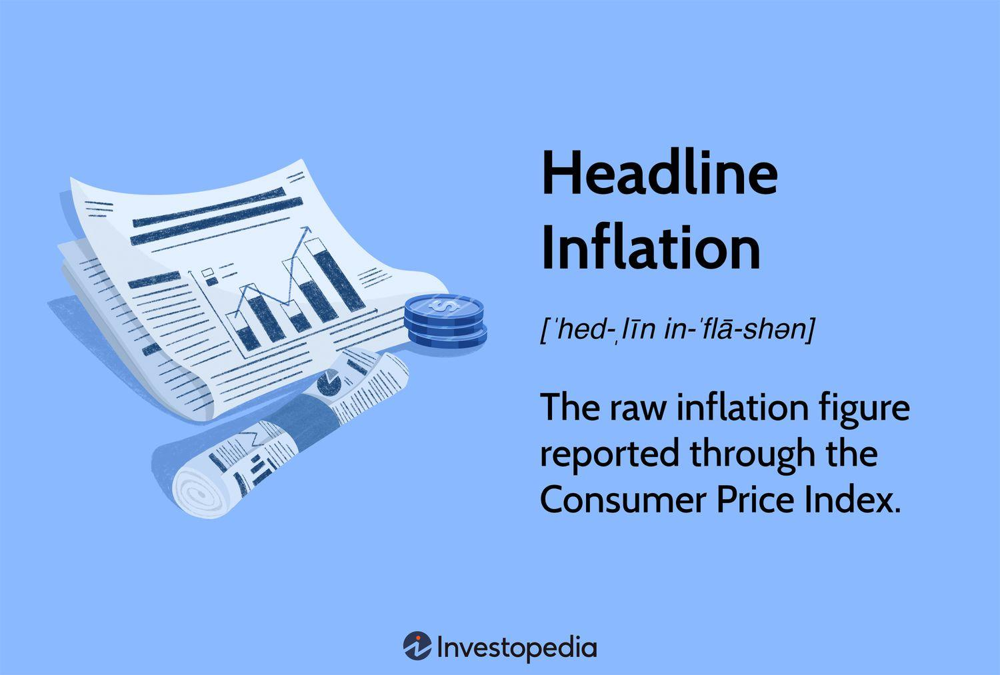

## Table of Contents

## What is headline inflation?

Headline inflation is a measure of the total inflation within an economy. It includes all items in the basket of goods and services that people typically buy, such as food, energy, and other everyday products. This type of inflation is often reported in the news and used to give a general idea of how prices are changing over time.

Sometimes, headline inflation can be affected a lot by big price changes in certain items, like oil or food. These changes can make the overall inflation rate go up or down a lot, even if the prices of other things stay the same. Because of this, economists also look at another measure called core inflation, which leaves out the more volatile items like food and energy to get a clearer picture of the underlying inflation trend.

## What is the Consumer Price Index (CPI)?

The Consumer Price Index, or CPI, is a way to measure how the prices of things people buy change over time. It looks at the cost of a big group of goods and services, like food, clothes, and things we use every day. The government collects this information every month to see if prices are going up or down. This helps us understand if we are paying more or less for things compared to last year.

The CPI is important because it shows how inflation affects people's lives. If the CPI goes up, it means prices are rising, and we might need to spend more money to buy the same things. Governments and businesses use the CPI to make decisions, like adjusting wages or setting prices. It's also used to figure out how much money people should get from programs like Social Security, to make sure it keeps up with the cost of living.

## How is headline inflation measured?

Headline inflation is measured by looking at the Consumer Price Index (CPI). The CPI is a basket of goods and services that people usually buy, like food, gas, and clothes. Every month, the government checks the prices of all these items to see if they have gone up or down. If the prices go up, it means there is inflation. The CPI gives us a number that shows how much prices have changed compared to the same time last year.

When we talk about headline inflation, we are talking about the total change in the CPI. This means it includes everything in the basket, even things like food and energy that can change a lot from month to month. Sometimes, big changes in the price of oil or food can make the headline inflation number go up or down a lot. That's why economists also look at another measure called core inflation, which leaves out these more unpredictable items to get a clearer picture of how prices are really changing over time.

## How does the CPI calculate inflation?

The CPI calculates inflation by looking at the prices of a big group of things that people usually buy, like food, gas, and clothes. Every month, the government checks these prices to see if they have gone up or down. They use a special basket of goods and services to do this. The basket has all kinds of things that people need and want. By comparing the prices from one month to the next, and from one year to the next, the government can see how much prices have changed. This change is what we call inflation.

To figure out the exact inflation rate, the CPI uses a formula. It takes the total cost of the basket in the current month and compares it to the total cost of the same basket in the same month of the previous year. If the total cost is higher this year, then there is inflation. The CPI then turns this change into a percentage. This percentage tells us how much prices have gone up over the year. For example, if the CPI goes up by 2%, it means that, on average, prices are 2% higher than they were a year ago.

## What are the main components included in headline inflation?

Headline inflation includes all the things people usually buy, like food, gas, clothes, and other everyday items. It's like a big shopping list that the government uses to check prices every month. This list, or basket, has everything from fruits and vegetables to electricity and rent. By looking at the prices of all these things, the government can see if they are going up or down.

Sometimes, the prices of certain things like gas or food can change a lot from month to month. These big changes can make the headline inflation number go up or down a lot, even if other prices stay the same. That's why headline inflation can be a bit tricky to understand. It gives us a general idea of how prices are changing, but it can be affected by big swings in just a few items.

## How does headline inflation differ from core inflation?

Headline inflation and core inflation are two ways to measure how prices are changing. Headline inflation looks at everything people buy, like food, gas, and clothes. It's like a big shopping list that shows the total change in prices. Sometimes, the prices of things like gas or food can go up or down a lot, which can make the headline inflation number change a lot too.

Core inflation, on the other hand, leaves out the things that can change a lot, like food and energy. It only looks at the prices of other things, like clothes and rent. This gives us a clearer picture of how prices are really changing over time, without the big swings from gas or food prices. Economists use core inflation to understand the underlying trend of inflation, which can help them make better decisions.

## What is the relationship between headline inflation and the CPI?

Headline inflation is closely tied to the Consumer Price Index (CPI). The CPI is like a big shopping list that the government uses to check the prices of things people buy every month. It includes everything from food and gas to clothes and rent. When we talk about headline inflation, we're looking at the total change in the CPI. So, if the CPI goes up, it means headline inflation is going up too, showing that prices are rising overall.

Sometimes, the prices of certain things like gas or food can change a lot from month to month. These big changes can make the headline inflation number go up or down a lot, even if other prices stay the same. That's why headline inflation can be a bit tricky to understand. It gives us a general idea of how prices are changing, but it can be affected by big swings in just a few items.

## How do changes in headline inflation affect the CPI?

Headline inflation and the CPI are closely connected. Headline inflation is just the total change in the CPI. So, if headline inflation goes up, it means the CPI has gone up too. The CPI is like a big shopping list that the government uses to check the prices of things people buy every month. It includes everything from food and gas to clothes and rent. When the prices of these things go up, the CPI goes up, and so does headline inflation.

Sometimes, big changes in the price of certain things, like gas or food, can make the CPI and headline inflation go up or down a lot. For example, if the price of gas suddenly goes up a lot, it can make the whole CPI go up, even if the prices of other things stay the same. This can make headline inflation look higher than it really is. That's why it's important to understand that headline inflation can be affected by big swings in just a few items, but it still gives us a good idea of how prices are changing overall.

## What are the economic implications of fluctuations in headline inflation as reflected by the CPI?

Fluctuations in headline inflation, as shown by the CPI, can have big effects on the economy. When headline inflation goes up a lot, it means prices are rising quickly. This can make people feel like they need to spend their money faster before prices go up even more. It can also make businesses raise their prices to keep up with costs. If inflation keeps going up, the government might need to do something to slow it down, like raising interest rates. This can make borrowing money more expensive, which can slow down spending and help control inflation.

On the other hand, if headline inflation goes down a lot, it can mean prices are not rising as fast or even falling. This can be good for people because their money can buy more things. But if prices keep falling, it can make people wait to buy things, hoping for even lower prices later. This can slow down the economy because businesses might sell less and might even have to lower prices more, which can lead to less spending and investment. So, keeping headline inflation stable is important for a healthy economy.

## How do policymakers use the CPI to manage headline inflation?

Policymakers use the CPI to keep an eye on headline inflation and make sure it stays at a good level. They look at the CPI every month to see if prices are going up too fast or too slow. If prices are going up too fast, it can make people feel like they need to spend their money quickly before things get even more expensive. To slow down this fast rise in prices, policymakers might raise interest rates. This makes borrowing money more expensive, which can make people and businesses spend less, helping to cool down the economy and bring inflation under control.

On the other hand, if the CPI shows that prices are not going up much or are even going down, policymakers might worry that the economy is slowing down too much. If people think prices will keep falling, they might wait to buy things, hoping for even lower prices later. This can hurt businesses because they might sell less and have to lower prices even more. To help the economy grow, policymakers might lower interest rates to make borrowing cheaper, encouraging people and businesses to spend more. By using the CPI to watch headline inflation, policymakers can make smart choices to keep the economy stable and growing.

## What are the limitations of using the CPI to measure headline inflation?

The CPI has some problems when it's used to measure headline inflation. One big issue is that it can be affected a lot by big price changes in just a few things, like gas or food. If the price of gas goes up a lot one month, it can make the whole CPI go up, even if other prices stay the same. This can make it hard to see the real trend of inflation. Also, the CPI basket might not change quickly enough to reflect what people are really buying. If people start buying different things, the CPI might not show that right away.

Another limitation is that the CPI doesn't always account for how people change their buying habits when prices go up. For example, if the price of beef goes up, people might buy more chicken instead. The CPI might not show this switch, so it might look like people are spending more on food than they really are. Also, the CPI can be slow to update, which means it might not show new products or services that people start buying. This can make the CPI less accurate over time.

## How can advanced statistical methods improve the accuracy of headline inflation forecasts based on the CPI?

Advanced statistical methods can help make better guesses about headline inflation by looking at the CPI in new ways. These methods can find patterns and connections in the data that might be hard to see otherwise. For example, they can use [machine learning](/wiki/machine-learning) to look at lots of different things at once, like the prices of food, gas, and other stuff, and see how they all fit together. This can help predict how prices might change in the future. Also, these methods can take into account things like how people change what they buy when prices go up, which the regular CPI might miss.

Another way advanced [statistics](/wiki/bayesian-statistics) can help is by making the CPI more up-to-date. They can use real-time data from places like online shopping sites to see what people are buying right now. This can make the CPI more accurate because it shows what's happening in the economy faster. By using these new methods, economists can get a clearer picture of inflation and make better plans to keep the economy stable.

## What is the understanding of CPI and Headline Inflation?

The Consumer Price Index (CPI) serves as a pivotal economic indicator that measures inflation by monitoring the price changes of a comprehensive basket of consumer goods and services. This index is essential for understanding how prices evolve over time, offering insights into the cost of living and purchasing power of a currency. It is calculated by taking price changes for each item in a predetermined basket of goods and averaging them, with the items being weighted according to their importance. Mathematically, it can be represented as:

$$
\text{CPI} = \frac{\sum (P_{t} \times Q_{0})}{\sum (P_{0} \times Q_{0})} \times 100
$$

where $P_{t}$ is the price of the item in the current period, $P_{0}$ is the price of the item in the base period, and $Q_{0}$ is the quantity of the item in the base period.

Headline inflation is the straightforward measure of inflation derived from the CPI. It includes all goods and services within the economy, notably capturing fluctuating categories like food and energy costs. These categories are particularly volatile due to various external factors such as weather conditions, geopolitical events, and market disruptions, which can significantly influence their pricing.

The importance of CPI and headline inflation extends to several key economic stakeholders, including policymakers, businesses, and traders. Policymakers use these metrics to guide monetary policy decisions, aiming to control inflation and stabilize the economy. For businesses, understanding CPI trends aids in pricing strategies and budgeting considerations. For traders, these indicators are crucial for economic forecasting and market analysis. By anticipating shifts in CPI, traders can make informed predictions about monetary policy changes, such as [interest rate](/wiki/interest-rate-trading-strategies) adjustments, which can influence market dynamics.

Being aware of the CPI allows traders to refine their strategies by anticipating economic conditions and potential shifts in market sentiment. For example, increasing inflation typically signals rising interest rates, which can lead to a stronger currency and impact stock market valuations. Similarly, knowing the potential impacts of volatile categories such as food and energy within the CPI can help traders anticipate short-term market moves and adjust their strategies accordingly. Understanding the intricacies of CPI equips market participants with the knowledge to navigate market complexities and optimize their trading positions in response to evolving economic landscapes.

## References & Further Reading

[1]: ["The CPI and the Cost of Living"](https://www.bls.gov/cpi/) by Robert J. Gordon, National Bureau of Economic Research

[2]: Jorion, P. (1997). ["Value at Risk: The New Benchmark for Controlling Market Risk."](https://archive.org/details/valueatrisknewbe0000jori) McGraw-Hill.

[3]: Brigo, D., & Mercurio, F. (2006). ["Interest Rate Models - Theory and Practice: With Smile, Inflation, and Credit"](https://link.springer.com/book/10.1007/978-3-540-34604-3) (Texts in Applied Mathematics). Springer.

[4]: ["Algorithmic Trading and DMA: An introduction to direct access trading strategies"](https://www.amazon.com/Algorithmic-Trading-DMA-introduction-strategies/dp/0956399207) by Barry Johnson

[5]: ["Consumer Price Index Manual: Theory and Practice"](https://www.imf.org/en/Publications/Manuals-Guides/Issues/2016/12/30/Consumer-Price-Index-Manual-Theory-and-Practice-17165) published by the International Monetary Fund

[6]: ["Inflation Targeting: Lessons from the International Experience"](https://www.jstor.org/stable/j.ctv301gdr) by Ben S. Bernanke, Thomas Laubach, Frederic S. Mishkin, and Adam S. Posen

[7]: ["Trading and Exchanges: Market Microstructure for Practitioners"](https://academic.oup.com/book/52292) by Larry Harris