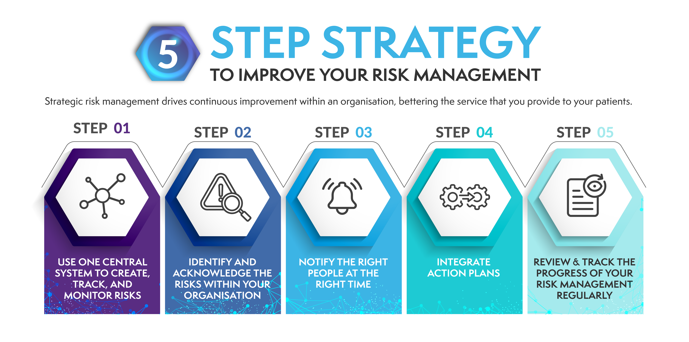

## Table of Contents

## What is health care risk management?

Health care risk management is about finding and reducing risks in hospitals and clinics to keep patients and workers safe. It involves looking at what could go wrong, like accidents or mistakes, and making plans to stop these things from happening. People who work in risk management use tools and methods to spot these risks early and fix them before anyone gets hurt.

A big part of health care risk management is also making sure that if something bad does happen, the hospital or clinic can handle it well. This means having good insurance, training staff on what to do in emergencies, and learning from past mistakes to improve future care. By doing all these things, health care risk management helps to make sure that patients get the best and safest care possible.

## Why is risk management important in health care?

Risk management is very important in health care because it helps keep patients and workers safe. By looking at what could go wrong, like accidents or mistakes, hospitals and clinics can make plans to stop these things from happening. This means that patients are less likely to get hurt or sick because of something that could have been prevented. It also makes sure that the people who work in health care are safe and can do their jobs well without worrying about risks.

Another reason risk management is important is that it helps hospitals and clinics handle problems well if they do happen. This includes having good insurance and training staff on what to do in emergencies. When something goes wrong, like a patient getting the wrong medicine, risk management helps the hospital learn from the mistake and fix it so it doesn't happen again. This way, everyone can trust that the health care they get is the best and safest possible.

## What are the common types of risks in health care settings?

In health care settings, there are many common types of risks that can affect patients and workers. One big risk is medical errors, like giving a patient the wrong medicine or doing the wrong surgery. These mistakes can happen because of mix-ups, not following rules, or being too tired. Another risk is infections that patients can get while in the hospital, called hospital-acquired infections. These can happen if the hospital is not clean enough or if staff do not wash their hands properly. Falls are also a common risk, especially for older patients who might be weak or unsteady.

Another type of risk in health care is related to equipment and technology. Machines and tools can break or not work right, which can be dangerous for patients. For example, if a heart monitor stops working, doctors might not know if a patient is in trouble. Data breaches are also a big risk because hospitals keep a lot of private information about patients. If this information gets stolen, it can hurt patients and the hospital's reputation. 

Lastly, there are risks from the way the hospital is run. Staff might not have enough training or might be overworked, which can lead to mistakes. There can also be problems with how the hospital communicates, like not sharing important information quickly enough. All these risks need to be watched and managed to keep everyone safe and healthy.

## How can health care organizations identify potential risks?

Health care organizations can identify potential risks by looking closely at what they do every day. They can do this by checking their records to see if there have been any accidents or mistakes in the past. They can also talk to their staff and patients to find out if anyone has noticed anything that could be dangerous. By doing regular checks of their buildings and equipment, they can spot things that might break or not work right. This helps them find risks before they cause harm.

Another way to identify risks is by using special tools and methods. For example, they can use something called a risk assessment, which is like a checklist to see what could go wrong and how likely it is to happen. They can also do what's called a root cause analysis, which means looking at why a mistake happened and figuring out how to stop it from happening again. By using these tools, health care organizations can find risks early and make plans to keep everyone safe.

## What are the basic steps in a health care risk management process?

The first step in a health care risk management process is to identify the risks. This means looking at everything the hospital or clinic does and figuring out what could go wrong. They do this by checking records, talking to staff and patients, and doing regular checks of buildings and equipment. They use tools like risk assessments to help them find risks early.

Once the risks are identified, the next step is to analyze and evaluate them. This means figuring out how likely the risks are to happen and how bad they could be if they do. Health care organizations use methods like root cause analysis to understand why mistakes happened and how to stop them from happening again. After analyzing the risks, they decide which ones need to be dealt with first.

The final step is to handle the risks. This can mean making new rules or training staff to do things differently to avoid the risks. It can also mean getting insurance to cover any problems that do happen. The health care organization keeps watching the risks and makes changes as needed to keep everyone safe. By following these steps, they can manage risks and provide the best care possible.

## What role does patient safety play in health care risk management?

Patient safety is a big part of health care risk management. It means making sure that patients do not get hurt or sick because of the care they get. When hospitals and clinics work on risk management, they are trying to find and fix things that could harm patients. This includes making sure that the right medicine is given, surgeries are done safely, and infections are prevented. By focusing on patient safety, health care organizations can stop many risks before they cause problems.

Patient safety also helps health care organizations learn from their mistakes. If something goes wrong, like a patient getting the wrong treatment, the hospital can study why it happened and make changes to stop it from happening again. This way, everyone in the hospital learns how to do their job better and safer. By always thinking about patient safety, health care risk management helps make sure that patients get the best and safest care possible.

## How can health care providers implement effective risk management strategies?

Health care providers can implement effective risk management strategies by first making sure they know all the risks that could happen in their hospital or clinic. They do this by looking at past records, talking to their staff and patients, and checking their buildings and equipment regularly. They use tools like risk assessments to help them find risks early. Once they know what the risks are, they can figure out which ones are the most important to fix first. This means looking at how likely the risks are to happen and how bad they could be if they do. By understanding the risks well, health care providers can make smart plans to keep everyone safe.

After identifying and evaluating the risks, health care providers need to take action to handle them. This can mean making new rules or training staff to do things differently to avoid the risks. For example, they might train nurses on how to give medicine safely or set up better cleaning routines to stop infections. They also need to get insurance to cover any problems that do happen. It's important for health care providers to keep watching the risks and make changes as needed. By always working on risk management, they can make sure that patients get the best and safest care possible.

## What are some examples of successful risk management in health care?

One example of successful risk management in health care is how some hospitals have reduced the number of falls among patients. They did this by putting in place special programs that help keep patients safe. For example, they made sure that patients at risk of falling wore special bracelets, and they put up signs to remind staff to check on these patients more often. They also changed the hospital's layout to make it safer, like adding more handrails and making sure floors were not slippery. By doing all these things, the hospitals were able to lower the number of falls and keep their patients safer.

Another example is how some health care organizations have worked to stop hospital-acquired infections. They did this by making strict rules about hand washing and cleaning. They trained all staff to wash their hands properly and set up systems to make sure these rules were followed. They also used special tools to clean rooms and equipment better. By doing this, they were able to cut down the number of infections that patients got while in the hospital. This made patients healthier and saved the hospitals money because they did not have to treat as many infections.

## How does compliance with regulations factor into health care risk management?

Compliance with regulations is a big part of health care risk management. It means following the rules and laws that tell hospitals and clinics how to keep patients safe. These rules can be about things like how to give medicine, how to clean the hospital, or how to keep patient information private. When health care organizations follow these rules, they can stop many risks before they happen. For example, if a hospital follows the rules about cleaning, it can stop infections from spreading. By making sure they comply with regulations, health care organizations can keep their patients and staff safe.

Not following the rules can lead to big problems. If a hospital does not follow the rules, it might get fined or lose its license to work. This can hurt the hospital's reputation and make it hard for them to take care of patients. Also, if a hospital does not follow the rules, it might miss important risks that could harm patients. For example, if a hospital does not follow the rules about keeping patient information private, it might have a data breach. By making sure they comply with regulations, health care organizations can manage risks better and provide the best care possible.

## What advanced tools and technologies are used in health care risk management?

In health care risk management, advanced tools and technologies help hospitals and clinics find and fix risks before they cause problems. One important tool is electronic health records (EHRs). EHRs keep all patient information in one place, making it easier for doctors and nurses to see a patient's history and avoid mistakes like giving the wrong medicine. Another tool is predictive analytics, which uses data to guess what might go wrong in the future. By looking at past data, hospitals can see patterns and take action to stop risks before they happen.

There are also special software programs that help with risk management. These programs can do things like risk assessments, which help hospitals find risks and figure out how bad they could be. Some software can also keep track of incidents, like accidents or mistakes, so hospitals can learn from them and make things better. Technology like barcode scanning is used to make sure patients get the right medicine and treatments. By using these advanced tools and technologies, health care organizations can manage risks better and keep everyone safe.

## How can data analytics improve risk management practices in health care?

Data analytics can help health care organizations find and fix risks before they cause problems. By looking at a lot of information, like patient records and hospital data, data analytics can spot patterns that show where risks might happen. For example, if a lot of patients are getting infections in one part of the hospital, data analytics can help figure out why and what can be done to stop it. This way, hospitals can make changes to keep patients and staff safer.

Another way data analytics helps is by predicting what might go wrong in the future. By using past data, hospitals can guess which risks are most likely to happen and how bad they could be. This lets them focus on the most important risks first and make plans to handle them. For example, if data shows that falls are common among older patients, the hospital can start special programs to help these patients stay safe. By using data analytics, health care organizations can manage risks better and give the best care possible.

## What are the future trends and challenges in health care risk management?

In the future, health care risk management will use more technology to find and fix risks. Tools like [artificial intelligence](/wiki/ai-artificial-intelligence) and [machine learning](/wiki/machine-learning) will help hospitals look at a lot of data quickly and spot problems before they happen. This means hospitals can stop risks like infections or medical errors even better. Also, more hospitals will use electronic health records to keep all patient information in one place, making it easier to avoid mistakes. But using all this new technology can be hard. Hospitals will need to train their staff to use these tools and make sure the technology works well and stays safe from hackers.

Another big challenge will be keeping up with new rules and laws. As health care changes, there will be more rules about how to keep patients safe and their information private. Hospitals will need to make sure they follow all these rules, which can be hard and take a lot of time. Also, as more people use health care services, hospitals will need to manage more risks. This means they will need to find new ways to keep everyone safe, even as they get busier. By working on these challenges, health care organizations can keep improving their risk management and give the best care possible.

## References & Further Reading

[1]: Scherpf, J., et al. (2020). ["A machine learning approach to identify sepsis."](https://pubmed.ncbi.nlm.nih.gov/31965266/) Nature Medicine.

[2]: Shimabukuro, D. W., et al. (2017). ["Effect of a Machine Learning–Based Severe Sepsis Prediction Algorithm on Patient Outcomes."](https://pmc.ncbi.nlm.nih.gov/articles/PMC11612599/) The American Journal of Respiratory and Critical Care Medicine.

[3]: Esteva, A., et al. (2019). ["A guide to deep learning in healthcare."](https://pubmed.ncbi.nlm.nih.gov/30617335/) Nature Medicine.

[4]: Ratwani, R. M., et al. (2018). ["Improving Medication Safety through Human Factors Engineering."](https://pubmed.ncbi.nlm.nih.gov/29982549/) The Journal of Patient Safety.

[5]: Buch V.H., Ahmed I. & Maruthappu M. (2018). ["Artificial intelligence in medicine: current trends and future possibilities."](https://pubmed.ncbi.nlm.nih.gov/29472224/) Journal of the Royal Society of Medicine.

[6]: Lopez de Prado, M. (2018). ["Advances in Financial Machine Learning."](https://www.amazon.com/Advances-Financial-Machine-Learning-Marcos/dp/1119482089) Wiley.