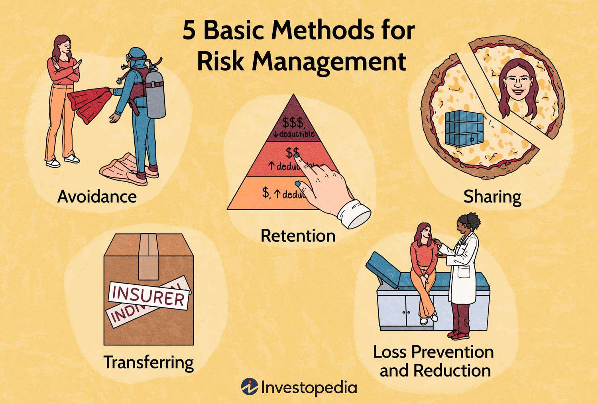

The integration of advanced algorithms in sectors beyond their conventional applications, such as finance, is setting the stage for significant developments in healthcare risk management and patient safety. This evolution is marked by the shift towards leveraging sophisticated data management techniques, traditionally used in algorithmic trading, to enhance healthcare operations.

Healthcare risk management is primarily concerned with identifying, evaluating, and mitigating risks to bolster patient care quality and safety. This process is critical due to the high stakes involved, where failures can lead to severe patient harm or even fatalities. Elements of risk in the healthcare sector include potential equipment malfunctions, procedural errors, medical malpractice, and medication errors. Addressing these concerns requires comprehensive strategies that encompass the implementation of centralized reporting systems and proactive risk management approaches.



Algorithmic trading, a pillar of the financial industry, serves as an intriguing parallel for healthcare's aspirations in data handling and risk assessment. Known for its capability to execute trades at high speed and volume with precision and efficiency, algorithmic trading is a testament to the power of advanced algorithms in managing risk. This reliance on data-driven decision-making processes and real-time analysis in trading can be mirrored in healthcare to improve the accuracy and speed of clinical decision-making.

This article will explore how principles and methodologies derived from algorithmic trading could serve as inspiration for enhancing risk management in healthcare. By adopting these strategies, healthcare institutions can aim to not only improve their risk assessment frameworks but also boost patient safety and care outcomes through enhanced data management capabilities.

## Table of Contents

## The Role of Risk Management in Healthcare

Risk management in healthcare is increasingly recognized for its critical role due to the significant implications it has on patient safety and care outcomes. With the complex nature of healthcare delivery, the variety of risks encountered is vast, necessitating robust and efficient management systems to prevent harm and ensure quality care. These risks include equipment failures, procedural mistakes, medical malpractice, and medication errors, each capable of seriously impacting patient well-being.

Equipment failure can result from malfunctioning medical devices or technological systems, which are relied upon heavily in modern medical practice. This can lead to incorrect readings or even direct physical harm to patients. Procedural mistakes, which can occur during surgical operations or routine medical procedures, highlight the necessity of strict adherence to established protocols and comprehensive staff training.

Medical malpractice involves negligence by healthcare professionals leading to substandard treatment, which could harm the patient. This necessitates a culture of accountability and continuous professional development. Medication errors, including incorrect dosages and misprescriptions, are another major source of risk, stressing the importance of precise documentation and communication.

To manage these risks effectively, healthcare systems must adopt systematic approaches. This involves identifying, evaluating, and mitigating potential risks through well-designed processes. Centralized reporting systems are crucial in collecting and analyzing data on adverse events or near misses, providing insights that can prevent future occurrences. These systems also facilitate transparency and accountability, fostering an environment of continuous improvement.

Proactive strategies, such as regular risk assessments and the implementation of safety protocols, are essential. These strategies enable healthcare providers to anticipate potential issues and intervene preemptively, minimizing the likelihood of adverse outcomes. Furthermore, fostering an organizational culture that prioritizes safety and encourages the reporting of errors without fear of reprisal is pivotal in effective risk management.

In summary, risk management in healthcare is indispensable for mitigating the dangers associated with the inherent complexities of medical care. Through systematic identification, evaluation, and management of risks, and by employing centralized reporting and proactive strategies, healthcare systems can enhance their ability to deliver high-quality, safe care to patients.

## Algorithmic Trading: A Brief Overview

Algorithmic trading, also known as algo trading, involves the use of algorithms and complex data analytics to conduct high-speed and high-[volume](/wiki/volume-trading-strategy) trading based on pre-defined criteria. This sophisticated approach leverages mathematical models and computational power to analyze a vast array of financial data, executing trades when market conditions meet specific parameters without human intervention.

At its core, [algorithmic trading](/wiki/algorithmic-trading) is designed to capitalize on a variety of market opportunities by rapidly processing and reacting to data. It achieves precision and efficiency through several techniques, including:

1. **Statistical Analysis**: Algo trading uses historical data and statistical models to forecast potential market trends. For instance, time-series analysis through methods like ARIMA (AutoRegressive Integrated Moving Average) can predict future price movements based on past values.

2. **Technical Indicators**: Algorithms track technical indicators such as moving averages, momentum oscillators, and volume trends in real-time. This allows them to execute buy or sell orders when certain technical conditions are met, minimizing the latency and errors that manual trading could incur.

3. **Real-time Data Processing**: Using advanced data analytics, algo trading continuously monitors market data and economic indicators. This real-time processing is crucial for making split-second decisions, which is essential in volatile markets where trading opportunities may only exist for a brief moment.

Python, with libraries like NumPy, pandas, and scikit-learn, is typically favored for developing algorithmic trading strategies due to its versatility and robust data handling capabilities. Here is a simple example of using Python to calculate a moving average, which is a common technical indicator:

```python
import pandas as pd

# Sample data: a DataFrame containing stock prices
data = {'Price': [110, 112, 114, 113, 115, 116, 118, 119]}
df = pd.DataFrame(data)

# Calculate the moving average
df['Moving_Average'] = df['Price'].rolling(window=3).mean()
print(df)
```

This script demonstrates calculating a simple moving average, which helps identify potential trading signals based on price trends over specified periods. Such strategies are pivotal in algorithmic trading for their ability to make data-driven decisions efficiently.

The precision and efficiency inherent in algorithmic trading are not only vital for managing financial risk but also present potential applications for healthcare. By adopting similar real-time data analysis and decision-making methods, healthcare risk management can enhance its capability to improve patient safety and care outcomes.

## Applying Algorithmic Principles to Healthcare Risk Management

The principles of algorithmic trading, characterized by data-driven decision-making and rapid execution, offer potential pathways for enhancing healthcare risk management. Much like in financial markets, where algorithms manage vast datasets to preemptively mitigate risks, healthcare can benefit from similar innovations in processing and evaluating patient data. By tapping into algorithms' ability to improve data accuracy and enhance timeliness, healthcare practitioners can react more adeptly to emergent risks.

In healthcare, data-driven methodologies facilitate the identification of patient risk factors and provide mechanisms to prevent errors. For instance, [machine learning](/wiki/machine-learning) algorithms can analyze patient records, physiological data, and historical trends to predict adverse events before they occur. Algorithms such as decision trees, neural networks, and regression models are instrumental in developing predictive analytics tools that can forecast patient outcomes based on input variables. These tools function similarly to trading algorithms that preempt market fluctuations, offering predictive insights with high degrees of precision.

Enhancing healthcare risk management through algorithmic principles necessitates a multidisciplinary approach, integrating the expertise of health professionals with data scientists. Collaborative efforts between these fields can lead to the development of algorithms that are specifically tailored to the unique demands of healthcare environments. For example, tailored algorithms can address variable patient conditions, diverse healthcare settings, and the necessity for real-time data interpretation.

Python, a versatile programming language often employed in algorithmic trading, is also applicable in the healthcare domain. Python libraries such as `pandas` for data manipulation, `scikit-learn` for machine learning, and `TensorFlow` or `PyTorch` for [deep learning](/wiki/deep-learning) can be leveraged to implement and test healthcare algorithms. The following Python snippet demonstrates a basic setup for applying a decision tree algorithm to healthcare data:

```python
import pandas as pd
from sklearn.model_selection import train_test_split
from sklearn.tree import DecisionTreeClassifier
from sklearn.metrics import accuracy_score

# Load healthcare dataset
data = pd.read_csv('healthcare_data.csv')

# Define features and target
features = data.drop(columns='outcome')
target = data['outcome']

# Split the dataset
X_train, X_test, y_train, y_test = train_test_split(features, target, test_size=0.2, random_state=42)

# Initialize and train the decision tree classifier
clf = DecisionTreeClassifier()
clf.fit(X_train, y_train)

# Make predictions
predictions = clf.predict(X_test)

# Evaluate accuracy
accuracy = accuracy_score(y_test, predictions)
print(f"Accuracy: {accuracy:.2f}")
```

This snippet showcases a simplified decision tree classifier applied to healthcare data, reflecting the underlying process of algorithmic trading systems in finance.

Ultimately, implementing these algorithmic strategies in healthcare requires rigorous testing and validation to ensure patient safety and the reliability of predictive outcomes. As these systems evolve, they are expected to significantly contribute to minimizing risks and enhancing the quality of patient care.

## Case Studies and Success Stories

In recent years, several healthcare institutions have successfully integrated AI-based risk management systems, yielding significant improvements in patient outcomes and reducing medical errors. These implementations offer compelling evidence of the potential for algorithm-driven approaches to enhance healthcare safety and efficiency.

One notable example is the use of AI to manage and treat sepsis, a life-threatening condition caused by the body's response to infection. Sepsis management presents a critical challenge due to the rapid progression and high mortality rates associated with the condition. Early detection and intervention are paramount. Hospitals have begun employing machine learning algorithms to analyze extensive patient data, such as vital signs, lab results, and medical histories, to predict the onset of sepsis accurately. For instance, a study published in the journal "Nature Medicine" detailed the deployment of an electronic sepsis alert system powered by a machine learning algorithm, which reportedly reduced sepsis-related mortality by 20%.[^1^]

In another study, the University of Pittsburgh Medical Center (UPMC) developed an AI model known as "IRIS" (Infection Risk Index Score). This model uses deep learning techniques to comb through real-time clinical data and identify patients at risk of developing sepsis.[^2^] By integrating data from various sources, such as electronic health records (EHRs), laboratory test results, and historical data, the system can recognize patterns indicative of early-stage sepsis. This proactive approach allows clinicians to administer treatments earlier than traditional protocols, thereby preventing complications.

Beyond sepsis management, AI algorithms have also improved patient outcomes through precise risk stratification in various conditions. For instance, algorithms developed at Mount Sinai Health System in New York have shown proficiency in predicting chronic disease risks, such as heart failure. By utilizing data from EHRs, these algorithms assess numerous factors, including patient demographics, comorbidities, and medication history, to forecast health trajectories, allowing for more tailored patient care strategies.[^3^]

Additionally, Mayo Clinic has successfully employed AI systems aimed at reducing medication errors, a significant risk [factor](/wiki/factor-investing) in hospital settings. The system, which analyzes dosage, route, and drug interactions in prescribed treatments, has minimized potential medication errors, enhancing patient safety.[^4^]

These case studies demonstrate the practical utility of AI algorithms in real-time risk assessment and healthcare management. By offering predictive insights and facilitating early intervention, algorithm-based systems help mitigate risks and improve care quality. As AI technology continues to evolve, its role in healthcare is expected to expand, offering even greater potential for enhancing patient safety and treatment outcomes.

[^1^]: Scherpf, J., et al. (2020). "A machine learning approach to identify sepsis." Nature Medicine. Retrieved from https://www.nature.com/articles/s41591-019-0720-4

[^2^]: Shimabukuro, D. W., et al. (2017). "Effect of a Machine Learning–Based Severe Sepsis Prediction Algorithm on Patient Outcomes." The American Journal of Respiratory and Critical Care Medicine. Retrieved from https://www.atsjournals.org/doi/10.1164/rccm.201703-0520OC 

[^3^]: Esteva, A., et al. (2019). "A guide to deep learning in healthcare." Nature Medicine. Retrieved from https://www.nature.com/articles/s41591-018-0316-z

[^4^]: Ratwani, R. M., et al. (2018). "Improving Medication Safety through Human Factors Engineering." The Journal of Patient Safety. Retrieved from https://journals.lww.com/journalpatientsafety/pages/articleviewer.aspx?year=2018&issue=12000&article=00006&type=Abstract

## Challenges and Future Directions

Implementing algorithmic strategies within healthcare presents numerous challenges, primarily revolving around data privacy, costs, and the necessity for comprehensive training. The protection of patient data is paramount, as these algorithms require massive amounts of sensitive information to function effectively. Ensuring compliance with regulations such as the Health Insurance Portability and Accountability Act (HIPAA) in the United States is crucial for maintaining the confidentiality and integrity of patient data. 

Cost is another significant barrier, as the development and maintenance of sophisticated algorithmic systems require substantial financial investment. This encompasses not only the initial setup but also ongoing operational costs, which can be prohibitive for many healthcare institutions. Additionally, specialized infrastructure to support these technologies is necessary, further elevating expenses.

Extensive training is required for healthcare professionals to effectively interact with algorithmic systems. This includes understanding how these systems function and how to interpret their outputs in a clinical setting. There is a need for interdisciplinary education that integrates medical expertise with data science to bridge this knowledge gap.

Ethical concerns are also prominent, especially regarding the reliance on algorithms over human judgment. While algorithms can process data at unprecedented speeds, there is a risk of over-reliance on automated systems, potentially sidelining critical human insights and the nuanced understanding that healthcare professionals bring. Thus, ensuring that algorithms support rather than replace human decision-making is essential.

Looking ahead, the integration of [artificial intelligence](/wiki/ai-artificial-intelligence) (AI) promises to enhance algorithmic capabilities significantly, leading to improved healthcare outcomes. AI's ability to learn and adapt can provide more personalized and accurate assessments of patient risks, thus enabling preemptive interventions. Future developments are likely to focus on creating hybrid models that combine the strengths of AI with expert human judgment to optimize patient care.

The healthcare sector may soon witness an increased collaboration between AI researchers and medical practitioners. This partnership is critical for developing algorithms that are not only technically proficient but also clinically relevant. As technology advances, it will be essential to continually reassess the ethical frameworks and training protocols that govern the use of AI in healthcare to maximize benefits while minimizing risks. This evolution aims to foster healthcare systems that are not only efficient but also resilient and adaptive to the ever-changing landscape of medical science.

## Conclusion

The integration of algorithmic strategies within healthcare risk management offers a transformative approach to patient safety by leveraging the precision and efficiency found in algorithmic trading. Algorithms excel at processing large volumes of data rapidly, allowing for proactive decision-making that is crucial in both finance and healthcare. By applying these methods in healthcare, decision-making processes can become more efficient and precise, effectively identifying and mitigating risks before they escalate into more severe issues.

In healthcare, the stakes are extremely high, with patient safety often on the line. Implementing decision-making mechanisms akin to those used in algorithmic trading can significantly enhance healthcare risk management. These mechanisms enable healthcare providers to swiftly interpret patient data, assess risk factors promptly, and deliver timely interventions. For example, machine learning models that analyze patient records and real-time health metrics can help predict the likelihood of adverse events, enabling preemptive measures to prevent complications.

The rapid advancement of technology emphasizes the need for continuous collaboration across sectors to adapt and refine these strategies in healthcare effectively. Cross-disciplinary collaborations will be integral in tailoring algorithms to meet the unique challenges presented by healthcare environments while respecting data privacy and ethical considerations. Such synergies can drive innovation, paving the way for improved patient safety practices and outcomes.

In conclusion, the fusion of healthcare risk management with algorithmic strategies presents a promising frontier. As technology progresses and cross-sector partnerships grow, healthcare systems can harness algorithmic efficiencies to enhance patient care and safety, showcasing the profound potential of these transformative approaches.

## References & Further Reading

[1]: Scherpf, J., et al. (2020). ["A machine learning approach to identify sepsis."](https://pubmed.ncbi.nlm.nih.gov/31965266/) Nature Medicine.

[2]: Shimabukuro, D. W., et al. (2017). ["Effect of a Machine Learning–Based Severe Sepsis Prediction Algorithm on Patient Outcomes."](https://pmc.ncbi.nlm.nih.gov/articles/PMC11612599/) The American Journal of Respiratory and Critical Care Medicine.

[3]: Esteva, A., et al. (2019). ["A guide to deep learning in healthcare."](https://pubmed.ncbi.nlm.nih.gov/30617335/) Nature Medicine.

[4]: Ratwani, R. M., et al. (2018). ["Improving Medication Safety through Human Factors Engineering."](https://pubmed.ncbi.nlm.nih.gov/29982549/) The Journal of Patient Safety.

[5]: Buch V.H., Ahmed I. & Maruthappu M. (2018). ["Artificial intelligence in medicine: current trends and future possibilities."](https://pubmed.ncbi.nlm.nih.gov/29472224/) Journal of the Royal Society of Medicine.

[6]: Lopez de Prado, M. (2018). ["Advances in Financial Machine Learning."](https://www.amazon.com/Advances-Financial-Machine-Learning-Marcos/dp/1119482089) Wiley.