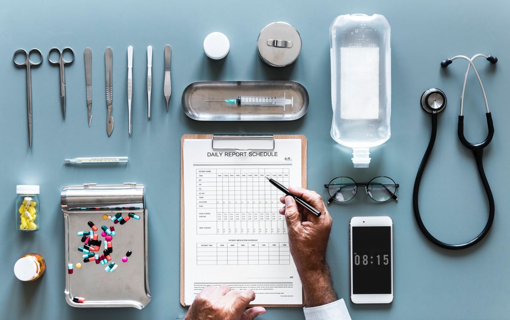

## Table of Contents

## What is alternative data in the context of healthcare?

Alternative data in healthcare refers to information that comes from non-traditional sources, outside of the usual medical records and clinical data. This can include things like data from wearable devices, social media activity, and even satellite imagery. These sources can provide insights into people's health and behaviors that traditional data might miss.

Using alternative data can help healthcare providers and researchers understand more about how people live their daily lives and how this affects their health. For example, data from fitness trackers can show how active someone is, which can be important for managing conditions like diabetes or heart disease. By looking at this kind of data, doctors can make better decisions about treatment and care, and researchers can find new ways to improve health outcomes.

## How is alternative data collected in healthcare?

Alternative data in healthcare is collected from many different places that are not usual medical sources. For example, wearable devices like fitness trackers and smartwatches gather information about how much someone moves, their heart rate, and even how well they sleep. This data is sent to apps or online platforms where it can be looked at by the person wearing the device or shared with doctors. Social media is another place where alternative data comes from. By looking at what people post online, researchers can learn about their habits, feelings, and even signs of health problems.

Another way to collect [alternative data](/wiki/best-alternative-data) is through satellite imagery and location data from smartphones. This can show how the environment where people live affects their health, like if they live in areas with a lot of pollution or not enough green spaces. Companies and organizations also use surveys and online searches to gather information about what people are worried about or looking for in terms of health. All this data helps build a bigger picture of someone's health and lifestyle, which can be very useful for doctors and researchers.

## What are some common sources of healthcare alternative data?

One common source of healthcare alternative data is wearable devices. These include fitness trackers and smartwatches that track things like how many steps someone takes, their heart rate, and how well they sleep. This data can be shared with apps or online platforms, and sometimes with doctors, to help understand a person's health better. Another source is social media. By looking at what people post online, researchers can learn about their daily habits, feelings, and even early signs of health issues.

Location data from smartphones and satellite imagery also provide useful alternative data. This can show how the environment, like air quality or access to green spaces, affects people's health. Companies and organizations also use surveys and online search data to gather information about what people are worried about or looking for in terms of health. All these sources help build a more complete picture of someone's health and lifestyle, which can be very helpful for doctors and researchers.

## How can healthcare providers use alternative data to improve patient care?

Healthcare providers can use alternative data to learn more about their patients' daily lives and health. For example, data from fitness trackers can show how active a patient is, which is important for managing conditions like diabetes or heart disease. By knowing how much a patient moves and sleeps, doctors can give better advice on how to stay healthy. Also, social media posts can help doctors see if a patient is feeling stressed or sad, which can affect their health. This way, doctors can offer help or suggest changes to make the patient feel better.

Another way alternative data helps is by showing how the environment affects health. With location data from smartphones and satellite images, doctors can see if a patient lives in a polluted area or somewhere with few parks. This information can guide doctors in giving advice on how to avoid health risks from the environment. For example, if a patient lives near a busy road, the doctor might suggest ways to reduce exposure to air pollution. By using all this data, healthcare providers can make better plans for each patient, leading to improved care and healthier lives.

## What are the potential benefits of using alternative data in healthcare?

Using alternative data in healthcare can help doctors and researchers understand more about how people live and what affects their health. For example, data from fitness trackers can show how active someone is, which is important for managing conditions like diabetes or heart disease. By knowing how much a person moves and sleeps, doctors can give better advice on how to stay healthy. Also, looking at social media posts can help doctors see if a patient is feeling stressed or sad, which can affect their health. This way, doctors can offer help or suggest changes to make the patient feel better.

Another benefit of alternative data is that it can show how the environment affects health. With location data from smartphones and satellite images, doctors can see if a patient lives in a polluted area or somewhere with few parks. This information can guide doctors in giving advice on how to avoid health risks from the environment. For example, if a patient lives near a busy road, the doctor might suggest ways to reduce exposure to air pollution. By using all this data, healthcare providers can make better plans for each patient, leading to improved care and healthier lives.

## What are the ethical considerations when using alternative data in healthcare?

When using alternative data in healthcare, there are important ethical things to think about. One big issue is privacy. People's data from fitness trackers, social media, and location information is very personal. Doctors and researchers need to make sure this data is kept safe and only used in ways that help the patient. They also need to get permission from the person before using their data. If they don't, it can feel like someone is looking at their private life without asking.

Another thing to consider is fairness. Not everyone has the same access to things like fitness trackers or smartphones. This means that alternative data might not include everyone, and some groups of people might be left out. This can lead to unfair treatment or decisions that don't work for everyone. Doctors and researchers need to make sure they are using data in a way that helps everyone equally and doesn't leave anyone behind.

## How does alternative data help in predicting healthcare trends?

Alternative data helps in predicting healthcare trends by giving doctors and researchers a lot of information about how people live their daily lives. For example, data from fitness trackers can show how active people are, and social media posts can tell us if people are feeling stressed or sad. By looking at this data over time, doctors can see patterns and predict if more people might get sick with certain conditions, like heart disease or mental health problems. This helps them plan better and make sure they have the right treatments ready.

Another way alternative data helps is by showing how the environment affects health. With location data from smartphones and satellite images, doctors can see if people live in areas with a lot of pollution or not enough green spaces. This information can help predict if more people in those areas might get sick from things like air pollution or lack of exercise. By understanding these trends, healthcare providers can work on ways to keep people healthier and stop problems before they start.

## What are the challenges associated with integrating alternative data into existing healthcare systems?

One big challenge with using alternative data in healthcare is making it work well with the systems doctors already use. Most hospitals and clinics use special computer systems to keep track of patients' health records. Adding new kinds of data, like from fitness trackers or social media, can be hard because these systems were not made to handle this information. It takes a lot of work to change the systems so they can take in this new data and use it correctly. Doctors and IT people need to work together to make sure the new data fits well with what they already have.

Another challenge is making sure the data is correct and useful. Alternative data can come from many different places, and it might not always be as accurate as the data doctors usually use. For example, someone might forget to wear their fitness tracker or post something on social media that is not true. Doctors need to check this data carefully to make sure it is right before they use it to make decisions about a patient's health. Also, not everyone has the same access to things like fitness trackers or smartphones, so the data might not show the full picture of everyone's health. This can make it hard to use the data in a fair way for all patients.

## Can you explain how machine learning and AI are used with healthcare alternative data?

Machine learning and AI help doctors and researchers use alternative data in healthcare by finding patterns and making predictions. For example, if a lot of people are using fitness trackers, [machine learning](/wiki/machine-learning) can look at all that data to see if there are signs that someone might get sick with a condition like heart disease. It can also look at social media posts to see if people are feeling stressed or sad, which can affect their health. By using AI, doctors can get early warnings about health problems and help patients before they get really sick.

Another way AI helps is by making sense of big amounts of data from different places, like location data and satellite images. This can show how the environment, like air quality or access to green spaces, affects people's health. AI can find patterns in this data that would be hard for people to see on their own. This helps doctors give better advice to patients about how to stay healthy and avoid risks from their surroundings. By using machine learning and AI, healthcare providers can make better plans for each patient and help keep more people healthy.

## What are some case studies where alternative data has significantly impacted healthcare decisions?

One case study that shows how alternative data can help is about a big health company that used data from fitness trackers to help people with diabetes. They looked at how much people moved and how well they slept. By doing this, they found that people who moved more and slept better had better control of their blood sugar. The company used this information to make special programs that helped people with diabetes be more active and sleep better. This led to better health for many people, and doctors could give better advice based on real data about their patients' lives.

Another example is about a research group that used social media data to help with mental health. They looked at what people posted online to see if they were feeling stressed or sad. By finding patterns in these posts, the researchers could tell when someone might need help with their mental health. They shared this information with doctors, who then reached out to these people to offer support and treatment. This early help made a big difference for many people, showing how looking at social media can help doctors take care of their patients better.

## How do regulatory frameworks affect the use of alternative data in healthcare?

Regulatory frameworks play a big role in how alternative data is used in healthcare. These rules are made to keep people's information safe and private. For example, laws like HIPAA in the United States say that doctors need to ask for permission before they can use someone's health data. This means that when doctors want to use data from fitness trackers or social media, they have to make sure they are following these rules. If they don't, they could get in trouble and people might not trust them with their data.

Another way regulatory frameworks affect the use of alternative data is by setting standards for how the data is collected and used. These rules help make sure that the data is correct and fair. For example, if a company wants to use location data to see how the environment affects health, they need to follow rules about how they collect and store this data. This can make it harder to use alternative data because it takes more time and money to follow all the rules. But it also helps make sure that the data is used in a way that helps everyone and keeps people's information safe.

## What future developments can we expect in the use of alternative data in healthcare?

In the future, we can expect more and more use of alternative data in healthcare. As technology gets better, things like fitness trackers and smartwatches will be able to gather even more information about people's health. This will help doctors understand more about how people live and what affects their health. For example, new kinds of sensors might be able to tell if someone is at risk for a heart attack before it happens. This means doctors can help people stay healthy before they get really sick.

Another big change will be in how we use [artificial intelligence](/wiki/ai-artificial-intelligence) and machine learning with alternative data. These tools will get better at finding patterns in the data and making predictions. This can help doctors see early signs of health problems and offer help before things get worse. Also, as more people use technology, alternative data will include more people, making it fairer and more useful for everyone. But, we will need to keep working on rules to make sure people's information stays safe and private.

## References & Further Reading

[1]: Oliveira, N., Cortez, P., & Areal, N. (2017). ["The impact of microblogging data for stock market prediction: Using Twitter to predict returns, volatility, trading volume and survey sentiment indices."](https://www.sciencedirect.com/science/article/pii/S0957417416307187) Expert Systems with Applications, 73, 125-144.

[2]: Chen, H., De, P., Hu, Y. J., & Hwang, B. H. (2014). ["Wisdom of Crowds: The Value of Stock Opinions Transmitted Through Social Media."](https://academic.oup.com/rfs/article-abstract/27/5/1367/1581938) The Review of Financial Studies, 27(5), 1367-1403.

[3]: ["Advances in Financial Machine Learning"](https://www.amazon.com/Advances-Financial-Machine-Learning-Marcos/dp/1119482089) by Marcos Lopez de Prado.

[4]: ["Machine Learning for Algorithmic Trading"](https://github.com/stefan-jansen/machine-learning-for-trading) by Stefan Jansen.

[5]: ["Quantitative Trading: How to Build Your Own Algorithmic Trading Business"](https://books.google.com/books/about/Quantitative_Trading.html?id=j70yEAAAQBAJ) by Ernest P. Chan.

[6]: Powtorka, T., & Wengrowski, D. R. (2019). ["Utilizing Alternative Data Sources for Better Machine Learning Models in Financial Markets."](https://korkimatematyczne.blogspot.com/2020/12/6-geometria-analityczna.html) 

[7]: ["Data Science for Algorithmic Trading: Predictive models to extract signals from market and alternative data for systematic trading strategies with Python"](https://www.amazon.com/Data-Science-Algorithmic-Trading-alternative/dp/1839217715) by Sourav Ghosh and Ankit Garg.