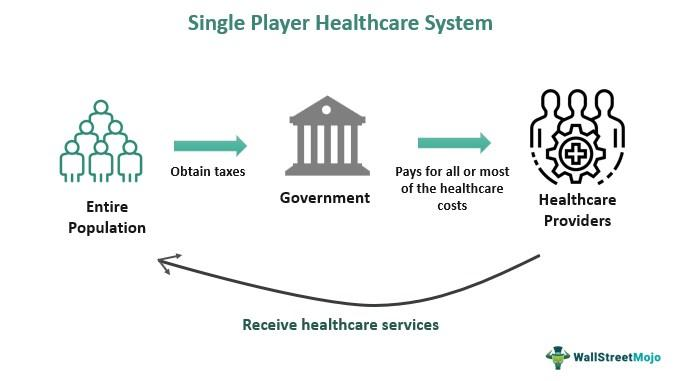

In recent years, the application of alternative data in algorithmic trading has gained remarkable traction. This trend is fueled by the increasing availability of diverse datasets from non-traditional sources, such as social media, sensor data, and in particular, healthcare data. The financial industry has recognized the potential of these unconventional data streams to enhance decision-making and predict market movements more accurately [1].

Healthcare alternative data, comprising information from health insurance claims, consumer health applications, prescription sales, and hospital visits, offers a distinct advantage. It presents robust analytics potential, fueling a new wave of data-driven investment strategies. These datasets contribute unique insights into consumer health trends and spending patterns, which can significantly impact stock performance within the healthcare sector and broader market movements [2].



This article explores the role of healthcare alternative data in algorithmic trading, including its applications, advantages, challenges, and future implications. By understanding how these datasets are utilized, traders and analysts can improve trading models and identify superior investment opportunities. As technological advancements continue to enhance the capture and digitization of healthcare information, traders gain access to timely data capable of influencing trading decisions effectively.

Overall, healthcare alternative data is transforming the landscape of algorithmic trading by providing unique insights and competitive advantages. While it presents opportunities for profit and increased predictive accuracy, it also poses challenges that must be adequately addressed. As markets evolve, understanding and harnessing healthcare alternative data will be crucial for successful trading strategies.

[1] Oliveira, N., Cortez, P., & Areal, N. (2017). The impact of microblogging data for stock market prediction: Using Twitter to predict returns, volatility, trading volume and survey sentiment indices. Expert Systems with Applications, 73, 125-144.
[2] Chen, H., De, P., Hu, Y. J., & Hwang, B. H. (2014). Wisdom of Crowds: The Value of Stock Opinions Transmitted Through Social Media. The Review of Financial Studies, 27(5), 1367-1403.

## Table of Contents

## Understanding Healthcare Alternative Data

Healthcare [alternative data](/wiki/best-alternative-data) encompasses a wide variety of information generated from healthcare activities and transactions beyond traditional financial metrics. This data originates from non-conventional sources within the healthcare landscape, offering investors a unique vantage point on health-related market dynamics.

Examples of healthcare alternative data include information from health insurance claims, consumer health applications, prescription sales, and hospital visits. Each of these data types provides distinctive insights. For instance, health insurance claims data can reveal trends in patient spending and healthcare utilization, while consumer health app data often captures real-time health metrics and lifestyle habits. Prescription sales data offers a glimpse into the demand for specific medications, potentially forecasting pharmaceutical company performance. Moreover, hospital visit records can indicate public health trends, like the incidence of certain illnesses, which may impact healthcare service demand and associated industries.

The digitization of healthcare data has been expedited by advances in technology, making this information more accessible and timely. This rapid data acquisition allows traders to react swiftly to emerging trends. For example, an increase in hospital visits due to a flu outbreak might suggest a short-term rise in pharmaceutical sales for over-the-counter cold medicines, enabling investors to strategically adjust their portfolios.

Traders leveraging this data can gain valuable insights into consumer health trends and spending behaviors, which may have direct implications for stock performance within the healthcare sector. Moreover, these insights can ripple out to affect broader market movements, highlighting the interconnectedness of health trends and economic vitality.

Ultimately, the availability and utilization of healthcare alternative data support informed trading decisions, allowing market participants to identify opportunities not visible through traditional financial analysis. As the landscape of data acquisition continues to evolve, the strategic use of diverse healthcare datasets presents significant potential for deriving financial value.

## Applications in Algorithmic Trading

Healthcare alternative data is increasingly being leveraged in [algorithmic trading](/wiki/algorithmic-trading) to enhance the prediction of market trends and the development of more accurate predictive models. One significant application is the analysis of prescription sales data. By examining this data, investors can forecast pharmaceutical sales performance, which directly influences trading strategies related to stocks in the pharmaceutical sector. This approach provides an opportunity to anticipate market movements in response to changes in sales data, potentially offering an early indicator of stock price fluctuations. 

Another valuable source of healthcare alternative data comes from health monitoring devices, such as wearable technology that tracks user health metrics like heart rate, sleep patterns, and physical activity. This data reflects broader health trends and consumer behavior, thus offering valuable insights for investment in health-related sectors. For example, an increase in consumer health application usage might signal a rising public interest in health and wellness, guiding investors towards sectors poised for growth.

Moreover, healthcare data can be effectively integrated into [machine learning](/wiki/machine-learning) models, which are adept at identifying patterns and trends within complex datasets. By training algorithms with healthcare data, traders can develop models that offer improved predictive power regarding market behavior. Machine learning techniques, such as supervised learning or [deep learning](/wiki/deep-learning) models, can be employed to enhance the analysis and forecasting capabilities. A simple Python snippet utilizing a machine learning library like Scikit-learn might involve setting up a predictive model as follows:

```python
from sklearn.model_selection import train_test_split
from sklearn.linear_model import LinearRegression

# Assuming 'X' is the feature set derived from healthcare data, and 'y' is the target variable (e.g., stock price)
X_train, X_test, y_train, y_test = train_test_split(X, y, test_size=0.2, random_state=42)

# Initialize and train the model
model = LinearRegression()
model.fit(X_train, y_train)

# Predictions
predictions = model.predict(X_test)
```

By implementing models that utilize diverse healthcare datasets, traders can achieve a more nuanced understanding of the market, thereby enhancing their decision-making processes. The use of healthcare alternative data represents a significant evolution in trading strategies, promising greater efficiency and accuracy in market predictions.

## Advantages of Using Healthcare Alternative Data

The primary advantage of integrating healthcare alternative data into trading strategies lies in the significant informational edge it offers, transcending traditional financial metrics. This type of data provides multifaceted insights that enhance the predictive accuracy of trading models, contributing to potentially higher returns. By harnessing diverse datasets such as health insurance claims and consumer health behavior, traders gain a comprehensive understanding of market dynamics that informs more precise forecasts.

Incorporating such data enables traders to identify sector-specific trends earlier, allowing for preemptive and strategic investment decisions. For example, analyzing prescription sales data might reveal emerging patterns in pharmaceutical demand, prompting timely stock maneuvers. These insights allow investors to anticipate market movements with greater confidence and agility.

Furthermore, healthcare alternative data serves a crucial function in validating and refining models derived from conventional economic and financial indicators. By cross-referencing and aligning predictions across different data sources, traders can enhance the robustness and reliability of their strategies. This amalgamation of data not only mitigates risk by providing corroborative evidence but also ensures a more rigorous approach to investment decision-making.

Overall, the strategic use of healthcare alternative data in algorithmic trading offers a substantial edge by augmenting data richness and diversity, fostering advanced prediction capabilities, and supporting superior decision-making frameworks in financial markets.

## Challenges and Considerations

Despite its advantages, there are significant challenges associated with using healthcare alternative data in trading. One of the foremost concerns is data privacy and ethical considerations. Healthcare data is inherently sensitive, containing personal information that must be handled with confidentiality and care. The misuse or breach of such data can lead to serious implications both legally and ethically, emphasizing the importance of compliance with data protection regulations such as the Health Insurance Portability and Accountability Act (HIPAA) in the United States and the General Data Protection Regulation (GDPR) in Europe.

In addition to privacy issues, the need for sophisticated data analytics technologies and expertise is critical. Healthcare alternative data is often complex and voluminous, necessitating advanced analytical tools and techniques to process and extract meaningful insights. The ability to effectively use machine learning algorithms, data mining processes, and statistical models is essential for traders aiming to incorporate this type of data into their strategies.

Data quality presents another challenge. Issues such as incompleteness, inaccuracies, or inconsistencies in healthcare datasets can significantly affect the reliability of trading models. For instance, a predictive model based on erroneous or outdated prescription data might lead to misguided investment decisions. Ensuring data veracity requires rigorous validation processes and continuous monitoring to maintain the integrity of analytical outcomes.

Furthermore, navigating regulatory environments adds another layer of complexity. Regulatory compliance is a dynamic field, especially in jurisdictions with strict data protection laws. Traders and firms must stay informed about current and emerging regulations, ensuring that their data acquisition, processing, and trading practices align with legal standards. This requires not only legal acumen but also the capability to adapt swiftly to regulatory changes, which can be resource-intensive.

In summary, while healthcare alternative data opens up new avenues for algorithmic trading, it necessitates careful consideration of privacy, technological capability, data quality, and regulatory compliance. Balancing these challenges is key to harnessing its potential successfully.

## Future Implications

The future trajectory of algorithmic trading is anticipated to be further entwined with the use of alternative data, compelling a transformation in how trading strategies and decisions are devised. Healthcare data is poised to become more granular and comprehensive due to rapid technological advancements. This evolution promises even more precise insights, enhancing predictive models and financial forecasts.

As these datasets expand and their quality improves, they present significant opportunities for uncovering lucrative trading prospects. Enhanced data collection methods, predictive analytics, and real-time processing capabilities will contribute significantly to traders and investors seeking an edge in a competitive market. For example, advancements in data processing technologies such as machine learning can efficiently analyze extensive healthcare datasets to derive patterns and correlations that were previously undetectable.

Moreover, Python programming, with libraries such as pandas, NumPy, and scikit-learn, can be instrumental in processing, analyzing, and visualizing vast amounts of healthcare data. Python's ability to handle large datasets and perform complex calculations makes it a favored tool among quants and data scientists in the financial sector. Consider the following Python code snippet that demonstrates processing a hypothetical healthcare dataset to predict market trends:

```python
import pandas as pd
from sklearn.ensemble import RandomForestRegressor

# Load healthcare data
data = pd.read_csv('healthcare_data.csv')

# Feature selection and preparation
X = data[['feature1', 'feature2', 'feature3']]  # Select relevant features
y = data['market_trend']  # Predicted variable

# Training a predictive model
model = RandomForestRegressor(n_estimators=100)
model.fit(X, y)

# Predict market trends
predictions = model.predict(X)
print(predictions)
```

Such advancements necessitate a parallel focus on ethical standards and data privacy concerns, especially given the sensitive nature of healthcare information. The financial industry must proactively adapt to regulatory changes, ensuring compliance while leveraging new data sources. This balance between innovation and ethical responsibility will be crucial for sustainable success, ensuring that the use of healthcare alternative data remains both profitable and principled. Thus, staying abreast of technological and regulatory trends will be indispensable for financial analysts and traders aiming to capitalize on the growing realm of alternative data.

## Conclusion

Healthcare alternative data is rapidly transforming the landscape of algorithmic trading by providing unique insights and competitive advantages. This transformation is due to the rich, non-traditional datasets derived from healthcare activities that offer new avenues for predicting market trends and investment opportunities. These datasets allow traders to discern patterns and trends that are otherwise invisible in traditional financial data sources, thus enabling a distinct informational edge.

While the potential for increased profit and predictive accuracy is significant, the integration of healthcare alternative data in trading strategies introduces substantial challenges. Ensuring data privacy and navigating the ethical considerations of using sensitive health information are critical. The complexity of accurately analyzing and interpreting vast and diverse datasets demands advanced analytical technologies and expertise. Addressing data quality issues, such as incompleteness or inaccuracies, is crucial to maintaining the reliability of predictions and mitigating risks.

Going forward, the ability to balance the exploitation of these datasets with ethical and regulatory compliance will determine the ultimate success and sustainability of using such data in the financial markets. Adhering to ethical standards and ensuring compliance with data protection regulations are non-negotiable elements for gaining and maintaining public trust and regulatory approval.

By embracing the insights provided by healthcare alternative data, investors can formulate more informed trading strategies. This proactive approach positions investors to remain competitive amidst the continually evolving dynamics of financial markets. It enables anticipating sector-specific shifts and consumer health trends, facilitating timely and strategic investment decisions. As technology continues to advance, the potential for utilizing healthcare data in trading will expand, making it imperative for traders to adapt and evolve their strategies accordingly.

## References & Further Reading

[1]: Oliveira, N., Cortez, P., & Areal, N. (2017). ["The impact of microblogging data for stock market prediction: Using Twitter to predict returns, volatility, trading volume and survey sentiment indices."](https://www.sciencedirect.com/science/article/pii/S0957417416307187) Expert Systems with Applications, 73, 125-144.

[2]: Chen, H., De, P., Hu, Y. J., & Hwang, B. H. (2014). ["Wisdom of Crowds: The Value of Stock Opinions Transmitted Through Social Media."](https://academic.oup.com/rfs/article-abstract/27/5/1367/1581938) The Review of Financial Studies, 27(5), 1367-1403.

[3]: ["Advances in Financial Machine Learning"](https://www.amazon.com/Advances-Financial-Machine-Learning-Marcos/dp/1119482089) by Marcos Lopez de Prado.

[4]: ["Machine Learning for Algorithmic Trading"](https://github.com/stefan-jansen/machine-learning-for-trading) by Stefan Jansen.

[5]: ["Quantitative Trading: How to Build Your Own Algorithmic Trading Business"](https://books.google.com/books/about/Quantitative_Trading.html?id=j70yEAAAQBAJ) by Ernest P. Chan.

[6]: Powtorka, T., & Wengrowski, D. R. (2019). ["Utilizing Alternative Data Sources for Better Machine Learning Models in Financial Markets."](https://korkimatematyczne.blogspot.com/2020/12/6-geometria-analityczna.html) 

[7]: ["Data Science for Algorithmic Trading: Predictive models to extract signals from market and alternative data for systematic trading strategies with Python"](https://www.amazon.com/Data-Science-Algorithmic-Trading-alternative/dp/1839217715) by Sourav Ghosh and Ankit Garg.