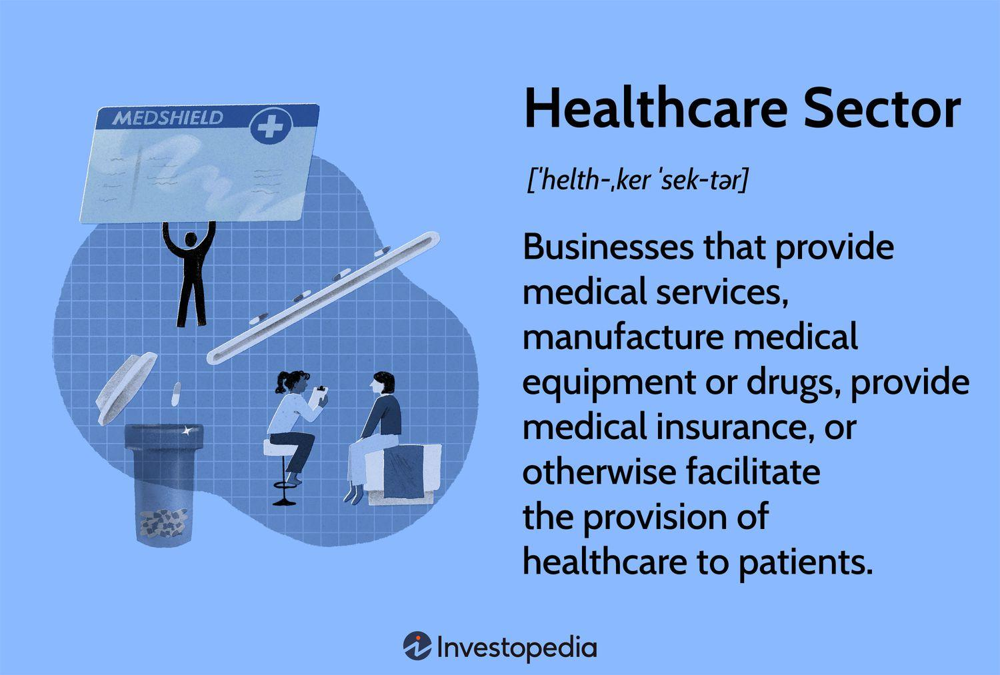

The healthcare industry plays a crucial role in the global economy, encompassing diverse sectors such as pharmaceuticals, medical devices, and healthcare facilities. It represents a significant and essential component of economic systems worldwide, influencing various facets of societal wellbeing. With rapid technological advancements, the healthcare sector is undergoing pivotal growth and transformation, which is reshaping how services are delivered and managed.

Technological innovations in areas like telemedicine, artificial intelligence, and big data analytics are driving significant changes. These developments contribute to more efficient healthcare delivery, improved patient outcomes, and enhanced operational efficiency within healthcare facilities. As a result, stakeholders in the healthcare sector, including policymakers, healthcare providers, and investors, must navigate a dynamically changing landscape.



This article aims to provide an in-depth analysis of critical statistics within the healthcare industry, highlighting sector-specific insights that underscore its economic impact. Additionally, it addresses the emergence and growing significance of algorithmic trading powered by alternative data in the healthcare domain. By examining these aspects, the article provides a comprehensive overview of the current state and future direction of the healthcare industry, emphasizing its importance within the global economy.

## Table of Contents

## Overview of the Healthcare Industry

The healthcare industry is a vast and multifaceted sector comprising a range of businesses that deliver medical services, produce medical equipment, offer medical insurance, and facilitate the provision of healthcare. This sector is crucial not only for individual health and well-being but also as a substantial component of the global economy. It plays a pivotal role in economic development and job creation. 

In many developed countries, and particularly in the United States, healthcare has become a major part of national spending. According to data from the Centers for Medicare & Medicaid Services (CMS), healthcare expenditures in the U.S. constituted about 18% of the Gross Domestic Product (GDP) in 2020. This significant share highlights the country's substantial investment in healthcare services and infrastructure, which however, does not always correspond directly with superior health outcomes when compared to other advanced economies.

The structure of the healthcare sector can be divided into several key segments:

1. **Medical Services**: This includes hospitals, clinics, outpatient care centers, and specialized service providers such as laboratories and imaging centers. These entities are responsible for direct patient care and medical procedures.

2. **Medical Equipment and Devices**: Companies in this segment develop and manufacture a broad array of products, ranging from surgical instruments and diagnostic devices to prosthetics and wearable health technology.

3. **Pharmaceuticals and Biotechnology**: This segment focuses on the development, production, and marketing of drugs and biological products, playing a crucial role in addressing both acute and chronic health conditions.

4. **Health Insurance**: Insurance organizations provide financial products that cover the costs of medical care, thereby facilitating access to healthcare services. This includes private health insurers and government programs such as Medicare and Medicaid.

5. **Healthcare IT and Analytics**: With advancements in technology, there is a significant focus on healthcare IT solutions such as electronic health records (EHRs), telemedicine, and health informatics, which enhance healthcare delivery through improved data management and analytics.

The healthcare industry's complexity and its broad scope demonstrate its integral role in supporting and advancing public health while driving innovation and economic growth. The sector's influence extends beyond physical health services to impact economic policies, employment, and demographic transitions, making it a central area for policy and investment focus.

## Key Statistics in the Healthcare Sector

Healthcare spending represents a crucial metric for understanding the sector's impact on the economy. In 2020, the United States' healthcare expenditures constituted approximately 18% of its Gross Domestic Product (GDP), highlighting the substantial financial resources devoted to maintaining and improving health services within the nation. This significant proportion underscores the emphasis placed on healthcare in the U.S., although it also raises questions regarding the correlation between high expenditure and healthcare outcomes.

Globally, the healthcare market is on an upward trajectory, projected to reach $11.9 trillion by 2025. This growth is driven by factors such as increasing global population, aging demographics, and advancements in medical technology. The expansion of healthcare services and infrastructure worldwide is a response to these driving forces, indicating a robust demand for healthcare across various regions.

Within this expansive market, specific sectors are experiencing particularly rapid growth. Telemedicine, for example, is expected to reach a market value of $185 billion by 2025. The COVID-19 pandemic accelerated the adoption of telemedicine services, as patients and healthcare providers adapted to new methods of consultation and treatment that prioritized safety and accessibility. This sector's growth is supported by improvements in digital communication technologies and increased comfort with remote healthcare solutions among the population.

Similarly, [artificial intelligence](/wiki/ai-artificial-intelligence) (AI) in healthcare is an emerging sector with significant potential. By 2025, AI in healthcare is projected to attain a market size of $19 billion. AI technologies are being increasingly integrated into healthcare systems, facilitating advancements such as predictive analytics, personalized medicine, and enhanced diagnostic accuracy. These technologies hold the promise of optimizing healthcare delivery, improving patient outcomes, and reducing costs through efficient resource utilization. 

Together, these key [statistics](/wiki/bayesian-statistics) provide a quantitative snapshot of the healthcare sector's substantial economic footprint and its evolving landscape, driven by both traditional healthcare services and innovative technological developments.

## Economic Impact and Growth Trends

The healthcare industry stands as a cornerstone of employment across global economies, consistently ranking among the largest employers. Projections indicate substantial job growth in this sector by 2029. This expansion is driven by various factors, including demographic shifts such as aging populations, which increase the demand for healthcare services.

Advancements in telehealth and AI-driven healthcare solutions are pivotal in revolutionizing the industry landscape. Telehealth, buoyed by increased connectivity and digital infrastructure, has transformed patient access to medical services, enabling remote consultations and continuous patient monitoring. As of the mid-2020s, telehealth adoption has surged, providing a viable alternative to traditional face-to-face medical consultations. This shift not only improves access to care but also reduces healthcare costs and increases patient satisfaction.

Artificial Intelligence (AI) is playing a significant role in enhancing clinical decision-making, predictive analytics, and operational efficiencies. AI algorithms are developed to assist in diagnostic processes, optimize treatment plans, and even predict patient outcomes based on large datasets. These technological shifts are creating new job roles focused on managing, implementing, and maintaining digital health solutions, thus contributing to employment growth.

There is a strong emphasis on digital health technologies, which are pivotal in delivering personalized and efficient healthcare. Personalized medicine relies on understanding unique patient profiles, achieved through digital tools that analyze a vast array of data, including genetic, environmental, and lifestyle factors. The integration of digital health technologies facilitates the tailoring of treatments to individual patient needs, resulting in improved healthcare outcomes.

The healthcare industry's trajectory towards digital integration not only supports the economic fabric through job creation but also fosters an environment of innovative growth, reshaping healthcare delivery worldwide. As the sector continues to evolve, leveraging digital advancements will remain crucial in addressing the growing demand for efficient, accessible, and personalized healthcare services.

## Role of Alternative Data in Healthcare Sector Analysis

Alternative data is increasingly transformative in the analysis of the healthcare sector, particularly in [algorithmic trading](/wiki/algorithmic-trading) strategies. Alternative data refers to non-traditional data sources, as opposed to financial statements and market prices, offering additional layers of insights into economic and market behaviors. In healthcare, this encompasses a variety of sources, such as health insurance claims, consumer health application data, prescription sales, and hospital visit records.

Health insurance claims provide a comprehensive picture of patient demographics, types of treatments rendered, and frequency of specific medical services. This valuable data helps identify trends in healthcare demand and spending patterns, influencing stock valuations, particularly in insurance and pharmaceutical sectors.

Consumer health applications, prevalent with the increasing use of smartphones and wellness gadgets, collect data on user health habits, such as physical activity levels, heart rate metrics, and dietary patterns. Such data offers real-time indications of population health trends, potentially impacting demand for specific healthcare services and products. This information contributes to anticipating shifts in market demand and consumer behavior, providing a competitive edge in investment decisions.

Prescription sales data reflects medication demand, which can forecast pharmaceutical company performance. Accurate sales estimates enable more reliable financial projections, aiding traders in making informed decisions. Prescription trends are crucial indicators of market dynamics in sectors dealing with chronic diseases or emergent health issues.

Hospital visit records serve as a robust indicator of healthcare demand, with fluctuations in visitation frequency pointing to broader public health concerns or the efficacy of outpatient care. These data points reveal shifts in healthcare delivery models and patient preferences, influencing investment strategies within the healthcare infrastructure sector.

The integration of these data types into algorithmic trading frameworks enhances the prediction of stock performance, leveraging [machine learning](/wiki/machine-learning) and data analytics. Traders utilize algorithms to identify patterns and forecast potential market movements, embedding these insights within broader investment strategies.

Given the potential of [alternative data](/wiki/best-alternative-data) in the healthcare industry, these datasets are indispensable for refining market analytics, enabling traders to respond swiftly to health-related economic shifts. As data accumulation techniques advance, so do the predictive accuracies and insights they allow, making alternative data a pivotal element in modern financial analysis.

## Algorithmic Trading in the Healthcare Sector

Algorithmic trading in the healthcare sector leverages alternative data sources to forecast market movements, optimize investment strategies, and gain a competitive edge. This approach integrates various datasets, including prescription sales and health monitoring device data, to inform trading models about pharmaceutical performance and emerging consumer health trends.

The use of prescription sales data allows traders to predict the success of pharmaceutical products. By analyzing trends in prescription volumes, traders can assess the market demand for specific medications, enabling them to make informed predictions about the financial performance of pharmaceutical companies. For example, a consistent increase in the sales of a particular drug might signal a rise in the company's stock value, prompting strategic buy decisions.

Another significant data source is health monitoring devices, which provide real-time health metrics from consumers. Data from wearable devices like fitness trackers and smartwatches offer insights into public health trends. Analysts can use this data to predict demand for healthcare services and products directly linked to prevalent health conditions. This real-time data provides a granular view into consumer health behaviors, influencing market predictions and investment strategies.

Machine learning plays a critical role in processing and analyzing these vast datasets. Advanced algorithms are capable of detecting patterns and correlations that human analysts might miss. For instance, machine learning models such as random forests or neural networks can be employed to build predictive models. These models can identify non-linear relationships and high-dimensional patterns, improving prediction accuracy.

A simple example of a machine learning model in Python to analyze such data might involve using the scikit-learn library:

```python
from sklearn.model_selection import train_test_split
from sklearn.ensemble import RandomForestRegressor
from sklearn.metrics import mean_squared_error

# Assume X, y represent historical prescription sales data and stock prices
X_train, X_test, y_train, y_test = train_test_split(X, y, test_size=0.2, random_state=42)

# Random forest model
model = RandomForestRegressor(n_estimators=100, random_state=42)
model.fit(X_train, y_train)

# Predictions
predictions = model.predict(X_test)

# Evaluation
mse = mean_squared_error(y_test, predictions)
print(f"Mean Squared Error: {mse}")
```

This code demonstrates the basic steps in training a predictive model to assess pharmaceutical stock performance based on historical sales data. The model's efficiency and accuracy lie in its ability to learn complex patterns, making it a powerful asset in algorithmic trading. 

Ultimately, algorithmic trading in the healthcare sector is enriched by these alternative data sources and analytics techniques, offering investors more precise tools to navigate the dynamic landscape of healthcare markets.

## Challenges and Ethical Considerations

Privacy and ethical considerations are paramount due to the sensitive nature of healthcare data. As healthcare data increasingly integrates with algorithmic trading, safeguarding this information becomes crucial. Healthcare data often contains personally identifiable information (PII), which requires rigorous protection measures to prevent unauthorized access and ensure confidentiality.

Compliance with regulations such as the Health Insurance Portability and Accountability Act (HIPAA) in the United States and the General Data Protection Regulation (GDPR) in the European Union is essential. HIPAA sets the standard for protecting sensitive patient data in the U.S., mandating the protection of health information. Non-compliance can result in severe penalties, including fines and legal actions. Similarly, GDPR demands strict data management protocols and imposes heavy fines for breaches, thereby reinforcing the importance of securing healthcare data.

Data quality issues pose another significant challenge. Incomplete, inaccurate, or outdated data can heavily impact analysis outcomes, leading to erroneous predictions and inefficient decision-making processes in algorithmic trading. Ensuring data accuracy and reliability is crucial for meaningful insights and optimal performance. Advancements in data cleaning techniques and robust data validation processes are needed to overcome these issues.

Moreover, the complexities involved in analyzing healthcare data necessitate advanced analytics capabilities. The deployment of machine learning algorithms to process and interpret large, diverse datasets demands sophisticated technical infrastructure and expertise. Building effective models requires a comprehensive understanding of both the healthcare environment and data science techniques, which can be a resource-intensive task. Developing such capabilities involves investment in technology and continuous skill enhancement.

Ethical considerations extend beyond data protection. The use of healthcare data for financial purposes raises questions about the exploitation of sensitive information for profit maximization. Balancing commercial interests with ethical responsibility is vital to maintain public trust and respect patient privacy. Adopting transparency in data usage policies and engaging in open dialogue with stakeholders can help address these ethical dilemmas.

In conclusion, as the integration of healthcare data into algorithmic trading grows, addressing privacy and ethical challenges is critical. Compliance with stringent regulations, ensuring high data quality, and deploying advanced analytics will be pivotal in navigating these challenges, safeguarding sensitive information, and fostering ethical investment practices.

## Future Implications and Conclusion

The future of algorithmic trading is poised for significant transformation, driven by the integration of alternative data, notably from the healthcare sector. As technological advancements continue to evolve, the accuracy and predictive capabilities of these trading models are expected to improve, providing substantial competitive advantages to those who can effectively harness this data.

Alternative data sources, such as health insurance claims, consumer health application data, and prescription sale records, provide a rich dataset that can be leveraged to forecast trends and market behaviors with greater precision. The utilization of machine learning algorithms enables the extraction of actionable insights from these vast and complex datasets, enhancing the capability to predict market movements with higher accuracy.

Incorporating advanced technologies, such as artificial intelligence and machine learning, can significantly bolster data processing and analysis efforts. These technologies can identify patterns and correlations that are not immediately apparent through traditional data analysis methods. An example of a simple data processing technique could be the following Python snippet that employs a machine learning model to predict stock trends based on healthcare data:

```python
from sklearn.model_selection import train_test_split
from sklearn.ensemble import RandomForestRegressor
import pandas as pd

# Assume `healthcare_data` is a DataFrame with relevant features
# and `stock_trends` is the target variable.
X_train, X_test, y_train, y_test = train_test_split(healthcare_data, stock_trends, test_size=0.3, random_state=42)

# RandomForestRegressor to predict stock trends
model = RandomForestRegressor(n_estimators=100, random_state=42)
model.fit(X_train, y_train)

predictions = model.predict(X_test)
# Evaluate model accuracy using appropriate metrics
```

While the opportunities presented by the integration of alternative data are vast, the ethical use of such data cannot be overstated. The sensitive nature of healthcare data necessitates rigorous adherence to privacy laws and regulations, including the Health Insurance Portability and Accountability Act (HIPAA) and the General Data Protection Regulation (GDPR). Ensuring compliance with these regulations is essential for maintaining public trust and avoiding legal repercussions.

The challenges associated with data quality and the need for sophisticated analytics also pose significant hurdles. High-quality data is crucial for accurate model predictions, and organizations must invest in the development of advanced analytics capabilities to clean, process, and analyze these datasets effectively.

In conclusion, the successful integration of healthcare-related alternative data into algorithmic trading strategies promises to revolutionize financial markets, offering enhanced predictive precision and competitive edge. However, this cannot be at the expense of ethical standards and regulatory compliance, which are crucial for ensuring the sustainable and responsible advancement of this burgeoning field.

## References & Further Reading

[1]: Centers for Medicare & Medicaid Services (CMS). ["National Health Expenditure Data."](https://www.cms.gov/data-research/statistics-trends-and-reports/national-health-expenditure-data) 

[2]: ["Advances in Financial Machine Learning"](https://www.amazon.com/Advances-Financial-Machine-Learning-Marcos/dp/1119482089) by Marcos Lopez de Prado

[3]: Minh, T. H., Mehtab, S., & Ahmed, J. (2020). ["An Introduction to Algorithmic Trading in the Healthcare Sector."](https://www.sciencedirect.com/science/article/pii/S0360319924041995) Asia-Pacific Financial Markets.

[4]: ["Machine Learning for Algorithmic Trading"](https://github.com/stefan-jansen/machine-learning-for-trading) by Stefan Jansen

[5]: Ghassemi, M., Naumann, T., Schulam, P., Beam, A. L., & Chen, I. Y. (2020). ["A Review of Challenges and Opportunities in Machine Learning for Health."](https://pubmed.ncbi.nlm.nih.gov/32477638/) Journal of the American Medical Informatics Association.