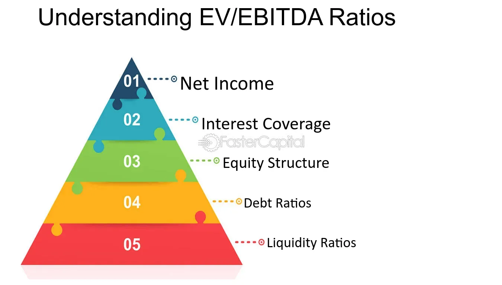

## Table of Contents

## What is EV/EBITDA and why is it important?

EV/EBITDA stands for Enterprise Value to Earnings Before Interest, Taxes, Depreciation, and Amortization. It's a way to figure out how much a company is worth compared to how much money it makes before taking away some expenses. Imagine you want to buy a business. EV/EBITDA helps you understand if the price you're paying for the whole business (that's the Enterprise Value) is a good deal compared to the profits the business makes (that's the EBITDA).

This ratio is important because it gives a clearer picture of a company's value, especially when comparing businesses in the same industry. It's useful because it ignores things like how a company is financed or the different ways companies might depreciate their assets, which can make comparisons tricky. By using EV/EBITDA, investors and analysts can see if a company is undervalued or overvalued, helping them make smarter decisions about buying or selling the company's stock or the whole business.

## How is the EV/EBITDA ratio calculated?

To calculate the EV/EBITDA ratio, you first need to find the Enterprise Value (EV) of a company. The Enterprise Value is like the total price tag of a business if you were to buy it outright. You add up the market value of all the company's shares, its debt, and any minority interest, then subtract any cash the company has on hand. This gives you the total cost to buy the business, including taking over its debts but also getting its cash.

Next, you need the EBITDA, which stands for Earnings Before Interest, Taxes, Depreciation, and Amortization. This is a way to look at a company's profits before taking away certain expenses. You find this number on the company's income statement or calculate it by starting with the net income, then adding back interest, taxes, depreciation, and amortization. Once you have both the EV and the EBITDA, you divide the Enterprise Value by the EBITDA. This gives you the EV/EBITDA ratio, which tells you how many years it would take for the company's EBITDA to equal the total value of the business.

## What does a healthy EV/EBITDA ratio look like for different industries?

A healthy EV/EBITDA ratio can vary a lot depending on the industry. For industries like tech or software, where companies can grow fast and have high profits, a healthy EV/EBITDA might be higher, often between 10 and 20. These industries are seen as having good future growth, so investors are okay with paying more for them. On the other hand, industries like manufacturing or utilities, which might not grow as quickly and have more stable but lower profits, usually have lower EV/EBITDA ratios, often between 6 and 10. These industries are more about steady income and less about fast growth.

It's also important to know that what's considered a healthy ratio can change over time and depends on the economy. During good economic times, investors might be willing to pay more for companies, so EV/EBITDA ratios could be higher across the board. But in tough economic times, investors might want safer investments, leading to lower ratios. So, when looking at what's a healthy EV/EBITDA ratio, it's good to compare it with other companies in the same industry and look at how the economy is doing.

## How can EV/EBITDA be used to compare companies within the same sector?

EV/EBITDA is a useful tool for comparing companies in the same sector because it gives a clear picture of their value relative to their earnings. When you look at the EV/EBITDA ratios of different companies in the same industry, you can see which ones might be a good deal. For example, if one company has a much lower EV/EBITDA ratio than its competitors, it might mean that the company is undervalued, and could be a good investment. On the other hand, a company with a very high EV/EBITDA might be overvalued, suggesting it could be riskier to invest in.

It's important to remember that while EV/EBITDA is helpful, it's just one piece of the puzzle. You should also look at other things like the company's growth potential, how much debt it has, and its overall financial health. By comparing the EV/EBITDA ratios along with these other factors, you can get a better idea of which companies in the sector are the best investments. This way, you can make smarter choices about where to put your money.

## What are the limitations of using EV/EBITDA as a valuation metric?

One big problem with using EV/EBITDA is that it doesn't take into account how much a company spends on things like new equipment or buildings, which can be really important for some businesses. These costs, called capital expenditures, can make a big difference in how much money a company actually has left over after paying for everything. If a company has to spend a lot on new stuff, its EV/EBITDA might look good, but it might not have as much cash as you think.

Another issue is that EV/EBITDA can be easy to mess with. Companies can change how they report their earnings to make their EV/EBITDA look better. For example, they might play around with how they calculate depreciation or amortization, which can make their earnings look higher than they really are. This means that you have to be careful and look at other things too, not just the EV/EBITDA number.

Lastly, EV/EBITDA doesn't tell you about a company's debt or how it's financed. Some companies might look good on an EV/EBITDA basis but have a lot of debt, which can be risky. So, while EV/EBITDA is a useful tool, it's important to use it along with other ways of looking at a company's value to get the full picture.

## How does EV/EBITDA differ from other valuation metrics like P/E ratio?

EV/EBITDA and P/E ratio are both ways to figure out if a company is a good buy, but they look at different things. EV/EBITDA looks at the whole value of the company, including its debt and cash, compared to its earnings before taking away interest, taxes, depreciation, and amortization. This gives you a bigger picture of the company's value, especially useful when comparing companies with different amounts of debt or different ways of handling their assets. On the other hand, the P/E ratio, or Price-to-Earnings ratio, just looks at the company's stock price compared to its net income. It's simpler but doesn't account for the company's debt or how it spends money on things like new equipment.

The main difference between EV/EBITDA and P/E ratio is that EV/EBITDA gives you a more complete view of a company's value because it includes things like debt and cash. This makes it better for comparing companies within the same industry, especially when those companies have different financial structures. The P/E ratio is easier to calculate and understand, but it can miss important details about a company's financial health. So, while the P/E ratio is good for a quick look at a company's value, EV/EBITDA is often better for a deeper analysis.

## Can EV/EBITDA be used effectively for companies with negative EBITDA?

Using EV/EBITDA for companies with negative EBITDA can be tricky. When a company has a negative EBITDA, it means it's not making enough money to cover its basic operating costs before even thinking about interest, taxes, and other expenses. In this case, the EV/EBITDA ratio can't be calculated in the usual way because you can't divide by a negative number. It doesn't give you a useful number to compare with other companies, so it's not very helpful for figuring out if the company is a good buy.

However, even if you can't use EV/EBITDA directly, it doesn't mean you can't look at a company with negative EBITDA at all. You might want to look at other things like how much cash the company has, how much debt it has, and what its plans are for turning things around. These other pieces of information can help you understand if the company might start making money again in the future. So, while EV/EBITDA isn't the best tool for companies with negative EBITDA, there are still other ways to figure out if they could be a good investment.

## How do economic cycles affect what is considered a healthy EV/EBITDA ratio?

Economic cycles can change what people think is a healthy EV/EBITDA ratio. During good economic times, when businesses are growing and making more money, investors might be willing to pay more for companies. This means that a higher EV/EBITDA ratio might still be seen as healthy because everyone is expecting the good times to keep going. For example, in a booming economy, an EV/EBITDA ratio of 15 or even higher might be okay for some industries because investors believe the companies will keep growing and making more money.

On the other hand, during tough economic times, when businesses are struggling and making less money, investors might want to be more careful with their money. They might look for safer investments and be less willing to pay a lot for companies. This means that a lower EV/EBITDA ratio might be seen as healthier because it shows the company is a better deal. For example, in a recession, an EV/EBITDA ratio of 8 might be considered healthy because it suggests the company is a good value even when times are hard.

## What role does debt play in interpreting EV/EBITDA ratios?

Debt plays a big role in understanding EV/EBITDA ratios. When you calculate the Enterprise Value (EV), you add the company's debt to its market value. This means that a company with a lot of debt will have a higher EV, which can make its EV/EBITDA ratio look higher too. If two companies make the same amount of money (EBITDA), but one has more debt, that company will have a higher EV/EBITDA ratio. This can make it seem like the company with more debt is more expensive or overvalued compared to the one with less debt.

Because of this, it's important to look at a company's debt when you're using EV/EBITDA to decide if it's a good investment. A high EV/EBITDA ratio might not always mean a company is overvalued; it could just mean the company has a lot of debt. So, you need to check the company's debt levels and see if it can handle paying it back. By looking at both the EV/EBITDA ratio and the company's debt, you can get a better idea of whether the company is really a good deal or not.

## How can historical EV/EBITDA ratios inform future investment decisions?

Looking at a company's historical EV/EBITDA ratios can help you make better choices about investing in the future. By seeing how the ratio has changed over time, you can spot patterns or trends. For example, if a company's EV/EBITDA ratio has been going down, it might mean the company is getting cheaper compared to its earnings. This could be a sign that it's a good time to buy the stock because it might be undervalued. On the other hand, if the ratio has been going up a lot, it might mean the company is getting more expensive, which could be a warning sign to be careful or sell.

You can also compare a company's current EV/EBITDA ratio with its historical average to see if it's a good deal right now. If the current ratio is lower than the historical average, it might be a good time to invest because the company could be undervalued. But if the current ratio is much higher than the historical average, it might be overvalued, and you might want to wait for a better price. By using historical EV/EBITDA ratios, you can make smarter decisions about when to buy or sell a company's stock.

## What are some advanced adjustments one might make to EV/EBITDA for a more accurate valuation?

When you want to make EV/EBITDA more accurate, you might need to make some changes to the numbers you use. One big change is to look at the company's capital expenditures (CapEx). These are the costs for things like new equipment or buildings. Since EV/EBITDA doesn't take these costs into account, you can make it more accurate by subtracting the CapEx from the EBITDA. This gives you a better idea of how much money the company really has left over after paying for everything it needs to keep running.

Another change you might make is to adjust for any one-time costs or gains that show up in the EBITDA. These can make the numbers look better or worse than they really are. By taking out these one-time things, you get a clearer picture of the company's regular earnings. Also, if the company has a lot of debt, you might want to look at how much it costs them to pay the interest on that debt. Adding the interest expense back into the EBITDA can give you a better sense of the company's ability to handle its debt. By making these adjustments, you can get a more accurate idea of whether a company is a good investment.

## How do global market conditions influence the interpretation of EV/EBITDA ratios across different regions?

Global market conditions can really change how people see EV/EBITDA ratios in different parts of the world. If the economy is doing well in one region, like Europe, investors might be willing to pay more for companies there. This means that a higher EV/EBITDA ratio might still be seen as okay because everyone expects the good times to keep going. But if another region, like Asia, is going through a tough time with slower growth or more uncertainty, investors might want to be more careful. They might look for lower EV/EBITDA ratios to find safer investments, even if the companies are in the same industry.

Also, things like currency values and interest rates can make a big difference. If the currency in one country gets weaker, it can make companies there look cheaper to foreign investors, which might make their EV/EBITDA ratios seem more attractive. On the other hand, if interest rates go up in a region, it can make borrowing more expensive for companies, which might make investors less willing to pay high EV/EBITDA ratios. So, when looking at EV/EBITDA ratios across different regions, it's important to think about what's happening in the global economy and how it might affect each place differently.

## What is Understanding Enterprise Value (EV)?

Enterprise Value (EV) serves as a comprehensive indicator of a company's total value by accounting for various financial components such as market capitalization, debt, and cash reserves. Unlike the market cap, which only factors in the value of a company's equity, EV provides a more holistic view by including both equity and debt, making it a crucial tool for assessing a company's true worth. This broad perspective is particularly beneficial in scenarios such as mergers and acquisitions, where understanding the entire financial footprint of a company is necessary.

The calculation of Enterprise Value is straightforward yet incorporates several key financial elements. The formula for EV is expressed as:

$$
\text{EV} = \text{Market Capitalization} + \text{Total Debt} - \text{Cash and Cash Equivalents}
$$

**Market Capitalization** is the total market value of a company's outstanding shares of stock. This is calculated by multiplying the company's share price by its total number of outstanding shares. However, using market cap alone can be misleading, as it does not account for the debt burden a company carries or the uninvested cash lying on its books.

**Total Debt** includes all of a company's outstanding short and long-term obligations. This is added to the market cap to reflect the enterprise's obligations to creditors. Debt becomes particularly relevant in enterprise value as it must be taken into consideration when analyzing takeovers or buyouts, where acquiring entities will assume the debt positions of the target firm.

**Cash and Cash Equivalents** are subtracted from the sum of market capitalization and total debt because these liquid assets can be used to pay down debt immediately, thereby reducing the actual price a purchaser must pay to acquire the firm. Cash equivalents may include assets like treasury bills and commercial paper, which can be quickly converted into cash.

The comprehensive nature of EV makes it a favorite among financial analysts for a more accurate assessment of company valuation, transcending the limitations of market capitalization. This valuation method aligns the interests of equity investors with those of debt holders, thereby providing an inclusive metric for evaluating financial health and making it especially useful in comparing companies with different capital structures.

## What is the meaning of EBITDA and how can it be decoded?

EBITDA, an acronym for Earnings Before Interest, Taxes, Depreciation, and Amortization, serves as a significant indicator of a company's operational efficiency by isolating earnings derived from core business activities. It provides a clearer understanding of a firm's profitability by eliminating the effects of financial and accounting decisions, such as debt structure, tax strategies, and the impact of non-cash charges like depreciation and amortization.

Calculated from a company's income statement, EBITDA allows investors and analysts to gauge a company's financial performance in terms of operational efficiency. The formula for EBITDA is expressed as:

$$
\text{EBITDA} = \text{Net Income} + \text{Interest} + \text{Taxes} + \text{Depreciation} + \text{Amortization}
$$

This formula strips away variables that do not reflect a company's day-to-day operations, presenting a clearer picture of its core profitability. By excluding interest, EBITDA neutralizes the effects of different financing structures, while the exclusion of taxes removes the influence of varied tax jurisdictions. Similarly, depreciation and amortization, which are non-cash charges affected by historical investments and accounting practices, are also excluded to present a purer measure of operational success.

EBITDA's emphasis on operational performance makes it an invaluable metric for comparing companies within the same industry, regardless of their capital structures or geographical locations. This feature is particularly useful for industries with significant capital investments, as it provides an unbiased view of corporate performance without the distortions introduced by differing investments or financial management strategies.

## What is the EV/EBITDA Multiple Explained?

The EV/EBITDA ratio is a widely utilized valuation metric, instrumental for comparing a company’s total value—including its debt—with its operational cash earnings. Expressed mathematically, the EV/EBITDA ratio is calculated as:

$$
\text{EV/EBITDA} = \frac{\text{Enterprise Value (EV)}}{\text{EBITDA}}
$$

This ratio effectively represents how many years it would take for an investor to recover the purchase price of a company through its EBITDA, assuming profitability remains constant. Its popularity stems largely from its comprehensive nature, which incorporates both equity and debt, thereby offering a holistic view of a company's valuation.

In capital-intensive industries, such as energy, telecommunications, and manufacturing, the EV/EBITDA ratio remains particularly useful. These sectors often involve significant capital expenditures, which can obscure true valuation when relying solely on traditional metrics like the Price-to-Earnings (P/E) ratio. The P/E ratio may not fully capture a company's value because it does not account for debt or the impact of different depreciation methods.

A key appeal of the EV/EBITDA ratio is that it neutralizes the effects of capital structure, providing a clearer evaluation by excluding interest, taxes, and non-cash accounting variables like depreciation and amortization. This neutrality is especially advantageous when comparing companies across the same industry that may operate under different financial structures. 

A lower EV/EBITDA ratio often suggests that a company might be undervalued compared to its peers, potentially representing a more attractive investment opportunity. For instance, if two companies within the same industry present significantly differing ratios, the firm with the lower EV/EBITDA could be undervalued given comparable growth prospects and risk profiles. Investors typically find such companies more appealing, particularly if the broader market sentiment does not reflect the intrinsic value suggested by the ratio.

In contrast, a higher EV/EBITDA ratio may indicate that a company is overvalued, suggesting that it might be trading above its intrinsic value. Investors should approach such companies with caution, as the high ratio could reflect either market optimism or unidentified risks that could impact future performance.

In summary, the EV/EBITDA ratio serves as a critical tool for evaluating investment opportunities—particularly within heavily-capitalized sectors—by offering a refined, balanced view of company valuation.

## References & Further Reading

[1]: Aswath Damodaran. ["Investment Valuation: Tools and Techniques for Determining the Value of Any Asset."](https://www.amazon.com/Investment-Valuation-Tools-Techniques-Determining/dp/111801152X) John Wiley & Sons, 3rd Edition, 2012.

[2]: Michael C. Thomsett. ["The Mathematics of Options: Quantifying Risk and Value with Financial Derivatives."](https://dl.icdst.org/pdfs/files3/fca2629b88907d4e91acebbffae02257.pdf) University of North Carolina Press, 2020.

[3]: Stewart C. Myers. ["Principles of Corporate Finance."](https://www.mheducation.com/highered/product/Principles-of-Corporate-Finance-Brealey.html) McGraw-Hill Education, 12th Edition, 2016.

[4]: Robert G. Eccles, Timothy Youmans. ["Materiality in Corporate Governance: The Statement of Significant Audiences and Materiality."](https://papers.ssrn.com/sol3/papers.cfm?abstract_id=2654199) Harvard Business Review, 2015.

[5]: Cartea, Alvaro, Jaimungal, Sebastian, & Penalva, Jose. ["Algorithmic and High-Frequency Trading."](https://assets.cambridge.org/97811070/91146/frontmatter/9781107091146_frontmatter.pdf) Cambridge University Press, 2015.