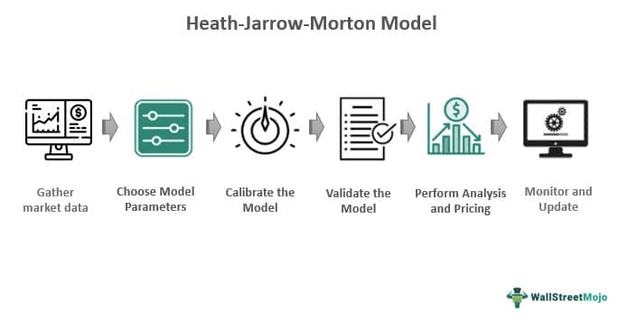

The Heath-Jarrow-Morton (HJM) Model represents a pivotal framework in financial mathematics, particularly in the modeling of forward interest rates. This model is essential for the pricing of interest rate derivatives and other financial securities. Unlike traditional interest rate models that focus on short rates or instantaneous forward rates, the HJM Model provides a comprehensive approach by describing the entire forward rate curve. This approach allows for a more robust and detailed understanding of interest rate dynamics, which is crucial for accurately pricing complex financial instruments.

The defining feature of the HJM Model is its flexibility, achieved through the use of stochastic processes to model the evolution of interest rates over time. By employing stochastic differential equations, the model captures the random behavior of future interest rates under various economic conditions. This stochastic nature is fundamental for understanding and predicting the future behavior of interest rates, thereby supporting effective pricing and risk management strategies.



The model's importance extends to analysts, arbitrageurs, and institutions engaged in algorithmic trading and risk management. Analysts leverage the model to gain insights into future interest rate fluctuations, while arbitrageurs utilize it to identify and exploit discrepancies in pricing. For institutions, the HJM Model is instrumental in implementing risk management strategies, hedging interest rate exposure, and developing algorithmic trading models that rely on projected interest rate movements. Consequently, the HJM Model is not only a theoretical construct but also a practical tool that informs real-world financial decision-making.

## Table of Contents

## Understanding the Heath-Jarrow-Morton Model

The Heath-Jarrow-Morton (HJM) Model focuses on the entire forward rate curve, which represents the interest rates at which an entity can borrow money for different maturities. Instead of modeling a single rate, it describes the behavior of forward rates as a whole, capturing the dynamics of the entire curve. This approach is beneficial because it aligns more closely with the reality of financial markets, where interest rates vary across different maturities.

The model utilizes differential equations, specifically stochastic differential equations, to incorporate randomness into the evolution of forward rates. These equations allow the HJM Model to simulate various market conditions and predict future movements of interest rates. The general form of the equation used in the HJM Model can be expressed as:

$$
df(t,T) = \alpha(t,T)dt + \sigma(t,T)dW_t
$$

where $f(t,T)$ denotes the forward rate at time $t$ for a future time $T$, $\alpha(t,T)$ represents the drift term, $\sigma(t,T)$ denotes the volatility term, and $dW_t$ is a Brownian motion term introducing randomness.

A crucial aspect of the HJM Model is ensuring no [arbitrage](/wiki/arbitrage) opportunities exist. Arbitrage refers to the practice of profiting from differences in the price of an asset in different markets, which, if present, indicates inefficiencies. The model achieves arbitrage-free conditions through a drift condition, derived from a no-arbitrage argument. Mathematically, this condition is given by:

$$
\alpha(t,T) = \sigma(t,T) \int_t^T \sigma(t,u)du
$$

This drift condition ensures that the expected changes in forward rates are adjusted so that arbitrage opportunities are eliminated under the model's assumptions.

Understanding the complexity of the HJM Model involves grappling with advanced mathematical structures designed to maintain robustness in various market environments. This robust framework makes it invaluable for accurately modeling and predicting the evolution of interest rates over time.

## Mathematical Formulation and Theoretical Foundations

The Heath-Jarrow-Morton (HJM) Model provides a comprehensive approach to modeling forward interest rates through stochastic differential equations (SDEs). A primary feature of the model is its ability to describe the evolution of the entire yield curve, rather than focusing on individual rates. This method is crucial for ensuring the accurate representation of [interest rate](/wiki/interest-rate-trading-strategies) behaviors over time.

At the core of the HJM Model is the formulation of forward rates as stochastic processes. These are typically represented by the following SDE:

$$
df(t,T) = \alpha(t,T)dt + \sigma(t,T)dW(t)
$$

where:
- $f(t,T)$ denotes the instantaneous forward rate at time $t$ for a contract maturing at time $T$.
- $\alpha(t,T)$ is the drift term which accounts for the expected change in forward rates.
- $\sigma(t,T)$ represents the volatility term, signifying the uncertainty or variance in forward rates.
- $W(t)$ is a standard Brownian motion, embodying the random fluctuations typical in financial markets.

A critical feature of the HJM Model is the no-arbitrage condition, which is ensured by its drift condition. For the model to remain arbitrage-free, the drift term $\alpha(t,T)$ must adhere to the following relationship:

$$
\alpha(t,T) = \sigma(t,T) \int_{t}^{T} \sigma(t,u) \, du
$$

This condition ensures that the model's pricing is consistent with market conditions and that no arbitrage opportunities can arise, which is fundamental for maintaining market equilibrium.

The incorporation of Brownian motion into the HJM framework is vital as it captures the random walk behavior of financial markets. Brownian motion provides a robust mathematical tool for simulating future paths of interest rates. This stochastic process allows the HJM Model to account for the inherent randomness and [volatility](/wiki/volatility-trading-strategies) observed in financial markets, which can significantly influence the pricing of interest rate derivatives and other related securities.

Overall, the mathematical foundations of the HJM Model are rooted in its ability to balance complexity with practical application. By using SDEs with drift and volatility components, the model facilitates the accurate prediction and pricing of future interest rate movements, thereby playing a critical role in the fields of [algorithmic trading](/wiki/algorithmic-trading), risk management, and financial engineering.

## Applications in Financial Modeling

The Heath-Jarrow-Morton (HJM) Model serves instrumental roles in financial modeling, particularly in the pricing of interest rate derivatives like swaps and options. Swaps, being derivative contracts wherein two parties exchange financial instruments, often involve cash flows calculated on different interest rate benchmarks. Options, on the other hand, confer rights (but not obligation) to buy or sell an underlying asset at a specified strike price. The HJM Model facilitates the accurate pricing of these derivatives by modeling how forward interest rates evolve over time, thus assessing the potential future cash flows.

For risk management purposes, the HJM Model helps institutions manage interest rate risks inherent in their portfolios. By simulating various interest rate scenarios, the model enables analysts to assess potential changes in portfolio value due to interest rate fluctuations. Risk managers use these insights to devise hedging strategies that mitigate undesirable exposures. The model's ability to highlight risk factors across different future time periods enhances the accuracy of risk assessments.

Algorithmic traders leverage the HJM Model to design automated trading strategies based on projected movements in interest rates. These traders craft algorithms that execute trades when specific criteria, derived from HJM-based projections, are met. By using stochastic differential equations to model interest rate paths, they can anticipate market trends and adjust their trading positions accordingly. Python, with its robust libraries for numerical and scientific computations, is often employed to implement such strategies.

Below is a basic Python snippet illustrating how one might begin to implement a stochastic simulation based on the HJM framework:

```python
import numpy as np

# Parameters
n_paths = 1000
n_steps = 250
dt = 1/250
volatility = 0.01
initial_rate = 0.03

# Simulation of forward rates
def simulate_hjm(n_paths, n_steps, dt, volatility, initial_rate):
    paths = np.zeros((n_steps, n_paths))
    paths[0] = initial_rate
    for t in range(1, n_steps):
        z = np.random.normal(0, 1, n_paths)
        dr = volatility * np.sqrt(dt) * z
        paths[t] = paths[t-1] + dr
    return paths

# Generate simulated paths
forward_rate_paths = simulate_hjm(n_paths, n_steps, dt, volatility, initial_rate)
```

This script simulates forward rate paths using a basic HJM model with constant volatility. While simplistic, such simulations can provide initial insights into the potential movements of interest rates, thereby informing decisions related to pricing, risk management, and algorithmic trading strategies.

## Advantages and Limitations of the HJM Model

The Heath-Jarrow-Morton (HJM) Model is lauded for its comprehensive coverage of entire yield curves rather than just isolated interest rates. This comprehensive approach affords the model substantial flexibility, particularly regarding the incorporation of various volatility structures. This flexibility is pivotal for accurately capturing the dynamic nature of interest rate movements over time. By modeling the entire forward rate curve, the HJM Model allows for the consideration of numerous factors that affect interest rate dynamics, offering a holistic and adaptable framework. 

However, the complexity inherent in the HJM Model presents notable challenges. The model’s extensive structure makes it computationally intensive, meaning significant computational resources are often necessary for processing and implementation. This complexity is partly due to the model’s reliance on solving stochastic differential equations that describe forward rates’ evolution. Furthermore, the sensitivity of the model to parameter specifications adds another layer of complexity. Accurate parameter estimation is critical, as any mis-specifications can result in significant inaccuracies in pricing and risk assessment.

The calibration of the HJM Model to current market data is another challenge, often necessitating sophisticated mathematical techniques and advanced computational tools. Calibration involves adjusting the model parameters so that the model outputs are consistent with observed market prices. Given the intricate nature of financial markets, achieving a high level of accuracy in this aspect is demanding. This makes the model less accessible to those lacking the requisite computational expertise or resources.

While the flexibility and comprehensive nature of the HJM Model are advantageous, they require balancing the complexity and computational demands involved in its application. This necessitates expertise in both financial theory and computational methods, underscoring the model’s utility primarily for large institutions and specialized financial analysts.

## Extensions and Variants

Several extensions and variants of the Heath-Jarrow-Morton (HJM) Model have been developed to address the nuanced demands of financial markets and to enhance modeling precision. Among these, the Libor Market Model (LMM) stands out as a notable adaptation. The LMM, also known as the Brace-Gatarek-Musiela (BGM) model, diverges from the traditional HJM focus by modeling discrete forward rates instead of the continuous forward rate curve. This approach aligns more closely with market-traded instruments like caps, floors, and swaptions, improving accuracy in pricing and risk management of these derivatives. 

In addition to the LMM, multi-[factor](/wiki/factor-investing) models have emerged to capture more intricate market dynamics. These models incorporate multiple sources of risk and allow for varying levels of volatility across different maturities. This capability is particularly useful for modeling phenomena such as volatility smiles, where implied volatilities vary with strike prices and maturities. Multi-factor models enable a more detailed representation of the term structure of interest rates and their volatility, providing more robust tools for managing complex financial derivatives and risk exposures.

These variants of the HJM model offer tailored approaches suited to specific modeling needs and market conditions. They extend the flexibility and usability of the original framework, allowing institutions to adapt to rapidly changing market environments and meet specific strategic objectives in trading, hedging, and risk management. The development of these extensions reflects the ongoing evolution in financial modeling techniques, seeking to balance theoretical rigor with practical applicability in financial markets.

## Conclusion

The Heath-Jarrow-Morton (HJM) Model continues to hold a crucial position in financial engineering and mathematical modeling, predominantly due to its comprehensive nature in addressing the evolution of interest rates. Despite its inherent complexities, the HJM model provides an essential framework for capturing the dynamics of yield curves, affording analysts and financial institutions the ability to model and forecast forward interest rates efficiently. By incorporating stochastic processes to describe the random nature of interest rate movements, the model ensures robust simulations and accurate pricing of financial derivatives such as swaps and options.

For financial institutions and traders, the HJM model remains a vital tool in the domains of pricing, portfolio management, and risk mitigation. Its flexibility enables the tailoring of risk management strategies, allowing these entities to hedge against interest rate risks effectively. Importantly, the HJM model's ability to integrate multiple risk factors into a single, cohesive framework enhances decision-making processes, supporting the development of automated trading strategies that capitalize on projected market movements.

Despite challenges related to computational intensity and parameter calibration, the adaptability and robustness of the HJM model make it indispensable in the financial industry. Its enduring relevance reflects its capacity to evolve with market conditions, addressing the complex needs of modern financial markets and safeguarding against potential arbitrage opportunities by adhering to rigorous no-arbitrage conditions. Consequently, the HJM Model remains an invaluable resource in financial analysis and strategy formulation, underpinning the sophistication of contemporary financial modeling practices.

## References & Further Reading

[1]: Heath, D., Jarrow, R., & Morton, A. (1992). ["Bond pricing and the term structure of interest rates: A new methodology for contingent claims valuation."](https://www.jstor.org/stable/2951677?newaccount=true) Econometrica: Journal of the Econometric Society, 60(1), 77-105.

[2]: ["Interest Rate Models - Theory and Practice: With Smile, Inflation, and Credit"](https://link.springer.com/book/10.1007/978-3-540-34604-3) by Damiano Brigo and Fabio Mercurio

[3]: Jamshidian, F. (1997). ["LIBOR and swap market models and measures."](https://link.springer.com/article/10.1007/s007800050026) Finance and Stochastics, 1(4), 293-330.

[4]: Glasserman, P. (2004). ["Monte Carlo Methods in Financial Engineering."](https://link.springer.com/book/10.1007/978-0-387-21617-1) Springer.

[5]: Rebonato, R. (2002). ["Modern Pricing of Interest-Rate Derivatives: The LIBOR Market Model and Beyond."](https://www.jstor.org/stable/j.ctt7rpkk) Princeton University Press.