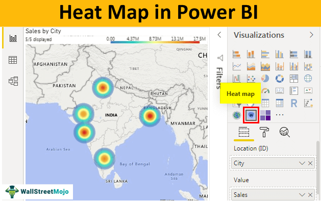

## Table of Contents

## What is a heatmap?

A heatmap is a type of chart that uses colors to show data. It is like a map where different colors represent different values. For example, darker colors might show higher numbers, and lighter colors might show lower numbers. Heatmaps are often used to show where people look on a website or how temperatures change over an area.

Heatmaps can be very useful for understanding patterns. For instance, in a store, a heatmap can show which areas customers visit the most. This helps store owners know where to put popular items. On a website, a heatmap can show which parts people click on the most. This helps website owners make their site better by moving important things to where people look.

## How does a heatmap work?

A heatmap works by using colors to show different levels of data. Imagine a grid where each square can be a different color. The color of each square tells you something about the data it represents. For example, if you're looking at a heatmap of website clicks, a dark red square might mean a lot of clicks, while a light yellow square might mean fewer clicks. The colors help you see patterns quickly without having to read numbers.

To make a heatmap, you start with your data, like numbers or measurements. Then, you decide on a color scale. This scale goes from one color to another, like from blue to red. You assign colors to your data based on this scale. If a number is high, it gets a darker color. If it's low, it gets a lighter color. Once all the data is colored, you put it on a grid or map. This finished heatmap shows you at a glance where the high and low values are, making it easy to understand the data.

## What are the common uses of heatmaps?

Heatmaps are often used to understand how people use websites. They show where people click, move their mouse, or look on a page. This helps website owners see what parts of their site are popular and what parts are ignored. For example, if a heatmap shows that people mostly click on the top left corner, the owner might put important information there.

Heatmaps are also used in stores to see where customers go. By tracking where people walk, store owners can see busy and quiet areas. This helps them decide where to place products. If a heatmap shows that many people pass by a certain spot, that could be a good place for a new display.

In other areas, heatmaps help show things like temperature changes or population density. For example, a weather heatmap can show which areas are hot or cold. A city heatmap can show where a lot of people live. These heatmaps help people make decisions based on clear, visual data.

## Can you explain the different types of heatmaps?

There are different types of heatmaps, each used for different purposes. One common type is the **click heatmap**, which shows where people click on a webpage. This helps website owners understand what parts of their site are interesting to visitors. Another type is the **scroll heatmap**, which shows how far down a page people scroll. This can tell website owners if people are reading all the content or if they stop halfway.

Another type is the **eye-tracking heatmap**, which shows where people look on a screen. This is useful for figuring out what catches people's attention first. There's also the **mouse movement heatmap**, which tracks where the mouse moves on a webpage. This can give clues about what people are interested in, even if they don't click.

In other areas, like geography, **geographic heatmaps** show things like population density or temperature across an area. These heatmaps use colors to show where there are more people or where it's hotter. Each type of heatmap helps people understand data in a visual way, making it easier to see patterns and make decisions.

## What kind of data is best suited for heatmaps?

Heatmaps work best with data that shows how something changes across an area or over time. This could be things like how many people click on different parts of a website, how temperatures change across a city, or how many people live in different neighborhoods. The key is that the data should have values that can be shown with colors. For example, if you have data about how many people visit different stores in a mall, a heatmap can use colors to show which stores are the busiest.

Another good use for heatmaps is when you want to see patterns that are hard to notice with numbers alone. For instance, if you want to see which parts of a webpage get the most attention, a heatmap can show this with bright colors where people look or click the most. This makes it easy to see where the popular spots are without having to look at lots of numbers. Heatmaps are great for showing data that has many points, like temperature readings across a large area, because they can quickly show where the highs and lows are.

## How do you create a basic heatmap?

To create a basic heatmap, start with your data. This could be numbers, like how many people click on different parts of a website or how hot it is in different places. Next, you need to decide on a color scale. This scale goes from one color to another, like from blue to red. You'll use this scale to show your data. If a number is high, you give it a darker color. If it's low, you give it a lighter color. Then, you put your colored data on a grid or map. Each square on the grid gets a color based on its number.

Once you have your grid filled with colors, you have a basic heatmap. This heatmap shows at a glance where the high and low values are. For example, if you're looking at website clicks, the dark red squares show where people click a lot, and the light yellow squares show where they click less. This makes it easy to see patterns without having to read numbers. You can make this heatmap using a computer program or even by hand if you want to.

## What software tools are available for creating heatmaps?

There are many software tools that can help you make heatmaps. Some popular ones are Microsoft Excel, Google Sheets, and Tableau. These tools let you put in your data and then turn it into a heatmap with just a few clicks. They are easy to use and good for people who are just starting out with heatmaps. You can also use special heatmap tools like Heatmap.co or Crazy Egg if you want to see how people use your website.

Other tools like Python with libraries such as Matplotlib and Seaborn are great for people who like to code. These tools give you more control over how your heatmap looks. You can change the colors, the size, and even add labels to make your heatmap just right. If you want to make heatmaps for geographic data, you might use tools like ArcGIS or QGIS. These tools are made for mapping and can show things like temperature or population across a big area.

## How can heatmaps be used in website analytics?

Heatmaps are very useful for website analytics because they show where people click, move their mouse, or look on a webpage. This helps website owners see which parts of their site are popular and which parts are ignored. For example, if a heatmap shows that many people click on the top left corner of a page, the owner might decide to put important information or links there. This can make the website easier to use and more interesting for visitors.

Heatmaps can also show how far down a page people scroll. If a lot of people stop scrolling halfway down, it might mean that the content at the bottom is not interesting or useful. Website owners can use this information to change their site. They might move important information higher up on the page or make the content at the bottom more interesting. By using heatmaps, website owners can make their site better and help more people find what they need.

## What are the limitations of using heatmaps?

Heatmaps are great for showing where people click or look on a website, but they have some limits. One big limit is that they don't tell you why people do what they do. For example, a heatmap might show that a lot of people click on a certain button, but it won't say if they clicked it because they liked it or because they were confused. This means you might need other tools to really understand what's going on.

Another limit is that heatmaps can be hard to read if there's too much data. If you have a lot of clicks or views all over the place, the colors can mix together and make it hard to see patterns. Also, heatmaps might not work well for small screens or if the website changes a lot. In those cases, the data might not be as clear or useful. So, while heatmaps are helpful, they work best when used with other tools to get the full picture.

## How can heatmaps be customized for specific applications?

Heatmaps can be changed to fit different needs by [picking](/wiki/asset-class-picking) the right colors and settings. For a website, you might use bright colors like red and yellow to show where people click the most. If you're looking at temperature across a city, you could use blue for cold and red for hot. You can also change the size of the squares on the heatmap to make it easier to see details. By picking the right colors and settings, you can make the heatmap show exactly what you need to see.

For special uses, like tracking where people walk in a store, you can set the heatmap to show paths instead of just spots. This helps you see how people move around. If you're using heatmaps for a website, you can add labels to show what each part of the page is. This makes it easier to understand what the colors mean. By customizing the heatmap this way, you can get the information you need in a way that's easy to understand.

## What advanced techniques can enhance heatmap analysis?

To make heatmap analysis better, you can use something called time-lapse heatmaps. This means you take heatmaps from different times and put them together to see how things change. For example, if you want to see how people use your website over a day, you can make a heatmap for each hour and then watch them all in order. This helps you see when people click on things the most and when they don't. It's like watching a movie of your data, and it can show you patterns that you might miss if you just look at one heatmap.

Another way to improve heatmap analysis is by mixing heatmaps with other data. For instance, you can add information about who is clicking on your website, like their age or where they live. This can help you understand why people do what they do. If you see that people from one place click on a certain button a lot, you might want to change your website for those visitors. By combining heatmaps with other data, you get a fuller picture of what's happening and can make better choices for your website or store.

## Can you provide examples of heatmaps used in various industries?

In the retail industry, heatmaps are used to see where customers walk in a store. Store owners can track how people move around and find out which areas are busy and which ones are quiet. If a heatmap shows that a lot of people pass by a certain spot, the store might put new products or special deals there. This helps the store make more sales by putting things where people will see them. For example, a supermarket might use a heatmap to see that many people walk by the end of an aisle, so they put popular items like snacks or drinks there.

In the field of website design, heatmaps help show where people click, scroll, or look on a page. Website owners use this information to make their site better. If a heatmap shows that many people click on the top left corner, the owner might move important links or buttons there. This makes the website easier to use because people can find what they need quickly. For instance, an online store might see from a heatmap that customers often click on product images, so they make those images bigger and more noticeable.

In healthcare, heatmaps can be used to track the spread of diseases. Health officials might use a geographic heatmap to see where cases of a sickness are most common. This helps them know where to send more doctors or medicine. For example, during a flu outbreak, a heatmap could show that a certain neighborhood has a lot of cases, so health workers can focus their efforts there. By using heatmaps, healthcare workers can respond faster and help more people stay healthy.

## References & Further Reading

[1]: Bergstra, J., Bardenet, R., Bengio, Y., & Kégl, B. (2011). ["Algorithms for Hyper-Parameter Optimization."](https://dl.acm.org/doi/10.5555/2986459.2986743) Advances in Neural Information Processing Systems 24.

[2]: ["Advances in Financial Machine Learning"](https://www.amazon.com/Advances-Financial-Machine-Learning-Marcos/dp/1119482089) by Marcos Lopez de Prado

[3]: ["Evidence-Based Technical Analysis: Applying the Scientific Method and Statistical Inference to Trading Signals"](https://www.amazon.com/Evidence-Based-Technical-Analysis-Scientific-Statistical/dp/0470008741) by David Aronson

[4]: ["Machine Learning for Algorithmic Trading"](https://github.com/stefan-jansen/machine-learning-for-trading) by Stefan Jansen

[5]: ["Quantitative Trading: How to Build Your Own Algorithmic Trading Business"](https://www.amazon.com/Quantitative-Trading-Build-Algorithmic-Business/dp/1119800064) by Ernest P. Chan