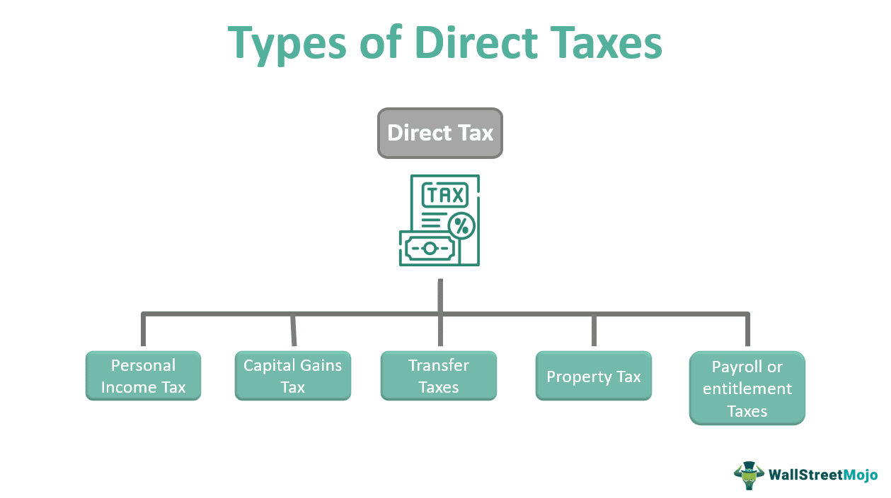

Algorithmic trading, commonly referred to as algo trading, has fundamentally transformed the operations of financial markets by automating trading processes, enhancing speed and efficiency, and minimizing human emotions in decision-making. At its core, algo trading involves the use of computer algorithms to execute trades based on pre-established criteria. These algorithms are capable of analyzing vast amounts of market data and financial indicators almost instantaneously, allowing for rapid response to market changes. This has led to increased liquidity, tighter bid-ask spreads, and improved price discovery in the financial markets.

A significant concept within trading is that of a "heavy" market, characterized by its resistance to price advancements. In such markets, price movements face substantial resistance due to various factors, such as high supply, reduced demand, or overall market indecision. These conditions suggest a potential shift in market trends or increased investor uncertainty. Understanding and identifying heavy markets is crucial, as they often precede significant price movements or even market downturns.



The strategic use of algorithmic trading in heavy markets can provide traders with valuable insights and potential advantages. Algorithms capable of identifying market heaviness can adjust trading strategies in real-time, either by hedging against possible downturns or exploiting temporary inefficiencies. This adaptability is essential for maintaining a competitive edge and optimizing trading performance.

Various algorithmic trading strategies exist, each designed to address different market conditions and trader objectives. By exploring these strategies, this article aims to provide a deeper understanding of how algorithmic trading functions and how it can be applied effectively. The integration of advanced technologies like artificial intelligence and machine learning further enhances the capabilities of algo trading systems, paving the way for more sophisticated and precise trading strategies.

Overall, gaining a comprehensive understanding of these concepts can significantly enhance trading performance and inform better decision-making strategies. As the landscape of financial markets continues to evolve with technological advancements, the role of algorithmic trading, especially in heavy markets, becomes increasingly prominent. Understanding these dynamics is not only beneficial but essential for traders aiming to succeed in the complex world of financial trading.

## Table of Contents

## Understanding the Concept of a Heavy Market

A heavy market represents a challenging environment for price advancement, often characterized by a resistance to upward movements. This phenomenon typically arises from a combination of investor indecision and caution, creating an atmosphere where buyers are hesitant to increase their activity. The resultant market inertia indicates a potential signal of an impending downturn or at least a temporary stalling in price momentum.

Key attributes of a heavy market include a marked reduction in buying activity. This slowdown may arise from various economic uncertainties, where investors prefer to hold their current positions rather than engage in new buying activities. The hesitation stems from both macroeconomic factors, such as [interest rate](/wiki/interest-rate-trading-strategies) changes or geopolitical tensions, and microeconomic signals, including company-specific news or sector-wide developments.

Experienced traders can often sense the weight of a market through subtle cues that impact their trading strategies. These practitioners rely on an intuitive understanding of market dynamics and may employ additional analytical tools to quantify market heaviness. For instance, a widening bid-ask spread and increasing trading volumes without corresponding price increases are quantitative indicators of a heavy market. Algorithms today are becoming increasingly adept at identifying these conditions, enabling automated adjustments to strategies that anticipate or hedge against potential downturns.

The ability to recognize and adjust for a heavy market is pivotal for informed trading decisions. A nuanced understanding of these conditions not only aids in mitigating risks associated with stagnating prices but also highlights potential opportunities to capitalize on eventual market shifts. By integrating heavy market indicators into their trading frameworks, market participants can better navigate the complexities of financial environments resistant to typical price movements.

## Historical Background of Algorithmic Trading

Algorithmic trading, or algo trading, traces its origins to the 1970s following the introduction of computerized systems in the American financial markets. These early systems aimed to automate routine trading tasks, thereby reducing human error and increasing efficiency. The introduction of electronic trading by the New York Stock Exchange (NYSE) marked a critical step forward, enabling traders to execute orders with unprecedented speed and accuracy. This shift facilitated the growing acceptance of [algorithmic trading](/wiki/algorithmic-trading) across the financial industry.

As technology advanced, the scope and complexity of algorithmic trading expanded. The integration of [artificial intelligence](/wiki/ai-artificial-intelligence) (AI) and [machine learning](/wiki/machine-learning) has allowed algorithms to analyze vast datasets, identify patterns, and make informed trading decisions with minimal human intervention. These technologies have become fundamental to the development of sophisticated trading algorithms capable of executing trades at high speeds.

A pivotal milestone in the evolution of algorithmic trading occurred in the early 2000s with the rise of high-frequency trading ([HFT](/wiki/high-frequency-trading-strategies)). This approach leverages powerful computing systems to execute a large number of trades in fractions of a second, capitalizing on small price movements. HFT strategies require advanced algorithms capable of processing massive amounts of market data in real-time to gain competitive advantages.

Overall, the historical evolution of algorithmic trading reflects the continuous pursuit of efficiency and precision in financial markets. The combination of electronic trading, AI, and HFT has transformed how modern markets operate, offering traders an array of tools to optimize their strategies. As technology continues to evolve, the potential applications and implications of algorithmic trading are likely to expand further.

## Key Features of Algorithmic Trading

Algorithmic trading, often shortened to algo trading, signifies a transformative approach that automates trading operations using sophisticated algorithms and pre-defined criteria. This automation facilitates executing orders at speeds and frequencies far beyond human capability. Here are the key features and benefits of algorithmic trading:

One of the foundational features of algorithmic trading is its ability to automate trading processes. Traders can design algorithms that incorporate specific mathematical models or rules. Once these algorithms are coded, they can automatically execute orders when the market conditions meet predetermined triggers. This eliminates the need for manual intervention, enabling operations to occur 24/7 without trader involvement, optimizing the timing of trades and the use of market opportunities.

Speed and efficiency are crucial in modern trading, where milliseconds can dictate the difference between profit and loss. Algorithmic systems analyze vast amounts of market data almost instantaneously. For example, an algorithm could process trading signals, market conditions, and other critical information hundreds of times per second. This rapid analysis supports high-frequency trading (HFT), where algorithms execute a significant number of trades within ultra-short periods. Thus, investors can take advantage of even the tiniest market fluctuations, maximizing their return potential.

A significant advantage of algorithmic trading is the removal of emotional influences from trading decisions. Human traders are prone to psychological biases, such as fear and greed, which can impair decision-making processes. Algorithms, however, make decisions based solely on data and structured logic, leading to more strategic, consistent, and unbiased outcomes. By minimizing human emotion, algo trading enhances the objectivity and credibility of trades.

The integration of advanced technologies, such as artificial intelligence (AI) and machine learning, has become increasingly vital in algorithmic trading. These technologies enhance the analytical capabilities of trading algorithms by identifying patterns and trends that may not be visible through conventional analysis. Machine learning algorithms, for example, can continuously improve their prediction accuracy by learning from historical data patterns. This dynamic adaptability can lead to more accurate forecasts of price movements, providing a significant advantage in fast-paced markets.

In conclusion, algorithmic trading offers structuring and execution approaches that capitalize on speed, efficiency, and technology. By utilizing advanced processing technologies and removing human emotional biases, algo trading provides a robust framework for modern financial market activities. As AI and machine learning continue to evolve, they will further enhance the capabilities and applications of algorithmic trading systems, presenting new opportunities for traders and investors.

## Heavy Market Indicators in Algorithmic Trading

Algorithms in algorithmic trading employ a range of techniques to identify heavy market conditions, which are characterized by significant resistance to price advancements. The detection of such conditions primarily hinges on an in-depth analysis of bid-ask spreads and trading volumes. 

1. **Bid-Ask Spreads Analysis**: The bid-ask spread, which is the difference between the price a buyer is willing to pay for an asset (bid) and the price at which a seller is willing to sell (ask), can be a crucial indicator of market liquidity and sentiment. In healthy, active markets, the spread tends to be narrow as buying and selling activity is brisk. However, in heavy markets, the spread may widen, reflecting investor reluctance and decreased trading activity. Algorithms monitor these fluctuations closely to determine the level of market heaviness.

2. **Trading Volumes**: Trading volume is another critical indicator, offering insights into the level of interest or indifference among investors. In a heavy market, trading volumes typically dwindle as buyers and sellers express hesitance amid market indecision. Algorithms can track these volume shifts in real-time, adjusting their strategies accordingly to either mitigate risk or prepare for market downturns.

When an algorithm detects indications of a heavy market, it may employ various strategic adjustments to manage risks or exploit opportunities. These strategies often include:

- **Hedging**: Algorithms might initiate hedging strategies to protect current positions against potential adverse market movements. This could involve taking offsetting positions in related assets or markets to buffer against possible losses.

- **Dynamic Strategy Adjustment**: Adaptive algorithms can modify their approach in response to market heaviness, such as curbing trading frequency or shifting focus to more stable or inverse relationships within the market.

Interpreting the signals of market heaviness is critical for the success of algorithmic trading. A seamless blend of statistical analysis, historical data comparison, and real-time monitoring empowers algorithms to maintain a competitive edge even under challenging market conditions. Python, with its rich set of libraries for data analysis and machine learning, is often used to develop these algorithms. Here is a simple example of how Python could be used to analyze bid-ask spreads and trading volumes:

```python
import pandas as pd

# Sample data
data = {'Timestamp': ['2023-09-01 09:30', '2023-09-01 09:35', '2023-09-01 09:40'],
        'Bid': [100, 101, 100.5],
        'Ask': [102, 104, 103],
        'Volume': [500, 450, 300]}

df = pd.DataFrame(data)
df['Timestamp'] = pd.to_datetime(df['Timestamp'])
df.set_index('Timestamp', inplace=True)

# Calculate Bid-Ask Spread
df['Spread'] = df['Ask'] - df['Bid']

# Detect heavy market indicator
spread_threshold = 2  # Example threshold
volume_threshold = 400  # Example volume threshold

def detect_heavy_market(df, spread_threshold, volume_threshold):
    heavy_market_conditions = df[(df['Spread'] > spread_threshold) & (df['Volume'] < volume_threshold)]
    return heavy_market_conditions

heavy_market_indicators = detect_heavy_market(df, spread_threshold, volume_threshold)
print(heavy_market_indicators)
```

This script demonstrates a simplistic algorithmic approach to identify market heaviness by focusing on the interplay of bid-ask spreads and trading volumes. The ability of an algorithm to accurately interpret these signals is pivotal in devising effective trading strategies that capitalize on or shield against market heaviness.

## Examples of Algorithmic Trading Strategies

Algorithmic trading strategies have become an integral part of modern financial markets, each designed to leverage specific market conditions and trader objectives. Key strategies include Momentum Trading, Arbitrage, Market-Neutral Strategies, and Trend Following.

Momentum Trading is a strategy that capitalizes on the persistence of existing market trends. Traders using this approach buy assets that have been rising or sell assets that have been falling, expecting that the trend will continue. This strategy relies heavily on technical indicators such as the Relative Strength Index (RSI) or Moving Average Convergence Divergence (MACD) to identify [momentum](/wiki/momentum) in the market.

Arbitrage involves exploiting price discrepancies between different markets or forms of the same asset. In its simplest form, [arbitrage](/wiki/arbitrage) requires buying an asset in one market at a lower price and simultaneously selling it in another market at a higher price. Advanced algorithms can identify these price differences within milliseconds, allowing high-frequency traders to execute multiple arbitrage opportunities across global markets. This strategy often requires sophisticated technology and rapid execution to be successful.

Market-Neutral Strategies aim to balance long and short positions to minimize exposure to overall market movements while capturing relative value discrepancies. A common market-neutral approach is pairs trading, where a trader might take a long position in one stock and a short position in a related stock, banking on the divergence between the two stocks to return to historical norms. This requires a deep understanding of correlations between assets and the ability to analyze vast amounts of market data.

Trend Following strategies utilize historical price data to identify and follow market trends. Traders using this strategy often apply moving averages, such as the Simple Moving Average (SMA) or the Exponential Moving Average (EMA), to determine the direction of the trend and establish entry and [exit](/wiki/exit-strategy) points. The central hypothesis is that markets tend to move in trends, and by following these trends, traders can potentially profit from such movements.

Each of these algorithmic trading strategies is designed to address particular market conditions and fulfill specific objectives for traders. The choice of strategy often depends on the trader's risk tolerance, market expertise, and technological capabilities. With the advancement of technology, particularly in machine learning and data analytics, these strategies continue to evolve, becoming more sophisticated and effective in extracting value from financial markets.

## Tools and Technologies in Algorithmic Trading

Cutting-edge software platforms play a vital role in the creation and execution of algorithmic trading strategies. These platforms offer functionalities such as [backtesting](/wiki/backtesting), optimization, and live trading, enabling traders to implement and test their strategies efficiently. One prominent advantage of these platforms is their ability to automate complex trading processes, thereby reducing manual intervention and human errors.

Cloud computing has emerged as a critical component in handling the vast data requirements of algorithmic trading. It provides scalable resources that allow traders to process large volumes of data quickly and efficiently. High-performance servers are integral to maintaining the continuous flow of trading operations, especially under high-frequency trading conditions where computation speed is paramount. These technological tools facilitate the rapid analysis and execution of trades, optimizing performance and enhancing decision-making.

Real-time data feeds and Application Programming Interfaces (APIs) are indispensable tools for acquiring critical data necessary for algorithmic decision-making. APIs enable seamless integration with financial data providers, offering up-to-the-second market data that is crucial for algorithmic models to function accurately. This real-time access ensures that trading algorithms are operating on the latest information, thus minimizing latency issues and potential trading discrepancies.

Machine learning technologies significantly enhance predictive analytics in algorithmic trading, offering traders competitive advantages. By employing advanced machine learning models such as neural networks and [reinforcement learning](/wiki/reinforcement-learning) algorithms, traders can identify complex patterns and extract actionable insights from historical and real-time data. These models are capable of adapting to changing market conditions, continuously improving prediction accuracy. For example, a simple machine learning algorithm in Python might look like this:

```python
from sklearn.ensemble import RandomForestRegressor
import numpy as np

# Historical market data
X_train = np.array([[1, 2], [2, 3], [3, 4], [4, 5]])
y_train = np.array([5, 7, 9, 11])

# Initialize the Random Forest Regressor
model = RandomForestRegressor(n_estimators=100, max_depth=5, random_state=0)

# Train the model
model.fit(X_train, y_train)

# Predict future market prices
X_new = np.array([[5, 6]])
predicted_price = model.predict(X_new)
print(f"Predicted Price: {predicted_price}")
```

This code snippet illustrates how a Random Forest Regressor, a common machine learning model, can be trained with historical data to predict future market prices. This predictive capability allows traders to make informed decisions based on model forecasts.

In conclusion, these technological components—software platforms, cloud computing, real-time data feeds, APIs, and machine learning—constitute the backbone of contemporary algorithmic trading, providing the tools necessary for traders to succeed in fast-paced and dynamic financial markets.

## Risks and Regulations in Algorithmic Trading

Algorithmic trading, often synonymous with high efficiency and speed, also presents unique challenges, primarily concerning risks and regulatory compliance. Maintaining market fairness and stability is of paramount importance, as improper use of these automated systems can lead to market disruptions or unfair advantages.

**Regulatory Compliance**

Ensuring compliance with applicable financial regulations is essential to safeguard the integrity of market operations. Regulatory bodies such as the U.S. Securities and Exchange Commission (SEC) and the European Securities and Markets Authority (ESMA) have established specific guidelines for algorithmic trading. These regulations are designed to prevent activities such as market manipulation, and to ensure a level playing field for all market participants.

For instance, the Markets in Financial Instruments Directive II (MiFID II), implemented in Europe, imposes stringent requirements on algo traders, mandating effective systems and risk controls and ensuring algorithms are tested annually to avoid contributing to market disorder. Compliance ensures that algorithms react appropriately under stress conditions and maintain operational transparency.

**Potential Risks**

Algorithmic trading systems, while highly efficient, are not free from risks. Two of the most notable risks include technical failures and unexpected market movements. Technical failures can occur due to software bugs, data feed errors, or system breakdowns, potentially leading to significant financial losses. For example, a coding error in an algorithm may execute thousands of unintended trades, affecting market conditions.

Moreover, algorithms can sometimes amplify unforeseen market movements. In volatile markets, rapid algorithmic trading can lead to flash crashes or exacerbated price swings, as was observed during the 2010 Flash Crash in the U.S. stock market. Algorithms can respond to false signals provoked by erroneous data or market manipulations, leading to adverse trading outcomes.

**Risk Management Strategies**

Robust risk management strategies are crucial in mitigating the risks associated with algorithmic trading. Implementing a comprehensive framework to monitor and control risk exposures is vital. Strategies include real-time monitoring systems that track algorithmic performance and trading patterns, which can be implemented via the following Python pseudocode:

```python
def monitor_trades(algorithm, market_data):
    try:
        while market_is_open():
            trade_data = algorithm.execute_trades(market_data)
            if trade_data['anomalies']:
                raise Alert("Anomalous trading detected")
            log_trade_data(trade_data)
    except Exception as e:
        handle_error(e)

def handle_error(error):
    logging.error(f"Trading error: {error}")
    alert_team()
    halt_trading_system()
```

Market stress testing and regularly updating algorithms based on backtesting results can also be effective in controlling risks. Furthermore, diversification of strategies, such as integrating both momentum and arbitrage models, can reduce dependency on single market directions or conditions, spreading risk across multiple assets and scenarios.

In conclusion, while algorithmic trading offers substantial advantages in efficiency and execution speed, it necessitates adherence to regulatory standards and implementation of robust risk management practices to mitigate the associated risks and ensure market integrity.

## Conclusion and Future Outlook

Algorithmic trading is becoming increasingly integral to financial markets as technology advances, making them more sophisticated and efficient. This reliance on technology is enhancing trading accuracy and execution speed, thereby reshaping market dynamics. A critical element in trading is recognizing heavy markets, which are characterized by resistance to price movements and reduced trading activity. By adeptly navigating these environments with algorithmic strategies, traders can potentially enhance their success and mitigate risks associated with market instability.

As artificial intelligence and technological innovations progress, the application and effectiveness of algorithmic trading across diverse market scenarios are expected to grow. Algorithms capable of learning and adapting to changing market conditions offer substantial potential to refine predictive analytics and decision-making capabilities. This progression emphasizes the importance for traders to remain informed and adaptable to harness these technological advancements fully.

The ultimate success in algorithmic trading will depend on traders' abilities to evolve alongside technology, integrating new tools and methodologies dynamically. Maintaining a competitive edge necessitates continuous education and adaptation in an ever-evolving financial landscape. Traders who leverage these advancements and understand market conditions, such as heavy markets, are better positioned to capitalize on opportunities and sustain long-term trading success.

## References & Further Reading

[1]: Bergstra, J., Bardenet, R., Bengio, Y., & Kégl, B. (2011). ["Algorithms for Hyper-Parameter Optimization."](https://papers.nips.cc/paper/4443-algorithms-for-hyper-parameter-optimization) Advances in Neural Information Processing Systems 24.

[2]: ["Advances in Financial Machine Learning"](https://www.amazon.com/Advances-Financial-Machine-Learning-Marcos/dp/1119482089) by Marcos Lopez de Prado.

[3]: ["Evidence-Based Technical Analysis: Applying the Scientific Method and Statistical Inference to Trading Signals"](https://www.amazon.com/Evidence-Based-Technical-Analysis-Scientific-Statistical/dp/0470008741) by David Aronson.

[4]: ["Machine Learning for Algorithmic Trading"](https://github.com/stefan-jansen/machine-learning-for-trading) by Stefan Jansen.

[5]: ["Quantitative Trading: How to Build Your Own Algorithmic Trading Business"](https://www.amazon.com/Quantitative-Trading-Build-Algorithmic-Business/dp/1119800064) by Ernest P. Chan.