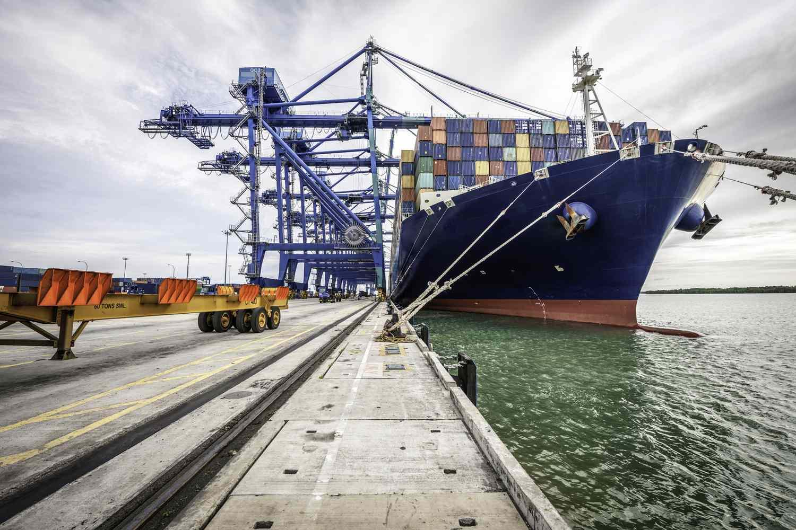

## Table of Contents

## What is heavy industry and why is it important for large-scale enterprises?

Heavy industry refers to industries that produce large and heavy products, like steel, chemicals, and machinery. These industries often need big factories and lots of workers. They use a lot of energy and raw materials to make their products. Heavy industry is different from light industry, which makes smaller things like clothes and electronics.

Heavy industry is very important for large-scale enterprises because it provides the basic materials and equipment they need to operate. For example, construction companies need steel from heavy industry to build skyscrapers and bridges. Car manufacturers need machinery and parts from heavy industry to make cars. Without heavy industry, these big businesses would not be able to do their work. This makes heavy industry a key part of the economy, helping to support many other industries and jobs.

## What are the common types of heavy industries involved in large-scale enterprises?

Heavy industries that are part of large-scale enterprises include steel, chemicals, and machinery. The steel industry makes steel, which is used to build things like cars, buildings, and bridges. The chemical industry makes chemicals that are used in many products, like plastics, medicines, and fertilizers. The machinery industry makes big machines that are used in factories and construction sites.

Another important heavy industry is the energy sector, which includes oil, gas, and coal. These industries provide the energy needed to run factories and machines. The mining industry is also a heavy industry. It digs up raw materials like iron ore and coal from the ground. These materials are used by other heavy industries to make their products.

These heavy industries are very important because they support many other businesses. Without them, large-scale enterprises would not have the materials and equipment they need to work. This makes heavy industries a key part of the economy.

## How does heavy industry impact the economy of large-scale enterprises?

Heavy industry has a big impact on the economy of large-scale enterprises. It provides the basic materials and equipment that these big businesses need to do their work. For example, construction companies need steel from heavy industry to build skyscrapers and bridges. Car manufacturers need machinery and parts from heavy industry to make cars. Without these materials and equipment, large-scale enterprises would not be able to operate, which would hurt the economy.

Heavy industry also creates many jobs. The factories and mines that are part of heavy industry need a lot of workers. These jobs help people earn money and spend it on things they need, like food and housing. This spending helps the economy grow. When heavy industry does well, it can lead to more jobs and more spending, which is good for the economy of large-scale enterprises.

In addition, heavy industry can affect the economy by influencing other industries. For example, if the steel industry is doing well, it can help the car industry because cars need steel. If the chemical industry grows, it can help the agriculture industry because chemicals are used to make fertilizers. This shows how heavy industry is connected to many parts of the economy and can have a big impact on large-scale enterprises.

## What are the key environmental considerations for heavy industries in large-scale enterprises?

Heavy industries like steel, chemicals, and mining can harm the environment. They use a lot of energy and raw materials, which can lead to pollution and waste. For example, factories might release smoke into the air, which can make the air dirty and cause health problems. Also, mining can harm the land and water, making it hard for plants and animals to live there. Large-scale enterprises need to think about these problems and try to reduce their impact on the environment.

To help the environment, heavy industries can use cleaner technology and better ways of working. For example, they can use renewable energy like wind or solar power instead of coal or oil. They can also recycle waste and use less water. Governments can make rules to make sure heavy industries do not harm the environment too much. By doing these things, large-scale enterprises can help protect the environment while still making the products they need.

## How can large-scale enterprises manage the high capital costs associated with heavy industry?

Large-scale enterprises can manage the high capital costs of heavy industry by planning carefully and using smart strategies. One way is to invest in technology that saves money over time. For example, using energy-efficient machines can lower the cost of running a factory. Another way is to borrow money from banks or investors. This can help pay for big projects like building a new factory or buying expensive equipment. Large-scale enterprises can also form partnerships with other companies to share the costs and risks of big projects.

Another important strategy is to focus on long-term planning. Heavy industry projects often take a long time to start making money, so it's important to think about the future. Large-scale enterprises can do this by setting aside money for future projects and by keeping a close eye on their finances. They can also look for government help, like grants or tax breaks, which can make it easier to pay for big projects. By using these strategies, large-scale enterprises can manage the high costs of heavy industry and keep their businesses strong.

## What are the safety protocols that need to be implemented in heavy industry operations?

Safety is very important in heavy industry because the work can be dangerous. To keep workers safe, companies need to follow strict safety rules. This means giving workers the right safety gear, like helmets, gloves, and safety glasses. It also means training workers on how to do their jobs safely. They need to know how to use machines and handle dangerous materials without getting hurt. Companies should also have clear rules about what to do if something goes wrong, like a fire or a spill.

Another important part of safety in heavy industry is regular checks and maintenance. Machines and equipment need to be looked at often to make sure they are working right. If something is broken, it needs to be fixed quickly to avoid accidents. Companies should also have safety meetings where workers can talk about any problems they see and learn about new safety rules. By doing these things, heavy industry can be a safer place to work.

## How does automation and technology integration affect heavy industry in large-scale enterprises?

Automation and technology integration have a big impact on heavy industry in large-scale enterprises. They help make work easier and faster. Machines can do hard and dangerous jobs that people used to do. This means fewer accidents and less hard work for people. Also, machines can work all the time without getting tired. This can help companies make more things and make them faster. Using technology can also help save money. For example, smart machines can use less energy and materials, which can lower costs.

But there are also some challenges with using more technology in heavy industry. One big challenge is the cost. Buying and setting up new machines can be very expensive. Companies need to plan carefully to make sure they can afford it. Another challenge is that workers need to learn how to use the new technology. This means companies need to spend time and money on training. If they don't, the new machines might not be used well. Even with these challenges, automation and technology can help heavy industry do better and be safer.

## What are the logistical challenges of managing heavy industry operations across multiple locations?

Managing heavy industry operations across multiple locations can be really hard. One big challenge is getting materials and products from one place to another. Heavy industry uses big and heavy things, like steel and machinery, which can be hard to move. Companies need to plan carefully to make sure everything gets where it needs to go on time. They also need to think about the cost of moving these heavy things, because it can be very expensive.

Another challenge is making sure all the different locations work well together. Each place might have different rules and ways of doing things. Companies need to make sure everyone follows the same safety rules and uses the same technology. This can be hard because people in different places might not talk to each other much. Good communication is very important to make sure everything runs smoothly and safely.

Overall, managing heavy industry across multiple locations takes a lot of planning and coordination. Companies need to think about how to move things, how to keep everyone safe, and how to make sure everyone works together well. By doing these things, they can make their heavy industry operations successful, even when they are spread out over many places.

## How can large-scale enterprises optimize supply chain management in heavy industry?

Large-scale enterprises can optimize supply chain management in heavy industry by using technology to keep track of materials and products. They can use computers and software to see where everything is and when it will arrive. This helps them plan better and make sure they have what they need when they need it. They can also use technology to talk to their suppliers and customers more easily. This helps them work together better and solve problems faster.

Another way to optimize supply chain management is to work closely with suppliers and partners. Large-scale enterprises can make agreements with their suppliers to get materials on time and at a good price. They can also work with other companies to share the cost of moving heavy things. By working together, they can make the supply chain more efficient and save money. This helps them get materials and products where they need to go faster and cheaper.

## What are the regulatory compliance issues specific to heavy industries that large-scale enterprises must address?

Heavy industries have to follow many rules to make sure they are safe for workers and good for the environment. These rules can be different in each country or even in each state. For example, there are rules about how much pollution a factory can make and how to handle dangerous chemicals. Large-scale enterprises need to know all these rules and make sure they follow them. If they don't, they can get in big trouble and have to pay a lot of money.

Another big issue is keeping workers safe. Heavy industries use big machines and dangerous materials, so there are strict rules about safety. Companies need to give workers the right safety gear, like helmets and gloves, and train them on how to work safely. They also need to check their machines often to make sure they are working right. If a company does not follow these safety rules, they can be fined or even shut down. This makes it really important for large-scale enterprises to always follow the rules and keep their workers safe.

## How can large-scale enterprises innovate within heavy industry to maintain competitive advantage?

Large-scale enterprises can innovate in heavy industry by using new technology to make their work better and faster. For example, they can use robots and smart machines to do hard and dangerous jobs. This can help them make more things and make them faster. It can also make their work safer for people. Companies can also use computers and software to plan their work better and keep track of their materials and products. This helps them save money and make sure they have what they need when they need it.

Another way to innovate is by finding new ways to use less energy and materials. Heavy industry uses a lot of both, so finding ways to use less can save a lot of money and be better for the environment. Companies can do this by using renewable energy like wind or solar power instead of coal or oil. They can also recycle waste and use less water. By doing these things, large-scale enterprises can make their work more efficient and stay ahead of their competition.

## What are the future trends and predictions for heavy industry in the context of large-scale enterprises?

In the future, heavy industry in large-scale enterprises will see a lot of changes because of new technology. More companies will use robots and smart machines to do hard and dangerous jobs. This will help them make more things faster and safer. Computers and software will also be used more to plan work and keep track of materials and products. This will help companies save money and be more efficient. Another big trend will be using renewable energy like wind and solar power instead of coal and oil. This will help companies use less energy and be better for the environment.

Another important trend will be finding new ways to use less materials and recycle more. Heavy industry uses a lot of materials, so finding ways to use less can save a lot of money. Companies will also focus more on recycling waste and using less water. This will help them be more sustainable and meet new environmental rules. Overall, these trends will help large-scale enterprises in heavy industry stay competitive and keep up with changes in the world.

## References & Further Reading

[1]: Lopez de Prado, M. (2018). ["Advances in Financial Machine Learning."](https://www.amazon.com/Advances-Financial-Machine-Learning-Marcos/dp/1119482089) Wiley.

[2]: Aronson, D. R. (2007). ["Evidence-Based Technical Analysis: Applying the Scientific Method and Statistical Inference to Trading Signals."](https://onlinelibrary.wiley.com/doi/book/10.1002/9781118268315) Wiley.

[3]: Jansen, S. (2020). ["Machine Learning for Algorithmic Trading: Predictive models to extract signals from market and alternative data for systematic trading strategies with Python."](https://github.com/stefan-jansen/machine-learning-for-trading) Packt Publishing.

[4]: Chan, E. P. (2009). ["Quantitative Trading: How to Build Your Own Algorithmic Trading Business."](https://github.com/ftvision/quant_trading_echan_book) Wiley.

[5]: Bergstra, J., Bardenet, R., Bengio, Y., & Kégl, B. (2011). ["Algorithms for Hyper-Parameter Optimization."](https://dl.acm.org/doi/10.5555/2986459.2986743) Advances in Neural Information Processing Systems 24.