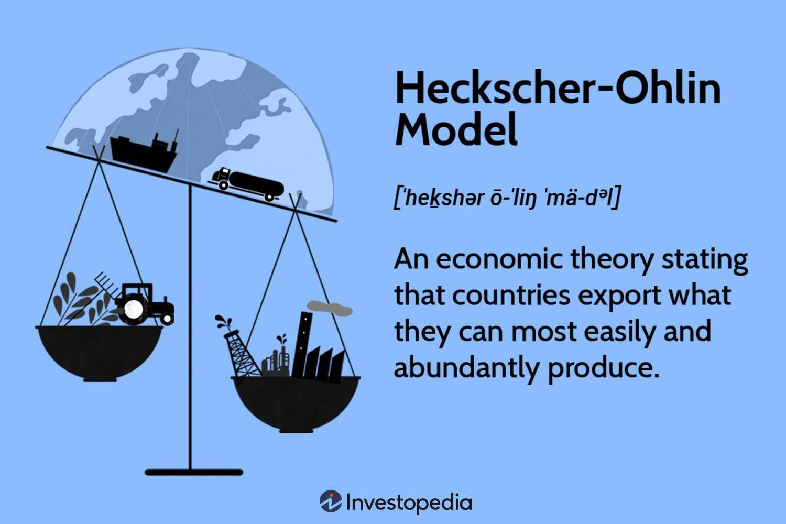

The global landscape of trade and finance is shaped by various economic models. Among these, the Heckscher-Ohlin model plays a pivotal role, offering a framework to understand the patterns of international trade. This model, rooted in comparative advantage theory, suggests that countries export goods that utilize their abundant factors of production while importing those that require resources in short supply. This concept shifts the focus from Ricardo's labor-centric comparative advantage to the diverse endowments of labor, capital, and other resources among nations.

In this article, we explore the intricacies of the Heckscher-Ohlin model and its continuing relevance to modern economic practices. The model's emphasis on factor endowments aligns with the evolving needs of global markets, where resource allocation and specialization drive trade dynamics. Understanding these underlying principles is crucial for appreciating contemporary trade flows and economic strategies.



Additionally, we examine the intersection of Heckscher-Ohlin principles and the dynamic world of algorithmic trading. This modern financial tool, which relies on advanced algorithms for executing trades with optimal speed and precision, opens new avenues for utilizing traditional economic theories. The integration of these principles with technology-driven trading strategies fosters a new paradigm in international trade, where real-time data analytics and computational power enhance decision-making processes.

By investigating these interactions, we aim to elucidate their contributions to the economy's evolving narrative. The synergistic combination of traditional economic theories and cutting-edge technology not only enhances our understanding of trade but also promises more interconnected and efficient global trading systems. This synthesis holds potential for fostering economic growth and adapting to the increasingly complex demands of international markets.

## Table of Contents

## Understanding the Heckscher-Ohlin Model

The Heckscher-Ohlin model is a fundamental concept in international trade theory, offering a framework to understand why countries engage in trade based on their respective resource endowments. Developed by economists Eli Heckscher and Bertil Ohlin, the model proposes that countries will export products that utilize their abundant and cheap factors of production and import products that require factors in which they are relatively scarce.

Central to this theory is the concept of comparative advantage, which extends the classical Ricardian model by emphasizing the role of a country's factor endowments—primarily labor and capital—over technological superiority. The Heckscher-Ohlin model asserts that the relative abundance or scarcity of production factors such as labor, land, and capital will determine a country's comparative advantage. For example, a labor-rich country is expected to specialize in and export labor-intensive goods, while importing capital-intensive goods.

This model is mathematically represented by two main theorems: 

1. **Heckscher-Ohlin Theorem**: A country will export goods that intensively use its abundant factors and import goods that intensively use its scarce factors.

2. **Factor Price Equalization Theorem**: The trade of goods that embodies factors will lead to the equalization of the prices of these factors across countries, assuming no transportation costs and identical technologies.

Critics of the Heckscher-Ohlin model point out several real-world limitations. One significant limitation is the assumption of identical production technologies across countries. In reality, technological disparities can significantly influence production efficiency and trade patterns. Moreover, the model assumes perfect competition, which is rarely observed in global markets typically characterized by imperfect competition and market power exertions.

Empirical studies, such as the Leontief Paradox, have also challenged the model's predictive power, showing that, contrary to Heckscher-Ohlin predictions, the United States—capital-abundant in nature—exported more labor-intensive goods than capital-intensive ones during the 1950s. This paradox highlights the complexity of international trade beyond [factor](/wiki/factor-investing) endowments, suggesting the need for modified versions or entirely new models that consider other determinants such as technology, economies of scale, and consumer preferences.

Despite these critiques, the Heckscher-Ohlin model remains integral to understanding trade flows and has significantly influenced subsequent economic models and global economic strategies. It continues to serve as a crucial analytical tool for economists and policymakers seeking to navigate the complexities of international trade, resource allocation, and economic growth.

## Integration with Algorithmic Trading

Algorithmic trading has transformed the landscape of financial markets by employing sophisticated algorithms to execute trades with unprecedented speed and precision. This modern approach can be effectively integrated with the principles of the Heckscher-Ohlin model to optimize decision-making in international markets. The Heckscher-Ohlin model, which provides insights into a country's comparative advantage based on its factor endowments, offers a strategic framework that [algorithmic trading](/wiki/algorithmic-trading) can exploit for enhanced trading performance.

One of the primary benefits of integrating algorithmic trading with the Heckscher-Ohlin model is the ability to adjust trading strategies dynamically in response to changes in factor endowments and comparative advantages. Algorithms can be designed to swiftly identify and respond to shifts in resource availability, labor to capital ratios, and other critical economic variables that signify potential trade opportunities. For example, if a country experiences an increase in capital endowment, algorithms can adjust trading strategies in real-time to prioritize capital-intensive goods, thereby capitalizing on the emerging comparative advantage.

This fusion of economic theory and technology enables a dynamic approach to international trade. By leveraging algorithmic trading, traders can not only respond to current market conditions but also anticipate future movements based on predicted changes in factor endowments. This predictive capability is particularly beneficial in volatile markets where quick adaptability is essential for maintaining competitive advantage.

Moreover, technological advancements in data analytics serve to bolster the integration of algorithmic trading with the Heckscher-Ohlin model. Advanced data analytics facilitate deeper insights into market dynamics by analyzing vast datasets to forecast economic trends and determine optimal trading strategies. Machine learning algorithms can dissect complex patterns and relationships within the data that are not immediately apparent, thereby enhancing the accuracy of trade decisions.

```python
# Pseudo-code representation of an algorithmic trading strategy based on the Heckscher-Ohlin model

def determine_comparative_advantage(country_factors):
    # Analyze a country's factor endowments to determine comparative advantage
    capital_to_labor_ratio = country_factors['capital'] / country_factors['labor']
    return "capital-intensive" if capital_to_labor_ratio > threshold else "labor-intensive"

def execute_trade_based_on_advantage(market_data, comparative_advantage):
    # Execute trades based on the identified comparative advantage
    if comparative_advantage == "capital-intensive":
        # Trade logic for capital-intensive goods
        execute_trade(market_data, 'capital-intensive-goods')
    else:
        # Trade logic for labor-intensive goods
        execute_trade(market_data, 'labor-intensive-goods')

# Example usage
country_factors = {'capital': 150, 'labor': 100}
market_data = {...} # Hypothetical market data
threshold = 1.2
comparative_advantage = determine_comparative_advantage(country_factors)
execute_trade_based_on_advantage(market_data, comparative_advantage)
```

The integration of algorithmic trading with the Heckscher-Ohlin model represents a significant advancement in the field of international trade. By harnessing cutting-edge technology, traders and policymakers can not only enhance trade efficiency but also cultivate a more interconnected and adaptive global market.

## Case Studies and Examples

The integration of the Heckscher-Ohlin model's principles with algorithmic trading has proven effective across various sectors, offering deeper insights and improved efficiencies. Numerous case studies highlight the application of these principles with tangible results in industries ranging from commodities to financial services.

One notable example is in the commodity markets, where algorithmic trading systems have leveraged factor endowments to optimize trade strategies. For instance, a country rich in natural resources like oil can use algo trading systems to predict price fluctuations based on its comparative advantage in [crude oil](/wiki/crude-oil) production. These systems analyze data on factor endowment shifts to anticipate market changes and trade accordingly. This capability significantly enhances market responsiveness and profitability.

In the financial services industry, automated trading platforms have successfully utilized Heckscher-Ohlin principles to manage and execute cross-border investment strategies. By analyzing a country's available factors of production, such as labor and capital, these platforms can identify favorable investment opportunities. Algorithms programmed to detect changes in labor productivity or capital availability allow traders to adjust investment portfolios dynamically, enhancing returns.

Automated systems have also been pivotal in detecting shifts in factor endowments, leading to increased trade efficiencies. For example, Python-based algorithms can incorporate data analytics to monitor global supply chain changes. By processing real-time data on labor costs and capital distribution, these systems identify changes in comparative advantages. This approach enables companies to optimize their global production and sourcing strategies, aligning with the Heckscher-Ohlin model's predictions.

```python
import pandas as pd
import numpy as np

# Example code to simulate detecting changes in factor endowments
# Assume df is a DataFrame containing data on labor costs and capital distribution
def detect_factor_shifts(df):
    # Calculate changes in labor costs
    df['Labor_Change'] = df['Labor_Cost'].pct_change()
    # Calculate changes in capital distribution
    df['Capital_Change'] = df['Capital_Distribution'].pct_change()

    # Identify significant shifts
    significant_shifts = df[(abs(df['Labor_Change']) > 0.05) | (abs(df['Capital_Change']) > 0.05)]
    return significant_shifts

# Example DataFrame
data = {'Labor_Cost': [100, 105, 103, 110], 'Capital_Distribution': [200, 210, 215, 220]}
df = pd.DataFrame(data)

# Detecting significant shifts
significant_shifts = detect_factor_shifts(df)
print(significant_shifts)
```

The lessons from these practical applications inform global trade strategies, enabling businesses and investors to harness economic theories more effectively. By integrating robust economic models with advanced trading algorithms, firms can achieve a strategic edge, optimizing their operations based on a nuanced understanding of global trade dynamics and factor endowments. These insights pave the way for more innovative and efficient trade and investment practices in the future.

## Challenges and Future Directions

The integration of Heckscher-Ohlin principles with algorithmic trading is a promising development in the field of international trade. However, it also presents several challenges that need to be addressed to realize its full potential. One primary issue is data accuracy. The reliability and quality of data used to inform algorithmic trading systems are crucial. Inaccurate data can lead to misguided strategies and suboptimal trading decisions. As algorithmic trading relies on real-time data, any discrepancies in data quality can have immediate and costly consequences. Thus, ensuring high data integrity is essential to the successful implementation of these systems.

Market [volatility](/wiki/volatility-trading-strategies) poses another significant challenge. Rapid changes in market conditions can outpace the adaptability of existing algorithms, resulting in trades that do not align with desired outcomes based on Heckscher-Ohlin theoretical premises. Algorithms must be designed to quickly adjust to these fluctuations to preserve the comparative advantages identified by the model. This requires continuous updates and refinements to trading algorithms, necessitating collaboration between economists and computer scientists to develop adaptable systems capable of responding to unforeseen market shifts.

The balance between automation and human oversight also remains a critical consideration. While automation enhances trading efficiency and speed, human expertise is indispensable for interpreting complex scenarios where algorithms might fall short. Striking an appropriate balance is crucial to harnessing the benefits of both machine precision and human judgment. As automation grows, the role of traders may shift toward strategy supervision and exceptional situation handling.

Future research is poised to further integrate technological innovations with economic models. Advances in [machine learning](/wiki/machine-learning) and [artificial intelligence](/wiki/ai-artificial-intelligence) may offer more robust models that better account for technological changes and global economic trends. These technologies can improve the predictive capabilities of trading systems, helping them to forecast shifts in factor endowments and market dynamics accurately.

Despite these challenges, the potential for enhancing international trade efficiency through this integration remains significant. As technology continues to evolve, there are vast opportunities for improving the precision and efficacy of trade strategies grounded in traditional economic theories like the Heckscher-Ohlin model. Emerging tools and methodologies promise to better equip policymakers, economists, and traders with insights necessary for fostering global economic growth and interconnectedness.

## Conclusion

The intersection of economic models such as the Heckscher-Ohlin theory with algorithmic trading serves as an innovative frontier in international trade. This convergence stands to benefit significantly from leveraging technological advancements, which enable traditional models to evolve in response to the dynamic demands of modern trade. Algorithmic trading, with its ability to process vast amounts of data and execute trades with precision, complements the Heckscher-Ohlin model by swiftly adapting to changes in factor endowments and comparative advantages. This synergy enhances the model's applicability in contemporary global markets, allowing for more nuanced insights and efficient trade practices.

For economists, traders, and policymakers, mastering these intricate interactions will be vital. Traditional economic principles, when combined with cutting-edge trading technologies, provide robust mechanisms for fostering economic growth. The capacity to analyze data in real time and reevaluate comparative advantages offers a significant edge in optimizing trade decisions and developing strategic responses to market shifts.

As international markets continue to evolve, the blending of economic theories with technological innovations offers potent tools to facilitate economic growth. This synthesis ensures a trading system that is not only efficient but also highly interconnected. By enhancing the adaptability and responsiveness of trade strategies, the integration of these disciplines promises to usher in a new era of global economic cooperation and development.

## References & Further Reading

[1]: Heckscher, E., & Ohlin, B. (1991). "Heckscher-Ohlin Trade Theory." MIT Press.

[2]: Leontief, W. (1953). "Domestic Production and Foreign Trade: The American Capital Position Re-Examined." Proceedings of the American Philosophical Society, 97(4), 332-349.

[3]: Krugman, P. R., Obstfeld, M., & Melitz, M. J. (2018). "International Economics: Theory and Policy." Pearson Education.

[4]: Dornbusch, R., Fischer, S., & Samuelson, P. A. (1980). "Heckscher-Ohlin Trade Theory with a Continuum of Goods." The Quarterly Journal of Economics, 95(2), 203-224.

[5]: "Algorithmic Trading: Winning Strategies and Their Rationale" by Ernest P. Chan, Wiley Trading.