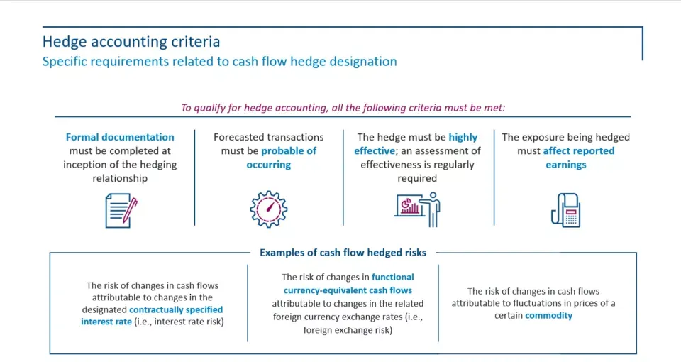

## Table of Contents

## What is hedge accounting?

Hedge accounting is a way that companies can match up the gains or losses from certain financial instruments, called hedges, with the items they are trying to protect, like future sales or purchases. This helps make the company's financial reports more accurate and less jumpy. Imagine you're trying to guess how much money you'll have next month. If you know you'll get money from selling something, but the price might change, you can use a hedge to lock in that price. Hedge accounting lets you show this lock-in on your financial statements, so your guess about next month's money is more steady.

There are rules about how to do hedge accounting right. You need to say what you're protecting, what hedge you're using, and how well it works. It's like making a plan and sticking to it. If you follow the rules, your financial statements will show a clearer picture of how well your company is doing, without big surprises from changes in prices. This can help investors and others understand your business better and trust your financial reports more.

## Why is hedge accounting important for businesses?

Hedge accounting is important for businesses because it helps them show a more accurate picture of their financial health. When a company uses hedges to protect against risks like changing prices or interest rates, hedge accounting lets them match these hedges with the things they're protecting on their financial statements. This means the company's profits and losses will be smoother and more predictable, which is good for planning and making decisions.

It also helps businesses communicate better with investors and others who look at their financial reports. Without hedge accounting, big swings in reported earnings could happen just because of changes in the value of hedges, even if the company's actual performance hasn't changed much. By using hedge accounting, a company can show a clearer, more stable view of its performance, which can build trust and make it easier to get loans or attract investors.

## What are the different types of hedging instruments?

Hedging instruments are tools that businesses use to protect themselves from risks like changes in prices, interest rates, or currency values. One common type of hedging instrument is a futures contract. This is an agreement to buy or sell something at a set price on a future date. For example, a farmer might use a futures contract to lock in the price of their crops ahead of time, so they know how much money they'll get even if prices drop later. Another type is an options contract, which gives the buyer the right, but not the obligation, to buy or sell an asset at a set price before a certain date. This can be useful if a company wants to protect against price increases but still wants the chance to benefit if prices go down.

Swaps are another type of hedging instrument, often used to manage [interest rate](/wiki/interest-rate-trading-strategies) or currency risks. In an interest rate swap, two parties agree to exchange interest payments, usually one fixed rate for one floating rate. This can help a company manage the risk of rising interest rates on their loans. Currency swaps work similarly but involve exchanging payments in different currencies, which can be helpful for companies that do business in multiple countries. Lastly, forward contracts are similar to futures but are customized agreements between two parties, often used for currencies or commodities. They allow a company to set a price for a future transaction, reducing uncertainty about future costs or revenues.

## How does hedge accounting differ from regular accounting?

Hedge accounting and regular accounting are different in how they show the effects of financial tools called hedges on a company's financial reports. In regular accounting, if a company uses a hedge, like a futures contract to lock in a price, any change in the value of that hedge would be shown right away in the income statement. This can make the company's profits look very different from one period to the next, even if their actual business hasn't changed much.

Hedge accounting, on the other hand, lets a company match up the gains or losses from the hedge with the thing it's protecting, like future sales or purchases. Instead of showing the hedge's value changes immediately, hedge accounting spreads them out over time to match when the thing being protected affects the company's profits. This makes the financial reports smoother and more predictable, giving a clearer picture of the company's performance over time.

## What are the basic principles of hedge accounting?

Hedge accounting follows some basic rules to make sure it works right. First, a company needs to decide what they want to protect, like future sales or costs, and pick a hedge that matches this. They have to say clearly what they're protecting and how they're doing it. Then, they need to check if the hedge is working well, which means it should be a good match for what they're trying to protect. If it's not working well, they can't use hedge accounting.

Once a company starts using hedge accounting, they need to keep track of how well the hedge is doing and show this in their financial reports. Instead of showing the ups and downs of the hedge right away, they spread out these changes to match when the thing they're protecting affects their profits. This makes their financial reports more steady and easier to understand. But they have to keep following the rules and making sure everything is working right, or they'll have to stop using hedge accounting.

## What are the criteria for applying hedge accounting?

To use hedge accounting, a company needs to follow some important rules. First, they must clearly say what they want to protect, like future sales or costs, and choose a hedge that matches this. They also need to show that the hedge is a good fit for what they're trying to protect. This means the hedge should work well to reduce the risk they're worried about. If the hedge doesn't match well, the company can't use hedge accounting.

Once a company starts using hedge accounting, they have to keep checking how well the hedge is working. They need to show this in their financial reports by spreading out the gains or losses from the hedge over time, so it matches when the thing they're protecting affects their profits. This makes their financial reports smoother and easier to understand. But they must keep following the rules and making sure everything is working right, or they'll have to stop using hedge accounting.

## How do you document a hedging relationship?

To document a hedging relationship, a company needs to write down everything about what they're trying to protect and how they're doing it. They have to clearly say what they're protecting, like future sales or costs, and what hedge they're using, like a futures contract or an options contract. They also need to explain why the hedge is a good match for what they're protecting. This means showing that the hedge will help reduce the risk they're worried about. All of this information should be written down in a way that anyone can understand, so it's clear and easy to check.

Once the hedging relationship is set up, the company needs to keep track of how well the hedge is working. They should write down regular updates on how the hedge is doing and if it's still a good match for what they're protecting. This helps make sure the hedge is doing its job and that the company can keep using hedge accounting. If anything changes, like the hedge not working well anymore, the company needs to update their records and maybe stop using hedge accounting. Keeping good records helps everyone understand the company's financial situation better and makes sure they're following the rules.

## What are the common challenges in implementing hedge accounting?

Implementing hedge accounting can be tricky because it needs a lot of careful planning and keeping track of things. Companies have to make sure they pick the right hedge for what they're trying to protect, like future sales or costs. They also need to show that the hedge is a good match and will help reduce the risk they're worried about. This means doing a lot of math and checking to make sure everything lines up. If the hedge doesn't work well or if the company doesn't keep good records, they might not be able to use hedge accounting, which can make their financial reports look jumpy and hard to understand.

Another challenge is keeping up with all the rules and making sure the company is following them. Hedge accounting has strict rules about what companies can do and how they have to show it in their financial reports. If a company makes a mistake or doesn't keep good records, they might have to stop using hedge accounting, which can mess up their financial planning. It's also important to keep everyone in the company on the same page about what they're doing and why, so they can work together to make sure the hedge is working right and the financial reports are clear and accurate.

## How does hedge accounting affect financial statements?

Hedge accounting helps make a company's financial statements more steady and easier to understand. When a company uses a hedge, like a futures contract, to lock in a price for something they'll buy or sell later, hedge accounting lets them match up the gains or losses from the hedge with when the thing they're protecting affects their profits. This means the company's financial reports won't show big swings just because the value of the hedge changed. Instead, the reports will show a smoother picture of how well the company is doing, which is good for planning and making decisions.

This smoother picture is important because it helps investors and others who look at the financial statements trust the company more. Without hedge accounting, the financial reports might look very different from one period to the next, even if the company's actual business hasn't changed much. By using hedge accounting, a company can show a clearer, more stable view of its performance, which can make it easier to get loans or attract investors. It's like making sure the financial reports tell a steady story about the company, instead of a story with lots of ups and downs.

## What are the recent changes in hedge accounting standards?

The main recent change in hedge accounting standards came with the release of IFRS 9 by the International Accounting Standards Board (IASB). This new standard, which became effective in 2018, aimed to make hedge accounting easier to use and more in line with how companies actually manage their risks. Before IFRS 9, the rules for hedge accounting were very strict and sometimes didn't match up well with what companies were doing. IFRS 9 made it simpler for companies to show how their hedges are working and to match up the gains or losses from hedges with the things they're protecting.

One big change with IFRS 9 is that it allows for more types of risks to be hedged. This means companies can use hedge accounting for more of their business activities, like protecting against changes in the value of their inventory or the cash flows from their loans. Another change is that companies don't have to do as much math to prove their hedges are working well. This makes it easier for them to use hedge accounting and show a clearer picture of their financial health in their reports. Overall, these changes help companies manage their risks better and make their financial statements more useful for investors and others.

## How can technology assist in managing hedge accounting?

Technology can make managing hedge accounting a lot easier for companies. Special software can help keep track of all the details about what a company is trying to protect and the hedges they're using. This means the company doesn't have to do as much work by hand, which can save time and reduce the chance of making mistakes. The software can also do the math to show how well the hedges are working and make sure the company is following all the rules for hedge accounting. This helps the company's financial reports be more accurate and easier to understand.

Another way technology helps is by making it easier to update and share information. With the right tools, everyone in the company can see the latest information about the hedges and how they're doing. This makes it easier for the company to work together and make sure everything is going smoothly. Technology can also help the company keep good records and show that they're following the rules, which is important for keeping trust with investors and others who look at their financial reports.

## What advanced strategies can be used to optimize hedge accounting?

To optimize hedge accounting, companies can use advanced strategies like dynamic hedging. This means they keep changing their hedges to match the risks they're facing as they change over time. Instead of setting a hedge and leaving it alone, they might adjust it often to make sure it's always a good fit for what they're trying to protect. This can help make their financial reports even smoother and more accurate because the hedges are always working well. It takes a lot of work to keep track of everything and make the right changes, but with the right tools and planning, it can really help.

Another strategy is to use portfolio hedging, where a company protects a whole group of things at once instead of one at a time. This can be a good way to manage risks when a company has lots of different things they're worried about, like different kinds of sales or costs. By hedging the whole group together, they can make their financial reports more stable and easier to understand. It's like using one big umbrella to protect against rain instead of lots of small ones. This can be tricky to set up and keep track of, but it can make a big difference in how well hedge accounting works for the company.

## References & Further Reading

[1]: Christensen, H. B., & Nikolaev, V. V. (2010). ["Who uses fair-value accounting for non-financial assets after IFRS adoption?"](https://www.semanticscholar.org/paper/Who-uses-fair-value-accounting-for-non-financial-Christensen-Nikolaev/ff5ec084126b23726cbd6d6465bb885218024391) Journal of Accounting and Economics, 50(2-3), 201-220.

[2]: Hull, J. C. (2006). ["Options, Futures, and Other Derivatives"](https://www-2.rotman.utoronto.ca/~hull/ofod/index.html) (8th ed.). Prentice Hall.

[3]: Chincarini, L. B., & Kim, D. (2006). ["Quantitative Equity Portfolio Management: An Active Approach to Portfolio Construction and Management"](https://www.mhebooklibrary.com/doi/book/10.1036/9781264268931) McGraw-Hill.

[4]: Patel, K., Pickard, A., & Patra, B. K. (2019). ["Algorithmic Trading & DMA: An introduction to direct access trading strategies"](https://www.semanticscholar.org/paper/Algorithmic-trading-%26-DMA-%3A-an-introduction-to-Johnson/aa5de1ab883d5e23b6651faa7c1807586d688e4b) 4Myeloma Press.

[5]: Cumming, D., & Johan, S. (2017). ["The Problems of High-Frequency Trading: Perspectives, Pathways and Solutions"](https://onlinelibrary.wiley.com/doi/abs/10.1002/sej.1265) Oxford University Press.