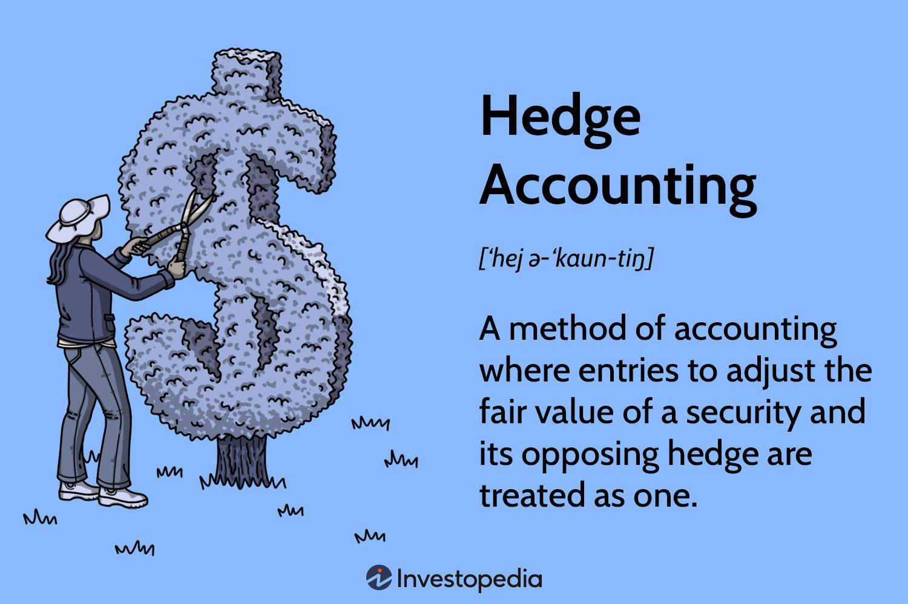

The financial landscape is characterized by constant evolution, driven by complexity and innovation. This dynamic environment necessitates that financial organizations adeptly navigate crucial components such as financial reporting, risk management, hedge accounting, and algorithmic trading. Understanding these interconnected elements is vital for operating effectively in today's financial ecosystem.

Financial reporting and risk management serve as the foundation for maintaining transparency and ensuring the accuracy of financial statements. These processes are essential in identifying potential threats and implementing control measures to mitigate risks, aligning with both internal and external regulatory requirements. Enhanced by technology and data analytics, risk management leverages real-time insights to detect reporting discrepancies, bolstering investor confidence and organizational credibility.



Hedge accounting emerges as a strategic approach to manage financial risk, particularly volatility. By synchronizing the gains and losses from hedging instruments with the items they offset, hedge accounting presents a clearer picture of an organization's financial performance. This method requires careful qualification and documentation, underscoring its role as a strategic, rather than mandatory, choice in risk management.

Algorithmic trading, or algo trading, revolutionizes the execution of trades through the use of computer algorithms. It offers advantages in speed, precision, and cost-efficiency, enabling traders to operate on a scale that surpasses manual trading capabilities. However, the associated risks—such as model risk and potential technological failures—demand robust risk management frameworks and adherence to regulatory guidelines. Algo trading is leveraged for strategies like market making and arbitrage, showcasing its pervasive influence in financial markets.

Integrating these components requires a comprehensive understanding and strategic approach to managing risk while exploiting opportunities. Balancing innovative trading technologies with risk management principles is crucial for fostering sustainable financial growth. Financial institutions that master this integration achieve higher transparency, efficiency, and resilience, positioning themselves advantageously in an ever-evolving financial landscape. Future advancements will continue to reshape these fields, urging stakeholders to maintain adaptability and vigilance.

## Table of Contents

## Understanding Financial Reporting Risk Management

Financial reporting risk management plays a pivotal role in ensuring the integrity and accuracy of financial statements, which are critical for safeguarding a company's financial health. The primary objective of this process is to identify potential threats that might affect financial reporting, assess their impact, and establish control measures to mitigate these risks effectively.

The process begins with threat identification, where organizations meticulously analyze both internal and external environments to pinpoint potential risks such as data inaccuracies, fraud, or regulatory non-compliance. Once identified, these risks are assessed to understand their potential impact on financial statements. This assessment typically involves quantifying risks, determining the likelihood of their occurrence, and evaluating the potential consequences.

To mitigate the identified risks, organizations implement robust control measures. These measures could range from enhancing data verification processes to implementing strict access controls and auditing procedures. The aim is to ensure that financial reporting aligns with both the organization's internal controls and the external regulatory landscape. This alignment is crucial for compliance with established standards such as the International Financial Reporting Standards (IFRS) or Generally Accepted Accounting Principles (GAAP).

Incorporating technology and data analytics significantly enhances the risk management process. Advanced analytics tools can process large volumes of data, detect anomalies, and provide real-time insights, allowing organizations to identify discrepancies promptly. This technological integration aids in proactive risk management, enabling companies to address issues before they escalate. By doing so, organizations can maintain investor confidence and uphold their credibility in financial markets.

Moreover, adopting a proactive approach encompasses regular risk assessments, continuous monitoring of financial transactions, and updating control mechanisms in response to evolving threats. This dynamic approach ensures that financial risk management is not a one-time exercise but an ongoing process that adapitates to changes in the financial landscape.

Ultimately, effective financial reporting risk management strengthens a company’s reputation by ensuring financial transparency and reliability, which are indispensable for maintaining stakeholder trust and securing long-term success.

## The Role of Hedge Accounting in Mitigating Volatility

Hedge accounting is an essential tool in financial risk management, allowing organizations to align the timing of gains and losses on hedging instruments with the items they are designed to hedge. This accounting method is particularly significant in mitigating the impact of [volatility](/wiki/volatility-trading-strategies) on financial statements, thus providing a more accurate reflection of a company’s financial health.

The primary purpose of hedge accounting is to smooth out fluctuations in an organization's reported earnings that arise from the volatility of financial markets. Without hedge accounting, derivatives and other hedging instruments would have to be marked-to-market, causing frequent and potentially misleading fluctuations in reported earnings. By matching these market fluctuations with the corresponding risk items they hedge, financial statements present a clearer and more stable picture of a company’s performance.

Hedge accounting entails three main types: 

1. **Fair Value Hedges**: These are used to hedge exposure to changes in the fair value of recognized assets or liabilities or firm commitments. For example, an interest rate swap can be used to hedge against interest rate fluctuations impacting the fair value of a fixed-rate debt instrument.

2. **Cash Flow Hedges**: These hedges aim to guard against exposure to variability in cash flows associated with a particular risk. A common example is using a futures contract to lock in prices for raw materials that a company needs in the future, thus mitigating cash flow volatility associated with price changes.

3. **Net Investment Hedges**: These hedges are used to protect against currency fluctuations affecting investments in foreign operations. They are similar to cash flow hedges but focus on the net investment in a foreign entity, using instruments like foreign currency debt or forward contracts to stabilize potential currency mismatches.

The method of hedge accounting allows the organization to treat both the hedging instrument and the hedged item as a combined entry for accounting purposes. This provides a more accurate depiction of financial stances by counterbalancing the gains and losses recognized on both ends.

However, the application of hedge accounting is not without restrictions. Implementing hedge accounting requires meeting stringent criteria for hedge effectiveness, rigorous documentation, and continuous evaluation of the hedge's performance. Organizations need to document at inception the relationship between the hedging instrument and the hedged item, their risk management objectives, and their strategy for undertaking the hedge.

While hedge accounting provides considerable benefits in terms of financial statement representation by minimizing earnings volatility, its application is a strategic choice due to the complexity and requirement of comprehensive documentation involved. Financial entities determine the applicability of hedge accounting based on their risk management strategies and the specific accounting implications involved.

## Algorithmic Trading: Revolutionizing Financial Markets

Algorithmic trading, commonly known as algo trading, involves the use of computer algorithms to automate the trading process, optimizing entry and [exit](/wiki/exit-strategy) points by exploiting market inefficiencies. This method offers several advantages over traditional trading techniques, including enhanced speed and accuracy, as well as significant cost reductions. The computational power of algo trading systems enables traders to execute transactions on a scale that is not feasible with manual trading practices.

### Advantages of Algorithmic Trading

**Speed and Accuracy**: Automated systems can interpret market data and execute trades in fractions of a second, which is considerably faster than a human can react. This speed ensures traders can capitalize on market fluctuations as they happen. The precision of algorithms reduces human error, providing greater accuracy in decision-making processes.

**Cost Reduction**: By minimizing the need for human intervention, algo trading reduces the costs associated with manual trading. This includes lowering transaction costs and reducing errors that can lead to financial losses.

### Risks of Algorithmic Trading

While algo trading offers several benefits, it also poses certain risks that require effective risk management strategies:

**Model Risk**: The accuracy of these trading algorithms depends heavily on the models they are based on. Flawed models can lead to incorrect trading decisions and significant financial losses.

**Market Impact**: High-frequency trading can lead to market disturbances. The sheer volume of trades executed by algorithms can affect market prices, leading to unintentional impacts on the markets.

**Technological Failures**: Algorithmic trading systems are susceptible to software bugs, hardware failures, and connectivity issues, which can lead to unintended trades or financial losses.

### Regulatory Frameworks

Regulators globally have developed guidelines and frameworks to mitigate the risks associated with [algorithmic trading](/wiki/algorithmic-trading). These guidelines emphasize the importance of transparency, with requirements for detailed reporting and record-keeping. Oversight mechanisms ensure that trading strategies comply with regulatory standards, protecting market integrity.

### Strategic Applications

Financial institutions employ algo trading for several strategic purposes:

- **Market Making**: Algorithms can continuously quote buy and sell prices, providing liquidity to the markets, and profiting from the bid-ask spread.

- **Arbitrage**: Algorithms can rapidly identify and exploit price discrepancies across different markets or financial instruments, securing risk-free profits.

- **Volume Trading**: Institutions use algorithms to trade large volumes of assets with minimal market impact. By intelligently breaking down large orders into smaller ones, algos ensure that trades do not significantly affect market prices.

In summary, algorithmic trading has transformed financial markets by introducing efficiency and scale. However, the associated risks necessitate robust risk management practices and compliance with regulatory standards. As technology and market conditions evolve, continuous adaptation and oversight remain essential.

## Integrating Risk Management with Algo Trading

Effective risk management in algorithmic trading is critical for maintaining operational resilience and regulatory compliance. This involves a comprehensive blend of technical, operational, and governance controls. By ensuring robust frameworks are in place, financial institutions can mitigate potential risks inherent in algorithmic trading.

One key strategy is the stress testing of trading algorithms across various market conditions. Stress testing enables the identification of vulnerabilities and aids in the calibration of algorithms to withstand adverse market scenarios. This preventative measure is crucial, as it ensures that trading operations remain stable even during periods of market volatility. Implementing fail-safes, such as automatic shutdown mechanisms or circuit breakers, provides additional layers of security against unanticipated failures or market anomalies.

The role of skilled personnel in the oversight of algorithmic models is indispensable. Expert staff are responsible for the continuous monitoring and validation of these models, ensuring that they function correctly and adapt to new market data. Their expertise in interpreting complex data patterns and model outputs is vital in identifying and mitigating model risks, such as those arising from algorithmic biases or erroneous data inputs.

Continuous monitoring through sophisticated analytics and data-driven insights enables dynamic responses to shifting market conditions. This requires the real-time collection and analysis of trade data, using [machine learning](/wiki/machine-learning) algorithms to identify emerging trends or anomalies. Python, for example, can be utilized to build real-time data pipelines and monitoring dashboards. The following Python code snippet illustrates a basic setup for monitoring trading data:

```python
import pandas as pd
import numpy as np

# Simulated trading data
data = pd.DataFrame({
    'prices': np.random.randn(1000).cumsum()
})

# Basic moving average calculation
data['moving_avg'] = data['prices'].rolling(window=50).mean()

# Identify anomalies based on a simple threshold
data['anomaly'] = np.abs(data['prices'] - data['moving_avg']) > 2 * data['prices'].std()

# Output anomalies
print(data[data['anomaly']])
```

Moreover, forging partnerships with technology providers plays a pivotal role in enhancing the infrastructure supporting algorithmic trading. Collaborating with technology partners ensures that trading systems are resilient and adhere to industry best practices. These partnerships facilitate access to cutting-edge solutions and innovations, such as advanced risk management tools and high-frequency trading capabilities, which are integral to maintaining a competitive edge in the market.

In summary, integrating risk management with algorithmic trading demands a multi-faceted approach, combining stress testing, expert oversight, real-time monitoring, and strategic collaborations. By implementing these measures, financial institutions can navigate the complexities of algorithmic trading while safeguarding against potential risks.

## Conclusion

The intersection of financial reporting risk management, hedge accounting, and algorithmic trading is fundamental for today's financial strategies. Successfully navigating these interconnected areas requires a thorough understanding and strategic deployment to manage risks and leverage emerging opportunities. Integration is key—organizing systems to benefit from advancements across these practices enables organizations to manage vulnerabilities better and enhance decision-making processes.

Aligning cutting-edge trading technologies with robust risk management frameworks supports sustainable financial growth. The ability to balance innovation with regulatory commitments ensures that financial entities remain agile while adhering to stringent standards. By making informed decisions grounded in comprehensive data analytics, organizations can maintain investor trust and operational integrity.

Adopting hedge accounting allows companies to effectively smooth the volatility that might otherwise distort financial outcomes, granting them a clearer view of their economic performance. Similarly, algorithmic trading offers speed and precision but requires rigorous oversight to mitigate associated risks. Embedding these practices within strong risk management systems facilitates adaptability and resilience, ensuring financial institutions can swiftly react to market shifts and regulatory changes.

Looking ahead, the financial landscape will likely undergo continuous transformation. Technological advancements will bring about new tools and methodologies, necessitating perpetual adaptation by stakeholders. Vigilant oversight and innovative thinking will remain crucial, enabling institutions to exploit the full potential of modern financial practices while maintaining stability and foresight in an ever-evolving market.

## References & Further Reading

[1]: Christensen, H. B., & Nikolaev, V. V. (2010). ["Who uses fair-value accounting for non-financial assets after IFRS adoption?"](https://www.semanticscholar.org/paper/Who-uses-fair-value-accounting-for-non-financial-Christensen-Nikolaev/ff5ec084126b23726cbd6d6465bb885218024391) Journal of Accounting and Economics, 50(2-3), 201-220.

[2]: Hull, J. C. (2006). ["Options, Futures, and Other Derivatives"](https://www-2.rotman.utoronto.ca/~hull/ofod/index.html) (8th ed.). Prentice Hall.

[3]: Chincarini, L. B., & Kim, D. (2006). ["Quantitative Equity Portfolio Management: An Active Approach to Portfolio Construction and Management"](https://www.mhebooklibrary.com/doi/book/10.1036/9781264268931) McGraw-Hill.

[4]: Patel, K., Pickard, A., & Patra, B. K. (2019). ["Algorithmic Trading & DMA: An introduction to direct access trading strategies"](https://www.semanticscholar.org/paper/Algorithmic-trading-%26-DMA-%3A-an-introduction-to-Johnson/aa5de1ab883d5e23b6651faa7c1807586d688e4b) 4Myeloma Press.

[5]: Cumming, D., & Johan, S. (2017). ["The Problems of High-Frequency Trading: Perspectives, Pathways and Solutions"](https://onlinelibrary.wiley.com/doi/abs/10.1002/sej.1265) Oxford University Press.