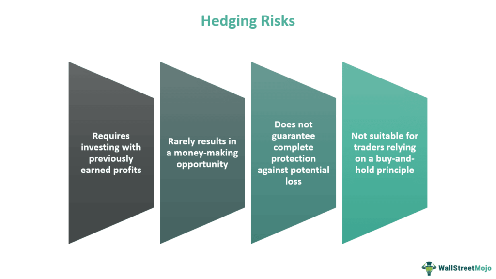

The financial industry is marked by intricate terminologies and concepts that form the backbone of its legal security and operational flow. One such concept of considerable importance within financial contracts is that of hedge clauses, especially relevant in the context of algorithmic trading. These clauses play a crucial role in delineating the boundaries of risk and liability, thereby facilitating smoother transactions in an environment characterized by volatility and rapid market movements.

The purpose of this article is to examine the concept of hedge clauses as they pertain to the legal frameworks of financial contracts, with a particular focus on their application in algorithmic trading. Hedge clauses are utilized as a form of risk management, assisting in the redistribution of risk to mitigate financial liabilities. They become especially pertinent as algorithmic trading continues to grow in complexity and impact, requiring precise legal tools to manage unpredictable outcomes resulting from automated decisions.

This article will offer insights into the operation of hedge clauses, exploring their legal implications and the ways in which they provide protection against financial liabilities. By addressing these aspects, we aim to provide a comprehensive understanding of how hedge clauses contribute to the financial ecosystem, ensuring both legal compliance and operational efficiency. Ultimately, the reader will gain an understanding of the fundamental role hedge clauses play in maintaining stability and security in financial transactions within dynamic markets.

## Table of Contents

## Decoding Hedge Clauses

Hedge clauses are integral components of financial documents, utilized primarily to delineate and limit the liability of the entity issuing the document, typically an investment advisor or financial planner. These provisions function as vital risk management mechanisms, redistributing a certain degree of risk back to clients, especially under circumstances that fall outside the advisor's direct control.

The operational basis of hedge clauses lies in their ability to specify liability constraints under various unpredictable market scenarios. This specification is crucial for protecting the parties involved from unforeseen financial disruptions. In essence, hedge clauses enact a safety net, clarifying the extent to which the issuing entity is accountable for financial outcomes.

These provisions gain heightened significance in the context of algorithmic trading. Algo trading, characterized by rapid, automated transactions driven by complex algorithms, inherently involves substantial market volatility. Such volatility introduces unique challenges that hedge clauses are well-suited to mitigate. By employing hedge clauses, firms can effectively manage the unpredictability engendered by algorithmic decisions.

For instance, a hedge clause in an algo trading agreement might stipulate that the advisor or firm is not liable for losses incurred under market conditions where algorithmic models fail to predict sudden market shifts accurately. Through these clauses, financial institutions holding fiduciary responsibilities can protect themselves legally while maintaining transparency with their clients.

By explicitly outlining these limitations within the contractual framework, hedge clauses facilitate a mutual understanding of risk parameters. This clarity not only fosters a well-defined boundary of liability but also enhances the trust and communication between advisors and clients. In environments prone to rapid fluctuations, such as those encountered in modern financial markets, the precise delineation provided by hedge clauses ensures all parties remain adequately informed and safeguarded against unforeseen financial hazards.

## Legal Structure and Implications

Hedge clauses must be crafted with precision to ensure their enforceability while adhering to regulatory standards such as those set by the U.S. Securities and Exchange Commission (SEC). A well-drafted hedge clause typically includes disclaimers and limitations on liability pertaining to uncontrollable events, thereby emphasizing the service provider's adherence to financial regulations.

For example, such clauses may specify that an investment advisor shall not be held liable for losses resulting from unforeseeable market [volatility](/wiki/volatility-trading-strategies), natural disasters, or other events beyond their control. This delineation is crucial in [algorithmic trading](/wiki/algorithmic-trading), where market parameters change rapidly and unpredictably. The clauses serve to protect advisors from being held accountable for outcomes that were influenced by extraneous factors beyond their predictive capacity.

However, the misuse or overreach in the application of hedge clauses can result in significant legal scrutiny. Overambitious hedge clauses risk misleading investors, potentially giving rise to investor grievances and claims that the clauses were designed to absolve advisors of their fiduciary responsibilities. This scrutiny is particularly relevant in settings regulated by the SEC, which seeks to protect investors from fraudulent or misleading practices. The SEC's stance implies that hedge clauses must not negate the fiduciary duties owed to clients, which include loyalty and care. 

In algorithmic trading, hedge clauses must align with prevailing legal frameworks to maintain trust and operational legitimacy. This requires constant evaluation and updating of the clauses according to changes in the legal and market landscape. Compliance ensures that investors are fully informed about the extent of risk they undertake and the limitations on potential advisories’ liabilities. Clear and effective communication of these clauses to clients fosters transparency and confidence in the automated trading processes.

In summary, the precision with which hedge clauses are drafted defines their success in balancing risk management with regulatory compliance. Financial professionals must navigate this delicate intersection to sustain both marketplace integrity and client trust.

## The Role of Hedge Clauses in Algo Trading

Algorithmic trading, commonly known as algo trading, is characterized by the execution of trading strategies via computer algorithms at speeds and frequencies impossible for human traders. The inherent risk and unpredictability in such high-speed market interactions necessitate robust protective measures like hedge clauses. These clauses are vital for delineating the boundaries of liability for automated trading decisions that may not yield the desired results due to market volatility or system errors.

Hedge clauses in algo trading contracts act as a legal safeguard by explicitly defining the extent of responsibility that an investment advisor or firm holds for outcomes influenced by automated processes. They are designed to specify which scenarios would lead to the advisor being held liable and which would not, thereby providing a buffer against financial repercussions caused by factors beyond the advisor’s control.

In a rapidly evolving trading environment governed by algorithmic strategies, hedge clauses establish a clear framework to manage expectations and responsibilities. By clarifying which outcomes are considered within the liability boundaries of the advisor and which fall outside due to unpredictable market forces, these clauses provide essential legal coverage. This not only protects the advisor but also ensures that investors have a transparent understanding of their potential risks and liabilities.

Effective communication with clients about the implications of hedge clauses is critical. Clear articulation of these terms can foster trust and transparency, crucial for maintaining strong client-advisor relationships. Clients must be informed about the specific conditions under which the advisor is not liable for losses incurred due to automated trading decisions, ensuring that both parties have a mutual understanding of the agreement's protective measures.

In summary, hedge clauses are indispensable in the context of algo trading, offering a vital mechanism for limiting liability and facilitating transparent client interactions. They enable financial advisors and firms to operate with certainty and legitimacy amidst the uncertainties of algorithm-driven market dynamics.

## Challenges and Considerations

Hedge clauses play a critical role in financial contracts, particularly when it comes to mitigating liabilities in volatile trading environments. However, their effective implementation encounters several challenges, primarily due to the potential for legal disputes stemming from ambiguous language. The language used within hedge clauses must be precise and unambiguous to avoid interpretations that could lead to conflicts between the contracting parties. This precision is essential because ambiguous language can lead to different interpretations, increasing the risk of litigation. 

A significant challenge is ensuring that hedge clauses protect the advisor or financial entity from unforeseen liabilities while not infringing upon the rights and expectations of the client. Achieving this balance requires a careful construction of clauses that offer necessary protections to advisors without excessively biasing the terms against the clients' interests. This balance is crucial to maintaining trust and fairness, avoiding situations where clients feel that their protection is undermined.

Regulatory scrutiny also poses a significant challenge to the enforceability of hedge clauses. Regulatory bodies, such as the U.S. Securities and Exchange Commission (SEC), often oversee the fairness and transparency of these clauses to ensure they are not misleading or detrimental to investors' protections. Financial entities must, therefore, ensure that hedge clauses adhere strictly to regulatory standards. This necessity for compliance requires that these clauses are drafted with utmost clarity and fairness to stand up to regulatory evaluations.

Moreover, the dynamic nature of legal frameworks governing financial contracts necessitates continual monitoring and adjustment of hedge clauses. Regulatory landscapes evolve with new rules and guidelines that can render existing clause structures obsolete or non-compliant. Therefore, financial professionals must stay informed about ongoing legal and regulatory updates. This vigilance ensures that financial contracts are always aligned with current legal standards, thereby safeguarding both the institution and its clients against potential disputes and regulatory penalties.

In summary, while hedge clauses are indispensable for risk management in algorithmic trading and other financial operations, their effective implementation requires careful attention to linguistic clarity, equitable protection for all parties, regulatory compliance, and adaptability to legal developments.

## Conclusion

Hedge clauses are essential elements in financial contracts, acting as vital safeguards against the inherent uncertainties of financial markets, particularly in algorithmic trading. By clearly defining the boundaries of liability and ensuring alignment with legal standards, these clauses protect both investors and financial advisors from the adverse effects of market volatility. They provide a structured framework within which financial activities can operate securely, minimizing potential disputes and fostering a clearer understanding of risk allocation.

For investors, a firm grasp of how hedge clauses function aids in making informed decisions, understanding the limitations of coverage, and appreciating the protections available against unforeseen losses. Financial advisors benefit by having a clear demarcation of their responsibilities, providing them with the confidence to engage in sophisticated trading strategies without undue exposure to legal or financial repercussions.

As the financial landscape continues to evolve, driven by technological advancements and shifting legal frameworks, hedge clauses will likely adapt in complexity and application. Emerging trends and regulatory developments necessitate a proactive approach by financial entities to stay informed and compliant. This adaptability ensures that hedge clauses remain robust tools for managing liability and maintaining trust between financial professionals and their clients, ultimately contributing to more resilient financial operations.

## References & Further Reading

[1]: Bergstra, J., Bardenet, R., Bengio, Y., & Kégl, B. (2011). ["Algorithms for Hyper-Parameter Optimization."](https://dl.acm.org/doi/10.5555/2986459.2986743) Advances in Neural Information Processing Systems 24.

[2]: ["Advances in Financial Machine Learning"](https://www.amazon.com/Advances-Financial-Machine-Learning-Marcos/dp/1119482089) by Marcos Lopez de Prado

[3]: ["Evidence-Based Technical Analysis: Applying the Scientific Method and Statistical Inference to Trading Signals"](https://www.amazon.com/Evidence-Based-Technical-Analysis-Scientific-Statistical/dp/0470008741) by David Aronson

[4]: ["Machine Learning for Algorithmic Trading"](https://github.com/stefan-jansen/machine-learning-for-trading) by Stefan Jansen

[5]: ["Quantitative Trading: How to Build Your Own Algorithmic Trading Business"](https://github.com/LucindaYa/quant-resources/blob/master/Quantitative%20Trading%20How%20to%20Build%20Your%20Own%20Algorithmic%20Trading%20Business.pdf) by Ernest P. Chan