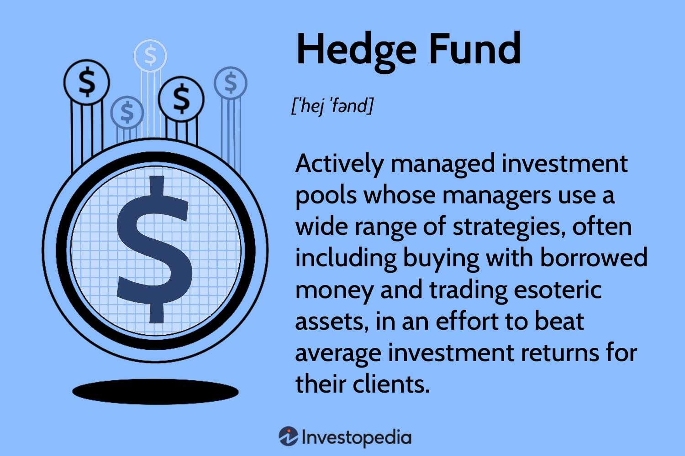

In the fast-paced world of finance, the integration of investment management, hedge strategies, and algorithmic trading is significantly altering the landscape for traders and institutions. Algorithmic trading, which utilizes a series of sophisticated algorithms, has revolutionized traditional investment practices by enhancing both the speed and efficiency of trading operations. These algorithms are designed to analyze market data and execute trades automatically, thereby minimizing human intervention and error.

Hedge funds, in particular, leverage algorithmic trading to not only refine investment strategies but also manage risks more effectively. By employing algorithms, hedge funds can swiftly respond to various market conditions, capitalize on fleeting opportunities, and protect against adverse market movements. This intersection of technology and finance has opened new avenues for profit, albeit with its own set of challenges.



This article examines how hedge funds harness algorithmic trading to boost their performance while navigating risks. It further discusses the mechanisms that underpin algorithmic trading, highlighting both its advantages, such as speed and cost reduction, and its potential drawbacks, like technical failures and market volatility risks. Additionally, it explores how algorithmic trading influences the performance and risk management strategies of hedge funds.

We also provide a glimpse into the current advancements and considerations within the field, offering valuable insights for traders, whether they are novices or seasoned professionals. As technology continues to evolve, understanding and leveraging algorithmic trading becomes increasingly essential for achieving financial goals in today's rapidly changing market environment.

## Table of Contents

## Understanding Algorithmic Trading

Algorithmic trading leverages computer algorithms to execute buy and sell orders in financial markets based on predefined criteria such as timing, price, and quantity. This process reduces the manual intervention typically required in trading by automating decision-making, ensuring trades are carried out at optimal prices, and minimizing human error.

This automated approach relies on a variety of strategies. Trend-following is one such strategy, where algorithms identify and exploit market trends by tracking price movements, informed by technical indicators like moving averages. Arbitrage strategies, on the other hand, involve capitalizing on price discrepancies of the same asset across different markets, aiming for risk-free profit. Another common application is in index fund rebalancing, where algorithms automatically adjust holdings to match a particular index.

High-frequency trading ([HFT](/wiki/high-frequency-trading-strategies)) represents a specialized form of [algorithmic trading](/wiki/algorithmic-trading). It involves executing a high [volume](/wiki/volume-trading-strategy) of orders at microsecond speeds, taking advantage of minute price discrepancies. HFT demands advanced infrastructure and technology, such as low-latency trading systems, to achieve rapid execution and data processing speeds, maximizing market opportunities and [liquidity](/wiki/liquidity-risk-premium) provision.

With technological advancements, algorithmic trading has become more accessible beyond institutional investors like hedge funds or financial institutions, reaching individual traders as well. Retail traders can now access algorithmic trading platforms and tools, allowing them to design, test, and deploy their strategies. Programming languages such as Python are commonly used to develop these algorithms, benefiting from libraries and frameworks tailored for financial data analysis and [backtesting](/wiki/backtesting).

Thus, algorithmic trading represents a significant innovation in financial markets, offering enhanced efficiency and opening doors to a broader range of market participants. However, participants must maintain a solid understanding of both the financial and technical aspects to craft successful algorithmic trading strategies.

## The Role of Hedge Funds in Algorithmic Trading

Hedge funds are increasingly deploying algorithmic trading as a key component to boost portfolio performance and manage risk effectively. This sophisticated approach leverages predictive models, statistical analysis, and [machine learning](/wiki/machine-learning) algorithms to optimize trading strategies and engage in high-frequency trading activities.

Algorithmic strategies in hedge funds often deploy predictive models that utilize historical data to forecast future price movements. These predictions are achieved through complex statistical techniques and machine learning algorithms, which are designed to identify patterns and correlations that are not immediately obvious to human traders. For example, machine learning models can be trained to recognize specific market conditions that precede profitable trading opportunities.

By implementing these algorithms, hedge funds can promptly adapt to changing market conditions and capitalize on [arbitrage](/wiki/arbitrage) opportunities. Arbitrage involves taking advantage of small price discrepancies of the same asset in different markets. The rapid execution capabilities of algorithmic trading make it possible to exploit these disparities, making trades in fractions of a second that capitalize on fleeting opportunities before they disappear.

Moreover, algorithmic trading enables hedge funds to hedge against unfavorable market movements. Through automated systems, hedge funds can execute complex hedging strategies, which involve taking offsetting positions to mitigate potential losses. This is achieved by employing algorithm-driven models that adjust positions swiftly in response to market news and events, thereby reducing exposure to risk.

The high-speed nature of algorithmic trading positions hedge funds to benefit significantly from small price fluctuations. In high-frequency trading, where trades are executed in milliseconds, the potential for profit is tied closely to the sheer volume of transactions and the ability to act faster than other market participants. This requires not only sophisticated algorithms but also a robust technological infrastructure to ensure minimal latency and maximize execution efficiency.

Despite its advantages, algorithmic trading within hedge funds demands rigorous testing and a robust risk management framework. Articles of risk, such as technical failures and data mismatches, can lead to significant financial losses. As a result, hedge funds implement stringent testing protocols and continuously monitor the performance of their algorithms to ensure they respond accurately to real-time data. Risk management systems are designed to mitigate potential losses by setting predefined stop-loss thresholds and employing diversification strategies to reduce the impact of adverse market movements.

In conclusion, the integration of algorithmic trading within hedge funds supports enhanced performance and risk management. By utilizing advanced analytical tools and technologies, hedge funds exploit market inefficiencies efficiently. Nonetheless, this requires ongoing development and oversight to maintain a competitive edge and safeguard against emerging risks.

## Advantages and Disadvantages of Algorithmic Trading

One of the key advantages of algorithmic trading is its speed and efficiency. Automated systems execute trades in fractions of a second, far quicker than manual trading. This rapid execution reduces the market impact and slippage, optimizing transaction costs. Furthermore, such systems can simultaneously scan multiple markets and assets for trading opportunities, ensuring traders capitalize on favorable conditions.

Algorithmic trading systems are designed to eliminate emotions from trading decisions. Emotions such as fear and greed can impair judgment; algorithms operate based on predefined criteria, offering rational and objective trade execution. This systematic approach ensures consistency in executing trading strategies, minimizing human error.

However, algorithmic trading is not without its disadvantages. Technical failures pose significant risks, as software or hardware malfunctions can lead to substantial losses. For example, if an algorithm malfunctions during volatile market conditions, it might execute trades erroneously or fail to execute planned trades, impacting the overall trading strategy.

The market [volatility](/wiki/volatility-trading-strategies) risk is another challenge. Rapid and unexpected market movements can lead to substantial discrepancies between expected outcomes and actual trading performance. Moreover, algorithms that operate across multiple markets may inadvertently contribute to heightened volatility. Instances such as the Flash Crash of 2010 illustrate how algorithmic trading can exacerbate market instability, amplifying sudden price changes.

The complexity of algorithmic trading systems can occasionally lead to over-optimization. Strategies fine-tuned to perform exceptionally in backtesting with historical data may not necessarily replicate those results in live trading. Market conditions are continually evolving, and what worked in past scenarios may not be effective in the current environment. This phenomenon, often referred to as "curve-fitting," underscores the need for robust testing and adaptability in algorithmic models.

Finally, algorithmic trading's reliance on technology necessitates constant updates and monitoring. Financial markets are subject to regulatory changes, and algorithms must be compliant with these evolving standards. Continuous advancements in technology mean that algorithms require regular refinement and maintenance to ensure competitive performance and adherence to legal frameworks. Traders must remain vigilant, regularly updating systems and strategies to reflect current market conditions and technological innovations.

## Getting Started with Algorithmic Trading

For individuals keen on embarking on algorithmic trading, acquiring programming skills and a comprehensive understanding of financial markets are paramount initial steps. Languages such as Python, with its extensive library support for quantitative analysis and data handling, or C++, known for its execution speed, serve as valuable tools for developing and implementing trading algorithms.

A critical aspect of algorithmic trading is devising a robust trading strategy. This involves creating algorithms that can be rigorously backtested using historical market data. Backtesting allows traders to evaluate the viability of strategies under past market conditions and is instrumental in predicting future performance, reducing the risk of employing ineffective strategies. A common approach in backtesting is using Python's `pandas` and `numpy` libraries to manipulate and analyze historical data. An example code snippet for backtesting a simple moving average strategy might look like this:

```python
import pandas as pd

# Load historical data
data = pd.read_csv('historical_data.csv')

# Calculate moving averages
data['SMA_50'] = data['Close'].rolling(window=50).mean()
data['SMA_200'] = data['Close'].rolling(window=200).mean()

# Generate trading signals
data['Signal'] = 0
data['Signal'][50:] = np.where(data['SMA_50'][50:] > data['SMA_200'][50:], 1, 0)

# Backtest strategy
data['Position'] = data['Signal'].diff()
print(data[['Close', 'Signal', 'Position']])
```

The emergence of platforms and tools has democratized access to algorithmic trading, enabling traders at all experience levels to craft and test their strategies. Platforms such as MetaTrader, QuantConnect, and Alpaca offer capabilities ranging from strategy development to simulation and live trading execution. These platforms often integrate with brokerage accounts, facilitating the seamless execution of trades based on the algorithms formulated by traders.

For effective real-time trade execution, integration with brokerage accounts that support algorithmic trading is essential. This integration ensures that trading algorithms can execute trades with minimal latency, capitalizing on market opportunities as they arise.

Continual education is crucial for aspiring algo-traders to remain competitive in the ever-evolving financial ecosystem. Keeping abreast of market trends, technological advancements, and regulatory changes is imperative. Engaging with financial news outlets, academic publications, and participating in trading forums can be valuable activities for gaining insights. Moreover, remaining informed about emerging technologies like machine learning can provide competitive advantages in developing sophisticated algorithmic strategies.

In summary, getting started with algorithmic trading involves a blend of programming prowess, strategic development, utilization of trading platforms, brokerage integration, and ongoing education, all of which are essential for aspiring traders to effectively harness the capabilities of algorithmic trading.

## Conclusion

Algorithmic trading, characterized by its reliance on complex algorithms and computing power, has fundamentally transformed the investment finance landscape. This technological advancement provides hedge funds and individual traders with powerful tools to execute trades with unmatched speed and precision. The swift execution capability not only minimizes transaction costs but also exploits fleeting market opportunities that are beyond the reach of traditional trading methods.

Effective utilization of algorithmic trading requires a deep understanding of both technology and market dynamics. This dual expertise ensures that traders can develop, test, and deploy trading strategies that are both robust and adaptable to changing market conditions. For example, a trader might use Python to construct a simple moving average crossover strategy:

```python
import pandas as pd

def moving_average_strategy(data, short_window=40, long_window=100):
    signals = pd.DataFrame(index=data.index)
    signals['price'] = data['Close']
    signals['short_mavg'] = data['Close'].rolling(window=short_window, min_periods=1).mean()
    signals['long_mavg'] = data['Close'].rolling(window=long_window, min_periods=1).mean()
    signals['signal'] = 0.0

    signals['signal'][short_window:] = \
        np.where(signals['short_mavg'][short_window:] > signals['long_mavg'][short_window:], 1.0, 0.0)

    signals['positions'] = signals['signal'].diff()
    return signals

# Example usage
# data = pd.read_csv('stock_data.csv')
# signals = moving_average_strategy(data)
```

The ability of algorithmic systems to process massive datasets and execute trades in milliseconds positions them as enduring fixtures in financial markets. As technology evolves, the role of algorithmic trading will likely expand, presenting both new opportunities and challenges across various market segments. Improvements in machine learning and [artificial intelligence](/wiki/ai-artificial-intelligence) offer promising avenues for even more sophisticated trading mechanisms. 

Traders and institutions that effectively leverage these technologies while maintaining rigorous risk management practices are better poised to achieve their financial objectives. However, the dependencies on technology necessitate ongoing vigilance to adapt to regulatory changes and safeguard against vulnerabilities such as flash crashes. As the financial ecosystem continues to evolve, professionals who align their strategies with these cutting-edge tools stand to benefit from the sustained growth and efficiency that algorithmic trading heralds.

## References & Further Reading

[1]: Bergstra, J., Bardenet, R., Bengio, Y., & Kégl, B. (2011). ["Algorithms for Hyper-Parameter Optimization."](https://papers.nips.cc/paper/4443-algorithms-for-hyper-parameter-optimization) Advances in Neural Information Processing Systems 24.

[2]: ["Advances in Financial Machine Learning"](https://www.amazon.com/Advances-Financial-Machine-Learning-Marcos/dp/1119482089) by Marcos Lopez de Prado

[3]: ["Evidence-Based Technical Analysis: Applying the Scientific Method and Statistical Inference to Trading Signals"](https://www.amazon.com/Evidence-Based-Technical-Analysis-Scientific-Statistical/dp/0470008741) by David Aronson

[4]: ["Machine Learning for Algorithmic Trading"](https://github.com/PacktPublishing/Machine-Learning-for-Algorithmic-Trading-Second-Edition) by Stefan Jansen

[5]: ["Quantitative Trading: How to Build Your Own Algorithmic Trading Business"](https://www.amazon.com/Quantitative-Trading-Build-Algorithmic-Business/dp/1119800064) by Ernest P. Chan