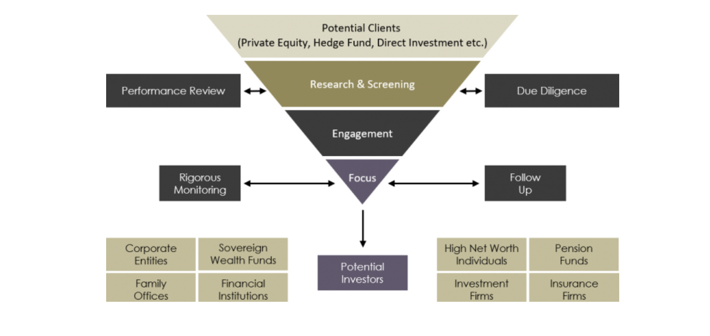

Raising capital is a fundamental aspect for hedge funds, representing a critical step in their establishment and growth within the financial market. In essence, capital raising for hedge funds involves accumulating assets under management (AUM) from various investors. This capital is then employed in diverse investment strategies, aimed at achieving returns that are not typically correlated with broader market indices.

The significance of capital raising in hedge funds cannot be overstated. It's not just about having the funds to invest; it's about creating a stable base from which the fund can operate, innovate, and grow. The amount of capital a hedge fund manages often serves as a barometer of its success and viability in a highly competitive market. This success, in turn, attracts more investors, creating a cycle of growth and expansion.

Moreover, the process of capital raising is tightly intertwined with the reputation and perceived performance of the hedge fund. Investors, whether institutional or individual, are drawn to funds that demonstrate a robust track record, sound risk management practices, and clear, compelling investment strategies.

## Table of Contents

## Fundamentals of Hedge Fund Capital

### How Hedge Funds Raise Money

Raising money is a critical function in the lifecycle of a [hedge fund](/wiki/hedge-fund-trading-strategies). The process is multi-faceted, requiring a blend of strategic planning, networking, and financial acumen. At its core, hedge fund [capital raising](/wiki/hedge-fund-capital-raising) revolves around sourcing funds from a range of investors who are willing to entrust their capital to the fund’s management team in exchange for the promise of returns.

1. The first step in this journey often involves the creation of a **compelling investment thesis**. This thesis, which outlines the fund's strategy, expected returns, risk management practices, and unique selling points, forms the basis of any capital raising effort. It's the hook that catches an investor's interest and lays the foundation for further discussions.
2. Next, hedge funds typically engage in **extensive networking** and relationship building. This involves reaching out to potential investors, which can range from high-net-worth individuals and family offices to institutional investors like pension funds, endowments, and foundations. Building these relationships requires a deep understanding of the investor's goals, risk tolerance, and investment horizons.
3. In tandem with networking, **effective communication** is key. This often involves crafting detailed presentations, investment memorandums, and financial models that transparently convey the fund's strategy and potential. Transparency and clarity are paramount as they help build trust—a crucial element in convincing investors to commit their capital.
4. Moreover, hedge funds often leverage **roadshows and investor meetings** as platforms to present their investment thesis and team capabilities. These interactions provide opportunities for fund managers to articulate their vision, answer queries, and directly engage with potential investors.
5. Throughout the capital raising process, the hedge fund must also navigate a complex web of **regulatory requirements**. Compliance with these regulations is not just a legal necessity; it also reassures investors of the fund's commitment to ethical and professional standards.
6. Finally, once the **investors are convinced**, the process moves towards formalizing the investment through legal agreements and the transfer of funds. This phase underscores the importance of having robust legal and operational frameworks in place.

In summary, raising capital for a hedge fund is a comprehensive process that demands a clear strategy, strong relationships, effective communication, regulatory compliance, and operational excellence. These elements combined enable a hedge fund to successfully attract and secure the capital necessary for its investment endeavors.

### Hedge Fund Fee Structures

Hedge fund fee structures play a pivotal role in the ecosystem of capital raising. Typically, these structures are built around two main types of fees: the management fee and the performance fee. Understanding these fees is crucial for both fund managers and potential investors.

The **management fee** is charged for the ongoing operation of the fund, usually calculated as a percentage of the fund's total assets under management (AUM). Commonly, this fee ranges from 1% to 2% annually. It covers operational costs, including administrative expenses, staff salaries, and overheads. This fee is crucial for the fund's sustainability, ensuring that the fund can operate effectively irrespective of its performance.

The **performance fee**, on the other hand, is tied to the fund’s profitability. Often set at around 20% of the fund's annual profits, this fee aligns the interests of the fund managers with those of the investors. By [earning](/wiki/earning-announcement) a significant part of their income based on performance, fund managers are incentivized to generate higher returns. However, it's essential to note that some funds may implement a hurdle rate or high-water mark, ensuring that performance fees are only charged on profits that exceed a certain benchmark or previous peak.

The interplay of these fees significantly impacts capital raising. A fund with a high management fee might deter some investors, particularly if it does not have a strong performance history to justify the cost. Conversely, a fund that has consistently delivered high returns may find it easier to attract investors despite a higher fee structure.

Moreover, the transparency and clarity in the communication of fee structures are vital. Investors are increasingly scrutinous about where and how their money is spent. Clear, fair, and justified fees can foster trust and confidence, which are fundamental in capital raising efforts.

In summary, hedge fund fee structures are not just a matter of compensating fund managers; they are a critical aspect of the fund's overall value proposition to investors. Striking the right balance between rewarding fund managers and offering a compelling investment case to investors is key to successful capital raising in hedge funds.

## The Current Landscape

The current landscape of hedge fund capital raising is shaped by a confluence of market dynamics, investor preferences, and global economic trends. In recent years, the industry has seen both challenges and opportunities that redefine how funds attract and maintain capital.

One notable trend is the increasing competition for investor capital. With a multitude of hedge funds in the market, each vying for a share of investor wealth, **differentiation has become key**. Funds are now more focused on demonstrating unique value propositions, whether through **specialized strategies**, **superior risk-adjusted returns**, or **niche market focuses.** This competition has led to more innovative approaches in investment strategies and fund management.

Another significant aspect is the **evolving investor base**. Institutional investors, such as pension funds, endowments, and family offices, have become more prominent players in the hedge fund industry. Their large capital bases and long-term investment horizons are influencing the way hedge funds operate and market themselves. As a result, there is a greater emphasis on transparency, governance, and alignment of interests between hedge funds and their investors.

**Global financial dynamics** also play a crucial role. Economic downturns, market volatility, and geopolitical tensions can impact investor sentiment and capital flows. For instance, periods of market stress often lead to increased demand for hedge funds that can provide downside protection and non-correlated returns. Conversely, in bull markets, investors may seek more aggressive growth-oriented strategies.

**Regulatory changes** are another critical factor affecting capital raising. Stricter regulations in the aftermath of financial crises have led to increased compliance costs and operational complexities. Hedge funds have to navigate these regulatory waters carefully, balancing compliance with the need to remain agile and competitive.

In conclusion, the landscape of hedge fund capital raising is multifaceted and constantly evolving. Success in this environment requires a deep understanding of market dynamics, investor needs, and global economic trends, coupled with the ability to adapt and innovate continuously.

## Targeting Investors

### Role of Institutional Investors

Institutional investors play a pivotal role in hedge fund capital raising, often serving as the backbone of a fund's investor base. These entities, including pension funds, insurance companies, endowments, and sovereign wealth funds, command significant financial resources and invest large sums in hedge funds, seeking diversified returns.

The influence of institutional investors extends beyond their capital contributions. They are known for conducting thorough due diligence, which sets a high bar for hedge funds to meet in terms of transparency, risk management, and performance. Meeting these stringent criteria can enhance a hedge fund's reputation and credibility, making it more attractive to a wider range of investors.

Furthermore, institutional investors tend to have longer investment horizons compared to individual investors. This long-term commitment provides hedge funds with more stable capital bases, enabling them to pursue strategies that may take longer to come to fruition.

However, the demands and expectations of institutional investors also shape the strategies and operations of hedge funds. They often seek lower fee structures, greater alignment of interests, and specific investment themes, such as [ESG](/wiki/esg-investing) (Environmental, Social, and Governance) [factor](/wiki/factor-investing)s, influencing how funds structure their offerings and operations.

Institutional investors are not just significant sources of capital for hedge funds; they are also key drivers of industry standards and practices. Hedge funds aiming to attract and retain these investors must align with their expectations and requirements, particularly in aspects of operational integrity, strategic clarity, and performance consistency.

### Identifying Potential Investors

Successfully identifying and targeting the right investors is crucial for hedge funds in their capital raising efforts. This process is nuanced and demands a strategic approach, tailored to the fund's specific goals and investment strategy. Here are key strategies to consider:

1. **Investor Profiling and Segmentation**: Start by profiling potential investors. This involves segmenting them into categories such as high-net-worth individuals, family offices, pension funds, endowments, foundations, and sovereign wealth funds. Understanding the characteristics, investment preferences, and risk appetites of each segment can help in tailoring your approach.
2. **Aligning Fund Characteristics with Investor Needs**: Investors are drawn to funds that align with their investment goals and risk tolerance. A fund specializing in long-term growth strategies might appeal more to pension funds or endowments, while those offering quicker, high-risk returns might attract high-net-worth individuals.
3. **Leveraging Industry Events and Networking Opportunities**: Attend industry events, seminars, and conferences to network with potential investors. These platforms offer opportunities to meet a wide range of investors, understand their interests, and build relationships.
4. **Utilizing Data and Analytics**: Use data-driven insights to identify potential investors. Analyzing historical investment trends, investor profiles, and market data can provide a clearer picture of who might be interested in your fund.
5. **Engaging with Investment Consultants and Advisors**: Investment consultants and advisors can be gatekeepers to large pools of capital, especially with institutional investors. Establishing relationships with these professionals can lead to introductions and recommendations to their clients.
6. **Digital Presence and Online Marketing**: In today’s digital world, a strong online presence can attract potential investors. A professional website, informative content, and active social media channels can enhance visibility and credibility.
7. **Referrals and Word of Mouth**: Leverage existing investors and professional networks for referrals. Satisfied investors are often willing to refer their peers, making this an effective way to expand your investor base.
8. **Tailored Communication and Presentations**: When approaching potential investors, customize your communication and presentations to address their specific interests and concerns. This personalized approach demonstrates your commitment to meeting their investment needs.

Remember, identifying the right investors is not just about increasing capital. It's also about building a stable and mutually beneficial relationship that aligns with the fund’s strategies and goals.

## Building a Strong Foundation

[https://www.youtube.com/watch?v=5daXfre6sxE](https://www.youtube.com/watch?v=5daXfre6sxE)

### Importance of a Solid Track Record

In the world of hedge funds, a solid track record is often the cornerstone of successful capital raising. It stands as a testament to the fund’s ability to deliver results and manage risk effectively. Here’s why a strong performance history is crucial in attracting investors:

1. **Demonstrates Expertise and Reliability**: A proven track record over several market cycles showcases the fund's expertise in generating consistent returns. It builds investor confidence in the fund manager's skills and strategies.
2. **Reduces Perceived Risk**: Investing in hedge funds involves significant risks. A solid track record helps in mitigating these perceived risks, as it suggests the fund manager’s capability in navigating various market conditions successfully.
3. **Increases Credibility and Trust**: Consistent performance establishes credibility in the eyes of investors. It fosters trust, which is a critical factor for investors when committing their capital.
4. **Facilitates Comparison with Peers**: Investors often compare hedge funds before investing. A strong track record differentiates a fund from its peers, making it a more attractive option for potential investors.
5. **Supports Marketing and Communication Efforts**: When marketing a fund, a solid track record serves as a key selling point. It provides concrete evidence to back up claims of expertise and potential for future success.
6. **Attracts Institutional Investors**: Institutional investors, who typically make large investments, are especially cautious about fund selection. A robust track record is often a prerequisite for attracting these investors.
7. **Helps in Navigating Regulatory Compliance**: Regulatory bodies often scrutinize funds with poor or inconsistent performance more closely. A solid track record can therefore ease regulatory compliance burdens.
8. **Supports Sustainable Growth**: While initial capital raising is important, sustainable growth of the fund is equally vital. A solid track record helps in not only attracting but also retaining investors over time.

A strong track record is not just a reflection of past success; it is a key driver for future capital raising efforts. It’s a fundamental aspect that hedge fund managers must focus on to attract and maintain investor confidence and capital inflows.

### Developing a Clear Investment Strategy

A well-defined investment strategy is pivotal for hedge funds, especially in the context of capital raising. This strategy serves as a blueprint, guiding the fund’s decisions and actions. Here's why having a clear investment strategy is essential in attracting capital:

1. **Defines the Fund’s Identity**: A clear investment strategy sets the fund apart, defining its unique identity in a crowded market. It helps investors understand what the fund stands for and what it aims to achieve.
2. **Builds Investor Confidence**: Investors seek assurance that their capital will be managed effectively. A well-articulated strategy demonstrates the fund’s expertise and commitment to delivering on its promises.
3. **Aligns with Investor Goals and Risk Appetite**: Investors have varied goals and risk tolerances. A clear strategy helps them align their investment with a fund that matches their specific needs and expectations.
4. **Facilitates Effective Decision Making**: A defined strategy guides the fund’s decision-making processes, ensuring consistency and clarity in investments. This consistency is often looked upon favorably by potential investors.
5. **Enhances Transparency and Trust**: Investors are more likely to trust funds that have transparent strategies. It shows that the fund is open about its methodologies and objectives, which is crucial for building long-term investor relationships.
6. **Supports Marketing Efforts**: Marketing a hedge fund becomes more effective when the strategy is clear and compelling. It provides a solid foundation for communication and promotional activities.
7. **Eases Compliance with Regulations**: Regulatory bodies often require funds to clearly state their investment strategies. A well-defined strategy, therefore, aids in smoother regulatory compliance.
8. **Adapts to Market Changes**: While the core of the strategy might remain constant, a clear strategy allows a fund to adapt to market changes more effectively, demonstrating agility and foresight to potential investors.

Developing a clear and well-defined investment strategy is not just a foundational step but a continuous process that evolves with the market. It is a critical component that can significantly influence a hedge fund’s ability to attract and retain capital in a competitive and dynamic financial landscape.

## Marketing and Promotion

### Marketing Strategies for Hedge Funds

Effective marketing is a critical component for hedge funds in their quest to raise capital. The right marketing strategies not only elevate the fund’s visibility but also build credibility and trust with potential investors. Here are some key techniques that hedge funds can leverage:

1. **Developing a Compelling Brand Story**: A strong narrative that conveys the fund's mission, vision, and unique value proposition is essential. This story should resonate with the target audience, highlighting the fund’s expertise, achievements, and investment philosophy.
2. **Digital Presence and Online Marketing**: In today’s digital age, a robust online presence is non-negotiable. Creating a professional website, engaging in social media, and leveraging SEO strategies can significantly boost visibility and attract potential investors.
3. **Content Marketing**: Providing valuable, informative content such as market analysis, investment insights, and thought leadership articles can establish the fund as a knowledgeable and reliable entity in the industry.
4. **Networking and Industry Events**: Participating in industry conferences, seminars, and networking events is crucial for building relationships and gaining exposure. These platforms provide opportunities to connect with potential investors and industry peers.
5. **Client Referrals and Testimonials**: Positive word-of-mouth from satisfied clients is a powerful tool. Encouraging referrals and showcasing testimonials can significantly influence new investors’ decision-making.
6. **Targeted Advertising**: Utilizing targeted advertising campaigns in financial publications, online platforms, and industry-specific media can effectively reach the desired investor demographic.
7. **Investor Relations and Communication**: Maintaining clear, consistent, and transparent communication with current and prospective investors is key. Regular updates on fund performance, market outlook, and investment strategies help in building long-term trust.
8. **Educational Workshops and Webinars**: Hosting informative sessions on relevant financial topics can attract potential investors and demonstrate the fund's expertise and commitment to investor education.
9. **Leveraging Technology and Analytics**: Utilizing advanced analytics to understand market trends, investor behavior, and preferences can help in tailoring marketing strategies for maximum impact.
10. **Collaboration with Influencers and Thought Leaders**: Partnering with industry influencers and thought leaders for joint events, webinars, or content creation can amplify the fund’s reach and credibility.

Hedge funds need to adopt a multi-faceted approach to marketing, combining traditional methods with digital strategies to effectively reach and engage potential investors. The key lies in conveying a consistent message across all platforms, showcasing the fund’s strengths and differentiators, and building meaningful relationships with the investment community.

### Use of Public Relations

Public Relations (PR) plays a pivotal role in the capital-raising journey of hedge funds. In a sector where reputation and credibility are paramount, effective PR strategies can significantly influence a fund's ability to attract and retain investors. Here’s how PR can be leveraged:

1. **Building and Maintaining Reputation**: PR is crucial in shaping and maintaining the public image of the hedge fund. Through consistent and strategic communication, funds can establish themselves as trustworthy and successful players in the market.
2. **Media Relations and Coverage**: Developing strong relationships with financial journalists and media outlets is key. Positive media coverage in respected publications can increase visibility and enhance the fund's profile among potential investors.
3. **Crisis Management**: In times of market volatility or internal challenges, skilled PR can manage the narrative, mitigate negative perceptions, and maintain investor confidence.
4. **Highlighting Successes and Milestones**: PR is an effective tool for publicizing achievements, such as strong performance metrics, awards, or significant milestones, which can positively influence investor perceptions.
5. **Educating and Informing Stakeholders**: Regularly disseminating information on market insights, fund strategies, and investment philosophies through press releases, articles, and interviews helps educate potential investors and positions the fund as a thought leader in its field.
6. **Event Management and Networking Opportunities**: Organizing and participating in industry events, webinars, and roundtables provides platforms for direct engagement with potential investors and influencers, fostering relationships and enhancing the fund's network.
7. **Digital PR Strategies**: Utilizing digital channels like social media, blogs, and online forums can amplify the fund's reach and allow for more direct, engaging communication with a broader audience.
8. **Sustainable and Ethical Practices Promotion**: With growing interest in ESG (Environmental, Social, and Governance) factors, PR can be used to highlight the fund's commitment to sustainable and ethical practices, appealing to socially-conscious investors.
9. **Partnerships and Collaborations Announcements**: Publicizing partnerships, collaborations, and joint ventures with other reputable entities can further boost the fund’s credibility and appeal in the market.
10. **Investor Relations Synergy**: Aligning PR efforts with investor relations ensures consistent messaging and reinforces the fund's key narratives, aiding in building lasting investor relationships.

In essence, Public Relations is not just about handling media; it's a strategic approach to building and maintaining the hedge fund's brand and reputation. Skillful use of PR can distinguish a fund in a crowded market, making it more attractive to current and potential investors.

### Navigating Regulatory Compliance

Navigating regulatory compliance is a critical aspect of capital raising in hedge funds, often laden with complexities and challenges. Adhering to financial regulations not only safeguards the fund's operations but also instills confidence among investors. Here are key strategies for effective compliance:

1. **Understanding Regulatory Requirements**: Comprehensive knowledge of regulations such as the Dodd-Frank Act, Securities Act, and Investment Advisers Act is essential. Each jurisdiction may have its unique regulations, making it crucial for funds to be well-versed in the legal landscape.
2. **Implementing Robust Compliance Programs**: Establishing a strong internal compliance program is vital. This includes creating and enforcing policies and procedures that align with regulatory standards, ensuring every aspect of the fund’s operation is compliant.
3. **Regular Compliance Training**: Continuous training programs for all employees are necessary to keep them updated on current laws and regulations. This training should cover topics like insider trading, market manipulation, and conflicts of interest.
4. **Engaging Compliance Experts**: Hiring or consulting with compliance experts, including legal advisors, can provide the necessary guidance and oversight. These professionals can assist in interpreting complex regulations and implementing best practices.
5. **Conducting Regular Audits**: Routine audits, both internal and external, are crucial to identify and rectify any compliance issues. Regular monitoring ensures that the fund adheres to regulatory requirements and operational guidelines.
6. **Transparent Reporting and Disclosure**: Maintaining transparency in reporting and disclosure practices is fundamental. This includes accurately reporting financials, disclosing material information to investors, and submitting required filings to regulatory bodies.
7. **Data Protection and Privacy**: Ensuring the security and confidentiality of investor data is a regulatory mandate. Funds must have robust cybersecurity measures and data protection policies to prevent data breaches and protect sensitive information.
8. **Adapting to Regulatory Changes**: The regulatory environment is dynamic, with frequent changes and updates. Staying agile and adapting to these changes promptly is key to maintaining compliance and avoiding penalties.
9. **Building a Compliance Culture**: Cultivating a culture of compliance within the organization is essential. This involves creating an environment where compliance is integrated into the decision-making process and is seen as a fundamental business practice.
10. **Managing Third-party Relationships**: If the fund engages with third-party service providers, it's important to ensure that they also comply with relevant regulations. This includes conducting due diligence and regularly reviewing the compliance status of these entities.

Effective navigation of regulatory compliance in hedge funds requires a proactive and thorough approach. By adhering to these strategies, funds can mitigate risks, avoid legal penalties, and maintain a solid reputation in the industry, all of which are crucial for successful capital raising.

## The Pitch and Closing Deals

### Approaching and Pitching to Investors

Successful capital raising in hedge funds significantly hinges on the ability to effectively approach and pitch to potential investors. Here are some key tactics for making compelling pitches:

1. **Research and Identify the Right Investors**: Before approaching potential investors, conduct thorough research to understand their investment goals, risk tolerance, and interests. Tailor your pitch to resonate with their specific investment criteria.
2. **Craft a Compelling Story**: Develop a clear and engaging narrative that outlines the uniqueness of your hedge fund. Highlight your fund’s philosophy, investment strategy, competitive edge, and how it stands out in the market.
3. **Showcase Performance and Expertise**: Present a robust track record that demonstrates past success, expertise, and deep understanding of market dynamics. Use data and analytics to back your performance claims and showcase your team’s expertise.
4. **Focus on Risk Management**: Investors are particularly interested in how risks are managed. Explain your risk management strategies, including how you mitigate market volatility and protect investment capital.
5. **Personalized Communication**: Personalize your approach for each investor. Understand their communication preference, whether it's formal presentations, one-on-one meetings, or digital communication, and adapt accordingly.
6. **Be Transparent and Honest**: Transparency builds trust. Be upfront about potential risks and how you plan to address them. Don’t shy away from discussing past failures but focus on lessons learned and improvements made.
7. **Highlight the Fee Structure**: Clearly explain your fee structure and how it aligns with investor interests. Ensure they understand the value they receive in exchange for the fees paid.
8. **Provide Clear Investment Terms**: Outline the terms of the investment, including lock-up periods, redemption terms, and minimum investment requirements. Clear terms can help investors make informed decisions.
9. **Utilize Visual Aids**: Use visual aids like charts, graphs, and videos in your pitch to make complex data easily understandable. This can make your presentation more engaging and memorable.
10. **Prepare for Questions and Objections**: Anticipate potential questions and objections from investors. Prepare well-thought-out responses to common queries regarding performance, strategy, team qualifications, and market conditions.
11. **Follow-up Effectively**: After the initial pitch, maintain communication with potential investors. Send follow-up materials, offer additional meetings, and provide updated fund information to keep them engaged.
12. **Seek Feedback and Refine Your Pitch**: Request feedback from investors after your pitch. Use this feedback to refine and improve your approach for future presentations.

Approaching and pitching to investors is both an art and a science. It requires thorough preparation, a deep understanding of your audience, and the ability to convey your fund’s value proposition in a compelling manner. By employing these tactics, hedge funds can enhance their chances of successfully attracting and securing capital from potential investors.

### Closing the Deal

Successfully closing deals with investors is a critical phase in hedge fund capital raising. Here are key strategies to ensure that this final stage is as effective as possible:

1. **Clear Communication of Terms**: Clearly outline the terms of the investment. Ensure that investors understand what they are committing to, including the structure of returns, time horizons, liquidity terms, and any potential risks involved.
2. **Build Trust through Transparency**: Maintain a high level of transparency throughout the deal-closing process. Be open about your fund’s performance metrics, management team, and investment strategies. Trust is essential for investors, especially in the final stages of decision-making.
3. **Address Investor Concerns**: Proactively address any concerns or questions that investors may have. Provide thorough answers and additional information where necessary to reassure them of their investment decision.
4. **Personalized Approach**: Tailor your closing approach based on the investor’s profile and preferences. Some may require more data-driven reassurances, while others might be swayed by the fund’s vision and long-term potential.
5. **Utilize Legal and Financial Advisors**: Involve professional advisors to ensure all legal and financial aspects of the deal are in order. This not only adds a layer of professionalism but also ensures that all regulatory and compliance requirements are met.
6. **Follow-Up and Consistent Engagement**: After initial meetings, continue to engage with potential investors. Regular updates on the fund’s performance or changes in strategy can keep the investment opportunity top of their mind.
7. **Create a Sense of Urgency**: Without being pushy, communicate any time-sensitive opportunities or benefits of early investment. This could be in the form of capped fund sizes or early-investor incentives.
8. **Effective Use of Documentation**: Ensure that all necessary documents are well-prepared and readily available. This includes investment agreements, prospectuses, and any relevant regulatory disclosures.
9. **Negotiate Win-Win Situations**: Be open to negotiating terms that are favorable to both parties. Flexibility can often be key in securing a deal, especially with savvy investors.
10. **Solidify the Relationship**: Remember that closing the deal is just the beginning of the investor relationship. Discuss the communication and reporting processes post-investment to ensure ongoing satisfaction and potential future investments.
11. **Seal the Deal Professionally**: Once all concerns are addressed and terms are agreed upon, ensure a professional and smooth signing process. A well-handled closing process leaves a lasting positive impression.
12. **Post-Closing Follow-Up**: After the deal is closed, follow up with a thank you note or a meeting. This helps in building a long-term relationship and can lead to future capital raising opportunities or referrals.

Successfully closing the deal with investors requires a blend of strategic communication, transparency, professionalism, and relationship management. These strategies, when effectively executed, can significantly increase the chances of securing the necessary capital for a hedge fund while laying the groundwork for long-term investor relationships.

## Documentations and Agreements

In the process of raising capital for hedge funds, certain essential documents play a pivotal role. These documents not only provide legal grounding but also ensure clarity and trust between the hedge fund and its investors. Here is an outline of the key documents required:

1. **Partnership Agreements**: This document forms the legal basis of the hedge fund. It outlines the structure of the fund, roles and responsibilities of the general and limited partners, investment terms, distribution policies, and other operational details.
2. **Subscription Agreements**: These are agreements between the hedge fund and the investor, detailing the terms of the investment. It includes the amount of capital invested, the representation of the investor, and adherence to the fund’s terms and conditions.
3. **Private Placement Memorandums (PPMs)**: PPMs provide detailed information about the hedge fund to potential investors. This includes investment strategy, risk factors, background information on the managers, fee structures, and historical performance data.
4. **Investment Management Agreements**: These agreements are between the hedge fund and its investment manager, outlining the terms of management of the fund’s assets, the authority of the manager, fee arrangements, and the extent of discretion in investment decisions.
5. **Regulatory Compliance Documents**: Compliance with financial regulations is crucial. This includes registration documents with the Securities and Exchange Commission (SEC), compliance with the Dodd-Frank Act, and adherence to Anti-Money Laundering (AML) and Know Your Customer (KYC) regulations.
6. **Due Diligence Questionnaires (DDQs)**: These are provided to potential investors to offer in-depth information about the hedge fund’s operational, financial, and compliance practices. DDQs are vital for transparency and building investor confidence.
7. **Disclosure Documents**: These documents provide disclosures on specific investment risks, conflicts of interest, and other relevant operational aspects of the hedge fund. They are essential for informed decision-making by investors.
8. **Performance Reports**: Regular performance reports are necessary to keep investors updated on the fund’s performance. This includes information on returns, asset allocation, market outlook, and fund manager commentary.
9. **Audit Reports**: Annual audit reports prepared by independent accountants provide credibility to the hedge fund’s reported financial status and performance.
10. **Tax Documents**: These include documents related to tax reporting and compliance, both for the fund and for individual investors, such as K-1 forms in the United States.
11. **Side Letters**: Agreements that offer certain investors specific terms or privileges not provided in the standard subscription agreement. These must be managed carefully to ensure they don't conflict with the broader interests of the fund or other investors.
12. **Risk Disclosure Documents**: Detailing the specific risks associated with the hedge fund’s investment strategies, these documents are crucial for investor awareness and informed decision-making.

In conclusion, a comprehensive and well-organized set of documentation is fundamental for successful capital raising in hedge funds. These documents not only fulfill legal and regulatory requirements but also build the foundation of trust and transparency essential for long-term relationships with investors.

## Leveraging Professional Relationships

### Utilizing Personal Networks

In the intricate world of hedge fund capital raising, personal networks stand as a cornerstone for success. The significance of personal connections cannot be overstated in an industry where trust and reputation are paramount. Here's an exploration of how personal networks play a crucial role in securing capital for hedge funds:

1. **Access to High-Value Contacts**: Personal networks often provide access to high-net-worth individuals, institutional investors, and family offices. These contacts are typically out of reach through conventional marketing channels.
2. **Building Trust**: In hedge funds, investments are not just monetary transactions; they are built on trust. Personal networks, cultivated over years, lay a foundation of trust and credibility, which is essential for attracting investors.
3. **Insider Insights**: Personal connections can provide valuable market insights and trends in investor sentiments. This insider knowledge is critical for hedge funds to tailor their strategies and pitches to meet the current demands and expectations of investors.
4. **Referrals and Recommendations**: A strong personal network can lead to referrals, which are instrumental in hedge fund capital raising. A recommendation from a trusted source can significantly enhance a fund’s credibility and attractiveness to potential investors.
5. **Partnerships and Collaborations**: Networks can facilitate strategic partnerships and collaborations with other financial professionals, including bankers, lawyers, and accountants. These relationships are beneficial for gaining insights, resources, and support in the capital raising process.
6. **Fund Visibility and Reputation**: Personal networks help in increasing the visibility of the fund in the right circles. Being known and spoken about in influential networks can greatly enhance a fund's reputation, making it more appealing to potential investors.
7. **Navigating Investor Psychology**: Personal networks allow fund managers to understand the psychology of investors better. This understanding is crucial in presenting the fund in a way that resonates with the investor's expectations and investment philosophy.
8. **Long-term Relationships**: Capital raising is not a one-off event; it’s about building long-term relationships. Personal networks lay the groundwork for these enduring relationships, which can provide ongoing capital inflows and support for future ventures.
9. **Crisis Management**: In times of market volatility or fund underperformance, personal relationships can play a critical role in managing investor concerns. The trust and rapport built through these networks can help in retaining investors during challenging times.
10. **Global Reach**: With the increasingly global nature of investments, personal networks that span across borders can open up international capital raising opportunities, diversifying the investor base and reducing reliance on local markets.

In summary, leveraging personal networks is more than just a strategy; it’s an indispensable part of the hedge fund capital raising process. These networks act as channels for trust, opportunities, and insights, essential for navigating the complex landscape of hedge fund investments. Therefore, building and nurturing these relationships should be a focal point for any hedge fund seeking to successfully raise and maintain capital.

### The Role of Third-party Marketers and Prime Brokers

In hedge fund capital raising, third-party marketers and prime brokers play pivotal roles. These entities bring unique skills and resources that can significantly enhance a hedge fund's efforts in securing investment. Here's an in-depth look at how they contribute to the capital raising process:

1. **Third-party Marketers: Extending Reach and Expertise**
    - **Broadening Investor Access**: Third-party marketers have extensive networks that include high-net-worth individuals, institutional investors, and family offices, providing hedge funds with access to a wider range of potential investors.
    - **Marketing and Sales Expertise**: These marketers specialize in crafting compelling narratives around a fund’s strategy and performance, making it more appealing to investors. Their expertise in sales strategies can effectively convert interest into investment.
    - **Market Intelligence**: They offer valuable insights into investor preferences and market trends, helping hedge funds tailor their approach to align with investor expectations and current market dynamics.
    - **Regulatory Compliance**: Third-party marketers are well-versed in regulatory requirements related to marketing and soliciting investments, ensuring that the hedge fund’s capital raising efforts are compliant with securities laws.
2. **Prime Brokers: Providing Infrastructure and Support**
    - **Operational Support**: Prime brokers provide a range of services such as custody of assets, clearing and settlement of trades, and leverage financing, which are essential for the smooth operation of a hedge fund.
    - **Investor Confidence**: The association with a reputable prime broker adds credibility to a hedge fund, thereby increasing investor confidence. Investors often view a fund’s relationship with a known prime broker as a sign of stability and legitimacy.
    - **Capital Introduction Services**: Many prime brokers offer capital introduction services, connecting hedge funds with potential investors through events and one-on-one meetings.
    - **Risk Management Tools**: They provide sophisticated risk management tools and analytics, enabling hedge funds to better manage their portfolios and demonstrate their risk management capabilities to investors.
    - **Customized Solutions**: Prime brokers can offer customized solutions based on a hedge fund’s size, strategy, and investor profile, enhancing the fund’s appeal to a specific investor segment.
3. **Synergy in Collaboration**
    - Working in tandem, third-party marketers and prime brokers can create a powerful combination for hedge funds. While third-party marketers focus on the direct marketing and investor relations aspects, prime brokers provide the operational backbone, risk management, and introductions to potential investors.
4. **Costs vs. Benefits Analysis**
    - While engaging third-party marketers and prime brokers involves costs, these need to be weighed against the potential benefits. The expertise, networks, and infrastructure they provide can be a significant driving force in a hedge fund’s capital raising success.

In conclusion, third-party marketers and prime brokers are integral to the capital raising ecosystem of hedge funds. Their roles are complementary, each bringing a set of essential services that can greatly enhance a hedge fund’s ability to attract and secure capital. By leveraging their networks, expertise, and support services, hedge funds can navigate the complex landscape of capital raising with greater efficiency and success.

## Conclusion

The landscape of capital raising in hedge funds is multifaceted and dynamic, requiring a blend of strategic planning, robust network utilization, and adherence to evolving regulatory standards. The key strategies and best practices identified in this guide serve as a blueprint for hedge funds striving to secure and expand their capital base effectively.

Recap of key strategies:

1. **Developing a Solid Foundation**: A proven track record and a clear, well-articulated investment strategy are fundamental. They not only demonstrate capability and direction but also build credibility and trust among potential investors.
2. **Effective Targeting and Relationship Building**: Identifying the right investors, particularly institutional ones, and leveraging personal and professional networks are crucial for outreach and relationship building. Understanding investor needs and preferences allows for more tailored and compelling investment propositions.
3. **Strategic Marketing and Public Relations**: Utilizing innovative marketing strategies and public relations effectively positions the fund in the market, enhances its visibility, and solidifies its reputation. This approach attracts the attention of potential investors and sets the stage for successful engagements.
4. **Navigating Regulatory Compliance**: Staying abreast of and complying with regulatory requirements is non-negotiable. It safeguards the fund's operations and reassures investors about the fund's commitment to legal and ethical standards.
5. **Dynamic and Engaging Pitching**: The ability to engage investors with persuasive pitches and presentations is vital. It's about translating complex strategies into understandable narratives that resonate with the investor’s goals and risk appetites.
6. **Utilizing Third-party Experts**: Collaborating with third-party marketers and prime brokers can provide access to wider networks, additional resources, and specialized expertise, enhancing the fund's capital raising efforts.
7. **Documentation and Closing**: Efficient handling of documentation and a streamlined closing process are indicative of a fund’s professionalism and operational efficiency, essential in instilling investor confidence.

Looking forward, the hedge fund industry is expected to continue evolving, influenced by global economic trends, technological advancements, and regulatory changes. Adaptability and innovation will be key in navigating this landscape. Hedge funds that continuously refine their strategies, embrace new technologies (like AI and blockchain for operational efficiency and market analysis), and stay attuned to global economic shifts will likely succeed in their capital raising endeavors.

In conclusion, the path to successful capital raising in hedge funds is complex but navigable. By adhering to these strategies and best practices, funds can position themselves favorably in the market, attract the right investors, and secure the capital necessary to thrive in the competitive and ever-changing world of hedge fund investing.

## References & Further Reading

**Hedge Fund Association (HFA)** - [www.thehfa.org](http://www.thehfa.org/): A global non-profit organization that provides resources and networking opportunities for those in the hedge fund industry.

[**HedgeCo.Net**](http://hedgeco.net/) - [www.hedgeco.net](http://www.hedgeco.net/): An online platform offering news, information, and services for hedge funds and investors.

**Investopedia - Hedge Funds** - [www.investopedia.com/hedge-fund](http://www.investopedia.com/hedge-fund): Provides educational articles and explanations on various hedge fund topics, including capital raising.

**HedgeWeek** - [www.hedgeweek.com](http://www.hedgeweek.com/): Offers news and analysis on hedge fund strategies and market trends.