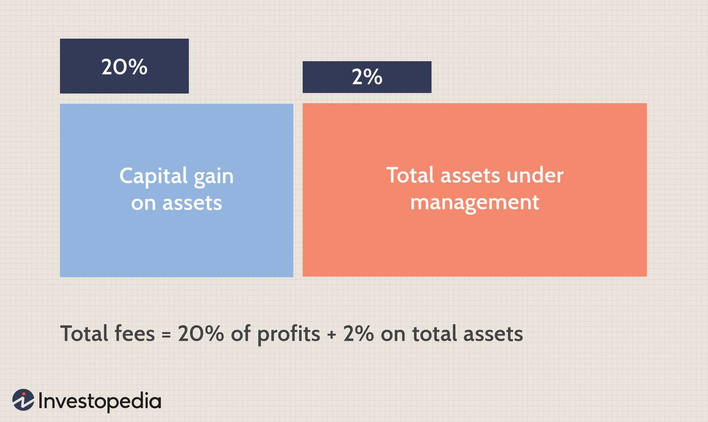

## Table of Contents

## What is a hedge fund?

A hedge fund is a type of investment fund that pools money from investors to invest in various assets, often using strategies that are more complex and riskier than those used by traditional investment funds. The goal of a hedge fund is to generate high returns for its investors, often by taking advantage of opportunities in the market that others might not see or be able to exploit.

Hedge funds are typically managed by experienced investment professionals who have the freedom to use a wide range of investment techniques. These can include short selling, using leverage, and investing in derivatives. Because of these strategies, hedge funds can be riskier than other types of investments, but they also have the potential for higher returns. Hedge funds are usually only available to wealthy individuals and institutional investors because of the high minimum investment requirements and the risks involved.

## What does 'Two and Twenty' refer to in hedge fund fee structures?

"Two and Twenty" is a common fee structure used by many hedge funds. It means the hedge fund charges investors a management fee of 2% of the total assets they manage each year, no matter if the fund makes money or not. This fee is to cover the costs of running the fund and paying the managers.

On top of the management fee, the hedge fund also takes a performance fee of 20% of any profits the fund makes. This means if the fund earns money, the managers get to keep a fifth of those earnings. The idea behind this is to motivate the managers to do well because the more money they make for investors, the more they earn themselves.

## How does the 'Two' part of the fee structure work?

The "Two" part of the "Two and Twenty" fee structure means the hedge fund charges a management fee of 2% of the total money they manage each year. This fee is taken no matter if the fund makes money or loses money. It's like a regular payment to cover the costs of running the fund and paying the people who manage it.

So, if someone puts $1 million into the hedge fund, they will pay $20,000 each year just for the fund to manage their money. This fee is taken out of the total amount in the fund, reducing the amount that can be invested or earn returns.

## What is the purpose of the 'Twenty' performance fee in hedge funds?

The "Twenty" part of the "Two and Twenty" fee structure is a performance fee that hedge funds charge. It means the fund managers get to keep 20% of any profits the fund makes. This fee is only charged if the fund earns money, so it's a way for the managers to earn more when they do a good job.

The main purpose of this performance fee is to motivate the fund managers to work hard and make smart investment choices. If the fund does well and makes a lot of money, the managers get a bigger reward. This system is meant to line up the managers' goals with the investors' goals, encouraging everyone to aim for high returns.

## Can you explain how the performance fee is calculated?

The performance fee is calculated based on the profits the hedge fund makes. If the fund earns money, the managers take 20% of those earnings as their fee. For example, if the fund makes a profit of $100,000 in a year, the managers would get $20,000 as their performance fee.

This fee is only charged if the fund makes money. If the fund loses money or stays the same, the managers don't get any performance fee. This way, the managers are encouraged to work hard to make the fund profitable, because the more money the fund makes, the more they earn.

## Are there any conditions under which the performance fee might not be charged?

The performance fee is not charged if the hedge fund does not make any profit. This means if the fund loses money or stays the same, the managers do not get any performance fee. The idea is to make sure the managers only get extra money when they do a good job and make money for the investors.

Sometimes, hedge funds have a rule called a "high-water mark." This means the managers only get the performance fee if the fund makes more money than the highest amount it reached before. If the fund goes down and then comes back up to where it was, the managers don't get the performance fee until the fund makes more money than that high point. This rule is there to make sure investors are not paying fees for the same gains twice.

## How do hedge fund fee structures impact investor returns?

Hedge fund fee structures, like the "Two and Twenty" model, can have a big effect on what investors take home at the end of the day. The 2% management fee is taken out of the total money in the fund every year, no matter if the fund makes money or not. This means that right off the bat, the amount of money that can be invested and potentially grow is smaller. For example, if an investor puts $1 million into a hedge fund, they will pay $20,000 each year just to have their money managed, which reduces the amount available for [earning](/wiki/earning-announcement) returns.

On top of that, the 20% performance fee is taken out of any profits the fund makes. If the fund does well and earns money, the managers get to keep a fifth of those earnings. While this fee is only charged when the fund makes money, it still means that investors get to keep less of the profits. Over time, these fees can add up and eat into the returns that investors see, especially if the fund doesn't perform exceptionally well. It's important for investors to understand these fees and how they can impact their overall investment returns.

## What are some criticisms of the 'Two and Twenty' fee model?

Some people don't like the "Two and Twenty" fee model because they think it's too expensive. The 2% management fee is charged every year no matter if the fund makes money or not. This means investors are paying a lot just to have their money managed, even if the fund doesn't do well. On top of that, the 20% performance fee can take a big chunk out of the profits. If the fund makes a lot of money, the managers get a big reward, but it means investors get to keep less of the earnings.

Another criticism is that the fees can make it hard for the fund to beat other types of investments. When you take away 2% each year and then another 20% of the profits, it can be tough for the fund to do better than simpler investments like index funds, which usually have much lower fees. Some people also think the performance fee might make managers take too many risks, trying to earn big profits so they can get their 20%. This can lead to more ups and downs in the fund's performance, which might not be what investors want.

## How have hedge fund fee structures evolved in recent years?

In recent years, hedge fund fee structures have changed a bit because investors have been asking for lower fees. Many hedge funds have started to offer different fee models that are not as high as the traditional "Two and Twenty." For example, some funds have lowered the management fee from 2% to 1% or even less. Others have changed the performance fee to something lower than 20%, like 15% or 10%. These changes help the funds attract more investors who want to pay less.

Another change is that some hedge funds now use what's called a "hurdle rate." This means the fund has to make a certain amount of money before the managers get their performance fee. If the fund doesn't make more than the hurdle rate, the managers don't get the extra money. This is to make sure the managers are really doing a good job before they get rewarded. Overall, these changes show that hedge funds are trying to be more flexible and fair to their investors, while still trying to make money for everyone involved.

## What alternatives to the 'Two and Twenty' model are being used by some hedge funds?

Some hedge funds are now using different fee models instead of the traditional "Two and Twenty." One common change is lowering the management fee from 2% to something lower, like 1% or even less. This makes it cheaper for investors to have their money managed. Another change is lowering the performance fee from 20% to a smaller percentage, like 15% or 10%. This means investors get to keep more of the profits the fund makes.

Another alternative is using a "hurdle rate." This means the fund has to make a certain amount of money before the managers can take their performance fee. If the fund doesn't make more than the hurdle rate, the managers don't get the extra money. This helps make sure the managers are really doing a good job before they get paid more. These changes show that hedge funds are trying to be more fair to investors while still trying to make money for everyone.

## How do different hedge fund strategies affect the application of the 'Two and Twenty' fee structure?

Different hedge fund strategies can change how the "Two and Twenty" fee structure is used. Some funds use strategies that are less risky and might not make as much money. These funds might lower their fees to attract more investors. For example, a fund that focuses on steady, long-term growth might only charge a 1% management fee instead of 2% and a 15% performance fee instead of 20%. This way, they can still make money for their investors but also keep their fees competitive.

On the other hand, funds that use more risky strategies and aim for high returns might stick with the "Two and Twenty" model. They believe their strategies can make a lot of money, so they think the higher fees are fair. Investors who put money into these funds are usually okay with paying more because they hope to earn big profits. But if the fund doesn't do well, the high fees can make their losses even worse.

## What regulatory considerations should be taken into account with hedge fund fee structures?

When hedge funds set their fees, they have to think about rules from places like the Securities and Exchange Commission (SEC) in the United States. The SEC makes sure that hedge funds are honest about their fees and tell investors clearly what they will be charged. Hedge funds have to write down their fee structures in their legal papers and share them with investors. This helps keep things fair and open, so investors know what they are paying for.

Different countries might have different rules about hedge fund fees too. For example, in Europe, there are rules from the European Union that hedge funds need to follow. These rules can affect how much hedge funds can charge and how they need to report their fees. It's important for hedge funds to know and follow all these rules so they don't get in trouble and can keep working with investors from different places.

## What is the 'Two and Twenty' Fee Structure and how does it work?

The 'two and twenty' fee structure is a prevalent model in the hedge fund industry, comprising a 2% management fee and a 20% performance fee. This structure incentivizes fund managers to achieve high returns while covering the operational costs of managing the fund.

The management fee, typically set at 2% of the fund's total assets under management (AUM), is designed to cover the fixed costs associated with running a hedge fund. This includes expenses such as salaries, office space, and research costs. The management fee is calculated annually and is independent of the fund’s performance. It provides a steady income stream that supports the infrastructure and day-to-day operations necessary for managing investments.

The performance fee, accounting for 20% of any profits generated by the fund, aligns the interests of fund managers with those of the investors. Often referred to as an incentive fee, it is contingent upon the fund achieving returns above a certain threshold, typically known as the high-water mark. The formula for calculating the performance fee can be represented as follows:

$$

\text{Performance Fee} = 0.2 \times (\text{Net Profits} - \text{High-Water Mark}) 
$$

The high-water mark ensures that performance fees are only charged on new profits, preventing fund managers from being compensated for recovering past losses.

The 'two and twenty' fee structure originated in the early 20th century and became a standard practice during the rise of hedge funds in the latter half of the century. This model has been attractive to hedge funds due to its potential to reward exceptional performance. While the management fee offers a baseline revenue, the performance fee incentivizes managers to pursue strategies that maximize returns, thereby creating potentially lucrative outcomes for both managers and investors.

In the landscape of [hedge fund](/wiki/hedge-fund-trading-strategies) management, these fees serve critical roles. The management fee secures the operational foundation of the fund, while the performance fee functions as a motivator for achieving superior returns. In performance assessment, the effectiveness of a hedge fund manager is often gauged by their ability to generate returns beyond benchmarks or indices. As such, the 'two and twenty' model positions hedge funds to attract and retain talented managers who are driven to outperform market expectations.

Despite its widespread adoption, the 'two and twenty' fee structure is not without critique. Investors argue that while the model can lead to high returns, it may also lead to excessive risk-taking by fund managers who are motivated to achieve short-term performance at the expense of long-term stability. Nonetheless, it remains a principal framework within the hedge fund industry, balancing operational viability with performance-driven incentives.

## References & Further Reading

[1]: ["Hedge Funds: An Analytic Perspective"](https://www.jstor.org/stable/j.ctt7rq28) by Andrew W. Lo

[2]: ["The Little Book of Hedge Funds: What You Need to Know About Hedge Funds but the Managers Won't Tell You"](https://www.amazon.com/Little-Book-Hedge-Funds-Managers/dp/1394286678) by Anthony Scaramucci

[3]: ["Quantitative Equity Portfolio Management: An Active Approach to Portfolio Construction and Management"](https://www.amazon.com/Quantitative-Equity-Portfolio-Management-Construction/dp/0071459391) by Ludwig B. Chincarini and Daehwan Kim

[4]: Schwartz, E., & Begley, J. (2017). ["Renaissance Technologies: Medallion Fund Case Study."](https://www.researchgate.net/publication/387147889_Hybrid_TPMS-based_architectured_materials_HTAM_for_enhanced_specific_stiffness_using_data-driven_design) Harvard Business School Case Collection.

[5]: ["Inside the Black Box: The Simple Truth About Quantitative Trading"](https://www.amazon.com/Inside-Black-Box-Quantitative-Trading/dp/0470432063) by Rishi K. Narang