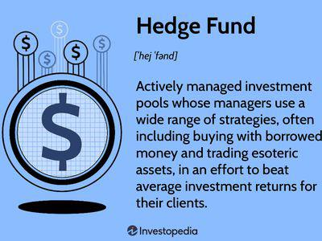

Algorithmic trading is significantly transforming the investment landscape across the globe, with a notable impact observed in Canada. Canadian hedge funds, in particular, are increasingly adopting these sophisticated trading systems to enhance investment optimization. These algorithms execute trades based on complex mathematical models and real-time market data, minimizing human intervention and maximizing trading efficiency. The adoption of algorithmic trading by Canadian hedge funds signals a shift towards more advanced and systematic approaches to investment strategies.

Various factors play a role in this transformation, including regulatory environments that demand transparency and accountability, technological advancements that provide the necessary tools and infrastructure for algorithm execution, and the unique challenges faced by hedge funds operating within Canada. Regulatory bodies such as the Canadian Securities Administrators (CSA) oversee the sector, ensuring that hedge funds comply with standards that emphasize investor protection and market integrity.



Understanding the complexities of algorithmic trading is essential for comprehending its potential impact on the future of hedge fund investments in Canada. This section will discuss the influence of regulatory frameworks, the role of technology in facilitating algorithmic trading, and the obstacles that Canadian hedge funds must navigate in this evolving financial landscape. As these funds continue to integrate algorithmic trading into their operations, it remains crucial for investors and fund managers to stay informed about the advantages and challenges that this technology presents.

## Table of Contents

## The Rise of Hedge Funds in Canada

Canada has experienced a notable increase in hedge fund activity, which can be credited to its stable economic environment and strong financial markets. Unlike traditional investment vehicles such as mutual funds, Canadian hedge funds employ advanced strategies involving derivatives, leverage, and short selling. These strategies enable hedge funds to achieve higher returns while managing risk more effectively. Derivatives, for example, allow hedge funds to hedge positions or speculate on future price movements, while leverage amplifies potential returns through borrowed capital. Short selling, on the other hand, involves betting against a security, allowing hedge funds to benefit from price declines.

The growth of the hedge fund sector in Canada is significantly supported by a regulatory framework designed to ensure transparency and investor protection. The Canadian Securities Administrators (CSA), a collective of provincial and territorial securities regulators, plays a critical role in overseeing these frameworks. The CSA ensures that hedge fund operations adhere to stringent disclosure requirements and high standards of governance. This regulatory environment fosters confidence among investors, enabling hedge funds to thrive and contribute to the country's financial ecosystem.

Despite challenging regulations, Canadian hedge funds have managed to attract both high-net-worth individuals and institutional investors. This investor base is drawn to the sophisticated risk-adjusted returns that hedge funds can offer. Institutional investors, such as pension funds and endowments, often seek hedge funds for portfolio diversification and to achieve returns uncorrelated with traditional asset classes. High-net-worth individuals, on the other hand, are attracted to the personalized investment strategies and potential for high returns.

The ability of Canadian hedge funds to navigate and comply with a rigorous regulatory environment while employing complex investment strategies has been a key [factor](/wiki/factor-investing) in their growth. The sector's expansion is not only a testament to the robust regulatory framework but also to the innovative approaches adopted by hedge funds within the Canadian financial market. This growth trend suggests a thriving future for hedge funds in Canada, driven by continued innovation and strategic investment methods.

## What is Algorithmic Trading?

Algorithmic trading utilizes computer algorithms to execute trades based on predefined criteria and real-time market data. This approach significantly reduces the need for human intervention, allowing for rapid and precise trading decisions driven by statistical models. At its core, [algorithmic trading](/wiki/algorithmic-trading) is designed to process large volumes of data and execute orders at speeds and frequencies impossible for human traders.

In recent years, algorithmic trading has transcended traditional boundaries and expanded across various asset classes, including equities, foreign exchange ([forex](/wiki/forex-system)), and commodities. This diversification is facilitated by advancements in technology, which provide sophisticated tools and platforms capable of analyzing market trends and executing complex trading strategies with minimal latency.

One of the fundamental aspects of algorithmic trading is the reliance on quantitative analysis. Algorithms utilize a range of statistical models to predict market movements and generate potential investment opportunities. For instance, mean-reversion trading is a popular strategy where the algorithm assumes that the price of an asset will revert to its average over time. Another commonly used strategy is [momentum](/wiki/momentum) trading, which involves following market trends to capitalize on expected continuation of price movement in a particular direction.

A simple Python example of an algorithmic trading strategy can be represented as follows:

```python
import pandas as pd
import numpy as np

# Sample trading strategy: Moving Average Crossover
def moving_average_crossover(data, short_window, long_window):
    signals = pd.DataFrame(index=data.index)
    signals['price'] = data['price']
    signals['short_mavg'] = data['price'].rolling(window=short_window, min_periods=1).mean()
    signals['long_mavg'] = data['price'].rolling(window=long_window, min_periods=1).mean()
    signals['signal'] = 0.0
    signals['signal'][short_window:] = np.where(
        signals['short_mavg'][short_window:] > signals['long_mavg'][short_window:], 1.0, 0.0
    )
    signals['positions'] = signals['signal'].diff()
    return signals

# Example usage with hypothetical data
price_data = pd.DataFrame({'price': [100, 102, 104, 103, 105, 107, 106, 110, 115]})
signals = moving_average_crossover(price_data, short_window=3, long_window=5)
print(signals)
```

This code illustrates a moving average crossover strategy where signals are generated based on short and long-term moving average thresholds, indicating potential buy or sell points.

Technological advancements have made it possible for hedge funds to operate at efficiencies unattainable with manual trading. The implementation of high-frequency trading ([HFT](/wiki/high-frequency-trading-strategies)) systems, in particular, allows these funds to execute large volumes of trades in fractions of a second, capturing small price inefficiencies in the market. This shift towards automation not only enhances trading speed but also reduces costs associated with human traders and allows for the handling of high-degree complexity involved in financial markets today.

Overall, algorithmic trading represents a paradigm shift in how financial markets operate, offering both opportunities and challenges in terms of execution speed, precision, and risk management.

## Impact of Algorithmic Trading on Canadian Hedge Funds

Algorithmic trading plays a pivotal role in enhancing the operations of Canadian hedge funds by significantly improving trade execution speed and accuracy. In a fast-paced market environment, the ability to execute trades within milliseconds can lead to substantial gains, as even slight delays might affect the profitability of trades. This swift execution is primarily achieved through sophisticated algorithms that automate the trading process, thereby minimizing human intervention and reducing the likelihood of errors. 

Moreover, algorithmic trading aids in the rapid identification and exploitation of market inefficiencies. By utilizing complex mathematical models and real-time data analysis, these systems can detect and act on [arbitrage](/wiki/arbitrage) opportunities or price discrepancies before they are corrected by the market. Such capabilities allow hedge funds to capitalize on fleeting opportunities, which would be challenging to exploit through traditional trading methods.

In terms of cost efficiency, algorithmic strategies are instrumental in lowering transaction costs. By determining the optimal timing and size of trades, algorithms can minimize market impact and reduce slippage, which refers to the difference between the expected price of a trade and the actual price at which the trade is executed. This is particularly important for trades involving large volumes, where market impact costs can be significant.

Despite these advantages, algorithmic trading also introduces certain risks. Technological failures, such as system malfunctions or connectivity issues, can lead to substantial financial losses. Additionally, market anomalies or events such as 'flash crashes'—rapid price declines followed by swift recoveries—pose significant risks. These phenomena may result from erroneous trading algorithms or unexpected market conditions, stressing the importance of robust risk management systems. 

To mitigate these challenges, Canadian hedge funds must implement comprehensive risk management frameworks that include regular system testing, real-time monitoring, and contingency protocols. This ensures that algorithms operate as intended and that any potential issues are promptly addressed to safeguard investor interests and maintain market stability.

## Regulatory Considerations for Algorithmic Trading in Canada

Canada's regulatory framework for hedge funds, including those employing algorithmic trading, is comprehensive, ensuring transparency and accountability across the sector. This framework is largely governed by the Canadian Securities Administrators (CSA), an umbrella organization composed of the provincial and territorial securities regulators. These regulations ensure that algorithmic trading follows standards that prevent market manipulation and maintain fair trading conditions. 

Hedge funds that utilize algorithmic trading must adhere to specific standards to maintain the integrity of financial markets. These standards are designed to prevent abusive practices such as spoofing and layering, which can create artificial impressions of supply and demand. To comply, fund managers are expected to implement adequate systems and controls that detect, deter, and manage potential market abuses. 

In addition, fund managers are obligated to meet strict reporting requirements. They must regularly disclose trade details, including volumes, prices, and the timing of trades, to ensure that the transactions are conducted fairly and are free from manipulation. This transparency allows for better monitoring by regulatory bodies and provides investors with an accurate representation of fund performance.

The province of Ontario, being a significant financial hub, has implemented specific measures tailored to the complexities of algorithmic trading. Among these are capital requirements that hedge funds must satisfy when employing algorithmic techniques. These requirements ensure that the funds have sufficient capital to manage the risks associated with rapid, high-frequency trades, which can expose them to significant financial vulnerabilities if not properly managed. 

Overall, the regulatory considerations for algorithmic trading in Canadian hedge funds are structured to preserve market stability while promoting innovation within the financial sector. This balance is crucial for ensuring that algorithmic trading continues to benefit the industry without jeopardizing market integrity.

## Challenges Facing Algorithmic Trading in Canadian Hedge Funds

Algorithmic trading in Canadian hedge funds, while advantageous, presents several challenges that necessitate careful consideration. One of the primary issues is regulatory constraints, which impose strict guidelines to ensure market integrity. These regulations mandate transparency and aim to prevent market manipulation, but they can also hinder the flexibility that algorithmic trading systems require to adapt rapidly to market changes.

Technological dependencies further complicate the landscape. Hedge funds must continually invest in advanced infrastructure to maintain competitiveness on a global scale. This need for regular upgrades can be both costly and resource-intensive, requiring significant capital and technical expertise. The pace of technological advancement means that systems can quickly become outdated, demanding frequent updates and new skillsets from the workforce.

Market stability is another significant concern. Regulators worry about the potential for algorithm-driven anomalies, commonly known as 'flash crashes.' These events can occur when algorithms react to market feedback in unforeseen ways, leading to rapid, significant price changes. Such incidents can undermine investor confidence and damage the reputation of financial institutions.

To address these challenges, robust risk management and algorithmic oversight are paramount. Hedge funds must implement thorough monitoring systems to detect and respond to irregular trading patterns swiftly. This involves setting stringent parameters for algorithm behavior and employing backup controls to intervene if anomalies are detected. 

Furthermore, hedge funds need to balance innovation with regulatory compliance, ensuring that their strategies do not contravene market standards. An ongoing dialogue with regulatory bodies can help funds stay informed and ahead of potential legislative changes that could impact their operations. 

In summary, while algorithmic trading offers substantial benefits, the associated challenges require careful navigation to safeguard market stability and investor trust in the Canadian financial ecosystem.

## Conclusion

Algorithmic trading presents a wide array of opportunities and challenges that distinctly impact hedge funds in Canada. This technology fundamentally enhances trading efficiency and strategy execution by enabling rapid decision-making based on advanced statistical models and real-time data analysis. The integration of algorithmic trading allows hedge funds to swiftly capitalize on market inefficiencies, reducing transaction costs and mitigating risks associated with high-[volume](/wiki/volume-trading-strategy) trades.

Nevertheless, the successful deployment of algorithmic trading systems must navigate stringent regulatory and operational hurdles. The regulatory environment in Canada demands transparency and accountability, necessitating compliance with complex reporting obligations and standards that curb market manipulation. As a result, fund managers are required to maintain a deep understanding of both regulatory expectations and the latest technological advances to ensure robust operation and compliance.

Looking ahead, the future of hedge funds in Canada is likely to witness more profound incorporation of algorithmic trading mechanisms as evolving technologies present new opportunities and as regulations adapt to these advancements. This progression underscores the necessity for continuous investment in cutting-edge infrastructure and the refinement of risk management systems. Moreover, there is an increasing focus on algorithm oversight to safeguard market stability and investor interests.

Investors and fund managers need to remain proactive and informed about developments in algorithmic trading. By doing so, they can strategically harness these innovations to enhance portfolio performance while minimizing potential risks. As the Canadian financial landscape continues to evolve, the ability to adeptly integrate sophisticated algorithmic trading strategies will be a key determinant of success for hedge funds operating within this dynamic marketplace.

## References & Further Reading

[1]: Canadian Securities Administrators. [Overview of the Regulatory Framework](https://www.securities-administrators.ca/). Accessed 2023.

[2]: Lopez de Prado, M. (2018). ["Advances in Financial Machine Learning."](https://www.amazon.com/Advances-Financial-Machine-Learning-Marcos/dp/1119482089) Wiley.

[3]: Jansen, S. (2020). ["Machine Learning for Algorithmic Trading."](https://github.com/stefan-jansen/machine-learning-for-trading) Packt Publishing.

[4]: Chan, E. P. (2009). ["Quantitative Trading: How to Build Your Own Algorithmic Trading Business."](https://github.com/ftvision/quant_trading_echan_book) Wiley.

[5]: Aronson, D. R. (2007). ["Evidence-Based Technical Analysis: Applying the Scientific Method and Statistical Inference to Trading Signals."](https://onlinelibrary.wiley.com/doi/book/10.1002/9781118268315) Wiley.

[6]: Aldridge, I. (2013). ["High-Frequency Trading: A Practical Guide to Algorithmic Strategies and Trading Systems."](https://books.google.com/books/about/High_Frequency_Trading.html?id=6l0DDQAAQBAJ) Wiley.