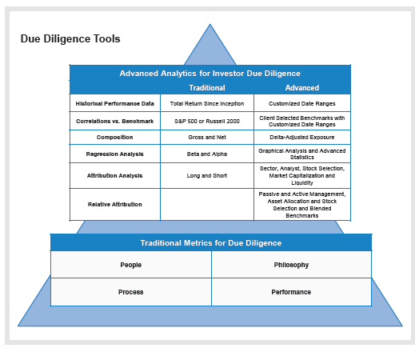

## Table of Contents

## What is a hedge fund and how does it differ from other investment vehicles?

A hedge fund is a type of investment fund that pools money from investors and uses different strategies to try to make money. These strategies can be riskier than those used by other types of funds. Hedge funds are usually only available to wealthy people or institutions because they are seen as more complex and riskier.

Hedge funds differ from other investment vehicles like mutual funds and exchange-traded funds (ETFs) in a few key ways. First, hedge funds can use strategies like borrowing money to invest more (called leverage) and betting that certain investments will go down in value (called short selling). These strategies are often not allowed or are limited in mutual funds and ETFs. Second, hedge funds often have fewer rules and regulations than other types of funds, which can make them more flexible but also more risky. This is why they are usually only open to people who can handle more risk and have a lot of money to invest.

## Why is due diligence important when considering hedge fund investments?

Due diligence is really important when you're thinking about putting your money into a hedge fund. This is because hedge funds can be pretty complicated and risky. They use special strategies that you might not see in other types of investments. By doing your homework, you can understand these strategies better and see if they match what you're looking for in an investment. You also get to check out the people running the fund, their track record, and how they've done in the past.

Doing due diligence also helps you figure out the risks involved. Hedge funds can lose money, and sometimes a lot of it. By looking closely at the fund, you can see what might go wrong and decide if you're okay with that risk. It's like checking the weather before you go on a hike. You want to know if there's a chance of rain or storms so you can be prepared. In the end, due diligence helps you make a smarter choice about whether a [hedge fund](/wiki/hedge-fund-trading-strategies) is right for you.

## What are the key components of hedge fund due diligence?

When you're doing due diligence on a hedge fund, one of the first things to look at is the people running it. You want to know about the fund manager's experience, how long they've been doing this, and what their past performance looks like. It's also good to check if they've had any problems or run-ins with the law. Another big part is understanding the fund's strategy. Hedge funds can do things like borrowing money to invest more or betting that certain investments will go down. You need to know what the fund is doing and if it makes sense to you.

The next thing to look at is the fund's performance and risk. You want to see how the fund has done over time, not just in good years but also in bad ones. This helps you figure out how risky the fund might be. It's also important to look at the fund's fees. Hedge funds can charge a lot, so you need to know if the fees are worth it compared to what you might get back. Finally, check the fund's legal and operational stuff. This means looking at their paperwork, how they keep track of money, and if they follow all the rules. All of these pieces together help you decide if the hedge fund is a good fit for you.

## How can an investor assess the track record and performance of a hedge fund?

To assess the track record and performance of a hedge fund, an investor should first look at the fund's historical returns. This means checking how the fund has done over the years, not just in the good times but also during tough times like economic downturns. It's important to see if the fund can make money when the market is going up and if it can protect your investment when the market goes down. You can usually find this information in the fund's performance reports or by asking the fund manager directly. It's also a good idea to compare the fund's returns to a benchmark, like the S&P 500, to see if it's doing better or worse than the market as a whole.

Another way to assess a hedge fund's performance is by looking at risk-adjusted returns. This means figuring out how much risk the fund is taking to get its returns. A common way to do this is by looking at the Sharpe Ratio, which shows how much extra return you're getting for the extra risk you're taking. A higher Sharpe Ratio is usually better because it means the fund is giving you more return for the risk involved. Also, it's important to look at other risk measures like the fund's [volatility](/wiki/volatility-trading-strategies), which shows how much the fund's value goes up and down, and the maximum drawdown, which shows the biggest loss the fund has had from its highest point to its lowest point. By looking at all these things together, an investor can get a good idea of how well a hedge fund has performed and if it's worth the risk.

## What are the common risks associated with hedge fund investments?

Hedge fund investments come with several risks that you should know about. One big risk is market risk. This means the value of the investments in the fund can go up and down because of things happening in the market, like a stock market crash or economic downturn. Another risk is leverage risk. Hedge funds often borrow money to invest more, which can make gains bigger but also make losses bigger if things go wrong. There's also [liquidity](/wiki/liquidity-risk-premium) risk, where it might be hard to get your money out of the fund quickly if you need it.

Another common risk is strategy risk. Hedge funds use different strategies that can be complicated and might not work out as planned. If the strategy fails, the fund could lose money. There's also manager risk, where the success of the fund depends a lot on the people running it. If the manager makes bad choices or leaves the fund, it can hurt your investment. Finally, there's operational risk, which includes things like fraud or mistakes in how the fund is run. All these risks mean you need to be careful and do your homework before putting money into a hedge fund.

## How should an investor evaluate the management team and their investment strategy?

When you're thinking about investing in a hedge fund, it's really important to look at the people running it. You want to know if the management team knows what they're doing. Check out their background and experience. Have they managed money before? How long have they been doing this? It's also good to see if they've had any problems in the past, like being in trouble with the law or losing a lot of money for investors. Talking to them or reading about them can help you understand if they're honest and good at what they do.

Next, you need to understand the investment strategy the hedge fund is using. Hedge funds can do things that other funds can't, like borrowing money to invest more or betting that certain investments will go down. You should ask the fund manager to explain their strategy in a way that makes sense to you. Is it something you believe in? Does it fit with what you want to do with your money? Also, see if the strategy has worked in the past. Has it made money, and was it during good times or bad times? Knowing the strategy helps you decide if the hedge fund is a good fit for you.

## What legal and regulatory considerations should be taken into account during due diligence?

When you're looking into a hedge fund, you need to think about the legal and regulatory stuff. Hedge funds have to follow certain rules, but they usually have fewer rules than other types of funds. You should check if the fund is registered with the right places, like the Securities and Exchange Commission (SEC) in the U.S. This can tell you if they're playing by the rules. Also, look at the fund's legal documents, like the offering memorandum or prospectus. These papers tell you about the fund's rules, how they handle money, and what rights you have as an investor.

Another thing to think about is how the fund deals with taxes. Hedge funds can be set up in different ways that affect how you're taxed. Some funds might be in places with lower taxes, which can be good for you but also means you need to understand the tax laws in those places. It's also important to see if the fund has been in any legal trouble or if there are any ongoing lawsuits. This can give you a heads-up on any problems that might affect your investment. By looking at all these legal and regulatory things, you can make a smarter choice about whether the hedge fund is right for you.

## How can an investor analyze the operational infrastructure and controls of a hedge fund?

When you're thinking about putting money into a hedge fund, it's important to look at how they run things and keep everything in order. You want to see if they have good systems to keep track of money and investments. This means checking if they use good software to manage their [books](/wiki/algo-trading-books) and if they have strong security to protect your information. It's also good to see if they have outside people, like auditors, who check their work to make sure everything is done right. If they have these things in place, it can give you more confidence that the fund is being run well.

Another thing to look at is how the hedge fund handles risks and follows the rules. They should have a clear plan for dealing with risks, like what they do if the market goes down or if something unexpected happens. It's also important to see if they follow all the laws and regulations that apply to them. You can ask to see their compliance policies and check if they have someone in charge of making sure they follow the rules. By looking at all these parts of how the hedge fund operates, you can get a better idea of whether they have the right setup to manage your money safely and effectively.

## What role does transparency and reporting play in hedge fund due diligence?

Transparency and reporting are really important when you're looking at a hedge fund. They help you understand what the fund is doing with your money. You want to see regular reports that show how the fund is doing, what it's investing in, and how much risk it's taking. These reports should be clear and easy to understand. If a hedge fund is open about its activities and gives you good information, it can make you feel more confident that they're doing things the right way.

Also, transparency helps you keep an eye on the fund's performance over time. You can see if the fund is making money like it said it would, and if it's sticking to its strategy. Good reporting can also help you spot any problems early, like if the fund is taking too much risk or if something doesn't look right. By having clear and regular updates, you can make better decisions about whether to keep your money in the fund or take it out.

## How can advanced quantitative analysis be used to evaluate hedge fund performance?

Advanced quantitative analysis can help you understand how well a hedge fund is doing by looking at numbers and patterns. You can use something called risk-adjusted returns to see how much money the fund is making compared to the risks it's taking. One way to do this is by using the Sharpe Ratio, which tells you how much extra return you're getting for the extra risk. A higher Sharpe Ratio means the fund is doing a good job of making money without taking too much risk. You can also look at other numbers like the fund's volatility, which shows how much the fund's value goes up and down, and the maximum drawdown, which shows the biggest loss the fund has had. By looking at all these numbers together, you can get a better idea of how the hedge fund has performed and if it's worth the risk.

Another way to use quantitative analysis is by doing something called [factor](/wiki/factor-investing) analysis. This means figuring out what things, or factors, are making the fund's returns go up or down. For example, you might find that the fund does well when the stock market goes up, or when interest rates change. Knowing these factors can help you understand what's driving the fund's performance and if it's likely to keep doing well in the future. You can also use statistical models to predict how the fund might do in different situations, like if the market goes down or if there's a big economic change. By using these advanced tools, you can make smarter choices about whether to invest in the hedge fund and how much risk you're okay with taking.

## What are some red flags to look out for during the due diligence process?

When you're checking out a hedge fund, there are some warning signs you should watch for. One big red flag is if the fund manager doesn't have a good track record or if they've been in trouble before. You want to know if they've lost a lot of money for investors in the past or if they've had any legal problems. Another thing to look out for is if the fund's strategy is too complicated or if it doesn't make sense to you. If the manager can't explain it in a way that's easy to understand, that's a problem. Also, be careful if the fund is promising really high returns without explaining the risks. If it sounds too good to be true, it probably is.

Another red flag is if the fund isn't transparent about what it's doing with your money. If they don't give you regular reports or if the reports are hard to understand, that's a warning sign. You should also be worried if the fund has high fees that don't seem to match what you're getting back. High fees can eat into your returns and make it harder to make money. Finally, if the fund has had a lot of investors pulling their money out, or if it's hard to get your money back when you need it, those are big red flags. These signs can help you decide if a hedge fund is too risky or if it's not being run the right way.

## How can an investor stay updated with ongoing due diligence after the initial investment?

After you put your money into a hedge fund, it's important to keep checking on it to make sure everything is going well. You can do this by looking at the regular reports the fund sends you. These reports should tell you how the fund is doing, what it's investing in, and any big changes that have happened. If the reports are clear and come out on time, that's a good sign. You should also keep an eye on the news to see if there's anything happening with the fund or the people running it. If you hear about any problems or legal issues, you might want to take a closer look.

Another way to stay updated is by talking to the fund manager. You can ask them questions about how things are going and if there have been any changes in their strategy or the risks they're taking. It's also a good idea to meet with them in person or over a call every now and then. This can help you get a better feel for how the fund is being run and if the people in charge are still doing a good job. By staying on top of these things, you can make sure your investment is still a good fit for you and that you're comfortable with the risks involved.

## What are the key elements of hedge fund due diligence?

Conducting due diligence for hedge fund investments involves a meticulous examination of specific elements that significantly influence potential returns and associated risks. Among these elements, understanding investment terms is critical. Key factors such as minimum investment requirements, share classes, fee structures, and redemption terms form the foundation of a hedge fund's financial architecture.

**Minimum Investment**: Hedge funds typically require a substantial initial outlay, limiting their accessibility to high-net-worth individuals and institutional investors. Recognizing the minimum investment threshold is essential for assessing the suitability of a fund against one's financial capacity and risk tolerance.

**Share Classes**: Hedge funds can offer multiple share classes, each with different fee structures, investment strategies, or redemption terms. Investors must evaluate these classes to ensure alignment with their investment goals and risk profile.

**Fee Structures**: Hedge funds often employ complex fee structures, typically involving a management fee and a performance fee (often the "2 and 20" model—2% of assets under management and 20% of profits). Understanding the impact of fees on net returns is crucial for financial forecasting and investment strategy.

**Redemption Terms**: Redemption terms define the conditions and timeframes under which investors can withdraw their capital. Elements such as lock-up periods, notice periods, and redemption fees can impact liquidity and should be carefully considered in the context of an investor's need for access to their funds.

Beyond quantitative measures, qualitative assessments are vital. Investors should scrutinize the hedge fund's management team, examining their experience, track record, and reputation within the industry. Understanding the evolution of the fund's strategy is also essential; has it adapted successfully to changing market conditions, and does it continue to leverage its assets effectively?

Evaluating a fund's historical performance provides insights into its consistency and ability to achieve returns across different market cycles. Performance metrics, such as the Sharpe ratio, which measures risk-adjusted returns, can offer valuable data points:

$$
\text{Sharpe Ratio} = \frac{R_p - R_f}{\sigma_p}
$$

where $R_p$ is the return of the portfolio, $R_f$ is the risk-free rate, and $\sigma_p$ is the standard deviation of the portfolio's excess return.

Additionally, engaging directly with the hedge fund team provides unparalleled insights. Visiting hedge fund offices and conversing directly with fund managers can uncover aspects of the fund's operation and culture that are not evident through documentation alone. These interactions can also elucidate the fund's decision-making process and corporate ethos, contributing to a comprehensive due diligence process.

In summary, a thorough due diligence process encompassing a detailed analysis of investment terms and qualitative factors is imperative for informed hedge fund investment decisions. This rigor ensures that investors accurately understand a fund's potential and align their investment strategies appropriately.

## References & Further Reading

[1]: Bergstra, J., Bardenet, R., Bengio, Y., & Kégl, B. (2011). ["Algorithms for Hyper-Parameter Optimization."](https://dl.acm.org/doi/10.5555/2986459.2986743) Advances in Neural Information Processing Systems 24.

[2]: ["Advances in Financial Machine Learning"](https://www.amazon.com/Advances-Financial-Machine-Learning-Marcos/dp/1119482089) by Marcos Lopez de Prado

[3]: ["Evidence-Based Technical Analysis: Applying the Scientific Method and Statistical Inference to Trading Signals"](https://www.amazon.com/Evidence-Based-Technical-Analysis-Scientific-Statistical/dp/0470008741) by David Aronson

[4]: ["Machine Learning for Algorithmic Trading"](https://github.com/stefan-jansen/machine-learning-for-trading) by Stefan Jansen

[5]: ["Quantitative Trading: How to Build Your Own Algorithmic Trading Business"](https://www.amazon.com/Quantitative-Trading-Build-Algorithmic-Business/dp/1119800064) by Ernest P. Chan

[6]: Aldridge, I. (2013). ["High-Frequency Trading: A Practical Guide to Algorithmic Strategies and Trading Systems"](https://books.google.com/books/about/High_Frequency_Trading.html?id=6l0DDQAAQBAJ). Wiley.

[7]: Jabłonowski, F. & Kim, S. (2017). ["Book Review: Hedge Fund Operational Due Diligence: Understanding the Risks."](https://www.semanticscholar.org/paper/Hedge-Fund-Operational-Due-Diligence%3A-Understanding-Scharfman/56cc9e803eb02eebff465067645de4b2018ea509) LSE Review of Books.

[8]: ["Hedge Funds: An Analytic Perspective"](https://www.jstor.org/stable/j.ctt7rq28) by Andrew W. Lo