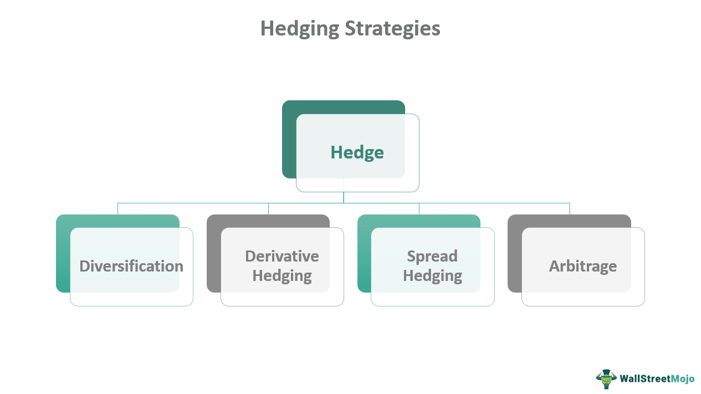

## Table of Contents

## What is a hedge fund manager?

A hedge fund manager is a person who runs a hedge fund, which is a type of investment fund that pools money from investors to buy different kinds of assets. The goal is to make more money for the investors. Hedge fund managers use different strategies to try to make profits, no matter if the market is going up or down. They often take more risks than regular investment funds and might use borrowed money to increase their potential gains.

Hedge fund managers are usually very skilled and experienced in finance. They get paid a lot of money, often a percentage of the profits they make for the fund. This is called a performance fee. Because they handle a lot of money and take big risks, they need to be smart about where they invest and how they manage the fund's money.

## What are the primary responsibilities of a hedge fund manager?

A hedge fund manager's main job is to manage the money that investors put into the hedge fund. They decide where to invest this money, looking for opportunities that can make a good profit. They use different strategies to try to make money, even when the market is not doing well. They might invest in stocks, bonds, commodities, or other types of assets. They also need to keep an eye on the investments to make sure they are performing well and adjust their strategies if needed.

Another important responsibility is managing risk. Because hedge funds often take bigger risks than other types of funds, the manager needs to be careful about how much risk they take. They use different tools and methods to measure and control risk. They might use borrowed money to increase potential gains, but this also increases the risk, so they need to balance this carefully. They also need to communicate with investors, telling them how the fund is doing and what the future plans are.

Lastly, [hedge fund](/wiki/hedge-fund-trading-strategies) managers need to follow the rules and regulations that apply to their funds. This includes reporting to regulatory bodies and making sure all the fund's activities are legal and ethical. They also need to manage the day-to-day operations of the fund, which can include hiring staff, dealing with accountants and lawyers, and handling administrative tasks. All of these responsibilities are crucial to running a successful hedge fund.

## How does a hedge fund manager differ from a mutual fund manager?

A hedge fund manager and a mutual fund manager both handle money for investors, but they do it in different ways. A hedge fund manager can take bigger risks and use special strategies to try to make money, even when the market is going down. They might borrow money to invest more, which can lead to bigger gains but also bigger losses. Hedge fund managers usually work with wealthy people or big organizations because they often need a lot of money to start investing. They also charge higher fees, often taking a percentage of the profits they make.

On the other hand, a mutual fund manager focuses on investing in a way that follows the market's overall performance. They usually invest in stocks, bonds, or other assets that are easier to buy and sell. Mutual funds are open to the public, so anyone can invest in them, even if they don't have a lot of money. The fees for mutual funds are usually lower than for hedge funds, and the managers are more limited in the kinds of risky strategies they can use. This makes mutual funds generally safer but with potentially lower returns compared to hedge funds.

In summary, the main differences between a hedge fund manager and a mutual fund manager are the level of risk they take, the types of investors they work with, and the fees they charge. Hedge fund managers aim for high returns with high risk, while mutual fund managers aim for steady growth with lower risk. Both types of managers need to be skilled and knowledgeable about the markets, but their approaches and the expectations of their investors are quite different.

## What are the most common investment strategies used by hedge fund managers?

Hedge fund managers use a lot of different ways to invest money and make profits. One common strategy is called "long/short equity." This means they buy stocks they think will go up in price (long) and sell stocks they think will go down (short). This can help them make money no matter if the market is going up or down. Another strategy is "[global macro](/wiki/global-macro-strategy)," where managers look at big things happening around the world, like politics or economic changes, and invest in things like currencies, commodities, or interest rates based on what they think will happen.

Another popular strategy is "event-driven," where managers focus on events like company mergers or bankruptcies. They try to predict how these events will affect stock prices and invest accordingly. "Arbitrage" is also common, where managers try to take advantage of price differences between similar assets in different markets. For example, they might buy a stock in one market and sell it in another where it's more expensive. These strategies show how hedge fund managers try to find different ways to make money, often by taking more risks than other types of investors.

## How do hedge fund managers use leverage and derivatives in their strategies?

Hedge fund managers often use leverage to try to make more money. Leverage means borrowing money to invest more than they have. For example, if a manager has $1 million, they might borrow another $4 million to invest a total of $5 million. This can lead to bigger profits if their investments do well. But it also means bigger losses if things go wrong. So, using leverage is a way to take more risk in hopes of getting higher returns.

Derivatives are another tool that hedge fund managers use. Derivatives are financial contracts that get their value from something else, like stocks, bonds, or commodities. Common types of derivatives include options and futures. Managers might use options to bet on whether a stock will go up or down without actually buying the stock. Futures can be used to lock in prices for commodities. By using derivatives, managers can make money from price movements without having to own the actual assets. This can help them manage risk and increase potential profits, but it also adds complexity and can lead to big losses if not managed carefully.

## What is the role of risk management in a hedge fund manager's job?

Risk management is a big part of a hedge fund manager's job. They need to keep an eye on how much risk they are taking with the money they are investing. This is important because hedge funds often take bigger risks than other types of funds. The manager uses different tools and methods to measure and control risk. They might use something called "[value at risk](/wiki/var-value-at-risk)" to figure out how much money they could lose on a bad day. By managing risk carefully, the manager tries to protect the investors' money while still trying to make good profits.

Another way hedge fund managers manage risk is by using strategies like diversification. This means they spread their investments across different types of assets, like stocks, bonds, and commodities. If one type of investment does badly, the others might do well and balance things out. They also use something called "hedging," which is where they make investments that can protect them from losses. For example, if they think a stock might go down, they might buy an option that will make money if the stock does go down. All these methods help the manager keep the fund's risk at a level that the investors are comfortable with, while still trying to make as much money as possible.

## How do hedge fund managers generate alpha for their investors?

Hedge fund managers aim to generate alpha, which means making more money for their investors than what the market as a whole is doing. They do this by using special strategies that try to beat the market. For example, they might buy stocks they think will go up and sell stocks they think will go down. This is called a long/short strategy. They also look at big events happening around the world, like changes in politics or the economy, and invest based on what they think will happen next. This is called a global macro strategy. By using these and other strategies, hedge fund managers try to find ways to make extra profits that the average investor might not be able to get.

Another way hedge fund managers generate alpha is by taking more risks than regular investors. They might borrow money to invest more than they have, which is called leverage. This can lead to bigger profits if their guesses about the market are right, but it can also lead to bigger losses if they're wrong. They also use financial tools called derivatives, like options and futures, to make money from price movements without owning the actual assets. By carefully managing these risks and using their knowledge and experience, hedge fund managers try to create extra returns for their investors, even when the market is not doing well.

## What are the regulatory requirements and compliance issues hedge fund managers must navigate?

Hedge fund managers have to follow a lot of rules and laws to make sure they are doing things the right way. In the United States, they need to register with the Securities and Exchange Commission (SEC) if they manage a certain amount of money. They also need to follow rules from the Commodity Futures Trading Commission (CFTC) if they use derivatives like futures and options. These rules are there to protect investors and keep the financial markets fair. Hedge fund managers also have to report a lot of information about their funds, like how much money they are managing and what they are investing in. This helps the government keep an eye on what they are doing.

Besides following government rules, hedge fund managers also need to follow rules set by their own investors. These can include limits on how much risk they can take or what kinds of investments they can make. They also need to be careful about conflicts of interest, like making sure they are not using the fund's money to help themselves or their friends. If they don't follow these rules, they could get in big trouble, like losing their license to manage money or even going to jail. So, it's very important for hedge fund managers to stay on top of all these rules and make sure they are always doing things the right way.

## How is the performance of a hedge fund manager typically measured and evaluated?

The performance of a hedge fund manager is usually measured by looking at how much money they make for their investors. One common way to do this is by calculating the fund's return, which is the percentage of profit or loss over a certain time. People also compare the fund's performance to a benchmark, like the S&P 500, to see if the manager is doing better or worse than the market. Another important measure is the Sharpe ratio, which looks at how much return the manager is getting for the amount of risk they are taking. A higher Sharpe ratio means the manager is doing a good job of balancing risk and reward.

Besides these numbers, investors also look at other things to evaluate a hedge fund manager. They want to know how well the manager is sticking to their investment strategy and if they are managing risk properly. They also check if the manager is following all the rules and being honest with investors. Sometimes, they look at how the fund has done over many years to see if the manager can keep making good returns over time. All these things together help investors decide if a hedge fund manager is doing a good job and if they should keep their money in the fund.

## What is the typical fee structure for hedge fund managers, including the '2 and 20' model?

Hedge fund managers usually charge their investors fees in two main ways. One common fee structure is called the "2 and 20" model. This means the manager charges a management fee of 2% of the total amount of money in the fund every year. This fee helps pay for the costs of running the fund, like salaries and office expenses. On top of that, the manager also charges a performance fee of 20% of any profits the fund makes. This fee is meant to reward the manager for making good investments and [earning](/wiki/earning-announcement) money for the investors.

However, not all hedge funds use the "2 and 20" model. Some might charge different percentages, like "1 and 10" or "3 and 30," depending on the fund's strategy and the manager's track record. Sometimes, hedge funds have what's called a "hurdle rate," which means the manager only gets the performance fee if the fund's returns are above a certain level. This is to make sure the manager is doing better than just keeping up with the market. Overall, the fee structure is important because it affects how much money investors keep after paying the manager.

## How does the compensation of a hedge fund manager compare to other financial professionals?

Hedge fund managers often earn a lot more money than other financial professionals. This is because they get paid a part of the profits they make for the fund, which can be a lot if the investments do well. For example, in the "2 and 20" fee model, they get 2% of the total money in the fund every year just for managing it, and 20% of any profits they make. This can add up to millions of dollars, especially if the fund is big and does well. In comparison, other financial professionals like stock brokers or financial advisors usually earn a salary and maybe some bonuses, but it's not as much as what a successful hedge fund manager can make.

For example, a stock broker might earn a salary plus commissions on the trades they make for clients. A financial advisor might get paid a fee based on the amount of money they manage, but it's usually a smaller percentage than what a hedge fund manager charges. Investment bankers also make good money, often with big bonuses, but their pay is more predictable and less tied to the performance of specific investments like a hedge fund manager's. So, while other financial professionals can have high earnings, hedge fund managers have the potential to make much more if their investments are successful.

## What are the career paths and educational backgrounds commonly seen among successful hedge fund managers?

Many successful hedge fund managers start their careers in other parts of the finance world. They might begin as investment bankers, working at big banks to help companies raise money. Or they could start as stock analysts, studying companies and giving advice about which stocks to buy or sell. Some work at other hedge funds first, learning the ropes before starting their own. It's common for them to move around and gain experience in different areas of finance before becoming a hedge fund manager. This helps them understand the markets better and develop the skills they need to manage a fund.

Most hedge fund managers have strong educational backgrounds. They usually have a bachelor's degree in finance, economics, business, or something related. Many also have advanced degrees, like a Master's in Business Administration (MBA) or even a Ph.D. in finance or economics. These degrees help them learn about investing and managing money. They also need to be good at math and understand how to analyze data. This education, combined with their work experience, helps them make smart investment decisions and run a successful hedge fund.

## What are the key aspects of understanding investment strategies?

Investment strategies constitute a crucial aspect of financial markets, guiding how funds are allocated to achieve specific financial objectives. These strategies vary significantly, utilizing different methodologies to manage and grow assets in the capital markets. 

### Active vs. Passive Management

Active management and passive management represent two primary investment strategies. Active management involves portfolio managers making selective investments, aiming to outperform market indices. These managers rely on market research, forecasts, and their judgment to buy and sell securities and adapt to market conditions. Conversely, passive management seeks to replicate the performance of a market index by maintaining a fixed portfolio composition. A prominent example is the use of index funds, which are designed to follow the performance of specific indices like the S&P 500. Passive strategies typically incur lower costs and fees compared to active strategies due to reduced trading and research expenses.

### Risk Management Techniques and Diversification

Risk management is integral to all investment strategies. It involves identifying, assessing, and prioritizing risks followed by coordinated efforts to minimize or control the probability and impact of these risks. Diversification is a widely used technique that involves spreading investments across various assets to reduce exposure to any single asset or risk. For instance, the formula for portfolio variance, which quantifies risk, includes a covariance term that is minimized through effective diversification: 

$$
\sigma_p^2 = \sum_{i=1}^{n}w_i^2\sigma_i^2 + \sum_{i=1}^{n-1}\sum_{j=i+1}^{n}2w_iw_j\sigma_i\sigma_j\rho_{i,j}
$$

Where $\sigma_p^2$ is the portfolio variance, $w$ represents the weights of individual assets in the portfolio, $\sigma$ their individual standard deviations, and $\rho$ the correlation between pairs of assets.

### Hedge Funds vs. Traditional Investment Platforms

Hedge funds distinguish themselves from traditional investment vehicles like mutual funds by employing more sophisticated and flexible strategies. They often leverage derivatives, short selling, and leverage to achieve high returns and are typically accessible to accredited investors. In contrast, traditional investment platforms may adopt more conservative strategies focused on steady growth and income. For example, hedge funds might use long/short equity strategies or market-neutral strategies to capitalize on market inefficiencies, whereas mutual funds often adhere to long-only equity holdings.

### Impact of Technology and Quantitative Analysis

The evolution of investment strategies has been significantly influenced by advancements in technology and quantitative analysis. Techniques such as [algorithmic trading](/wiki/algorithmic-trading) and quantitative models have become crucial tools for managing complex investment portfolios. These methods utilize vast datasets and computing power to identify patterns and execute trades at speeds beyond human capabilities. Quantitative analysis often involves the application of statistical methods and [machine learning](/wiki/machine-learning) algorithms to forecast market trends or optimize portfolios. The integration of Python or similar programming languages in developing these analytical models is a common practice in modern finance:

```python
import pandas as pd
import numpy as np
from sklearn.linear_model import LinearRegression

# Example of a simple linear regression model to predict returns
data = pd.read_csv('market_data.csv')
X = data[['feature_1', 'feature_2', 'feature_3']]
y = data['returns']

model = LinearRegression()
model.fit(X, y)
predicted_returns = model.predict(X)
```

Technology enables more dynamic and adaptive investment strategies, positioning hedge funds and other sophisticated investment platforms to navigate complex and volatile market conditions effectively. This advancement underscores the crucial role of technology in expanding the boundaries of traditional investment strategies.

## References & Further Reading

[1]: Bergstra, J., Bardenet, R., Bengio, Y., & Kégl, B. (2011). ["Algorithms for Hyper-Parameter Optimization."](https://dl.acm.org/doi/10.5555/2986459.2986743) Advances in Neural Information Processing Systems 24.

[2]: ["Advances in Financial Machine Learning"](https://www.amazon.com/Advances-Financial-Machine-Learning-Marcos/dp/1119482089) by Marcos Lopez de Prado

[3]: ["Evidence-Based Technical Analysis: Applying the Scientific Method and Statistical Inference to Trading Signals"](https://www.amazon.com/Evidence-Based-Technical-Analysis-Scientific-Statistical/dp/0470008741) by David Aronson

[4]: ["Machine Learning for Algorithmic Trading"](https://github.com/stefan-jansen/machine-learning-for-trading) by Stefan Jansen

[5]: ["Quantitative Trading: How to Build Your Own Algorithmic Trading Business"](https://www.amazon.com/Quantitative-Trading-Build-Algorithmic-Business-ebook/dp/B097QGPVND) by Ernest P. Chan