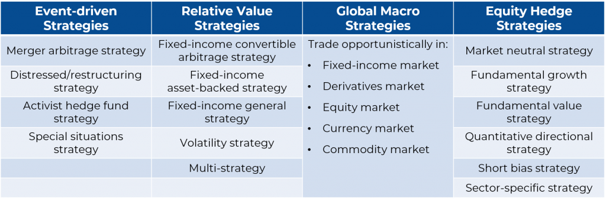

## Table of Contents

## What is a hedge fund?

A hedge fund is a type of investment fund that pools money from investors to invest in various assets with the goal of earning high returns. Unlike mutual funds, hedge funds are often less regulated and can use more aggressive strategies, such as borrowing money to invest or betting that the value of certain assets will go down. This flexibility allows hedge fund managers to try and make money in different market conditions.

Hedge funds are typically available only to wealthy individuals and institutional investors because they often require a high minimum investment. The idea behind hedge funds is to "hedge" or protect against potential losses while aiming for higher returns than traditional investments. However, because of their complex strategies and high fees, they can also be riskier and may not always perform better than simpler investment options.

## How do hedge funds differ from mutual funds?

Hedge funds and mutual funds both collect money from many people to invest, but they have some big differences. Hedge funds are usually only for rich people or big organizations because you need a lot of money to start investing in them. They also have fewer rules to follow, which means they can try riskier ways to make money. For example, they might borrow money to invest more or bet that some investments will lose value. This can lead to big gains, but also big losses.

Mutual funds, on the other hand, are available to more people and have to follow strict rules. They can't use the same risky strategies that hedge funds do. Instead, they usually invest in a mix of stocks, bonds, and other assets to grow over time. Mutual funds are often seen as safer and more predictable, but they might not offer the same high returns that hedge funds sometimes can.

In short, hedge funds are for those who can handle more risk and want the chance at bigger rewards, while mutual funds are for those looking for a steadier, more secure way to grow their money.

## What are the common investment strategies used by hedge funds?

Hedge funds use many different strategies to try and make money for their investors. One common strategy is called "long/short equity." This means the fund buys stocks they think will go up in value (going long) and sells stocks they think will go down in value (going short). By doing both, they hope to make money no matter which way the market goes. Another popular strategy is "[global macro](/wiki/global-macro-strategy)," where the fund makes big bets on things like interest rates, currency values, and how whole economies are doing. They might use these bets to take advantage of big changes happening around the world.

Another strategy hedge funds use is called "event-driven." This involves betting on things like mergers, acquisitions, or other big company events that could change a stock's value. For example, if two companies are about to merge, a [hedge fund](/wiki/hedge-fund-trading-strategies) might buy stock in the company they think will benefit more from the merger. Hedge funds also sometimes use "[arbitrage](/wiki/arbitrage)," which is when they try to make money from small differences in price between similar assets. They might buy a stock on one market and sell it on another where the price is a bit higher. These strategies can be complex and risky, but hedge funds use them to try and beat the market and earn high returns for their investors.

## Who typically invests in hedge funds?

Hedge funds are usually for people who have a lot of money. These investors are often called "accredited investors" because they meet certain financial requirements set by the government. This means they have to have a high income or a lot of money saved up. Hedge funds are not for everyone because they can be risky and you need a big amount of money to start investing in them.

Besides rich people, big organizations like pension funds, university endowments, and insurance companies also invest in hedge funds. These groups have a lot of money to invest and they are looking for ways to make more money for their members or clients. They understand the risks and are willing to take a chance on hedge funds to try and get higher returns than they might get from other investments.

## What are the risks associated with investing in hedge funds?

Investing in hedge funds can be risky because they often use strategies that can lead to big losses. They might borrow money to invest more, which can make their gains bigger but also their losses. They also might bet that some investments will go down in value, and if they guess wrong, they can lose a lot of money. Because hedge funds have fewer rules to follow, they can take bigger risks than other types of investments like mutual funds.

Another risk is that hedge funds charge high fees. They usually take a percentage of the money you invest and then another percentage of any profits they make. These fees can eat into your returns, especially if the fund doesn't do well. Also, hedge funds can be hard to understand because they use complex strategies. If you don't fully understand what the fund is doing, it can be hard to know if it's a good investment for you.

## How are hedge funds regulated?

Hedge funds are not as tightly controlled as other types of investments like mutual funds. In the United States, they are mostly overseen by the Securities and Exchange Commission (SEC). The SEC has rules that say hedge funds can only take money from people who are considered "accredited investors." These are people who have a lot of money or make a high income. This is to make sure that only people who can handle the risk are investing in hedge funds.

Even though hedge funds have fewer rules to follow, they still have to follow some important laws. For example, they can't lie to investors about what they're doing with their money. They also have to report some information to the SEC, like how much money they're managing and what kinds of investments they're making. But overall, hedge funds have more freedom to try different and sometimes risky ways to make money compared to other types of funds.

## What is the role of a hedge fund manager?

A hedge fund manager is in charge of running the hedge fund. Their main job is to decide where to invest the money that people have put into the fund. They use different strategies to try and make more money for the investors. These strategies can be risky, but the manager's goal is to earn high returns. They also have to keep an eye on the market and make quick decisions about buying or selling investments.

Besides managing the investments, hedge fund managers also have to talk to the investors. They need to explain what they're doing with the money and how the fund is doing. They also have to follow the rules set by the government, like reporting certain information to the SEC. Even though hedge funds have fewer rules than other types of funds, the manager still has to make sure everything is done correctly.

## Can you explain the concept of leverage in hedge fund strategies?

Leverage is a way that hedge fund managers try to make more money with the money they have. It's like borrowing money to invest more than what you actually have. Imagine you have $100 and you want to buy a stock. With leverage, you might borrow another $100 so you can buy $200 worth of stock. If the stock goes up, you make more money because you have more of it. But if the stock goes down, you lose more money because you owe the money you borrowed.

Using leverage can be risky. It's like a double-edged sword. When things go well, it can make your profits bigger. But when things go badly, it can make your losses bigger too. Hedge fund managers use leverage because they think they can make more money this way, but it's important for them to be careful because the risks are high.

## What is a hedge fund's fee structure, and how does it impact investors?

Hedge funds usually charge two types of fees: a management fee and a performance fee. The management fee is a percentage of the total money in the fund, often around 2%. This means if you invest $1 million, you might pay $20,000 each year just for the fund to manage your money. The performance fee is a percentage of any profits the fund makes, usually around 20%. So if the fund makes $100,000 in profit, you might pay $20,000 in performance fees.

These fees can have a big impact on investors. The management fee is charged no matter how well the fund does, so it can eat into your returns even if the fund doesn't make any money. The performance fee means the fund manager gets a big reward if the fund does well, but it can also mean less money for you. Because of these high fees, you need the hedge fund to do really well just to make up for what you're paying. If the fund doesn't perform better than other investments, the fees might make it a bad choice.

## How do hedge funds use derivatives in their strategies?

Hedge funds often use derivatives to try and make more money or to protect their investments. Derivatives are financial tools that get their value from something else, like a stock or a commodity. For example, a hedge fund might use options, which give them the right to buy or sell an asset at a certain price. If they think a stock will go up, they can buy an option to buy it later at today's price. If the stock goes up, they make money on the difference. If they think a stock will go down, they can buy an option to sell it at today's price. This way, they can make money even if the market goes down.

Another way hedge funds use derivatives is through futures contracts. These are agreements to buy or sell something at a future date for a price agreed on today. Hedge funds might use futures to bet on things like oil prices or interest rates. For example, if they think oil prices will go up, they can buy a futures contract to buy oil later at today's price. If oil prices do go up, they can sell the oil at the higher price and make money. Using derivatives can be risky because they can lose a lot of money if their guesses are wrong, but hedge funds use them to try and make big profits.

## What are some of the advanced trading techniques employed by hedge funds?

Hedge funds often use a technique called [algorithmic trading](/wiki/algorithmic-trading), which means they use computers to make trading decisions very quickly. These computers follow a set of rules, or an algorithm, to buy and sell investments. This can help hedge funds take advantage of small changes in the market that happen in just a few seconds. It's like trying to catch a lot of small fish instead of waiting for one big one. This can be risky because the market can change in ways the computer doesn't expect, but it can also help hedge funds make money faster.

Another advanced technique is called [statistical arbitrage](/wiki/statistical-arbitrage). This is when hedge funds use math to find patterns in how different investments move compared to each other. They might notice that when one stock goes up, another one usually goes down. They can then buy the stock that's going down and sell the one that's going up, hoping to make money on the difference. This can be complicated because it relies on the patterns staying the same, which they might not. But if the hedge fund gets it right, it can make a lot of money from these small differences.

Hedge funds also use a technique called [pair trading](/wiki/pair-trading), which is a bit like statistical arbitrage but simpler. In pair trading, they find two companies that are similar but one is doing better than the other. They might buy the stock of the company that's doing worse and sell the stock of the company that's doing better. If the two stocks start to move back towards each other, the hedge fund can make money. This can be less risky than other strategies because it's based on the idea that the two stocks will eventually be more similar, but it still depends on the market behaving as expected.

## How do hedge funds contribute to market efficiency?

Hedge funds help make the market more efficient by looking for and taking advantage of small differences in prices. They use a lot of research and smart computer programs to find these differences. When they find a stock or another investment that they think is priced wrong, they buy or sell it to try and make money. This buying and selling helps move the price of the investment closer to what it should be, based on all the information available. So, by trying to make money, hedge funds actually help make sure that prices in the market are more accurate.

Another way hedge funds contribute to market efficiency is by providing more money to the market. They have a lot of money to invest, which means they can buy and sell big amounts of stocks, bonds, and other things. This extra money in the market helps make it easier for other people to buy and sell investments too. When there's more money and more trading happening, it's easier for the market to find the right price for everything. So, even though hedge funds are trying to make money for themselves, they end up helping the whole market work better.

## References & Further Reading

[1]: Bergstra, J., Bardenet, R., Bengio, Y., & Kégl, B. (2011). ["Algorithms for Hyper-Parameter Optimization."](https://papers.nips.cc/paper/4443-algorithms-for-hyper-parameter-optimization) Advances in Neural Information Processing Systems 24.

[2]: ["Advances in Financial Machine Learning"](https://www.amazon.com/Advances-Financial-Machine-Learning-Marcos/dp/1119482089) by Marcos Lopez de Prado

[3]: ["Evidence-Based Technical Analysis: Applying the Scientific Method and Statistical Inference to Trading Signals"](https://www.amazon.com/Evidence-Based-Technical-Analysis-Scientific-Statistical/dp/0470008741) by David Aronson

[4]: ["Machine Learning for Algorithmic Trading"](https://github.com/stefan-jansen/machine-learning-for-trading) by Stefan Jansen

[5]: ["Quantitative Trading: How to Build Your Own Algorithmic Trading Business"](https://www.amazon.com/Quantitative-Trading-Build-Algorithmic-Business/dp/1119800064) by Ernest P. Chan