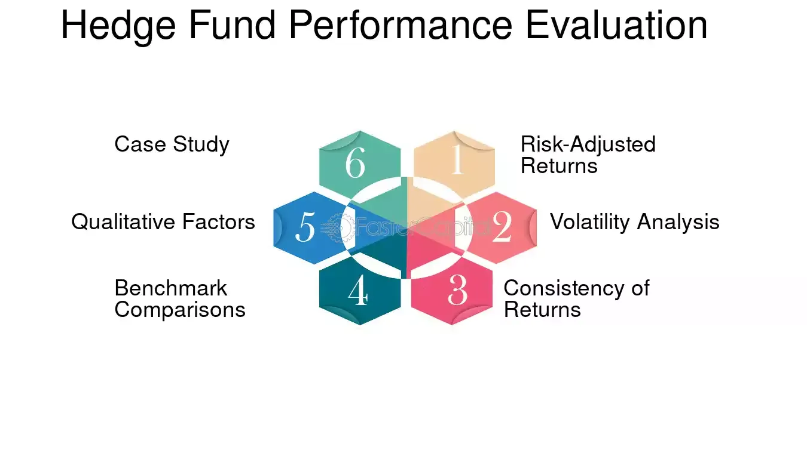

## Table of Contents

## What is a hedge fund and how does it differ from other investment vehicles?

A hedge fund is a type of investment fund that pools money from investors and uses different strategies to try to earn high returns. These strategies can include investing in stocks, bonds, commodities, and even using complex financial tools like derivatives. Hedge funds are usually managed by professional managers who aim to make money whether markets are going up or down. They often take more risks than other types of funds and are usually only available to wealthy investors or institutions because of the high minimum investment requirements.

Hedge funds differ from other investment vehicles like mutual funds and exchange-traded funds (ETFs) in several ways. First, hedge funds have more freedom in what they can invest in and how they can invest. For example, they can use leverage, which means borrowing money to invest, to try to boost their returns. Mutual funds and ETFs, on the other hand, have more restrictions on what they can do. Second, hedge funds are less regulated than mutual funds and ETFs, which means they don't have to share as much information with investors. This can make them riskier but also potentially more rewarding. Finally, hedge funds often charge higher fees than other investment vehicles, which can eat into the returns for investors.

## What are the common types of risks associated with hedge funds?

Hedge funds come with several types of risks that investors should be aware of. One common risk is market risk, which means the value of the investments can go down if the overall market goes down. Hedge funds often use strategies that can make this risk even bigger, like borrowing money to invest more or using complex financial tools. Another risk is liquidity risk, which happens when it's hard to sell the investments quickly without losing a lot of money. Hedge funds sometimes invest in things that are not easy to sell, which can be a problem if many investors want their money back at the same time.

Another type of risk is operational risk, which comes from problems within the [hedge fund](/wiki/hedge-fund-trading-strategies) itself, like mistakes in managing the fund or issues with the people running it. This can lead to losses even if the investments are doing well. There's also the risk of high fees, which can eat into the returns that investors get. Hedge funds often charge a lot of money for managing the fund, which means investors need to make a lot more money just to break even. Finally, there's the risk that comes from the lack of transparency, because hedge funds don't have to share as much information as other types of funds. This can make it hard for investors to know exactly what they're investing in and how much risk they're taking on.

## How can one measure the performance of a hedge fund?

To measure the performance of a hedge fund, you can look at a few key numbers. One important number is the return, which shows how much money the fund made or lost over a certain time. You can compare this return to a benchmark, like the S&P 500, to see if the hedge fund did better or worse than the market. Another number to look at is the risk-adjusted return, which takes into account how much risk the fund took to get its returns. A common way to measure this is by using the Sharpe Ratio, which compares the return of the fund to the risk it took. A higher Sharpe Ratio means the fund did a good job of making money without taking too much risk.

It's also important to look at other factors when measuring a hedge fund's performance. One [factor](/wiki/factor-investing) is the consistency of returns, which shows if the fund made money steadily over time or if it had big ups and downs. Another factor is the fund's performance in different market conditions, like when the market is going up or down. This can help you see if the fund's strategy works well no matter what the market is doing. Finally, you should consider the fees the fund charges, because high fees can eat into the returns. By looking at all these numbers and factors, you can get a good idea of how well a hedge fund is doing.

## What are some key performance metrics used in hedge fund assessment?

When assessing a hedge fund, one of the main performance metrics to look at is the return. This shows how much money the fund has made or lost over a certain time. You can compare this return to a benchmark, like the S&P 500, to see if the hedge fund did better or worse than the market. Another important metric is the risk-adjusted return, which looks at how much risk the fund took to get its returns. The Sharpe Ratio is a common way to measure this. It compares the fund's return to the risk it took, and a higher Sharpe Ratio means the fund did well at making money without taking too much risk.

Other key metrics include the consistency of returns and the fund's performance in different market conditions. Consistency of returns shows if the fund made money steadily over time or if it had big ups and downs. Looking at how the fund performs when the market is going up or down can help you see if its strategy works well no matter what the market is doing. It's also important to consider the fees the fund charges, because high fees can reduce the returns you get. By looking at all these metrics, you can get a good picture of how well a hedge fund is performing.

## How do hedge funds use leverage and what are the associated risks?

Hedge funds use leverage by borrowing money to make bigger investments. They do this because it can help them make more money if their investments do well. For example, if a hedge fund borrows money to buy more stocks and the stocks go up, the fund can make a lot more money than if it had just used its own money. But using leverage also means the hedge fund can lose a lot more money if the investments go down. If the stocks go down instead, the fund will lose not just its own money but also the money it borrowed, making the losses much bigger.

The main risk of using leverage is that it can make losses much bigger. If the investments don't do well, the hedge fund might not be able to pay back the money it borrowed. This can lead to big financial problems for the fund and its investors. Another risk is that using leverage can make the fund's returns go up and down a lot more, which can be scary for investors. It's like riding a roller coaster instead of a smooth train. Because of these risks, hedge funds that use a lot of leverage need to be very careful and make sure they understand what they're doing.

## What role does liquidity risk play in hedge fund management?

Liquidity risk is a big deal for hedge funds because it can affect how easily they can buy and sell their investments. When a hedge fund invests in things that are hard to sell quickly, like real estate or some types of bonds, it faces liquidity risk. If a lot of investors want their money back at the same time, the fund might have to sell these hard-to-sell investments at a lower price just to get the cash. This can lead to big losses for the fund and its investors.

Managing liquidity risk is important for hedge funds. They need to balance their investments between things that are easy to sell and things that might be harder but could make more money. If a hedge fund doesn't manage this risk well, it could run into trouble if the market changes suddenly or if investors start pulling their money out. Good management means keeping enough cash or easy-to-sell investments on hand to meet investor demands without having to sell other investments at a bad time.

## How can operational risk impact the performance of a hedge fund?

Operational risk can really hurt a hedge fund's performance. This kind of risk comes from problems inside the fund, like mistakes in how it's run or issues with the people in charge. For example, if the fund's computer system breaks down or if someone makes a big mistake with the numbers, it can lead to big losses. Even if the investments are doing well, these problems can still mess things up and make the fund lose money.

It's important for hedge funds to manage operational risk carefully. They need to have good systems in place to catch mistakes and prevent problems before they happen. If they don't, the fund might not only lose money but also lose the trust of its investors. When investors see that a fund has operational issues, they might take their money out, which can make things even worse for the fund. So, keeping operational risk under control is key to keeping the fund running smoothly and making money for everyone involved.

## What are the differences between absolute and relative performance measures in hedge funds?

Absolute performance measures in hedge funds look at how much money the fund made or lost, without comparing it to anything else. It's like saying, "The fund made 10% last year." This measure tells you if the fund made money, but it doesn't tell you if it did better or worse than other funds or the market. Investors who want to know if their money grew, no matter what the market did, care about absolute performance.

Relative performance measures, on the other hand, compare the fund's performance to something else, like a benchmark such as the S&P 500. It's like saying, "The fund did 2% better than the S&P 500 last year." This measure helps investors see if the fund did better or worse than the market or other funds. People who want to know if their fund beat the market or did better than other funds care about relative performance. Both measures are important, but they tell you different things about how well a hedge fund is doing.

## How do regulatory changes affect hedge fund risk and performance?

Regulatory changes can have a big impact on how risky hedge funds are and how well they do. When rules change, hedge funds might have to change what they invest in or how they do things. For example, if new rules make it harder to use leverage, hedge funds might not be able to borrow as much money to invest. This can make their investments less risky but also might mean they can't make as much money. On the other hand, if rules get stricter about what funds have to tell investors, it might make things safer for investors but could also make it harder for funds to do well if they have to share more information.

These changes can also affect how investors see hedge funds. If new rules make hedge funds seem safer, more people might want to invest in them. But if the rules make it harder for hedge funds to make money, investors might take their money out. So, regulatory changes can shake things up a lot for hedge funds. They have to keep an eye on what's happening with the rules and be ready to change how they work to keep making money and managing risk.

## What advanced statistical methods can be used to assess hedge fund risk?

One advanced statistical method to assess hedge fund risk is called Value at Risk (VaR). VaR helps you figure out the most money a hedge fund could lose over a certain time, like a day or a month, with a certain level of confidence. For example, if a hedge fund's VaR is $1 million at a 95% confidence level for one day, it means there's a 5% chance the fund could lose more than $1 million in a single day. This method is useful because it gives you a clear number to understand the risk, but it also has limits. It doesn't tell you how much more you could lose if things go really bad, and it assumes the past is a good guide for the future, which isn't always true.

Another method is stress testing, which looks at how a hedge fund would do if really bad things happened in the market. This can help you see if the fund could handle big shocks, like a stock market crash or a sudden change in interest rates. Stress testing is good because it can show you what might happen in the worst cases, but it's hard to predict all the bad things that could happen. So, while stress testing gives you a good idea of risk in tough times, it's not perfect. Both VaR and stress testing are important tools for understanding hedge fund risk, but they work best when used together and with other methods to get a full picture of what could go wrong.

## How can stress testing be applied to evaluate hedge fund resilience?

Stress testing is a way to check how strong a hedge fund is by seeing how it would do if really bad things happened in the market. Imagine the stock market suddenly drops a lot or interest rates change quickly. Stress testing helps you see if the hedge fund could handle these big shocks without losing too much money. It's like practicing for the worst days so you know what might happen. By running these tests, the people running the hedge fund can find out where the fund might be weak and fix those problems before they become big issues.

Using stress testing is helpful because it shows what could happen in the worst cases, which is important for understanding how risky a hedge fund is. But it's not perfect because it's hard to predict all the bad things that could happen. Even though it can't cover every possible problem, stress testing still gives a good idea of how the fund would do in tough times. When used with other ways of checking risk, like looking at past performance or using other statistical tools, stress testing helps make sure the hedge fund is ready for whatever the market throws at it.

## What are the latest trends in hedge fund risk management strategies?

One of the latest trends in hedge fund risk management is using more technology and data. Hedge funds are using computers and special math to look at a lot of information quickly. This helps them see risks better and make smarter choices about what to invest in. They use things like [machine learning](/wiki/machine-learning), which is a kind of computer program that can learn from data and get better at finding risks. This way, they can spot problems faster and change their plans before things go wrong.

Another trend is paying more attention to how the world is changing. Hedge funds are looking at things like climate change, new laws, and big changes in how people live and work. They know these things can affect their investments, so they try to plan for them. For example, if a new law might make a certain kind of investment riskier, they might decide to invest less in that area. By keeping an eye on these big changes, hedge funds can be ready for whatever might happen and keep their investments safer.

## What is the Performance Evaluation of Algorithmic Trading Strategies?

Evaluating the performance of [algorithmic trading](/wiki/algorithmic-trading) strategies is crucial for determining their effectiveness and profitability. The assessment process incorporates various metrics and methodologies that highlight different aspects of a strategy's viability.

**Metrics for Performance Evaluation**

The primary metrics used in performance evaluation include return rates, risk-adjusted returns, maximum drawdown, and the Sharpe ratio:

1. **Return Rates**: This metric measures the gain or loss of a strategy over a specific period, providing a direct indicator of profitability.

2. **Risk-Adjusted Returns**: These consider the risk taken to achieve returns, offering a more comprehensive view. A popular risk-adjusted metric is the Sharpe ratio, defined as:
$$
   \text{Sharpe Ratio} = \frac{R_p - R_f}{\sigma_p}

$$

   where $R_p$ is the expected portfolio return, $R_f$ is the risk-free rate, and $\sigma_p$ is the standard deviation of portfolio returns. This ratio helps in understanding whether high returns are due to smart investment decisions or higher risk.

3. **Maximum Drawdown**: This metric indicates the largest peak-to-trough decline in the value of a portfolio before reaching a new peak. It is crucial for assessing the potential for extreme losses.

**Backtesting**

Backtesting involves running a strategy against historical data to determine how it would have performed in the past. This approach assumes that historical market conditions can provide insights into the potential effectiveness of a strategy. The process usually involves steps such as cleaning data, selecting the proper time frame, and accounting for trading costs and slippage.

**Real-Time Monitoring Tools**

Real-time monitoring tools play a vital role in performance evaluation by allowing immediate assessment of trading activities. These tools help identify anomalies or deviations from expected results, enabling prompt adjustments to strategies. By employing dashboards and alerts, hedge funds can gain insights into crucial performance metrics in real time.

**Post-Optimization Assessments**

After initial optimization, strategies must prove robust across various market scenarios. Post-optimization assessments involve running the strategy across a diverse set of market conditions to ensure stability. This process might include changing market assumptions, such as [volatility](/wiki/volatility-trading-strategies) levels or [liquidity](/wiki/liquidity-risk-premium) constraints, to verify that the strategy maintains performance integrity without overfitting to historical data.

The integration of these methodologies and metrics facilitates a comprehensive evaluation of algorithmic trading strategies, empowering hedge funds to refine approaches for achieving optimal performance while mitigating risks.

## References & Further Reading

[1]: ["Advances in Financial Machine Learning"](https://www.amazon.com/Advances-Financial-Machine-Learning-Marcos/dp/1119482089) by Marcos Lopez de Prado

[2]: Bergstra, J., Bardenet, R., Bengio, Y., & Kégl, B. (2011). ["Algorithms for Hyper-Parameter Optimization."](https://dl.acm.org/doi/10.5555/2986459.2986743) Advances in Neural Information Processing Systems 24.

[3]: ["Quantitative Trading: How to Build Your Own Algorithmic Trading Business"](https://www.amazon.com/Quantitative-Trading-Build-Algorithmic-Business/dp/1119800064) by Ernest P. Chan

[4]: ["Machine Learning for Algorithmic Trading"](https://github.com/stefan-jansen/machine-learning-for-trading) by Stefan Jansen

[5]: ["Evidence-Based Technical Analysis: Applying the Scientific Method and Statistical Inference to Trading Signals"](https://www.amazon.com/Evidence-Based-Technical-Analysis-Scientific-Statistical/dp/0470008741) by David Aronson