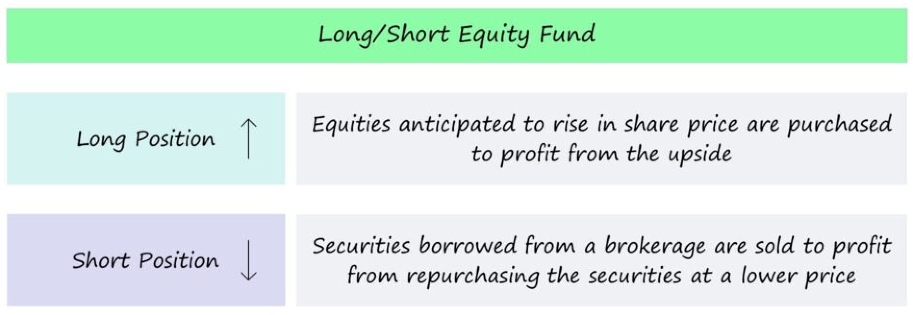
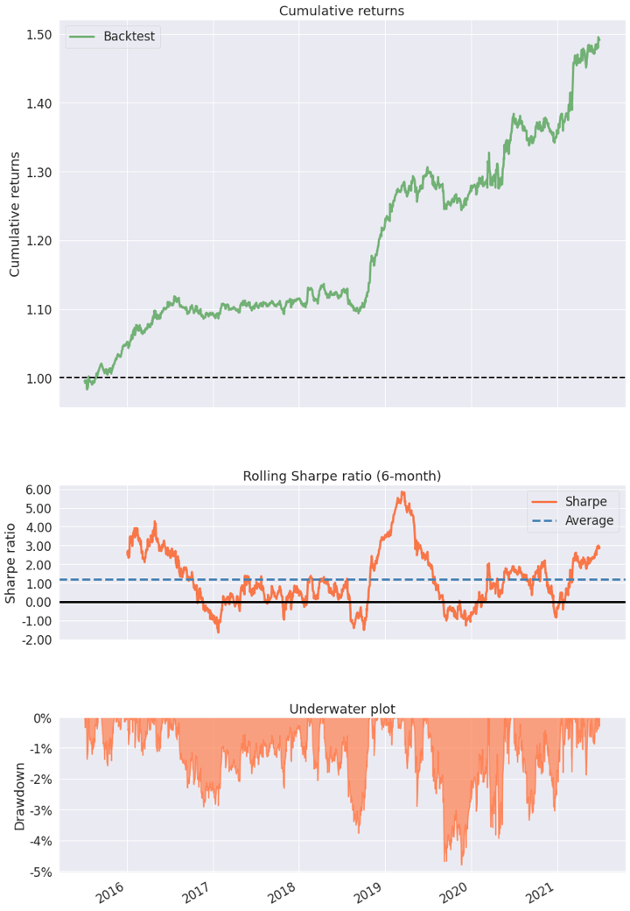

Hedge funds are investment funds that pool capital from accredited individuals or institutional investors to invest in a variety of assets, often with complex portfolio-construction and risk-management techniques. Unlike traditional investment funds, hedge funds are characterized by their flexibility to employ a wide range of strategies to earn active returns, or alpha, for their investors. These funds are typically managed by professional investment management firms and are less regulated than mutual funds and other traditional investment vehicles.

Hedge fund trading strategies are diverse and sophisticated, designed to generate high returns by leveraging various methods and financial instruments. These strategies range from standard practices like long/short equity, where funds take long positions in stocks that are expected to increase in value and short positions in stocks expected to decrease, to more complex strategies like global macro, which seek to profit from changes in global economies and market shifts. Other strategies include market neutral, aiming to minimize market exposure and risk; event-driven, capitalizing on corporate events like mergers or acquisitions; and quantitative strategies, which rely on algorithmic and statistical models to make trading decisions.

Each strategy has its unique approach, risk profile, and market dependency, allowing hedge funds to operate in both rising and falling markets. This flexibility is a key characteristic of hedge funds, distinguishing them from other investment vehicles. Understanding these strategies is crucial for investors considering hedge fund investments, as it not only provides insight into how these funds operate but also helps in evaluating their potential role in a diversified investment portfolio.

## Table of Contents

## Core Hedge Fund Strategies

### Long/Short Equity Strategy

The Long/Short Equity Strategy is a foundational approach in hedge fund trading, characterized by its dual strategy of taking long positions in undervalued stocks and short selling overvalued stocks. This strategy is designed to capitalize on both the upside and downside market movements, offering a balanced approach to equity investment.

In a long position, the fund buys stocks that are anticipated to increase in value. The selection of these stocks is typically based on in-depth [fundamental analysis](/wiki/fundamental-analysis), identifying companies with strong potential for growth or undervalued assets. The aim is to sell these stocks at a higher price in the future, securing a profit from the difference.

Conversely, short selling involves borrowing stocks believed to be overpriced and selling them in the market. The intention is to buy these stocks back at a lower price when their value decreases, returning the borrowed stocks and profiting from the price differential. This aspect of the strategy provides a hedge against market downturns, as gains from short sales can offset losses from the long positions in a declining market.

The Long/Short Equity Strategy not only seeks to generate absolute returns but also aims to reduce market exposure and [volatility](/wiki/volatility-trading-strategies). By balancing long and short positions, the strategy endeavors to mitigate the risks associated with market fluctuations. This approach can provide more consistent returns compared to traditional long-only investment strategies, especially in volatile or declining markets.

The success of this strategy heavily relies on the fund manager's ability to effectively identify undervalued and overvalued stocks, as well as their skill in timing the market. It requires a deep understanding of market trends, individual company performance, and broader economic [factor](/wiki/factor-investing)s. Additionally, effective risk management is crucial in maintaining the balance between long and short positions to optimize returns while minimizing potential losses.

The Long/Short Equity Strategy offers a versatile and dynamic approach to equity trading, allowing [hedge fund](/wiki/hedge-fund-trading-strategies)s to profit in both rising and falling markets while striving to manage risk and volatility. This strategy represents a core technique in the arsenal of hedge fund trading methodologies, appealing to investors seeking a balanced and potentially less market-sensitive investment approach.

### Market Neutral Strategy

The Market Neutral Strategy is a prominent hedge fund approach focused on minimizing market exposure and reducing the impact of market fluctuations on the portfolio's performance. This strategy aims to achieve a balance between long and short positions in the market, thus neutralizing the fund's overall exposure to market movements.

In practice, the [market neutral strategy](/wiki/market-neutral-strategy) involves taking equal and offsetting positions in different securities. For instance, a hedge fund might buy stocks that are undervalued or show strong growth potential (long positions) and simultaneously short sell stocks that are overvalued or expected to decline. The objective is to create a portfolio where the gains and losses from these positions offset each other, ideally leading to a net gain regardless of market direction.

A key component of the market neutral strategy is stock selection. This requires thorough research and analysis to identify pairs of stocks or securities that are expected to diverge in terms of performance. The strategy often employs quantitative methods to select these pairs, relying on statistical models to predict relative movements.

Another aspect of this strategy is leveraging. Funds may use leverage to amplify their investment capacity, aiming to increase potential returns from the spreads between the long and short positions. However, this also increases the risk, making effective risk management essential.

Risk management in market neutral strategies typically involves constant monitoring and rebalancing of the portfolio to maintain the market-neutral stance. This might include adjusting the size of positions or [exit](/wiki/exit-strategy)ing certain trades to align with the changing market conditions and risk profiles.

The market neutral strategy is attractive to investors seeking a lower-risk investment approach, as it aims to generate consistent returns irrespective of market trends. However, its success heavily depends on the fund manager's skill in stock selection and risk management. While the strategy aims to be immune to market swings, it is still subject to specific risks like model risk, where the statistical models used may not perform as expected, and [liquidity](/wiki/liquidity-risk-premium) risk, particularly in the short-selling aspect of the strategy.

In essence, the market neutral strategy represents a sophisticated risk-adjusted approach within hedge fund trading, appealing to those looking for returns that are not directly tied to the general movements of the equity markets.

### Convertible Arbitrage Strategy

The Convertible Arbitrage Strategy is a sophisticated approach employed by hedge funds to exploit pricing inefficiencies between a convertible bond and the stock of the company that issues it. This strategy hinges on the unique characteristics of convertible bonds, which are corporate bonds that can be converted into a predetermined number of shares of the issuing company's stock.

In convertible [arbitrage](/wiki/arbitrage), a hedge fund typically buys convertible bonds and simultaneously shorts the underlying stock of the issuing company. The idea is to capitalize on the price discrepancies between the convertible bond and the associated stock. If the stock price rises, the increase in the value of the convertible bond should offset the losses from the short stock position. Conversely, if the stock price falls, the gain from the short position should counterbalance the decrease in the bond's value.

A key aspect of this strategy is the sensitivity of the convertible bond's price to the underlying stock, known as "delta." Hedge funds engaging in convertible arbitrage closely monitor and adjust their positions to maintain an appropriate delta-neutral position, where the bond and stock price movements are balanced against each other.

Interest rates, credit spreads, and the volatility of the underlying stock are also critical factors in the success of convertible arbitrage. Funds must analyze these elements to determine the attractiveness of the arbitrage opportunity. They may use complex financial models to evaluate the potential return and associated risks of different convertible bonds.

Risk management is essential in convertible arbitrage, as misjudging the market movements or failing to accurately assess the bond's sensitivity to the stock can lead to significant losses. Additionally, this strategy requires high levels of liquidity to adjust positions swiftly in response to market changes.

Convertible arbitrage is known for its potential to generate returns with relatively low correlation to equity and fixed-income markets. However, it requires sophisticated analysis and active management, making it more suited to hedge funds with specialized expertise in this area.

### Event-Driven Strategy

The Event-Driven Strategy in hedge fund trading focuses on capitalizing on stock price movements caused by significant corporate events. These events include mergers and acquisitions, financial restructurings, bankruptcy filings, stock buybacks, spin-offs, and other corporate reorganizations. The fundamental premise of this strategy is that such events can lead to mispriced securities, offering opportunities for profit.

Hedge funds employing an event-driven strategy typically engage in detailed analysis of the potential outcomes and impacts of the corporate event. This approach requires a deep understanding of the intricacies of corporate finance and law, as well as a keen sense of how these events will affect the company's future value.

In mergers and acquisitions, for instance, an event-driven fund might buy shares in the target company while selling short the acquiring company's stock, betting on the successful completion of the merger. This is known as merger arbitrage. The spread between the current market price and the acquisition price can provide an opportunity for gains.

In situations involving distressed companies, event-driven funds may purchase the debt or equity of firms facing bankruptcy or restructuring. These high-risk investments can lead to significant returns if the company successfully reorganizes and recovers.

Risk management is a crucial aspect of the event-driven strategy. Events can have unpredictable outcomes, and the fund's success depends on accurately predicting these and their effect on security prices. Moreover, the strategy can be sensitive to market fluctuations and broader economic conditions, which can influence the success of corporate events and, by extension, the profitability of the strategy.

Event-driven strategies require a proactive approach to investment management, with continuous monitoring of potential and ongoing corporate events, as well as the ability to react quickly to new information. This active management, combined with the high level of research and analysis involved, makes the event-driven strategy particularly suited to hedge funds with the resources and expertise to navigate these complex scenarios.

### Global Macro Strategy

The Global Macro Strategy is a dynamic hedge fund trading approach that seeks to profit from broad market movements caused by major economic trends and global events. This strategy involves making leveraged bets on commodities, currencies, [interest rate](/wiki/interest-rate-trading-strategies)s, stocks, and bonds based on macroeconomic principles and predictions about global economic and political events.

Hedge funds utilizing a [global macro](/wiki/global-macro-strategy) strategy typically analyze a wide array of economic indicators, geopolitical risks, and policy decisions from governments and central banks around the world. This comprehensive analysis forms the basis for predicting macroeconomic trends, which the fund then translates into investment decisions across a range of asset classes.

A core aspect of the global macro strategy is its flexibility. Unlike other strategies that might focus on a specific sector or market, global macro funds have the freedom to invest anywhere in the world, in any asset class. This can include taking long positions in markets expected to rise due to positive economic indicators or shorting markets likely to fall due to adverse conditions.

Currency plays are a significant component of this strategy, with funds betting on the movements of exchange rates influenced by factors such as interest rate differentials, political stability, and economic growth. Similarly, investments in commodities markets are often driven by global supply and demand dynamics, while bond market investments might focus on interest rate movements and monetary policy changes.

The use of leverage is common in global macro strategies, allowing funds to amplify their exposure to certain assets. However, this also increases the potential risk, making effective risk management crucial. Hedge funds need to constantly monitor global markets and adjust their positions as economic conditions evolve.

Global macro strategies are known for their potential to deliver high returns, especially during periods of significant global economic change. However, they also [carry](/wiki/carry-trading) a high degree of risk due to the unpredictability of global events and the complex interplay of various economic factors.

In conclusion, the Global Macro Strategy offers hedge funds an opportunity to capitalize on large-scale economic trends and events. It requires a deep understanding of global economics and politics, flexibility in investment choices, and robust risk management to navigate the complexities of the global financial landscape.

### Short Only Strategy

The Short Only Strategy is a distinct approach in hedge fund trading that involves profiting exclusively from declining stock prices. This strategy is contrary to the typical market norm of buying low and selling high. Instead, it focuses on identifying stocks that are expected to decrease in value, allowing investors to capitalize on negative market trends, company-specific issues, or broader economic downturns.

In a short only strategy, the fund borrows shares of a stock it expects to decline and then sells these shares in the open market. The goal is to repurchase the shares at a lower price in the future, return the borrowed shares, and pocket the difference as profit. This approach requires a deep analysis of market trends, company financials, and industry conditions to identify stocks that are overvalued or have the potential for a price drop.

One of the primary drivers of this strategy is fundamental analysis. Hedge funds employing this approach meticulously scrutinize financial statements, management quality, market position, and sector health to determine the intrinsic value of companies. Stocks of companies that appear overvalued relative to their fundamental worth are prime candidates for short selling.

The short only strategy is often used in bear markets or during periods of economic decline, where many stocks are likely to lose value. However, it can also be effective in bull markets by targeting specific companies or sectors that are facing unique challenges or are fundamentally weak.

Risk management is crucial in a short only strategy, as the potential losses are theoretically unlimited. Since the price of a stock can rise indefinitely, the cost to repurchase and return the borrowed shares can exceed the initial proceeds from the sale. This makes the strategy inherently risky, requiring strict stop-loss measures and continuous market monitoring.

This strategy is not typically suited for the average investor due to its complexity and risk level. It requires not only a deep understanding of financial markets but also the ability to endure potentially significant and rapid losses.

### Merger Arbitrage Strategy

The Merger Arbitrage Strategy is a specialized investment approach in hedge fund trading that focuses on the stocks of companies undergoing mergers and acquisitions (M&A). This strategy aims to profit from the price discrepancies that typically arise during the process of a corporate merger or acquisition.

When a merger or acquisition is announced, the stock of the target company often trades at a discount to the price offered by the acquiring company. This price difference, or spread, exists due to the uncertainty surrounding the completion of the deal. Merger arbitrageurs capitalize on this spread by purchasing the stock of the target company and, in some cases, simultaneously short selling the stock of the acquiring company.

The primary objective is to profit from the spread between the market price and the acquisition price once the merger is completed. If the merger goes through as planned, the target company's stock price will typically rise to match the offer price, allowing the arbitrageur to realize a profit. In the case of short selling the acquirer’s stock, the strategy may profit if the acquirer's stock price falls, a common occurrence as companies often pay a premium for acquisitions.

However, merger arbitrage is not without risks. The main risk is the deal falling through. Factors such as regulatory hurdles, financing issues, or changes in market conditions can lead to a deal being renegotiated at a lower price or completely falling apart. In such scenarios, the price of the target company's stock can fall significantly, leading to potential losses for the arbitrageur.

To manage these risks, hedge funds engaging in merger arbitrage conduct thorough due diligence on the specifics of the deal, including legal and regulatory aspects, financial health of the involved companies, and market conditions. They may also diversify across many deals to spread the risk.

Merger arbitrage requires a nuanced understanding of corporate law, finance, and the specific dynamics of M&A. It can be a profitable strategy, especially in markets with high M&A activity, but requires careful analysis and risk management to navigate the complexities and uncertainties inherent in corporate mergers and acquisitions.

In essence, the Merger Arbitrage Strategy provides a way for hedge funds to exploit inefficiencies in the stock prices of merging companies, offering potential rewards while navigating the intricate risks of the M&A landscape.

### Fixed-Income Arbitrage Strategy

The Fixed-Income Arbitrage Strategy is a sophisticated trading approach used by hedge funds to capitalize on inefficiencies in the interest rate securities market. This strategy involves taking offsetting positions in different fixed-income securities to exploit price discrepancies or the yield spread between them. The goal is to profit from small price differences while minimizing exposure to interest rate movements.

Fixed-income arbitrage typically involves comparing and trading a range of interest rate products such as government bonds, corporate bonds, municipal bonds, and interest rate swaps. A common tactic is to buy one security that appears undervalued while simultaneously short selling a related security that seems overvalued. For example, a fund might exploit the yield spread between two government bonds with different maturities but similar credit quality.

One popular form of fixed-income arbitrage is yield curve arbitrage, where a fund might bet on changes in the shape of the yield curve — the difference between long-term and short-term interest rates. Another form is basis trading, which involves exploiting the price difference between a futures contract and the underlying bond.

The success of fixed-income arbitrage hinges on precise mathematical models and thorough market analysis to identify and quantify mispricings. Hedge funds employ complex strategies, including statistical models and [algorithmic trading](/wiki/algorithmic-trading), to evaluate the relative values of different fixed-income instruments and their likely future movements.

Risk management is crucial in fixed-income arbitrage, as the strategy often involves leverage to magnify returns from small price differentials. This can increase the potential for higher profits but also amplifies the risk of significant losses. Additionally, the strategy relies on the assumption that the identified price inefficiencies will correct themselves. If this does not happen as anticipated, or if market conditions change unexpectedly, the strategy can lead to losses.

Fixed-income arbitrage strategies are sensitive to changes in interest rates, credit spreads, and the overall liquidity in the bond markets. Therefore, funds must constantly monitor and adapt to changing market conditions, regulatory environments, and shifts in monetary policy.

## Advanced Strategies

### Quantitative Strategies

Quantitative Strategies in hedge fund trading involve the use of complex mathematical models and algorithms to identify trading opportunities and execute trades. This approach, often referred to as "quant" trading, relies heavily on technology, data analysis, and computer-driven models to make investment decisions.

At the heart of quantitative strategies are algorithms that analyze vast amounts of market data — including price, [volume](/wiki/volume-trading-strategy), and historical trends — to identify patterns and predict future market movements. These algorithms can process and analyze data at speeds and volumes far beyond human capability, allowing for the rapid execution of trades based on the insights gathered.

One of the key advantages of quantitative strategies is their ability to remove human emotion and bias from the trading process. Decisions are made based on data and statistical probabilities, which can lead to more disciplined and consistent investment strategies.

Quant trading includes a range of strategies such as [statistical arbitrage](/wiki/statistical-arbitrage), where the fund exploits temporary price inefficiencies between related financial instruments; high-frequency trading ([HFT](/wiki/high-frequency-trading-strategies)), involving making a large number of trades in fractions of a second; and algorithmic trading, where trades are executed automatically based on pre-set criteria.

Risk management is integral to quantitative strategies. Given the high speed and volume of trades, these strategies often employ sophisticated risk management algorithms to monitor and adjust exposures in real time. These algorithms are designed to mitigate potential losses, often by setting limits on trade sizes and by automatic hedging against market volatility.

The effectiveness of quantitative strategies depends on the quality of the algorithms and the data used. As more hedge funds and traders adopt these methods, the competition for finding profitable opportunities increases. This competition can lead to the diminishing effectiveness of certain strategies as market anomalies are quickly discovered and exploited.

Moreover, quant strategies are not immune to risks. They can be vulnerable to unexpected market conditions that deviate significantly from historical patterns, and there's also the risk of model overfitting, where a strategy works well on historical data but fails to perform in real market conditions.

### Multi-Strategy Approach

The Multi-Strategy Approach in hedge fund trading involves combining various investment strategies within a single fund to achieve diversification and balance risk. This approach capitalizes on the strengths of different strategies to maximize returns while minimizing the overall volatility and risk of the portfolio.

In a multi-strategy hedge fund, investments are allocated across different strategies such as long/short equity, market neutral, global macro, event-driven, and others. The idea is that by spreading investments across various approaches, the fund can capitalize on a wide range of market conditions and opportunities. If one strategy underperforms due to specific market conditions, another may outperform, thus balancing the overall performance of the fund.

One of the key advantages of the multi-strategy approach is its flexibility. Fund managers can shift allocations between different strategies based on market conditions, trends, and risk assessments. This dynamic allocation allows the fund to adapt to changing market environments, potentially offering more consistent returns over time.

Another benefit is risk mitigation. Since different strategies have varying risk profiles and market dependencies, combining them can reduce the fund's overall risk exposure. For example, while a long/short equity strategy might be affected by equity market movements, a market neutral strategy might not, providing a hedge within the portfolio.

The success of a multi-strategy approach largely depends on the fund manager's expertise in multiple trading strategies and their ability to effectively allocate resources and manage risks across these strategies. It requires a deep understanding of different market dynamics, a robust analytical framework, and efficient execution capabilities.

However, managing a multi-strategy hedge fund can be complex. It involves overseeing multiple trading teams, each specializing in a different strategy, and coordinating their activities to ensure that the overall fund objectives are met. Additionally, the complexity of managing and monitoring diverse strategies can lead to higher operational costs and the need for advanced technology and infrastructure.

### Credit Strategies

Credit Strategies in hedge fund trading focus on the credit and fixed income markets, targeting returns through investments in various debt instruments. These strategies are designed to capitalize on opportunities arising from the assessment of credit risk, interest rate movements, and the potential for credit events such as defaults, downgrades, or restructuring.

In executing credit strategies, hedge funds may engage in a range of activities including buying undervalued debt, short selling overvalued bonds, or trading credit derivatives like credit default swaps (CDS). The core of these strategies revolves around assessing the creditworthiness of issuers and predicting changes in credit ratings or credit spreads.

One common approach within credit strategies is distressed debt investing. This involves purchasing the debt of companies that are in financial trouble or bankruptcy at a discount, betting on a potential recovery or profitable exit scenario, such as a restructuring or acquisition. This strategy requires deep analytical skills to evaluate the potential for a turnaround and understand the intricacies of bankruptcy law and debt restructuring.

Another facet of credit strategies is high-yield bond investing, where funds buy bonds with lower credit ratings that offer higher yields to compensate for the increased risk. These bonds can provide attractive returns, but they are also susceptible to economic downturns and changes in market sentiment.

Credit arbitrage is another strategy used, which involves exploiting pricing inefficiencies between related credit securities. For example, a fund might identify mispricing between a corporate bond and a CDS contract for the same company and take offsetting positions in these securities to profit from the convergence of their prices.

Interest rate trading is also a part of credit strategies, focusing on securities sensitive to changes in interest rates, such as government bonds, mortgage-backed securities, and interest rate swaps. This requires predicting the direction of interest rates and understanding the relationship between interest rates and bond prices.

Risk management is crucial in credit strategies, as these markets can be highly sensitive to economic conditions, interest rate changes, and issuer-specific news. Funds must closely monitor credit risk, liquidity risk, and interest rate risk, often using sophisticated models to assess potential exposures and scenarios.

### Capital Structure Arbitrage

Capital Structure Arbitrage is a sophisticated trading strategy employed by hedge funds to exploit pricing inefficiencies within a single company's capital structure. This strategy involves taking positions in different securities issued by the same company, such as bonds, stocks, or derivatives, capitalizing on mispricings between these instruments.

The fundamental idea behind capital structure arbitrage is that different securities issued by the same company can sometimes be mispriced relative to one another. This mispricing can occur due to a variety of factors, including market sentiment, liquidity variations, or investor behavior. For example, a company’s debt might be undervalued compared to its equity, or vice versa, creating an opportunity for arbitrage.

To execute this strategy, hedge funds typically take a long position in one security (such as debt) that is perceived to be undervalued and a short position in another related security (such as equity) that is considered overvalued. The expectation is that the prices of these securities will eventually converge, resulting in a profit for the fund.

One common approach within this strategy is to exploit discrepancies between a company’s bonds and its stock. For instance, if a fund manager believes that a company’s bonds are undervalued relative to its stock, they might buy the bonds and short sell the stock. If their analysis is correct, and the bond prices rise or the stock prices fall, the fund can profit from the convergence of these prices.

Capital structure arbitrage requires a deep understanding of corporate finance and the factors that influence the pricing of different securities. This includes an analysis of the company’s financial health, the terms and conditions of its debt and equity instruments, and the overall market environment.

Risk management is crucial in capital structure arbitrage, as misjudgments about relative valuations can lead to significant losses. Factors such as credit risk, interest rate changes, and unexpected corporate events can all impact the outcome of the strategy. Moreover, the use of leverage, which is common in such strategies, can amplify both gains and losses.

In conclusion, Capital Structure Arbitrage presents an opportunity for hedge funds to profit from the complex relationships between different securities within a company's capital structure. It requires sophisticated analysis and a keen understanding of market dynamics, making it most suitable for hedge funds with expertise in both corporate valuation and market analysis.

### Distressed Debt Strategy

The Distressed Debt Strategy is a high-risk, high-reward hedge fund trading approach focused on investing in the debt of companies experiencing financial or operational difficulties. This strategy targets companies that are in or near bankruptcy, restructuring, or undergoing significant financial distress, with the belief that the distressed debt is undervalued and has the potential for substantial returns.

In distressed debt investing, hedge funds typically buy bonds, bank loans, or other debt instruments at a significant discount to their par value. The discount reflects the market's perception of the high risk of default. The aim is to profit either from the debt's return to par value upon the company's recovery or through a successful restructuring process where the debt may be converted to equity, potentially at favorable terms.

A key aspect of the distressed debt strategy is the in-depth analysis of the distressed company’s financial situation and prospects for recovery. This includes examining the company's cash flow, capital structure, assets, liabilities, and the broader industry dynamics. The analysis aims to assess the likelihood of the company either successfully restructuring its debt or improving its financial position and operations.

The strategy also involves active involvement in the restructuring process. Hedge funds may seek to influence the restructuring process to protect their interests, often by negotiating terms, advocating for higher recoveries for debt holders, or participating in creditor committees.

However, distressed debt investing carries significant risks. The primary risk is that the company may fail to recover or may end up liquidating, in which case the recovery on the distressed debt could be minimal. Moreover, the process of restructuring can be lengthy and complex, involving legal proceedings and negotiations among various stakeholders.

Market conditions also play a significant role. Economic downturns, changes in interest rates, and shifts in industry trends can all impact the recovery prospects of distressed companies.

### Relative Value Arbitrage

Relative Value Arbitrage is a sophisticated trading strategy used by hedge funds to exploit price differentials between closely related financial instruments. This strategy hinges on the concept that two similar securities, often within the same asset class, can become mispriced relative to one another, providing an opportunity for arbitrage.

In executing this strategy, hedge funds typically identify pairs of securities whose prices have historically moved together but have recently diverged. The fund then goes long on the undervalued security (buying it with the expectation that it will increase in value) and short sells the overvalued one (selling it with the expectation of buying it back at a lower price). The goal is to profit from the convergence of their prices back to their historical norm.

This approach can be applied across various types of securities, including stocks, bonds, commodities, and derivatives. For example, in the case of stock pairs, a fund might focus on two companies in the same industry with similar financial profiles. In fixed income, the strategy might involve different types of bonds issued by the same entity.

One common form of relative value arbitrage is statistical arbitrage, which uses mathematical models to identify and exploit these pricing inefficiencies. These models often rely on historical data to predict the likelihood of convergence and the timeframe in which it might occur.

Another variation is capital structure arbitrage, where a fund exploits pricing inefficiencies between different securities issued by the same company, such as bonds and stocks. This requires a deep understanding of the company's financial health and the factors influencing the pricing of its different securities.

Risk management is crucial in relative value arbitrage. The main risk is that the prices do not converge as expected, which can happen due to changes in market conditions, company fundamentals, or broader economic factors. Additionally, the use of leverage, which is common in arbitrage strategies, can magnify both gains and losses.

Relative value arbitrage strategies are generally considered lower risk compared to other hedge fund strategies, as they are often market-neutral and seek to profit from relative price movements rather than directional market trends. However, successful execution requires sophisticated quantitative analysis, rigorous research, and real-time monitoring of market conditions and positions.

## Strategy Development and Implementation

### Analyzing Market Conditions

Analyzing market conditions is a critical component of successful hedge fund trading strategies. It involves a comprehensive assessment of the current economic environment, market trends, geopolitical events, and financial indicators. This analysis helps hedge funds adapt their strategies to align with current market scenarios, maximizing potential returns while managing risks.

Hedge fund managers use a variety of tools and techniques to analyze market conditions. This includes macroeconomic analysis, which examines factors like GDP growth, inflation rates, unemployment figures, monetary and fiscal policies, and international trade dynamics. Understanding these macroeconomic indicators helps in predicting market directions and making informed investment decisions.

Another key aspect is technical analysis, which involves studying past market data, primarily price and volume, to forecast future market behavior. This includes analyzing charts, trends, patterns, and other statistical measures to identify potential trading opportunities.

Sentiment analysis is also crucial, especially in volatile markets. This involves gauging the mood of the market, whether bullish or bearish, and understanding how emotions and perceptions can influence investor behavior and, consequently, market movements.

Sector and industry analysis is another important area, as different sectors react differently to various economic conditions. Understanding the nuances of each sector, including growth potential, risks, and competitive landscape, allows hedge funds to make more targeted and informed investment decisions.

Risk analysis is an integral part of market condition analysis. This involves identifying potential risks in the market, including market volatility, interest rate changes, geopolitical risks, and sector-specific risks. Effective risk management strategies are then developed to mitigate these identified risks.

Hedge funds also monitor geopolitical events closely, as these can have significant impacts on global markets. Political instability, regulatory changes, trade agreements, and international conflicts can all affect investment decisions and portfolio performance.

### Risk Management

Risk Management is a pivotal aspect of hedge fund operations, crucial for protecting assets and maximizing returns. Each trading strategy, whether it's long/short equity, market neutral, or convertible arbitrage, carries its unique set of risks. Effective risk management involves identifying, assessing, and mitigating these risks to ensure the stability and longevity of the fund.

A primary component of risk management is market risk analysis, which involves understanding how market fluctuations can impact investment performance. This includes assessing exposure to market downturns, interest rate changes, and currency fluctuations. Hedge funds employ various techniques such as value-at-risk (VaR) models to quantify potential losses in adverse market conditions.

Credit risk is another key focus, especially for strategies involving fixed income or distressed debt. This risk assesses the likelihood of a counterparty defaulting on a payment obligation. Credit risk management involves thorough analysis of counterparty creditworthiness and setting appropriate credit limits.

Liquidity risk management is critical, particularly for strategies that invest in less liquid markets or assets. It involves ensuring that positions can be adjusted or unwound without significantly impacting market prices, thus safeguarding the fund from potential losses due to illiquidity.

Operational risk involves mitigating losses from failed internal processes, systems, or external events that disrupt normal business operations. This includes risks from inadequate or failed internal processes, people, systems, or external events.

Leverage risk is inherent in strategies that use borrowed money to amplify returns. While leverage can increase profits, it can also magnify losses. Managing leverage involves monitoring debt levels and ensuring they are in line with the fund's risk tolerance and market conditions.

Compliance risk involves adhering to regulatory requirements and laws. Non-compliance can lead to legal penalties and reputational damage. Funds must stay updated with changing regulations and ensure full compliance.

Diversification is a key strategy for risk management. By spreading investments across various strategies, sectors, geographies, and asset classes, hedge funds can reduce the impact of a poor performance in any single area on the overall portfolio.

Lastly, hedge funds often use hedging techniques to offset potential losses. This could involve using derivatives like options and futures to protect against downside risks in their investment portfolio.

### Portfolio Diversification

Portfolio Diversification is a fundamental investment principle applied in hedge fund trading to reduce risk and enhance potential returns. This approach involves spreading investments across a wide range of strategies, asset classes, sectors, and geographies, thereby minimizing the impact of any single investment’s poor performance on the overall portfolio.

In the context of hedge funds, portfolio diversification goes beyond just investing in different stocks or bonds. It encompasses the use of various hedge fund strategies like long/short equity, market neutral, global macro, event-driven, and others. Each strategy responds differently to market conditions, and combining them can create a more stable and resilient investment portfolio.

Diversification also includes investment in different asset classes such as equities, fixed income, commodities, and derivatives. This is based on the understanding that different asset classes often perform differently under various economic conditions. For example, while stocks may perform well during economic growth periods, bonds may provide stability during downturns.

Geographical diversification is another aspect, where funds invest in markets across different countries and regions. This helps in mitigating the risks associated with a particular country's economy or political environment. Global diversification is especially important for strategies like global macro, which capitalize on worldwide economic trends.

Sector diversification involves investing across various industry sectors such as technology, healthcare, finance, and consumer goods. This is crucial because different sectors react differently to economic cycles and specific market events.

For hedge funds, diversification is not just a risk management tool; it’s also a strategy for capturing a broad range of opportunities in the market. By diversifying, hedge funds can remain agile, taking advantage of emerging trends and adjusting to shifts in market dynamics.

However, effective diversification requires skillful balance. Over-diversification can dilute potential returns, while under-diversification can expose the portfolio to undue risk. Therefore, hedge funds must carefully calibrate their diversification strategy based on their investment goals, risk tolerance, and market outlook.

Portfolio Diversification in hedge fund trading is about creating a balanced and diverse investment portfolio that can withstand market volatility and capitalize on opportunities from different strategies, asset classes, sectors, and geographies. This approach is central to the hedge fund philosophy of achieving superior risk-adjusted returns.

### Backtesting Strategies

Backtesting Strategies is a critical process in hedge fund trading, involving the use of historical data to validate and refine investment strategies. This technique allows hedge funds to simulate how a strategy would have performed in the past, providing insights into its potential effectiveness and risks under various market conditions.

The core of [backtesting](/wiki/backtesting) involves applying the trading strategy's rules to historical market data to reconstruct trades that would have occurred in the past. This process helps in evaluating the profitability and risk profile of the strategy over different time periods and across various market cycles, including bull and bear markets, periods of high volatility, and economic downturns.

Backtesting is particularly important for quantitative strategies, which rely on mathematical models and algorithms. By applying these models to historical data, funds can assess whether the patterns and relationships the models rely on have been consistent over time. It also helps in identifying overfitting, where a strategy is too closely tailored to past data and may not perform well in future markets.

Effective backtesting requires a comprehensive dataset that includes a wide range of market conditions and asset classes. The quality and depth of the data are crucial for obtaining meaningful results. This includes data on prices, volumes, and other market indicators, as well as macroeconomic data and news events that could have impacted the markets.

Risk management is an integral part of backtesting. By analyzing historical performance, funds can gauge the strategy's risk-adjusted returns, drawdowns, and exposure to different risk factors. This helps in fine-tuning risk management measures like stop-loss orders, position sizing, and diversification to better handle adverse market conditions.

However, backtesting has its limitations. Past performance is not always indicative of future results, particularly in rapidly changing markets. Factors such as market liquidity, transaction costs, and slippage (the difference between expected transaction prices and the actual prices at execution) are not always accurately replicated in a backtesting environment.

In conclusion, Backtesting Strategies is a valuable tool for hedge funds, providing crucial insights into a strategy's potential effectiveness and risk. It is a key component in strategy development and refinement, helping funds to make informed decisions and adjust their approaches based on empirical evidence. However, it should be complemented with other methods of analysis and validation to ensure a comprehensive understanding of a strategy's potential in real-world trading scenarios.

## Investment Considerations

### Minimum Investment Requirements

Minimum Investment Requirements are a crucial aspect for investors to consider when looking into hedge funds. These requirements refer to the smallest amount of capital that an investor must commit to participate in a hedge fund. Hedge funds typically set these minimums to attract a certain level of investor, manage fund inflows effectively, and ensure that they have sufficient capital to execute their trading strategies effectively.

The minimum investment amount varies significantly among hedge funds, depending on their strategy, target investor base, and management. For many hedge funds, the minimum investment can range from $100,000 to $1 million or more. Some elite funds, particularly those with a strong track record of performance, may have even higher minimums, sometimes exceeding several million dollars.

These high minimum investment thresholds often make hedge funds accessible primarily to institutional investors, like pension funds and endowments, and high-net-worth individuals. The rationale is that such investors are more likely to understand the risks involved in hedge fund investments and can afford to allocate a significant amount of capital to a potentially risky investment vehicle.

For investors, understanding the minimum investment requirement is important for several reasons. Firstly, it helps in determining whether a particular hedge fund aligns with their investment capabilities. Secondly, it provides insights into the fund's investor base and, by extension, its overall investment philosophy and risk profile.

It’s also important for investors to understand that investing in hedge funds involves not just meeting the minimum investment requirement but also considering the liquidity of their investment. Many hedge funds require investors to lock in their capital for a certain period, known as the lock-up period, during which investors cannot withdraw their funds.

### Hedge Funds vs. Mutual Funds

Understanding the differences between Hedge Funds and Mutual Funds is crucial for investors navigating the investment landscape. While both are collective investment schemes pooling money from multiple investors to buy securities, they differ significantly in terms of structure, investment strategies, risk profiles, regulatory oversight, and accessibility to investors.

**Structure and Accessibility:** Hedge funds are typically private investment partnerships with a limited number of accredited or qualified investors, often requiring high minimum investments. In contrast, mutual funds are open to a broader range of investors, including retail investors, with lower minimum investment requirements.

**Investment Strategies and Objectives:** Hedge funds are known for their wide array of sophisticated and diverse strategies, including long/short equity, global macro, arbitrage, and event-driven. They often use leverage, derivatives, and short selling to maximize returns. Mutual funds generally follow more traditional strategies, primarily investing in stocks, bonds, and other securities, with a focus on long-term capital growth or income.

**Risk Profiles:** Hedge funds, with their complex strategies and use of leverage, are generally considered to be higher risk compared to mutual funds. They aim for higher returns and are more aggressive in their investment approach. Mutual funds, while also subject to market risks, typically have a more conservative investment approach and are considered less risky.

**Performance and Fees:** Hedge funds often aim for higher absolute returns regardless of market conditions and usually have a performance fee structure, where fund managers earn a percentage of the fund's profits. Mutual funds, on the other hand, aim to achieve returns that outperform a specific market benchmark and often have lower fee structures, primarily based on assets under management (AUM).

**Regulatory Oversight:** Mutual funds are subject to stringent regulatory requirements given their wide accessibility to the public. They are required to provide a high level of transparency in their operations, including regular disclosure of their holdings. Hedge funds, given their private nature and accredited investor base, face less regulatory scrutiny and are not required to disclose their activities publicly.

**Liquidity:** Mutual funds offer higher liquidity, with investors typically able to buy or sell shares on any business day. Hedge funds, however, often have lock-up periods where investors cannot withdraw their capital for a set period, making them less liquid.

### Tax Implications

The Tax Implications of hedge fund investments are a critical factor for investors to consider. Hedge funds, with their complex structures and diverse investment strategies, can have unique and sometimes complicated tax consequences.

**Tax Structure of Hedge Funds:** Most hedge funds are structured as limited partnerships or offshore investment corporations. This structure means that they are typically not subject to corporate income tax. Instead, the tax liability is passed through to the individual investors, who are taxed on their share of the fund's income and gains. The nature of these gains, whether short-term or long-term capital gains, interest income, or dividends, can impact the tax rate.

**Short-Term vs. Long-Term Capital Gains:** The distinction between short-term and long-term capital gains is crucial in hedge fund taxation. Short-term capital gains, from investments held for less than a year, are taxed at a higher rate, similar to ordinary income tax rates. Long-term capital gains, from investments held for more than a year, typically enjoy a lower tax rate. Hedge funds often engage in frequent trading, which can result in a higher proportion of gains being taxed at the short-term rate.

**Interest and Dividend Income:** Income from interest and dividends generated by a hedge fund's investments is also subject to tax. The rate depends on the individual investor’s tax bracket and the nature of the income.

**Offshore Funds and Taxation:** For offshore hedge funds, U.S. investors might face different tax implications. While these funds can offer tax advantages, such as deferment of taxes until profits are repatriated, they may also be subject to certain U.S. tax regulations aimed at preventing tax evasion.

**Tax Efficiency:** Some hedge funds employ strategies aimed at tax efficiency, seeking to maximize long-term capital gains or pursue investments that offer favorable tax treatment. However, the primary goal of hedge funds is often to maximize returns, regardless of the tax implications.

**K-1 Forms:** Investors in hedge funds typically receive a Schedule K-1 form, which details their share of the fund's income, gains, losses, deductions, and credits. This form can be complex and may require the assistance of a tax professional to properly report on an investor's tax return.

**Alternative Minimum Tax (AMT):** Hedge fund investments can potentially trigger the AMT for individual investors, a parallel tax system designed to ensure that high-income individuals pay a minimum amount of tax.

In conclusion, understanding the tax implications is essential for any investor considering hedge fund investments. The intricate tax structure of hedge funds, combined with the sophisticated nature of their trading strategies, can lead to complex tax scenarios that should be navigated with the assistance of a knowledgeable tax advisor.

### Performance Reporting

Performance Reporting is a crucial aspect of hedge fund operations, providing investors with insights into the fund's investment results and the effectiveness of its trading strategies. Hedge funds follow specific methods to report their performance, which can vary significantly from traditional investment vehicles like mutual funds.

**Net Asset Value (NAV):** The most common metric used in hedge fund performance reporting is the Net Asset Value (NAV). NAV represents the total value of the fund's assets minus its liabilities, often expressed on a per-share basis. This gives investors a clear picture of what their shares in the fund are worth at a given point in time.

**Returns:** Hedge funds report returns typically as a percentage, calculated based on the change in NAV over a specific period. These returns are usually provided on a monthly or quarterly basis and can be broken down into gross returns (before fees) and net returns (after fees). Net returns are more indicative of what investors actually earn.

**Benchmark Comparison:** Unlike mutual funds, hedge funds may not always compare their performance to a standard market index or benchmark. Given the diverse and complex strategies employed by hedge funds, finding an appropriate benchmark can be challenging. When comparisons are made, they are usually to a benchmark relevant to the fund’s specific strategy.

**Annualized Returns:** For longer-term perspective, hedge funds often report annualized returns. This metric smooths out the performance over several years, providing a rate of return that could be expected each year if the fund’s profit was compounded over the timeframe.

**Risk-Adjusted Returns:** Sophisticated investors pay close attention to risk-adjusted returns, such as the Sharpe ratio or Sortino ratio. These metrics provide insight into how much excess return the fund is generating for the risk taken, compared to a risk-free investment.

**High-Water Mark Policy:** Many hedge funds use a high-water mark in their performance reporting. This means that performance fees are only charged on net profits that exceed the highest NAV previously achieved. This policy aligns the interests of the fund managers with those of the investors, ensuring that managers are rewarded for genuine performance, not just market fluctuations.

**Transparency Level:** The level of detail in hedge fund performance reporting can vary widely. Some funds provide extensive details about their holdings, strategy changes, and market outlook, while others may offer only minimal information due to the proprietary nature of their strategies.

In conclusion, Performance Reporting in hedge funds is a vital communication tool between the fund managers and investors. It provides a snapshot of the fund’s financial health and the success of its investment strategies. Understanding these reports is key for investors to assess the performance, make informed decisions, and align their expectations with the fund’s investment approach.

## Challenges and Risks

### Market Risk

Market Risk, also known as systematic risk, is an integral concept in hedge fund trading strategies, encapsulating the potential for investment losses due to factors that affect the entire market or asset class. This form of risk is inherent in all market investments and cannot be eliminated through diversification, making its understanding crucial for hedge fund managers and investors.

**Sources of Market Risk:** Market risk arises from a variety of sources, including economic recessions, political upheaval, changes in interest rates, and global events like pandemics. These factors can lead to broad market fluctuations, impacting asset prices across the board.

**Impact on Hedge Fund Strategies:** Different hedge fund strategies exhibit varying degrees of market risk. For example, a long/short equity strategy may be more susceptible to overall market movements than a market neutral strategy, which seeks to minimize market exposure. Understanding the level of market risk associated with a strategy is vital for managing its potential impact.

**Measuring Market Risk:** Hedge funds often use statistical measures to gauge market risk. Value at Risk (VaR) is a common metric, estimating the maximum potential loss over a given time period at a certain confidence level. Another measure, beta, assesses the volatility of an investment or portfolio relative to the overall market, indicating its sensitivity to market movements.

**Managing Market Risk:** Hedge funds employ various techniques to manage market risk. This includes using hedging strategies, such as derivatives, to offset potential losses. Asset allocation and diversification across uncorrelated investments can also reduce the impact of market risk. Additionally, maintaining liquidity enables funds to adjust positions quickly in response to market changes.

**Importance for Investors:** For investors, understanding a hedge fund's exposure to market risk is crucial. It affects the fund's potential for gains and losses, and aligning this risk with one's risk tolerance and investment goals is important for long-term investment satisfaction.

### Strategy-Specific Risks

In hedge fund trading, each strategy comes with its unique set of risks, known as Strategy-Specific Risks. Understanding these risks is crucial for both fund managers and investors, as they can significantly impact the performance and stability of the investment. Here’s a breakdown of risks associated with key hedge fund strategies:

**1. Long/Short Equity Strategy:** The primary risk in this strategy is the misjudgment of stock values. Going long on undervalued stocks and short on overvalued stocks exposes the fund to the risk of market misinterpretations. Additionally, short selling brings the risk of unlimited losses, as there's no cap on how high a stock's price can rise.

**2. Market Neutral Strategy:** While designed to minimize market exposure, this strategy can be risky if the correlation between the long and short positions breaks down. It's also subject to model risk, where the statistical model used to balance the portfolio could be flawed.

**3. Convertible Arbitrage Strategy:** This strategy involves risks related to changes in interest rates, credit spreads, and the issuer's creditworthiness. There's also the risk that the convertible securities may not perform as expected, leading to losses.

**4. Event-Driven Strategy:** The success of this strategy hinges on the successful outcome of corporate events like mergers or acquisitions. Delays, regulatory issues, or deal cancellations can adversely affect the fund’s performance.

**5. Global Macro Strategy:** This strategy is sensitive to changes in global economic policies, political events, and major economic indicators. Misjudging these factors can lead to substantial losses, given the often leveraged nature of the trades.

**6. Short Only Strategy:** The major risk here is a market rally or an unexpected positive turn in the targeted company’s fortunes, which can lead to significant losses due to the short positions.

**7. Merger Arbitrage Strategy:** Risks include the possibility of a merger deal falling through or being revalued. This can lead to a loss if the strategy is heavily invested in the success of the merger.

**8. Fixed-Income Arbitrage Strategy:** Interest rate changes can affect this strategy significantly. Also, there’s a liquidity risk, as some fixed-income securities may be hard to sell quickly at a fair price.

**9. Quantitative Strategies:** These are subject to model risk, where the algorithm might be based on flawed assumptions or fail to predict new market conditions. They are also vulnerable to rapid market changes that the model cannot adapt to quickly.

**10. Credit Strategies:** The main risk is the default risk of bond issuers, as well as the general interest rate risk that affects all fixed-income securities.

**11. Capital Structure Arbitrage:** This involves risks related to a misjudgment in the valuation of different securities within a company's capital structure and is sensitive to the overall financial health of the issuer.

**12. Distressed Debt Strategy:** Investing in companies in financial distress is inherently risky, as these companies can fail to turn around and may go bankrupt, leading to substantial losses.

**13. Relative Value Arbitrage:** This strategy can be undermined by unexpected market movements that change the relative values of the securities being arbitrage.

### Regulatory Challenges

Navigating through complex regulatory environments is a critical aspect of hedge fund management. Hedge funds, like all financial entities, operate under a framework of rules and regulations designed to protect investors and ensure market integrity. However, the global nature of these funds, coupled with their sophisticated strategies, often presents unique regulatory challenges.

**Compliance with Local and International Laws:** Hedge funds must comply with the regulatory requirements of the jurisdictions in which they operate. This can be particularly challenging for funds that invest globally, as they must navigate a patchwork of international laws and regulations. Compliance involves adhering to rules regarding investor protection, reporting requirements, marketing, and fund operation.

**Changing Regulatory Landscape:** The regulatory environment for hedge funds is not static. In response to economic crises or market events, governments and regulatory bodies often update or introduce new regulations. Funds must be agile in adapting to these changes to avoid penalties and legal challenges. Post-2008 financial crisis, for instance, saw significant regulatory changes aimed at increasing transparency and reducing systemic risk in the financial system.

**Transparency and Reporting Requirements:** Regulatory bodies often require hedge funds to report various aspects of their operations. This includes disclosing financial statements, investment strategies, risk management practices, and information about their investors. Compliance with these reporting requirements demands robust internal processes and systems.

**Marketing and Solicitation Rules:** Hedge funds face strict rules regarding how and to whom they can market their funds. Many jurisdictions limit hedge fund marketing to accredited or qualified investors only, and there are often restrictions on advertising and public solicitation.

**Anti-Money Laundering (AML) and Know Your Customer (KYC) Compliance:** Hedge funds must have procedures in place to prevent money laundering. This includes implementing KYC practices to verify the identity of their investors and understand the nature of their invested funds.

**Tax Compliance:** With their complex structures and international investments, hedge funds face intricate tax compliance challenges. Navigating the tax implications in multiple jurisdictions requires deep expertise and can have significant implications for the fund’s profitability and investor returns.

**Regulatory Scrutiny and Pressure:** Hedge funds, especially those that are large or employ high-risk strategies, may be subject to increased scrutiny from regulators. This can include regular audits, inspections, and reviews to ensure compliance with financial and operational regulations.

## The Future of Hedge Fund Strategies

The future of hedge fund strategies is poised to be shaped by emerging trends, technological advancements, particularly the role of AI and machine learning, and the global economic landscape. These factors are expected to drive innovation and transformation in the way hedge funds operate and strategize for growth and risk management.

**Emerging Trends in Hedge Funds:** We are witnessing a shift towards more sustainable and responsible investing. Environmental, Social, and Governance (ESG) criteria are becoming increasingly important in investment decisions. Hedge funds are adapting by integrating ESG factors into their analysis and investment processes, recognizing that these elements can significantly impact long-term risk and return.

**Technological Advancements:** The integration of AI and machine learning in hedge fund strategies is becoming more pronounced. These technologies enable funds to process vast amounts of data, identify patterns, and make predictive analyses at a speed and accuracy that is unattainable for human traders. AI-driven strategies can adapt to new market conditions more dynamically, offering the potential for improved decision-making and risk assessment.

**Global Economic Influence:** Hedge funds are also focusing on the impact of global events, such as geopolitical shifts, trade policies, and global health crises, on markets. The increasing interconnectedness of global economies means that events in one region can have ripple effects across the world. Hedge funds are leveraging global macro strategies and real-time data analysis to navigate these complexities.

**Personalization and Customization:** There is a growing trend towards offering more personalized investment solutions. Investors are seeking bespoke strategies that align closely with their individual risk profiles and investment goals. Hedge funds are responding by using technology to create more tailored products and services.

**Regulatory Adaptation:** As the hedge fund industry evolves, so does the regulatory landscape. Funds must stay agile to adapt to new regulations that aim to increase transparency, protect investors, and reduce systemic risk. Compliance and adaptability to these regulatory changes remain a key focus for future hedge fund operations.

**Increased Collaboration:** Future strategies may involve greater collaboration between hedge funds and other financial institutions, including fintech companies, to leverage mutual strengths. This could lead to the development of innovative products and investment vehicles.

In conclusion, the future of hedge fund strategies is likely to be characterized by a deeper integration of technology, a greater emphasis on global economic trends, and a shift towards more sustainable and personalized investment approaches. Hedge funds that can effectively harness these changes and adapt to the evolving landscape are poised to succeed in this dynamic environment.

## Conclusion

In conclusion, hedge funds represent a dynamic and diverse segment of the financial market, characterized by a wide array of trading strategies designed to achieve specific investment goals. From the classic Long/Short Equity Strategy, balancing investments in undervalued stocks with short sales of overvalued stocks, to the sophisticated Quantitative Strategies leveraging algorithms and models, each approach offers unique opportunities and risks.

Strategies like Market Neutral and Convertible Arbitrage focus on minimizing market exposure and exploiting pricing inefficiencies, respectively. Event-Driven Strategies capitalize on corporate events, while Global Macro Strategies leverage global economic trends. Other approaches, such as Short Only, Merger Arbitrage, and Fixed-Income Arbitrage, each play a distinct role in the hedge fund landscape, exploiting specific market conditions for profit.

The advanced strategies, including Multi-Strategy Approaches and Credit Strategies, illustrate the adaptability and innovation within the hedge fund industry. These strategies, along with specialized ones like Capital Structure Arbitrage and Distressed Debt Strategy, underscore the importance of deep market knowledge and risk management in achieving successful outcomes.

In terms of future outlook, hedge funds are poised to continue evolving, driven by emerging trends, technological advancements like AI and [machine learning](/wiki/machine-learning), and the global economic environment. These factors will shape the strategies hedge funds employ, as they navigate the complexities of the market and strive to deliver value to their investors.

The role of hedge funds in a diversified investment portfolio cannot be overstated. With their unique strategies and ability to navigate different market conditions, hedge funds offer an alternative to traditional investment vehicles, potentially providing higher returns and risk mitigation.

For investors, understanding the diverse strategies and inherent risks of hedge funds is crucial. This knowledge, coupled with the awareness of regulatory challenges and global economic influences, can help in making informed decisions about including hedge funds in an investment portfolio.

As the financial landscape continues to evolve, hedge funds will undoubtedly adapt, seeking new opportunities and refining their strategies to meet the changing needs of their investors and the markets they navigate.

## References & Further Reading

- ["More Money Than God"](https://www.amazon.com/More-Money-Than-God-Relations/dp/0143119419) by Sebastian Mallaby
- ["The Big Short"](https://www.amazon.com/Big-Short-Inside-Doomsday-Machine/dp/0393338827) by Michael Lewis
- ["Hedge Fund Market Wizards"](https://www.amazon.com/Hedge-Fund-Market-Wizards-Winning-ebook/dp/B007YGGOVM) by Jack D. Schwager
- ["The Alpha Masters"](https://www.amazon.com/Alpha-Masters-Unlocking-Genius-Worlds/dp/1118065522) by Maneet Ahuja
- ["When Genius Failed"](https://www.amazon.com/When-Genius-Failed-Long-Term-Management/dp/0375758259) by Roger Lowenstein