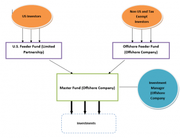

The investment finance landscape is a complex and dynamic field, characterized by a wide array of participants and financial instruments, all contributing to the global economy's vitality. Central to this landscape are hedge funds, which serve as critical players through their roles in market liquidity provision, risk management, and capital allocation. Hedge funds are pooled investment structures that employ various strategies to maximize returns for their investors. These funds are typically accessible to accredited investors due to their complex nature and regulatory standards, and they often leverage techniques such as long-short equity, market neutral, and event-driven strategies, among others.

Algorithmic trading, on the other hand, represents a significant technological advancement in finance, where computer algorithms execute trades at speeds and frequencies that surpass human capability. These algorithms use pre-defined instructions to evaluate numerous market variables, enabling traders to capitalize on fleeting market opportunities with precision and efficiency. Algorithmic trading has emerged as a transformative force, reshaping the traditional paradigms of trading through enhanced accuracy, reduced transaction costs, and minimized emotional biases.

The intersection of hedge funds and algorithmic trading is expanding rapidly, driven by the increasing availability of sophisticated data analytics and improved computing power. Hedge funds are progressively embracing algorithmic trading to enhance their decision-making processes and refine their investment strategies. This amalgamation is paving the way for a new breed of hedge funds that rely heavily on data-driven insights and technology to gain competitive advantages in the market.

The purpose of this article is to explore the confluence of hedge funds and algorithmic trading, highlighting its importance in the contemporary investment finance environment. Readers can expect to gain an understanding of the fundamental principles of hedge funds and algorithmic trading, the synergies between these entities, and the potential opportunities and risks involved. Through examining these aspects, the article aims to equip readers with greater insight into the future trajectory of investment finance, encouraging exploration and informed engagement in this evolving sector.

## Table of Contents

## Understanding Hedge Funds

Hedge funds are investment vehicles that pool capital from accredited and institutional investors to strategically achieve high returns. They are often structured as limited partnerships or limited liability companies, providing investors with an opportunity to gain exposure to diverse assets including stocks, bonds, currencies, and derivatives. Unlike mutual funds, hedge funds have more flexibility in their investment approaches due to fewer regulatory constraints, allowing them to employ a wide array of strategies suitable for different market conditions.

**Role of Hedge Funds in Global Financial Markets**

Hedge funds play a significant role in global financial markets by providing [liquidity](/wiki/liquidity-risk-premium), promoting market efficiency, and enhancing price discovery. With their ability to take both long and short positions, hedge funds can profit in various market conditions, contributing to market stability. Their participation aids in the efficient allocation of resources and influences corporate governance by holding significant equity stakes.

**Different Strategies Employed by Hedge Funds**

Hedge funds employ diverse strategies to optimize returns, including:

1. **Long/Short Equity:** This approach involves buying undervalued stocks while short-selling overvalued ones, aiming to capitalize on stock price discrepancies.

2. **Market Neutral:** By maintaining a balance between long and short positions, market neutral funds aim to mitigate market risk and profit from stock-specific movements.

3. **Global Macro:** This strategy focuses on large economic trends and macroeconomic principles, betting on big-picture economic shifts through various financial instruments.

4. **Event-Driven:** These funds capitalize on price movements caused by corporate events like mergers, acquisitions, or bankruptcies.

5. **Quantitative:** Leveraging mathematical models and algorithms, quantitative funds identify investment opportunities with precision, often employing high-frequency trading techniques.

**Advantages and Risks Associated with Hedge Fund Investments**

Hedge fund investments offer several advantages, such as potential high returns and access to advanced investment strategies and diversification. However, these benefits come with risks, including high [volatility](/wiki/volatility-trading-strategies), lack of liquidity, and significant investment costs. Additionally, hedge funds are less transparent and highly leveraged, which can magnify losses.

**Key Players and Trends in the Hedge Fund Industry**

Notable [hedge fund](/wiki/hedge-fund-trading-strategies) managers, like Ray Dalio, Ken Griffin, and Steven Cohen, have significantly impacted the industry, guiding the strategic directions of their respective firms such as Bridgewater Associates, Citadel LLC, and Point72 Asset Management. Recent trends in the hedge fund industry include increased adoption of technology and [algorithmic trading](/wiki/algorithmic-trading), a shift towards more socially responsible investing, and a growing emphasis on regulatory compliance amid an evolving financial landscape.

As hedge funds continue to adapt to technological advancements and changing market dynamics, they remain crucial components of the financial landscape, influencing trends and shaping the future of global investment strategies.

## The Role of Algorithmic Trading

Algorithmic trading refers to the use of computer algorithms to automate trading processes in financial markets. These algorithms execute trades based on pre-defined criteria, encompassing variables such as timing, price, and [volume](/wiki/volume-trading-strategy), thereby minimizing human intervention. This technology enhances trading efficiency and accuracy, allowing for rapid execution of orders which is critical in today’s fast-paced markets. 

The roots of algorithmic trading trace back to the early 1970s when it was employed for simple tasks like order execution. As computing power increased through the decades, so too did the complexity and capabilities of trading algorithms. By the late 20th century, algorithmic trading had transformed the financial landscape, with high-frequency trading ([HFT](/wiki/high-frequency-trading-strategies)) emerging as a dominant force. HFT involves executing a large number of orders at extremely high speeds, taking advantage of quantitative models and trading strategies.

One of the primary advantages of algorithmic trading for hedge funds and investors is its ability to process and analyze large volumes of data at speeds incomparable to human capabilities. This allows for the identification of trading opportunities and the execution of orders with precision and speed. Furthermore, algorithms eliminate emotional biases that can affect human traders, leading to more consistent decision-making processes.

Despite these advantages, algorithmic trading presents several challenges and risks. The reliance on technology introduces risks related to hardware and software failures. Flash crashes, where markets plummet rapidly due to automated trades, exemplify the potential dangers inherent in algorithmic strategies. Regulatory changes also pose challenges, as oversight bodies strive to keep pace with the evolving technology, ensuring that algorithmic trading does not destabilize financial markets.

Popular algorithmic trading strategies include [trend following](/wiki/trend-following), [arbitrage](/wiki/arbitrage), and [market making](/wiki/market-making). In trend following, algorithms identify and exploit upward or downward market trends. Arbitrage strategies involve simultaneously purchasing and selling an asset in different markets to exploit price discrepancies. Market making algorithms provide liquidity by offering to buy and sell an asset, capturing the spread between bid and offer prices as profit.

Algorithmic trading continues to evolve, driven by advancements in [artificial intelligence](/wiki/ai-artificial-intelligence) and [machine learning](/wiki/machine-learning). These technologies pave the way for increasingly sophisticated algorithms capable of complex pattern recognition and predictive analytics, heralding new opportunities and challenges for hedge funds and investors alike.

## The Synergy between Hedge Funds and Algo Trading

Hedge funds are increasingly turning to algorithmic trading due to its ability to process vast amounts of data quickly and execute trades at optimal prices. The adoption of algorithmic trading allows these funds to implement strategies that leverage computational power and sophisticated mathematical models, leading to enhanced decision-making processes and competitive advantages in financial markets.

Algorithmic trading allows hedge funds to utilize advanced strategies by automating processes that would be too complex or time-consuming to execute manually. For example, quantitative funds employ [statistical arbitrage](/wiki/statistical-arbitrage), which involves managing thousands of trades simultaneously. Algorithms enable these funds to identify and exploit inefficiencies across different markets or securities, thereby enhancing overall fund strategies and returns.

The role of technology in improving trading speed and efficiency is significant. With the advancements in high-frequency trading (HFT), trades can be executed in microseconds, allowing hedge funds to react to market conditions faster than human traders. This technological edge enables funds to capitalize on fleeting opportunities in the market, adjusting positions with precision and security.

Several hedge funds have successfully integrated algorithmic trading into their operations. For example, Renaissance Technologies is renowned for its Medallion Fund, which employs complex mathematical models to generate returns far above market averages. Another case is Two Sigma, which applies machine learning and distributed computing to manage its portfolios. These funds exemplify how quantitative approaches and algorithmic trading can yield substantial investment returns.

Looking forward, the integration of hedge funds and algorithmic trading is expected to deepen further. As artificial intelligence and machine learning models become more sophisticated, they will likely provide even more powerful tools for predictive analysis and automated decision making. Additionally, the continuous expansion of data sources—such as social media sentiment analysis and [alternative data](/wiki/best-alternative-data)—will offer new dimensions for trading algorithms to explore.

In summary, the synergy between hedge funds and algorithmic trading is transforming the investment landscape, with technology playing a pivotal role in shaping future strategies and performance outcomes. This integration offers promising opportunities for achieving superior returns while posing challenges related to managing complexity and regulatory scrutiny.

## Investment Opportunities and Risks

Hedge funds employing algorithmic trading present numerous investment opportunities for those looking to capitalize on advanced financial strategies. The primary appeal of algorithmic trading within hedge funds lies in the potential for increased efficiency, speed, and precision, enabling investors to exploit market inefficiencies timely.

### Potential Investment Opportunities

Algorithmic trading empowers hedge funds to adopt and excel in diverse strategies, such as high-frequency trading, statistical arbitrage, and quantitative analysis. These strategies can generate alpha by capitalizing on minute price discrepancies and executing large volumes of trades at high speeds. Additionally, hedge funds using algorithmic trading can access a broader array of asset classes, including equities, [forex](/wiki/forex-system), commodities, and cryptocurrencies, thus enhancing portfolio diversification.

### Key Factors to Consider Before Investing

Investors should evaluate several critical factors before committing capital to hedge funds utilizing algorithmic trading. Expertise in technology and financial markets is paramount. Understanding the fund's algorithmic strategies, the robustness of its technological infrastructure, and the experience of its quantitative team can provide insights into its potential for success. Furthermore, fees associated with hedge funds can be substantial, often following the “2 and 20” model—2% management fee and 20% performance fee. Thus, assessing the fund's historical performance and fee structure is essential.

### Understanding the Risk-Reward Balance

Algorithmic trading in hedge funds offers significant potential rewards but also involves substantial risks. One primary risk is the reliance on models that may fail to predict market dynamics accurately, especially during volatile periods. Moreover, algorithms can exacerbate market movements, contributing to flash crashes. Investors must understand the volatility of the asset classes involved and how the fund manages risk through stop-loss orders and other mechanisms.

### Regulatory Environment and Its Impact

The regulatory landscape significantly influences the operation of hedge funds and their algorithmic trading practices. Regulations such as the Dodd-Frank Act and the European Union's Markets in Financial Instruments Directive (MiFID II) impose stringent requirements on transparency, data reporting, and risk management for trading algorithms. Investors must consider how a hedge fund adheres to these regulations, as compliance impacts operational costs and strategic flexibility.

### Tips for Investors

For those interested in hedge funds and algorithmic trading, due diligence is crucial. Assess the fund's track record, strategy robustness, and risk management practices. Engaging with financial advisors to understand better the technical aspects of algorithmic models and the implications of the regulatory environment can also be beneficial. Moreover, investors should be prepared for the long-term commitment and potential volatility in returns that accompany innovative trading strategies. Diversifying investments and maintaining a balanced, informed approach can help mitigate some risks associated with hedge fund investments incorporating algorithmic trading.

## Conclusion

Hedge funds and algorithmic trading represent critical components of the modern financial ecosystem, combining sophisticated strategies and advanced technology to navigate the complexities of today's markets. Hedge funds have historically played a pivotal role in achieving market efficiencies and offering investors diversified risk-return profiles. By managing a pool of funds and employing strategies that aim to generate absolute returns, hedge funds contribute significantly to liquidity and price discovery in financial markets.

Algorithmic trading, on the other hand, has revolutionized how financial transactions are executed by using pre-programmed instructions to account for variables such as timing, price, and volume. This approach has enabled faster and more efficient trading, reducing human error and providing the capability to capitalize on brief market opportunities. The integration of algorithmic trading into hedge fund strategies epitomizes a significant leap towards more agile and responsive investment solutions.

Throughout this article, we've examined the transformative influence of algorithmic trading on hedge funds. We've highlighted how algorithmic strategies enhance hedge fund performance by increasing execution speed and optimizing trade outcomes. The synergy between these entities not only promises increased efficiency but also presents substantial opportunities for those willing to engage with the challenges and complexities involved.

The future of investment finance appears increasingly intertwined with technological innovation. As advancements in machine learning, big data, and AI continue, we can expect further refinement of hedge fund strategies through the use of complex algorithms. This progression anticipates a new era of investment opportunities characterized by precision, speed, and data-driven decision-making.

For investors, exploring hedge funds and algorithmic trading could unlock access to sophisticated investment strategies capable of navigating volatile market conditions. While these opportunities [carry](/wiki/carry-trading) risks, understanding the inherent dynamics and regulatory landscapes can provide a pathway to informed and strategic investment choices.

We invite readers to share their experiences and perspectives on hedge funds and algorithmic trading. Engaging with a community of informed investors can provide valuable insights and foster a deeper understanding of this evolving financial landscape.

## References & Further Reading

[1]: Bergstra, J., Bardenet, R., Bengio, Y., & Kégl, B. (2011). ["Algorithms for Hyper-Parameter Optimization."](https://papers.nips.cc/paper/4443-algorithms-for-hyper-parameter-optimization) Advances in Neural Information Processing Systems 24.

[2]: ["Advances in Financial Machine Learning"](https://www.amazon.com/Advances-Financial-Machine-Learning-Marcos/dp/1119482089) by Marcos Lopez de Prado

[3]: ["Evidence-Based Technical Analysis: Applying the Scientific Method and Statistical Inference to Trading Signals"](https://www.amazon.com/Evidence-Based-Technical-Analysis-Scientific-Statistical/dp/0470008741) by David Aronson

[4]: ["Machine Learning for Algorithmic Trading"](https://github.com/stefan-jansen/machine-learning-for-trading) by Stefan Jansen

[5]: ["Quantitative Trading: How to Build Your Own Algorithmic Trading Business"](https://www.amazon.com/Quantitative-Trading-Build-Algorithmic-Business/dp/1119800064) by Ernest P. Chan