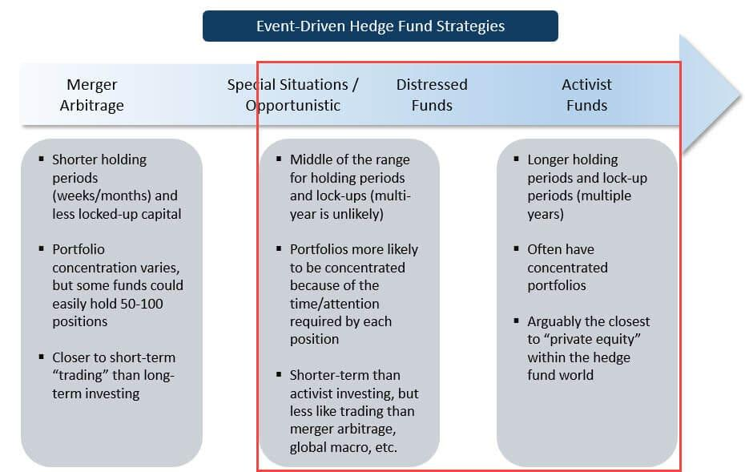

## Table of Contents

## What are hedge funds and how do they operate?

Hedge funds are investment funds that pool money from wealthy individuals and institutions to invest in a variety of assets. They aim to make high returns for their investors, often by taking risks that other types of funds might avoid. Unlike mutual funds, hedge funds are less regulated, which allows them to use different and sometimes complex investment strategies. These strategies can include betting on stocks going down as well as up, using borrowed money to increase potential returns, and investing in less traditional assets like commodities or real estate.

Hedge funds operate by charging fees to their investors. Typically, they charge a management fee, which is a percentage of the assets they manage, and a performance fee, which is a percentage of the profits they make. This fee structure can be quite high compared to other investment options. Hedge fund managers use the money they collect to make investments according to their strategy. They might buy and sell stocks, bonds, or other assets quickly to take advantage of market changes. Because hedge funds are less transparent than other funds, it can be hard for investors to know exactly what the fund is doing with their money.

## What is distressed debt and why do hedge funds invest in it?

Distressed debt is when a company is struggling and can't pay back its loans. These loans, or debts, become worth less because people think the company might not be able to pay them back. Hedge funds see this as a chance to buy these debts at a low price. They hope that the company will get better and be able to pay back more than what the hedge fund paid for the debt. It's like buying something on sale and hoping it goes back up in value.

Hedge funds invest in distressed debt because they can make a lot of money if things go well. They are willing to take big risks for big rewards. If the company does recover, the [hedge fund](/wiki/hedge-fund-trading-strategies) can make a profit from the difference between what they paid for the debt and what they get back. But it's risky because if the company goes bankrupt, the hedge fund could lose money. Still, hedge funds have experts who study these situations closely and try to pick the best opportunities.

## How do hedge funds identify distressed debt opportunities?

Hedge funds look for distressed debt by keeping a close eye on companies that are having money problems. They watch for signs like late payments on loans, falling stock prices, or news about the company struggling. They also use special tools and data to see how much a company's debt is worth and if it's a good deal to buy it at a lower price. By doing a lot of research, hedge funds try to figure out which companies might get better and pay back their debts, even if they are in trouble now.

Once they find a company with distressed debt, hedge funds think about how they can help the company get better. They might talk to the company's leaders and suggest ways to fix their problems. Sometimes, they buy a lot of the company's debt and then work to change how the company is run. This can be a big job, but if the company does well again, the hedge fund can make a lot of money from the debt they bought cheap. It's all about finding the right companies and helping them turn around.

## What are the typical strategies hedge funds use when investing in distressed debt?

Hedge funds use different strategies when they invest in distressed debt. One common strategy is to buy the debt at a low price and then wait for the company to get better. If the company improves, the value of the debt goes up, and the hedge fund can sell it for a profit. They might also work with the company to help it recover. This could mean giving advice or even taking control of the company to make big changes. The goal is to turn the company around so it can pay back its debts, which makes the hedge fund's investment worth more.

Another strategy is to buy a lot of the company's debt and then push for the company to be sold or broken up. This can be faster than waiting for the company to get better on its own. If the company is sold, the hedge fund can get paid back more than what they paid for the debt. Sometimes, hedge funds also trade the distressed debt, buying and selling it quickly to make money from small changes in its value. This can be risky but can also lead to quick profits if done right.

## What are the risks associated with investing in distressed debt for hedge funds?

Investing in distressed debt can be risky for hedge funds. One big risk is that the company might not get better. If the company goes bankrupt, the hedge fund could lose the money they put into the debt. This is a big problem because distressed debt is often bought at a low price, but if the company fails, even that low price can be too much. Another risk is that the market might change. If the economy gets worse, more companies could struggle, and the value of distressed debt could drop even more. Hedge funds need to be very careful and do a lot of research to try to avoid these problems.

There's also the risk that the hedge fund might not be able to sell the distressed debt when they want to. Sometimes, it's hard to find someone else who wants to buy this kind of debt, especially if the market is bad. This can mean the hedge fund has to keep the debt longer than they planned, which ties up their money and could lead to losses. Additionally, working with a troubled company can be tricky. The hedge fund might spend a lot of time and effort trying to help the company, but there's no guarantee that their plans will work. All these risks mean that investing in distressed debt is not for everyone and requires a lot of skill and patience.

## How do hedge funds manage and mitigate the risks of distressed debt investments?

Hedge funds manage the risks of distressed debt by doing a lot of research before they invest. They look at the company's financials, talk to its leaders, and use special tools to see if the debt is a good deal. They also spread out their investments, so they don't put all their money into one company. This way, if one company fails, they don't lose everything. Hedge funds also keep a close eye on the market and the economy, so they can sell the debt if things start to look bad.

Another way hedge funds mitigate risks is by working closely with the companies they invest in. They might give advice or even take control to make big changes that can help the company get better. This hands-on approach can increase the chances of the company paying back its debts. Hedge funds also use their experience to find the best times to buy and sell distressed debt, trying to make profits while keeping risks low. By being careful and active, hedge funds try to turn risky investments into successful ones.

## What is the role of due diligence in distressed debt investing by hedge funds?

Due diligence is a big part of what hedge funds do when they invest in distressed debt. It means doing a lot of homework on the company that's in trouble. Hedge funds look at the company's money situation, its debts, and how it's been doing lately. They talk to the people who run the company and use special tools to figure out if the debt is a good deal. This helps them see if the company can get better and pay back its debts. Without due diligence, hedge funds would be guessing, and that's too risky.

By doing due diligence, hedge funds can make better choices about which distressed debts to buy. They try to find out everything they can about the company's problems and what might help it get better. This careful checking helps them see the risks and decide if it's worth the chance. If they do their homework right, they can pick the best opportunities and help the companies turn around, which can lead to big profits.

## How do regulatory environments affect hedge fund investments in distressed debt?

Regulatory environments can have a big impact on how hedge funds invest in distressed debt. Different countries have different rules about what hedge funds can and can't do. For example, some places might have strict laws about buying and selling distressed debt, which can make it harder for hedge funds to make quick moves. Also, rules about how much a hedge fund can borrow to invest might limit how much they can put into distressed debt. These regulations can change how much risk a hedge fund is willing to take and how they plan their investments.

On the other hand, some regulatory environments might be more friendly to hedge funds. In these places, the rules might be less strict, which can make it easier for hedge funds to buy distressed debt and work with troubled companies. But even in these places, hedge funds still have to be careful. They need to make sure they follow all the rules, or they could get in trouble. So, understanding the regulatory environment is a big part of how hedge funds decide where and how to invest in distressed debt.

## Can you explain the process of restructuring and how hedge funds participate in it?

Restructuring is what happens when a company that's in trouble tries to fix its problems so it can start making money again. It's like giving the company a new plan to follow. This can mean changing how the company is run, cutting costs, or even selling off parts of the business. Hedge funds get involved in restructuring because they often buy the company's distressed debt. They want to help the company get better so they can make money from their investment. They might work with the company's leaders to come up with a new plan or even take control of the company to make big changes.

Hedge funds can also help by giving the company more money to keep going while it's fixing its problems. This is called debtor-in-possession (DIP) financing. It's a loan that helps the company stay alive during restructuring. If the restructuring works and the company starts doing well again, the hedge fund can get their money back with interest. But it's not always easy. Sometimes, the company can't be saved, and the hedge fund might lose money. Still, hedge funds are willing to take this risk because they believe in the company's potential to turn around.

## What are some notable case studies of successful distressed debt investments by hedge funds?

One famous example of a successful distressed debt investment is when hedge fund manager David Tepper bought debt from Chrysler during the 2008 financial crisis. Chrysler was in big trouble and could not pay its debts. Tepper's fund, Appaloosa Management, bought a lot of Chrysler's debt at a very low price. When the U.S. government stepped in to help Chrysler, the value of the debt went up a lot. Tepper's fund made a huge profit because they sold the debt for much more than they paid for it.

Another example is when hedge fund Elliott Management invested in the distressed debt of Enron after it went bankrupt in 2001. Enron was a big company that had a lot of problems and could not pay its debts. Elliott Management bought Enron's debt at a low price and then worked to help the company sell off its assets. By doing this, they were able to get back more money than they paid for the debt. This turned out to be a very successful investment for Elliott Management.

## How do hedge funds measure the performance of their distressed debt investments?

Hedge funds measure the performance of their distressed debt investments by looking at how much money they make or lose. They compare what they paid for the debt to what they get back when they sell it or when the company pays it off. If they bought the debt for a low price and then sold it or got paid back for more than that, they made a profit. They also look at how their investment did compared to other investments they could have made. This helps them see if their strategy was good or if they could have done better with a different investment.

Another way hedge funds measure performance is by tracking the progress of the troubled companies they invest in. They watch to see if the company is getting better and if their plan to help the company is working. They might look at things like the company's sales, how much it owes, and if it's making more money. If the company is doing better, it's a good sign that the hedge fund's investment in its distressed debt is doing well too. This helps them decide if they should keep the debt, sell it, or maybe invest even more in the company.

## What future trends are expected in hedge fund strategies related to distressed debt?

In the future, hedge funds might use more technology to find and invest in distressed debt. They could use computers and special programs to look at a lot of data quickly and find the best deals. This could help them make better choices and find opportunities faster. Also, as the world changes, more companies might have money problems because of things like climate change or new laws. Hedge funds will need to understand these new problems and find ways to help companies fix them.

Another trend could be that hedge funds work more with other investors, like big companies or even other hedge funds, to buy distressed debt. By working together, they can share the risks and maybe help more companies get better. This could lead to bigger investments and more chances to make money. But it also means they need to be good at working with others and making sure everyone agrees on what to do.

## References & Further Reading

[1]: Bergstra, J., Bardenet, R., Bengio, Y., & Kégl, B. (2011). ["Algorithms for Hyper-Parameter Optimization."](https://dl.acm.org/doi/10.5555/2986459.2986743) Advances in Neural Information Processing Systems 24.

[2]: ["Advances in Financial Machine Learning"](https://www.amazon.com/Advances-Financial-Machine-Learning-Marcos/dp/1119482089) by Marcos Lopez de Prado

[3]: ["Evidence-Based Technical Analysis: Applying the Scientific Method and Statistical Inference to Trading Signals"](https://www.amazon.com/Evidence-Based-Technical-Analysis-Scientific-Statistical/dp/0470008741) by David Aronson

[4]: ["Machine Learning for Algorithmic Trading"](https://github.com/stefan-jansen/machine-learning-for-trading) by Stefan Jansen

[5]: ["Quantitative Trading: How to Build Your Own Algorithmic Trading Business"](https://www.amazon.com/Quantitative-Trading-Build-Algorithmic-Business/dp/1119800064) by Ernest P. Chan