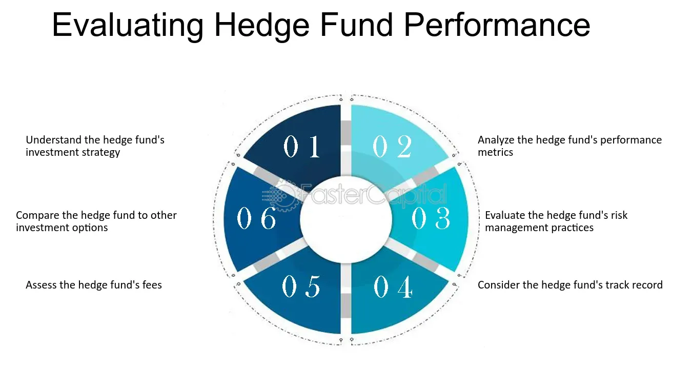

## Table of Contents

## What is a hedge fund?

A hedge fund is a type of investment fund that pools money from investors to buy different assets like stocks, bonds, and commodities. The goal is to make money for the investors, often by using special strategies that are different from regular investing. These strategies can include betting on prices going down as well as up, using borrowed money to increase potential returns, and investing in a wide range of things.

Hedge funds are usually only available to wealthy people and big institutions because they can be risky and have fewer rules than other types of funds. They are managed by professional investors, called fund managers, who try to beat the market and make high returns. Because of the high risk, hedge funds charge high fees, often a percentage of the money invested and a percentage of the profits they make.

## How do hedge funds generate returns?

Hedge funds generate returns by using different strategies to make money from the markets. They might buy stocks they think will go up in value and sell them later for a profit. But they also do something called short selling, where they borrow stocks they think will go down in value, sell them, and then buy them back cheaper to return them. This way, they make money when prices fall. They also use something called leverage, which means borrowing money to invest more than they have. This can increase their profits if things go well, but it can also increase losses if things go badly.

Another way hedge funds make money is by investing in many different things, like bonds, real estate, and even art. This is called diversification, and it helps spread the risk. Some hedge funds also use complex strategies like trading options and futures, which are agreements to buy or sell something at a set price in the future. These strategies can be risky but can also lead to big gains if the fund managers predict the market correctly. By combining these different approaches, hedge funds aim to make money no matter what the market is doing.

## What are the common types of hedge fund strategies?

Hedge funds use many different strategies to make money. One common strategy is called long/short equity. This means the fund buys stocks they think will go up in value (long) and sells stocks they think will go down in value (short). This way, they can make money whether the market goes up or down. Another strategy is called market neutral, where the fund tries to balance their long and short positions so that they make money no matter what the market does. They do this by carefully choosing which stocks to buy and sell.

Another popular strategy is [global macro](/wiki/global-macro-strategy), where the fund looks at big economic trends around the world and makes bets on things like currencies, interest rates, and commodities. They try to predict how these big trends will affect markets and make money from those predictions. Event-driven strategies are also common, where the fund focuses on specific events like mergers, acquisitions, or company restructurings. They try to make money by predicting how these events will affect stock prices. Each of these strategies has its own risks and rewards, and [hedge fund](/wiki/hedge-fund-trading-strategies) managers choose the ones they think will work best for their investors.

## What are the typical fees associated with hedge funds?

Hedge funds usually charge two types of fees. The first is called a management fee, which is a percentage of the total money investors put into the fund. This fee is charged every year, no matter if the fund makes money or not. It's like paying rent for the fund to manage your money. The typical management fee is around 2% of the assets under management.

The second fee is called a performance fee. This is a percentage of the profits the fund makes. It's only charged when the fund does well and makes money for the investors. The idea is to reward the fund managers for doing a good job. The typical performance fee is around 20% of the profits. So, if a hedge fund follows the common "2 and 20" model, they charge 2% of the assets every year and 20% of any profits they make.

## How does the '2 and 20' fee structure work?

The '2 and 20' fee structure is a common way hedge funds charge their investors. It means the fund takes 2% of the total money investors put in every year, no matter if the fund makes money or not. This is called the management fee. It's like paying rent for the fund to take care of your money. So, if you invest $100,000, the fund will charge you $2,000 every year just for managing your investment.

On top of the management fee, the fund also takes 20% of any profits it makes. This is called the performance fee. It's only charged when the fund does well and makes money for the investors. So, if the fund makes $50,000 in profit, it will take $10,000 of that as a performance fee. This way, the fund managers are rewarded for doing a good job and making money for their investors.

## What is the difference between management fees and performance fees?

Management fees are what hedge funds charge every year just for managing your money. It's like paying rent to the fund to take care of your investment. This fee is a percentage of the total money you put into the fund, usually around 2%. So, if you invest $100,000, you'll pay $2,000 every year, no matter if the fund makes money or not.

Performance fees are different. They are only charged when the fund makes money for you. This fee is a percentage of the profits the fund earns, usually around 20%. So, if the fund makes $50,000 in profit, it will take $10,000 of that as a performance fee. This way, the fund managers get rewarded for doing a good job and making money for their investors.

## How can investors evaluate the performance of a hedge fund?

Investors can evaluate the performance of a hedge fund by looking at a few key things. First, they should check the fund's returns over time. This means seeing how much money the fund has made or lost in the past. It's important to compare these returns to a benchmark, like the stock market, to see if the fund is doing better or worse than the market. Investors should also look at the fund's risk-adjusted returns, which show how much risk the fund took to make its money. A good way to measure this is by looking at the Sharpe ratio, which compares the fund's returns to the risk it took.

Another thing to consider is the fund's consistency. Investors should see if the fund has been able to make money steadily over time, or if its performance has been up and down. It's also helpful to look at the fund's performance during different market conditions, like when the market is going up or down. This can show how well the fund's strategies work in different situations. Finally, investors should think about the fees they are paying. High fees can eat into the returns, so it's important to see if the fund's performance is worth the cost.

## What are some key metrics to consider when assessing hedge fund returns?

When assessing hedge fund returns, one of the main things to look at is the total return the fund has made over time. This shows how much money the fund has earned for its investors. It's important to compare these returns to a benchmark, like the stock market, to see if the fund is doing better or worse than the market. Another key metric is the risk-adjusted return, which tells you how much risk the fund took to make its money. The Sharpe ratio is a common way to measure this. It compares the fund's returns to the risk it took, so a higher Sharpe ratio means the fund made good returns without taking too much risk.

Another important metric is the fund's consistency. You want to see if the fund has been able to make money steadily over time, or if its performance has been up and down. It's also helpful to look at how the fund does in different market conditions, like when the market is going up or down. This can show how well the fund's strategies work no matter what the market is doing. Finally, don't forget about the fees. High fees can eat into the returns, so it's important to see if the fund's performance is worth the cost.

## How do hedge fund returns compare to traditional investment vehicles?

Hedge funds often aim to make more money than traditional investment vehicles like mutual funds or index funds. They do this by using special strategies, like betting on prices going down as well as up, and by borrowing money to invest more than they have. This can lead to higher returns if the fund managers make good choices, but it also means higher risk. Traditional investments usually stick to buying stocks or bonds and try to match the market's performance, which is safer but might not make as much money.

Because hedge funds take more risks, their returns can be all over the place. Some years they might make a lot of money, and other years they might lose a lot. Traditional investments tend to be more steady, with smaller ups and downs. So, while hedge funds can be exciting and potentially more profitable, they're not for everyone. People who invest in hedge funds are usually okay with taking bigger risks to try and get bigger rewards.

## What role does risk-adjusted return play in evaluating hedge funds?

Risk-adjusted return is really important when you're looking at how well a hedge fund is doing. It tells you how much money the fund made compared to the risks it took to make that money. A good way to measure this is by using something called the Sharpe ratio. A higher Sharpe ratio means the fund made good returns without taking too much risk. This is important because just looking at how much money a fund made isn't enough. You also need to know if the fund took big risks to get those returns.

When you compare different hedge funds, looking at their risk-adjusted returns can help you see which ones are doing a better job of balancing risk and reward. Some funds might make a lot of money, but if they took a lot of risk to do it, that might not be as good as a fund that made a bit less money but took less risk. This way, investors can pick funds that fit their comfort level with risk and still make good returns.

## How can investors mitigate the impact of high fees on their hedge fund investments?

Investors can mitigate the impact of high fees on their hedge fund investments by carefully choosing funds that have a good balance between fees and performance. They should look for funds that charge lower fees but still deliver strong returns. Sometimes, funds with lower fees might not use as many fancy strategies, but if they can still make good money, it might be worth it. Also, investors can negotiate fees with fund managers, especially if they are investing a lot of money. Some funds might be willing to lower their fees for big investors, which can make a big difference over time.

Another way to lessen the impact of high fees is by keeping an eye on how the fund is doing and making sure the fees are worth it. If a fund is charging high fees but not making much money, it might be time to switch to a different fund. Investors can also look at the fund's performance after fees, which is called the net return. This shows how much money they are actually making after paying the fees. By focusing on funds that offer good net returns, investors can make sure they are getting the most out of their investments despite the high fees.

## What advanced quantitative methods are used to analyze hedge fund performance and fees?

Advanced quantitative methods can help investors understand how well a hedge fund is doing and if the fees they charge are worth it. One common method is regression analysis, which looks at how different things, like the stock market or interest rates, affect the fund's returns. By using regression, investors can see if the fund's strategies are working and if the returns are because of the fund manager's skill or just luck. Another method is [factor](/wiki/factor-investing) analysis, which breaks down the fund's returns into different parts, like how much comes from the stock market, how much from betting on prices going down, and how much from other strategies. This helps investors see what's really driving the fund's performance and if the fees are fair for the results.

Another useful tool is the Sortino ratio, which is like the Sharpe ratio but focuses only on the bad risks, or downside risk. This can show investors if the fund is good at avoiding big losses, which is important because high fees can make losses even worse. Monte Carlo simulations are also used to predict how a fund might do in the future by running many different scenarios. This can help investors see if the fees might eat into their returns over time. By using these advanced methods, investors can get a clearer picture of a hedge fund's performance and make smarter choices about where to put their money.

## References & Further Reading

[1]: Hedge Fund Research, Inc. (2020). [HFR Global Hedge Fund Industry Report](https://www.hfr.com/hfr-industry-reports/).

[2]: "Advances in Financial Machine Learning" by Marcos Lopez de Prado. [Available on Amazon](https://www.amazon.com/Advances-Financial-Machine-Learning-Marcos/dp/1119482089).

[3]: "Evidence-Based Technical Analysis: Applying the Scientific Method and Statistical Inference to Trading Signals" by David Aronson. [Available on Wiley](https://www.amazon.com/Evidence-Based-Technical-Analysis-Scientific-Statistical/dp/0470008741).

[4]: "Machine Learning for Algorithmic Trading" by Stefan Jansen. [Available on Amazon](https://www.amazon.com/Machine-Learning-Algorithmic-Trading-alternative/dp/1839217715).

[5]: "Quantitative Trading: How to Build Your Own Algorithmic Trading Business" by Ernest P. Chan. [Available on Amazon](https://www.amazon.com/Quantitative-Trading-Build-Algorithmic-Business/dp/1119800064).