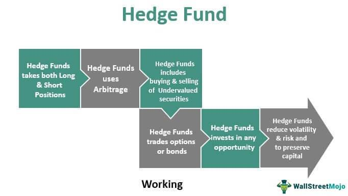

Hedge funds have maintained a prominent position in the landscape of global finance, often captivating investors and financial analysts with their aggressive investment strategies and capacity for high-stakes trading. These funds are structured to pool capital from accredited individuals or institutional investors aiming to generate substantial returns. To achieve these outcomes, hedge funds employ a variety of sophisticated trading strategies that set them apart from traditional investment vehicles.

Key to their allure is the potential for significant financial rewards, yet this comes at a cost. Hedge funds are known for charging some of the highest fees in the investment world, often adhering to a 'Two and Twenty' fee structure, which entails a 2% management fee on assets under management and a 20% performance fee on any profits earned. Such fees are justified by the anticipated superior returns and the complex market maneuvers executed by adept fund managers. However, these costs have sparked debates concerning whether the commensurate benefits truly outweigh the expenses incurred by investors.



In addition to traditional trading techniques, hedge funds have increasingly embraced modern technology, particularly in the form of algorithmic trading. This technological integration has the potential to revolutionize hedge fund operations by allowing for the rapid processing of colossal data volumes and executing trades at speeds beyond human capability. As such, algorithmic trading represents a pivotal component in the attempt to enhance hedge fund performance, potentially optimizing returns while navigating the volatile financial markets.

This article aims to dissect the complexities surrounding hedge fund fees and the returns they offer, placing a special emphasis on algorithmic trading. By scrutinizing whether the pursued returns justify the high fees, the piece will delve into the evolving landscape of modern technology within the hedge fund sector and its prospective impact on fund performance.

## Table of Contents

## Understanding Hedge Fund Fees

Hedge funds are renowned for their unique fee structure, colloquially known as "Two and Twenty," which significantly distinguishes them from traditional investment vehicles like mutual funds. This structure comprises two main components: a 2% management fee and a 20% performance fee on profits. The 2% management fee is calculated as a percentage of the total assets under management (AUM) and is levied annually. This fee serves as compensation for the fund managers to cover operational costs and fund management regardless of the fund's performance. For example, if a hedge fund manages assets worth $1 billion, the management fee would be $20 million annually.

The 20% performance fee, on the other hand, is contingent upon the fund's profitability. It is assessed on the gains earned by the hedge fund, rewarding managers for the fund's enhanced performance over a given benchmark. If a fund achieves profits of $100 million, a performance fee of $20 million would be charged to the investors. This model incentivizes fund managers to pursue aggressive strategies to maximize returns, aligning their interests with those of the investors.

One might question the rationale behind such substantial fees compared to more conventional funds, which typically charge lower fees. The expectation of superior returns through sophisticated trading strategies and expert management justifies these charges. Hedge funds employ complex strategies, including leverage, derivatives, and short-selling, which require specialized skills and resources to execute effectively. The costs associated with these advanced strategies, alongside the potential for delivering exceptional returns, underpin the justification for the "Two and Twenty" fee model.

However, investors must prudently assess whether these higher potential returns sufficiently compensate for the substantial costs associated with [hedge fund](/wiki/hedge-fund-trading-strategies) investments. Deciding to invest in a hedge fund should involve a thorough analysis of the expected returns relative to the costs, taking into account the hedge fund's historical performance, investment strategy, and risk management capabilities. Only by conducting such a critical assessment can investors determine the value proposition of hedge fund investments within the broader financial landscape.

## Hedge Fund Returns: A Closer Look

Hedge funds have often been associated with high returns, but a closer examination reveals a more nuanced picture. While hedge funds have the potential to outperform the market with their diverse strategies and expertise, historical data suggests they often struggle to consistently beat major indices such as the S&P 500 over extended periods. For instance, according to a report by Hedge Fund Research, Inc., during the decade from 2010 to 2020, the average hedge fund returned approximately 5% annually, compared to the S&P 500’s annual return of about 13.6% during the same period.[^1]

This discrepancy in performance can be attributed to several factors. Hedge funds employ various strategies, including long/short equity, [global macro](/wiki/global-macro-strategy), and [quantitative trading](/wiki/quantitative-trading), each with different risk and return profiles. Some strategies may outperform in specific market conditions but underperform in others, which can lead to variable annual returns. Additionally, hedge funds often have higher operational costs due to their complex strategies, which can erode net returns compared to passively managed funds.

For investors who seek higher returns, the key lies in identifying top-performing hedge fund managers. These managers often demonstrate strong risk management capabilities, insightful market predictions, and the ability to adapt their strategies to shifting market dynamics. Investors may also consider hedge funds that implement strategies suited to current economic conditions. For example, during market downturns, funds focusing on short-selling or macroeconomic strategies might outperform others.

It's important to conduct thorough due diligence when evaluating hedge funds for investment. This involves examining the fund's historical performance, understanding the underlying strategies, and assessing the fund manager's expertise and track record. Diversification across different funds and strategies can also mitigate risks and enhance the potential for achieving higher returns.

[^1]: Hedge Fund Research, Inc. (2020). HFR Global Hedge Fund Industry Report. Retrieved from [HFR website](https://www.hfr.com).

## Algorithmic Trading in Hedge Funds

Algorithmic trading has significantly transformed financial markets, and hedge funds have been leading the adoption of this advanced technology. The use of algorithms allows hedge funds to analyze large sets of data and execute trades at a speed that human traders cannot match, providing a strategic advantage in achieving optimal market timing and pricing.

Algorithms in trading are designed to follow specific pre-set rules for achieving a particular goal, such as maximizing returns or minimizing risk. These rules can be based on various criteria, including price discrepancies, timing, or [volume](/wiki/volume-trading-strategy) considerations, and they often involve complex quantitative models built using historical market data and statistical tools. For instance, moving averages, mean reversion strategies, and statistical [arbitrage](/wiki/arbitrage) are commonly programmed into trading algorithms to identify profitable trading opportunities.

A key benefit of [algorithmic trading](/wiki/algorithmic-trading) is its ability to mitigate human errors and biases that can occur in manual trading. By removing emotional decision-making, algorithms provide a more consistent application of trading strategies. Furthermore, these algorithms can handle high-frequency trading ([HFT](/wiki/high-frequency-trading-strategies)) scenarios, executing a large number of orders at extremely fast speeds, which is particularly advantageous in highly liquid markets.

Recent industry surveys indicate a growing reliance on algorithmic strategies among hedge funds. This trend highlights a broader shift towards technology-driven trading approaches, as these funds seek to leverage the computational power and efficiency of algorithms to gain a competitive edge. The increased adoption of algorithmic trading is also fueled by advancements in [machine learning](/wiki/machine-learning) and [artificial intelligence](/wiki/ai-artificial-intelligence), which enable the creation of more sophisticated and adaptive trading models.

Hedge funds employing algorithmic trading are often able to exploit short-term market inefficiencies and execute trades with precision and rapidity that is critical in today's fast-paced markets. The benefits of such strategies are evident in their potential for enhanced performance, although they also require substantial technological infrastructure and expertise in data analysis to implement effectively.

In conclusion, the integration of algorithmic trading into hedge fund strategies represents a paradigm shift towards more quantitatively-driven investment approaches. As technology continues to advance, the role of algorithms in hedge fund trading is likely to expand, providing new opportunities and challenges for investors and fund managers alike.

## Evaluating the Cost-Benefit of Hedge Funds

Investors considering hedge funds must carefully evaluate the balance between the high fees charged and the potential returns these funds offer. An integral part of this decision involves analyzing the hedge fund's historical performance. Consistent track records of above-market returns can sometimes justify the steep fees, as they indicate a likelihood of future profitability. However, it is crucial to remember that past performance is not always indicative of future results, particularly in the volatile and dynamic financial markets.

Risk management practices also play a critical role in this cost-benefit analysis. Sophisticated risk management strategies, often implemented through diverse asset classes and hedging techniques, can mitigate potential losses and preserve capital. This involves assessing the fund's exposure to various market risks and its capacity to navigate economic downturns without substantial losses.

Strategic outlook and the managerial vision of the hedge fund are equally significant. It is essential for investors to understand the fund's investment philosophy, market strategies, and adaptability to changing market conditions. A forward-thinking strategic outlook can offer a competitive advantage and align investments with market trends.

Algorithmic trading brings an additional layer of complexity and potential advantages to this assessment. With the capacity to analyze vast datasets and execute trades at high speed, algorithmic trading can enhance the fund's performance and might validate the high fees associated with hedge funds. However, the effectiveness of algorithmic strategies largely depends on the technological expertise and resources available to the fund.

Investors should critically appraise the technological capabilities of a hedge fund before commitment. This includes reviewing the infrastructure supporting algorithmic trading systems, data processing capabilities, and the expertise of the team managing these operations.

In conclusion, investors need a comprehensive understanding of the interplay between fees, potential returns, risk management, strategic outlook, and technology adoption before deciding on hedge fund investments. Such a holistic evaluation will provide the best foundation for determining whether the costs of investing in a hedge fund are justified by the benefits it promises.

## The Future of Hedge Funds and Algorithmic Trading

As technology advances, hedge funds are poised to adapt and evolve their strategies, with algorithmic trading playing an increasingly pivotal role. Algorithmic trading involves the use of computer algorithms to automate trading decisions and executions, allowing for the processing of large volumes of data and executing trades at high speed and precision. This technology is expected to offer hedge funds new opportunities for innovation and potentially enhanced returns.

With the continuous development of machine learning and artificial intelligence, algorithmic trading systems can evolve to become more sophisticated. These technologies can analyze complex patterns and data correlations that are not easily perceptible to human traders. For example, machine learning algorithms can be trained on historical market data to predict future price movements, thereby informing trading strategies with greater accuracy. The implementation of these algorithms can improve decision-making processes, risk management, and ultimately, profitability.

Additionally, the integration of big data analytics enables hedge funds to harness vast amounts of data from diverse sources—such as social media, news articles, and financial reports—to inform their strategies. This data-driven approach helps hedge funds to better understand market sentiment and quickly respond to economic and geopolitical events that impact market dynamics.

Python is often the language of choice for implementing algorithmic trading systems due to its extensive libraries for data analysis and machine learning, such as NumPy, pandas, and scikit-learn. A simple Python script for a moving average crossover strategy might look like this:

```python
import pandas as pd
import numpy as np

# Sample market data
data = pd.DataFrame({
    'prices': [100, 102, 104, 103, 105, 108, 110, 112, 111, 114]
})

# Calculate moving averages
data['short_ma'] = data['prices'].rolling(window=3).mean()
data['long_ma'] = data['prices'].rolling(window=5).mean()

# Generate trading signals
data['signal'] = np.where(data['short_ma'] > data['long_ma'], 'Buy', 'Sell')

print(data)
```

For investors, understanding these technological advancements and their implications is crucial. As hedge funds increasingly adopt algorithmic trading, staying informed about technological trends will offer insights into the strategic directions of these funds. Furthermore, assessing a hedge fund's technological capabilities can provide a competitive edge, potentially leading to more informed investment decisions.

In summary, the future of hedge funds is intrinsically linked to the advancement of algorithmic trading and technology. As hedge funds continue to harness these tools, they are likely to innovate and refine their strategies. Investors must stay vigilant to these changes, considering both the potential enhancements in fund performance and the associated risks.

## Conclusion

Hedge funds offer a multifaceted investment opportunity characterized by their capacity for high returns, balanced by the considerable fees and inherent risks. These funds utilize complex strategies, including leveraging and short selling, to maximize returns. However, the significant management and performance fees associated with hedge funds require meticulous evaluation by investors.

Algorithmic trading has emerged as a transformative force in the hedge fund industry, providing new avenues for optimizing trading strategies. The implementation of algorithms enables hedge funds to process vast datasets and execute trades with precision and speed, which can lead to enhanced performance. Despite the potential benefits, the adoption of algorithmic trading introduces additional layers of risk related to technology and model accuracy.

To make informed investment decisions, investors must engage in thorough due diligence. This process involves an intricate assessment of a hedge fund’s historical performance, risk management practices, and strategic positioning. Investors should scrutinize both explicit costs, such as fees, and potential hidden costs, like [liquidity](/wiki/liquidity-risk-premium) constraints or lock-up periods, to accurately gauge the investment's merit.

Ultimately, deciding to invest in a hedge fund requires careful consideration of whether the anticipated benefits justify the associated costs and risks. As the financial landscape evolves and technology continues to advance, staying abreast of developments in algorithmic trading will be crucial for investors seeking to capitalize on future opportunities within the hedge fund sector.

## References & Further Reading

[1]: Hedge Fund Research, Inc. (2020). [HFR Global Hedge Fund Industry Report](https://www.hfr.com/hfr-industry-reports/).

[2]: "Advances in Financial Machine Learning" by Marcos Lopez de Prado. [Available on Amazon](https://www.amazon.com/Advances-Financial-Machine-Learning-Marcos/dp/1119482089).

[3]: "Evidence-Based Technical Analysis: Applying the Scientific Method and Statistical Inference to Trading Signals" by David Aronson. [Available on Wiley](https://www.amazon.com/Evidence-Based-Technical-Analysis-Scientific-Statistical/dp/0470008741).

[4]: "Machine Learning for Algorithmic Trading" by Stefan Jansen. [Available on Amazon](https://www.amazon.com/Machine-Learning-Algorithmic-Trading-alternative/dp/1839217715).

[5]: "Quantitative Trading: How to Build Your Own Algorithmic Trading Business" by Ernest P. Chan. [Available on Amazon](https://www.amazon.com/Quantitative-Trading-Build-Algorithmic-Business/dp/1119800064).