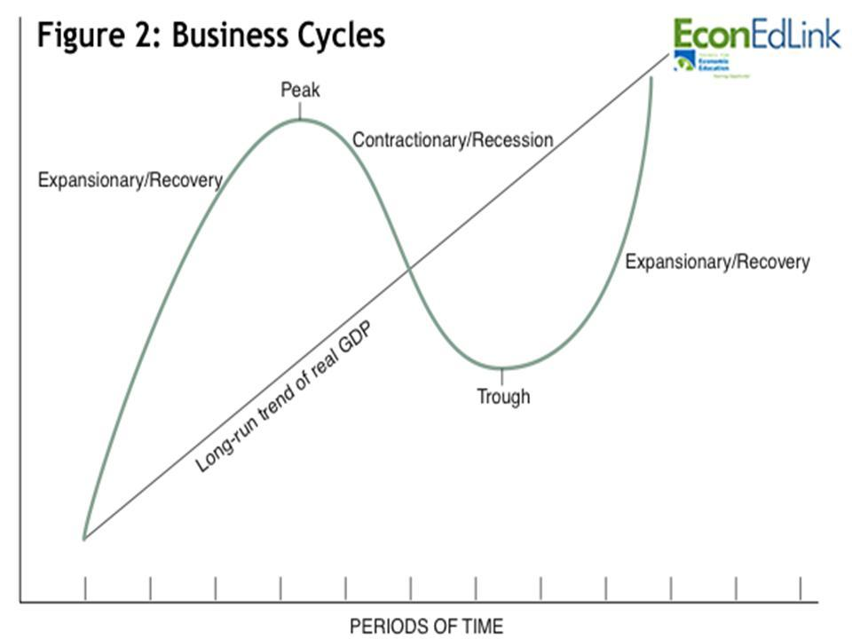

## Table of Contents

## What are hedge funds and how do they operate?

Hedge funds are investment funds that pool money from investors and use different strategies to try to make more money. They are usually only available to rich people or big institutions because they can be risky. Hedge funds aim to make money no matter what the market is doing, going up or down. They do this by using a variety of techniques, like buying stocks they think will go up, betting against stocks they think will go down, or using borrowed money to make bigger bets.

Hedge funds operate with fewer rules than other investment funds like mutual funds. This means they can take bigger risks and use more complex strategies. For example, they might use leverage, which is borrowing money to invest, to try to make bigger profits. They can also use derivatives, which are financial contracts that get their value from something else, like a stock or commodity. Hedge fund managers are paid a lot of money, usually a percentage of the money they manage and a percentage of the profits they make. This can encourage them to take bigger risks to earn more money.

## How did the financial crisis of 2008 affect hedge funds?

The financial crisis of 2008 hit hedge funds hard. Many hedge funds lost a lot of money because they were heavily invested in things like mortgage-backed securities, which crashed during the crisis. Some hedge funds even had to close down because they couldn't handle the losses. Investors also started pulling their money out of hedge funds because they were scared and wanted to protect what they had left.

On the other hand, some hedge funds actually did well during the crisis. These funds had strategies that worked well in a falling market, like betting against the housing market or using complex financial tools to protect their investments. Overall, though, the crisis showed that hedge funds could be very risky, and it made people more cautious about investing in them. After the crisis, new rules were put in place to try to make the financial system safer, and hedge funds had to follow more regulations.

## What were the main changes in hedge fund strategies post-2008?

After the 2008 financial crisis, hedge funds changed their strategies a lot. They started being more careful about the risks they took. Many hedge funds began to focus more on protecting their investors' money instead of just trying to make big profits. They used less borrowed money, which is called leverage, because it had caused big problems during the crisis. Hedge funds also started to invest in a wider range of things, like stocks, bonds, and commodities, to spread out their risk.

Another big change was that hedge funds started to use more computer-based strategies, called [algorithmic trading](/wiki/algorithmic-trading). These strategies use math and computers to make quick trading decisions. This helped hedge funds to react faster to changes in the market and manage their risks better. Overall, the crisis made hedge funds more cautious and more focused on using technology to improve their performance and protect their investors' money.

## How did regulatory changes impact hedge funds after the financial crisis?

After the 2008 financial crisis, governments made new rules to make the financial world safer. These rules affected hedge funds a lot. One big change was that hedge funds had to tell the government more about what they were doing. This was to help the government keep an eye on them and stop them from taking too many risks. Hedge funds also had to follow rules about how much money they could borrow. This was to stop them from using too much leverage, which had been a big problem during the crisis.

Another important change was that hedge funds had to be more open about their fees. Before, some hedge funds charged very high fees and it was hard for investors to know exactly what they were paying. The new rules made it easier for investors to understand the costs and decide if they wanted to invest. Overall, these regulatory changes made hedge funds more careful and transparent, which helped to make the financial system safer for everyone.

## What was the performance trend of hedge funds in the years immediately following the crisis?

In the years right after the 2008 financial crisis, hedge funds had a tough time. Many of them didn't do well because they were still recovering from the big losses they had during the crisis. Investors were also pulling their money out of hedge funds because they were scared and wanted to be safe. This made it hard for hedge funds to make money. Overall, the performance of hedge funds was not great in the immediate aftermath of the crisis.

However, as time went on, some hedge funds started to do better. Those that had changed their strategies to be more careful and used new technology, like computer-based trading, began to see better results. By focusing on managing risk and being more open about their fees, some hedge funds were able to regain the trust of investors. So, while the early years after the crisis were challenging, the performance of hedge funds slowly started to improve as they adapted to the new financial landscape.

## Can you explain the 'boom' period for hedge funds post-crisis and what drove it?

After a few tough years following the 2008 financial crisis, hedge funds experienced a 'boom' period around the mid-2010s. This boom was driven by a few key things. First, the global economy started to recover, which meant more money was flowing into investments. Hedge funds that had adapted to the new rules and become more careful with their strategies were able to take advantage of this. They used new technology, like computer-based trading, to make smarter and quicker decisions. This helped them to make more money and attract more investors.

Another big [factor](/wiki/factor-investing) was that interest rates were very low during this time. When interest rates are low, people look for other places to put their money to earn a better return. Hedge funds, with their promise of higher returns, became more attractive. Investors were willing to take on more risk again, and hedge funds were ready to meet this demand. The combination of a recovering economy, low interest rates, and improved strategies helped create a boom period for hedge funds, where they saw significant growth and better performance.

## What factors contributed to the 'bust' phase in the hedge fund industry?

After the boom, the [hedge fund](/wiki/hedge-fund-trading-strategies) industry hit a 'bust' phase. One big reason was that many hedge funds started to perform poorly. They couldn't keep up with the big stock market gains, and investors were not happy with the returns they were getting. Some hedge funds were also taking too many risks again, which scared investors away. As more people pulled their money out, hedge funds found it harder to make money, leading to a downward spiral.

Another factor was the rise of other investment options. Things like low-cost index funds and ETFs became more popular because they were cheaper and easier to understand. These alternatives offered good returns without the high fees and risks that came with hedge funds. As more investors moved their money to these other options, hedge funds lost a big part of their business. The combination of poor performance and competition from simpler, cheaper investments led to the 'bust' phase in the hedge fund industry.

## How have hedge fund returns compared to broader market indices since the financial crisis?

Since the financial crisis, hedge fund returns have often not been as good as the broader market indices like the S&P 500. Many investors were disappointed because they expected hedge funds to do better, especially since they charge high fees. The S&P 500 and other stock market indices had strong growth in the years after the crisis, while many hedge funds struggled to keep up. This made people question if it was worth paying the extra costs for hedge funds when they could get better returns from simpler, cheaper investments.

However, it's not all bad news for hedge funds. Some hedge funds did well, especially those that used new technology and careful strategies. These funds were able to make money even when the market was going up and down. But overall, the average hedge fund return has been lower than the returns from the broader market indices. This has made investors more cautious about putting their money into hedge funds, and many have chosen to stick with the simpler, more reliable options like index funds and ETFs.

## What role did quantitative easing play in the performance of hedge funds?

Quantitative easing, or QE, is when central banks like the Federal Reserve print more money and use it to buy things like government bonds. This was done a lot after the 2008 financial crisis to help the economy get better. QE made interest rates very low, which meant people were looking for other places to put their money to get a good return. Hedge funds became more attractive because they promised to make more money than regular investments like savings accounts. So, QE helped hedge funds by bringing in more investors who were looking for higher returns.

However, QE also made things harder for some hedge funds. Because interest rates were so low, it was tough for hedge funds to make money from the usual ways, like borrowing money cheaply to invest. Some hedge funds that relied on these strategies did not do well. Also, QE helped push up stock prices, which made it hard for hedge funds to beat the market. So while QE brought more money into hedge funds, it also made it tougher for them to make big profits compared to the overall market.

## How have investor attitudes towards hedge funds evolved post-financial crisis?

After the 2008 financial crisis, many investors became wary of hedge funds. They saw that hedge funds could lose a lot of money and were risky. Investors also didn't like the high fees hedge funds charged, especially when they weren't getting good returns. As a result, many people started looking for simpler and cheaper ways to invest, like index funds and ETFs. These options were easier to understand and often gave better returns than hedge funds.

Over time, some investors started to come back to hedge funds, but they were more careful. They looked for hedge funds that used new technology and careful strategies to manage risk. These investors wanted to see that hedge funds were being more open about their fees and were not taking too many risks. However, the overall trust in hedge funds was lower than before the crisis, and many investors still preferred the simpler, more reliable investment options.

## What are the current challenges and opportunities facing hedge funds?

Hedge funds today face a lot of challenges. One big challenge is that they have to compete with cheaper and simpler investment options like index funds and ETFs. These options often give good returns without the high fees and risks that come with hedge funds. Another challenge is that investors are more careful now and want to see that hedge funds are managing their money wisely. They don't want to pay high fees if the returns are not good. Also, new rules and regulations make it harder for hedge funds to take big risks, which can limit how much money they can make.

On the other hand, there are still opportunities for hedge funds. They can use new technology, like computer-based trading, to make smarter and quicker decisions. This can help them make more money and attract investors who are looking for something different from the usual investments. Hedge funds can also focus on special areas of the market that other funds don't look at, which can give them an edge. If they can show that they are careful with risks and give good returns, they can still be a good choice for some investors.

## What advanced strategies are hedge funds using to navigate post-crisis markets?

After the financial crisis, hedge funds started using more advanced strategies to do well in the markets. One big strategy is using computers and math to make quick trading decisions. This is called algorithmic trading. Hedge funds use special computer programs to look at lots of data and find good times to buy and sell things. This helps them make money even when the market is going up and down a lot. They also use these computers to manage risks better, so they don't lose as much money if something goes wrong.

Another strategy is to focus on special parts of the market that other funds don't look at as much. Hedge funds might invest in things like small companies, new technology, or markets in other countries. By finding these special opportunities, they can make more money than if they just followed the big stock market. They also use something called "[alternative data](/wiki/best-alternative-data)," which is information from places like social media or satellite images, to make better decisions. These advanced strategies help hedge funds try to do better in the tricky markets after the crisis.

## References & Further Reading

[1]: Bergstra, J., Bardenet, R., Bengio, Y., & Kégl, B. (2011). ["Algorithms for Hyper-Parameter Optimization."](https://dl.acm.org/doi/10.5555/2986459.2986743) Advances in Neural Information Processing Systems 24.

[2]: ["Advances in Financial Machine Learning"](https://www.amazon.com/Advances-Financial-Machine-Learning-Marcos/dp/1119482089) by Marcos Lopez de Prado

[3]: ["Evidence-Based Technical Analysis: Applying the Scientific Method and Statistical Inference to Trading Signals"](https://www.amazon.com/Evidence-Based-Technical-Analysis-Scientific-Statistical/dp/0470008741) by David Aronson

[4]: ["Machine Learning for Algorithmic Trading"](https://github.com/stefan-jansen/machine-learning-for-trading) by Stefan Jansen

[5]: ["Quantitative Trading: How to Build Your Own Algorithmic Trading Business"](https://www.amazon.com/Quantitative-Trading-Build-Algorithmic-Business/dp/1119800064) by Ernest P. Chan