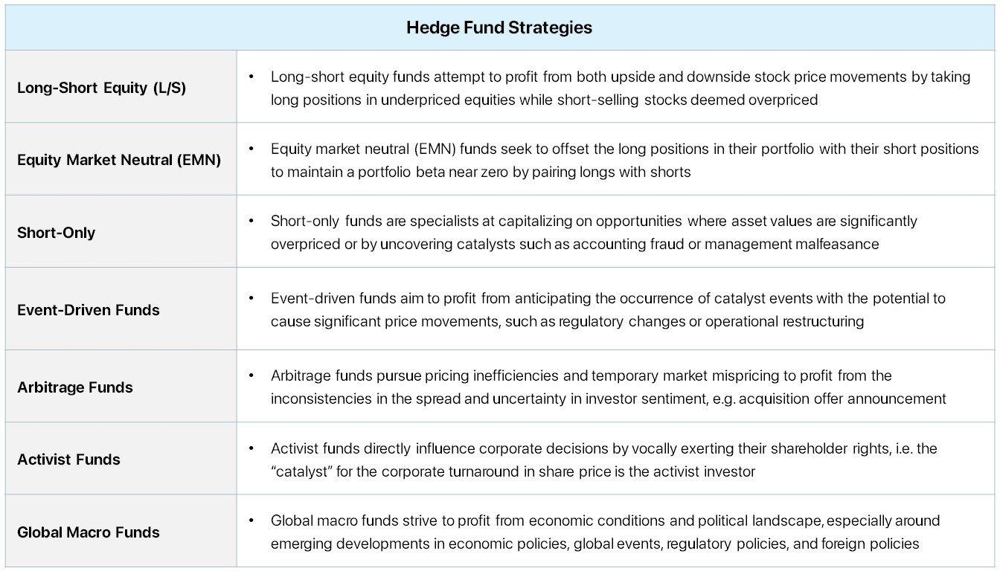

Financial markets are characterized by their dynamic and ever-changing nature, necessitating the continuous development of innovative strategies to maximize investment gains. Within this fluid environment, hedge funds and algorithmic trading have become essential instruments for investors seeking high returns. This article aims to dissect the symbiotic relationship between market strategy, investment gains, hedge funds, and algorithmic trading, with the intent of demystifying these financial instruments and their potential to optimize market performance.

Investors are often challenged by the complexities inherent in financial markets, where rapid advancements in technology and volatile economic conditions can significantly impact investment outcomes. Hedge funds, with their ability to use diverse and sophisticated strategies, and algorithmic trading, which enhances efficiency and precision, stand at the forefront of this evolving landscape. Both tools offer unique opportunities and challenges, intersecting to leverage data-driven insights and exploit market inefficiencies.



This exploration is designed to provide valuable insights for investors who are eager to deepen their understanding of hedge funds and algorithmic trading. By focusing on how these strategies can be effectively harnessed, the article seeks to equip investors with the knowledge required to navigate the modern financial terrain successfully. This foundational understanding is critical for those aiming to enhance their investment portfolios and capitalize on the innovative possibilities presented by the integration of market strategy, hedge funds, and algorithmic trading.

## Table of Contents

## Understanding Market Strategies

Market strategy is a detailed approach used by organizations to attract and secure investments, aiming to optimize returns while minimizing associated risks. In finance, these strategies vary in complexity, from simple buy-and-hold tactics to intricate derivative-based operations. A buy-and-hold strategy typically involves purchasing securities and retaining them over an extended period, anticipating growth in value and compounding returns.

On the other hand, derivative-based strategies might involve the use of options, futures, or swaps to hedge risks or speculate on price movements. These strategies can enhance potential returns but often come with increased risk and complexity, requiring careful management and expertise.

The most successful market strategies seamlessly blend traditional insights with modern technological advancements. Traditional approaches rely heavily on fundamental and technical analysis, two cornerstones in strategy formulation. Fundamental analysis involves assessing a company's financial statements, industry position, and economic factors to determine its intrinsic value. In contrast, technical analysis focuses on statistical trends gathered from trading activity, such as price movement and volume, to predict future price movements.

Incorporating cutting-edge technology into market strategies enhances their efficacy. With advancements in [machine learning](/wiki/machine-learning) and data analytics, investors can process vast amounts of data to identify patterns and opportunities that were previously undetectable. Algorithmic trading has emerged as a significant tool in this context, using predefined instructions based on quantitative analysis to execute trades with both speed and precision.

Moreover, successful market strategies often include diversification, a technique of spreading investments across various assets to reduce risk exposure. By diversifying their portfolio, investors can safeguard against market [volatility](/wiki/volatility-trading-strategies), ensuring more stable returns over time.

In conclusion, understanding and implementing effective market strategies involves a harmonious blend of traditional analyses and modern technologies. This combination not only optimizes returns but also provides a robust framework for risk management, essential in today's dynamic financial landscape.

## Investment Gains: The Ultimate Goal

Investment gains represent the increase in an asset's value over time, serving as a crucial marker of success for both institutional and individual investors. They are derived from three primary sources: dividends, interest, and capital appreciation. Dividends are typically received from equity investments when companies distribute a portion of their earnings to shareholders. Interest is accrued from fixed-income investments such as bonds, providing a steady stream of income over the investment period. Capital appreciation refers to the increase in the market value of an asset, realized when the asset is sold for more than its purchase price.

To ensure robust financial health, investors should aim for a balance between long-term sustainability and short-term profitability. This involves an ongoing assessment of market conditions and adjusting investment strategies accordingly. A diversified portfolio is instrumental in achieving substantial gains, particularly during volatile market phases. Diversification reduces the risk associated with individual asset classes by spreading investments across various sectors and asset types. This approach mitigates the potential losses while allowing investors to capitalize on gains from different market segments.

In mathematical terms, the total investment return can be expressed as:

$$
\text{Total Return} = \frac{(\text{Ending Value of Investment} - \text{Beginning Value of Investment}) + \text{Dividends or Interest}}{\text{Beginning Value of Investment}}
$$

In Python, calculating the total return for a given investment can be implemented as follows:

```python
def calculate_total_return(beginning_value, ending_value, dividends_interest):
    total_return = (ending_value - beginning_value + dividends_interest) / beginning_value
    return total_return

# Example usage:
beginning_value = 1000
ending_value = 1200
dividends_interest = 50

total_return = calculate_total_return(beginning_value, ending_value, dividends_interest)
print(f"Total Return: {total_return:.2%}")
```

For investors, the ultimate goal is to achieve consistent gains, ensuring financial stability and growth. This requires strategic planning, a keen understanding of market dynamics, and a commitment to regularly reviewing and adapting investment approaches in response to changing market conditions.

## The Role of Hedge Funds

Hedge funds represent a sophisticated investment mechanism where professionals manage pooled capital with the aim of generating high returns. These funds utilize a plethora of strategies to achieve their financial objectives, often including leverage, derivatives, and short-selling. Leverage involves borrowing capital to increase the potential return on investment, although it simultaneously amplifies risk. Derivatives, financial instruments whose value is derived from underlying assets, provide hedge funds with the ability to speculate on price movements or hedge against potential losses. Short-selling, a strategy where assets are sold with the expectation of repurchasing them at a lower price, allows hedge funds to potentially profit from declining markets.

In contrast to mutual funds, hedge funds seek absolute returns, striving for profitability regardless of overall market conditions. This pursuit of independent gains makes them appealing to high-net-worth individuals and institutional investors who are looking for investment options that do not merely track market indices. The flexibility in their investment strategies enables hedge funds to capitalize on diverse market opportunities, ranging from traditional equities to more complex financial instruments.

However, the pursuit of high returns through hedge funds is fraught with considerable risks. The use of leverage can lead to significant financial losses in volatile markets. Additionally, hedge funds operate with less regulatory oversight compared to mutual funds, which introduces risks pertaining to transparency and ethical considerations. Regulatory bodies impose constraints on these investment vehicles to manage systemic risks and protect investors, but the complex nature of hedge funds can make regulation challenging.

Furthermore, hedge funds typically require substantial minimum investments and impose lock-up periods, during which investors cannot withdraw their funds. This exclusivity, coupled with their performance-based fee structures, makes hedge funds a suitable option primarily for those with a substantial appetite for risk and deep pockets. Despite these challenges, hedge funds remain a pivotal component of modern investment portfolios, offering an avenue for potentially high returns in exchange for assuming significant financial risks.

## Algo Trading: A Modern Approach

Algorithmic trading, known as algo trading, is a revolutionary method of executing trades. It relies on pre-programmed instructions based on variables such as time, price, and [volume](/wiki/volume-trading-strategy). This approach significantly enhances trading efficiency and accuracy by reducing the possibility of human error in decision-making processes. Algo trading is particularly beneficial in high-frequency trading ([HFT](/wiki/high-frequency-trading-strategies)) environments, where the demand for speed and precision is paramount.

The advent of big data and [artificial intelligence](/wiki/ai-artificial-intelligence) has propelled algorithmic strategies to new heights of sophistication. Traders can now harness vast datasets and powerful machine learning models to predict market movements and execute trades with unparalleled precision. For instance, machine learning algorithms can analyze historical trading patterns and real-time market data to predict future price trends, allowing traders to respond with high-speed transactions that capitalize on these predictions.

A fundamental aspect of algo trading is the requirement for a robust technological infrastructure. The complexity and speed of algorithmic operations demand high-performance systems capable of processing large volumes of data at lightning speed. These systems must ensure minimal latency in order to maintain a competitive edge in the financial markets. Python, as a programming language, is frequently used to develop trading algorithms due to its simplicity, extensive libraries, and community support. An example of a basic trading algorithm in Python might look like this:

```python
import pandas as pd
import numpy as np

def moving_average_strategy(prices, short_window=40, long_window=100):
    signals = pd.DataFrame(index=prices.index)
    signals['signal'] = 0.0

    # Short moving average
    signals['short_mavg'] = prices['Close'].rolling(window=short_window, min_periods=1, center=False).mean()

    # Long moving average
    signals['long_mavg'] = prices['Close'].rolling(window=long_window, min_periods=1, center=False).mean()

    # Create signals
    signals['signal'][short_window:] = np.where(signals['short_mavg'][short_window:] > signals['long_mavg'][short_window:], 1.0, 0.0)   

    # Generate trading orders
    signals['positions'] = signals['signal'].diff()

    return signals

# Example usage
# prices = pd.read_csv(<your price data>)
# signals = moving_average_strategy(prices)
```

Despite its numerous advantages, [algorithmic trading](/wiki/algorithmic-trading) is not devoid of risks. The rapid execution speeds that provide an edge also pose systemic risks, including flash crashes and other unintended market disruptions. These risks highlight the necessity for continuous monitoring and updating of algorithms to ensure they align with current market conditions and regulatory frameworks. Furthermore, the ethical implications of algorithmic trading cannot be ignored. Concerns around market manipulation and fairness prompt ongoing discussions about implementing stricter oversight and ethical guidelines.

In summary, while algo trading presents opportunities for innovation and increased precision in trading, it requires a careful balance of technological advancement, risk management, and ethical considerations. The integration of cutting-edge technology will continue to shape the evolution of algorithmic trading, presenting both challenges and opportunities in the financial landscape.

## Integrating Hedge Funds and Algo Trading

The integration of hedge funds and algorithmic trading signifies a significant transformation towards data-driven investment decisions. Hedge funds, known for their adaptive and diverse strategies, increasingly deploy algorithmic methods to refine their portfolios and enhance returns. These algorithmic strategies allow hedge funds to quickly and efficiently capitalize on market inefficiencies. For instance, they can detect and execute trades at speeds unattainable by human traders, thereby exploiting momentary pricing discrepancies.

Technological advancements play an indispensable role in this integration. With the proliferation of big data and sophisticated machine learning models, hedge funds can process vast amounts of financial data to derive actionable insights. For example, machine learning algorithms can analyze historical financial data to identify patterns and predict future price movements. These insights are crucial for making informed trading decisions, particularly in volatile markets.

An example of a simple algorithm might involve a moving average crossover strategy implemented in Python:

```python
import pandas as pd

def moving_average_cross_strategy(data, short_window=40, long_window=100):
    signals = pd.DataFrame(index=data.index)
    signals['price'] = data['Close']
    signals['short_mavg'] = data['Close'].rolling(window=short_window, min_periods=1).mean()
    signals['long_mavg'] = data['Close'].rolling(window=long_window, min_periods=1).mean()

    signals['signal'] = 0.0
    signals['signal'][short_window:] = np.where(signals['short_mavg'][short_window:] 
                                                > signals['long_mavg'][short_window:], 1.0, 0.0)   

    signals['positions'] = signals['signal'].diff()
    return signals
```

However, integrating hedge funds with algorithmic trading requires a careful alignment with regulatory frameworks to mitigate associated risks. Financial regulators emphasize transparency and accountability, necessitating that hedge funds using algorithmic strategies maintain rigorous compliance protocols to avoid potential market manipulation. The sophistication of algo-trading models also demands continuous monitoring and adjustment to adhere to these regulatory requirements and safeguard against systemic risks.

Thus, while the integration of hedge funds and algorithmic trading offers promising opportunities for superior investment performance, it is also accompanied by challenges requiring strategic risk management and compliance adherence. The ongoing evolution of technology, coupled with stringent regulatory landscapes, calls for innovative yet cautious approaches to leverage these advanced trading strategies effectively.

## Challenges and Considerations

Integrating hedge funds and algorithmic trading may offer lucrative returns, but it also presents a number of challenges that require careful management. One prominent issue is regulatory compliance, as financial markets across the globe are governed by a complex array of regulations. These rules are designed to maintain market integrity, protect investors, and ensure transparency. Hedge funds utilizing algorithmic trading must navigate these regulations meticulously to avoid sanctions or penalties, which could undermine their investment strategies and reputations (U.S. Securities and Exchange Commission, 2023).

Technological risks are another significant concern. The complexity of algorithmic trading models necessitates continuous monitoring and regular adjustments to ensure they function as intended. Algorithms operate on assumptions and parameters that may require modifications in response to evolving market conditions. A failure in these systems, often referred to as a "flash crash," can result in substantial financial losses within seconds. Therefore, maintaining robust technological infrastructure is crucial.

Ethical considerations, particularly around market manipulation and transparency, pose additional challenges. Algorithmic trading, specifically high-frequency trading, can potentially be manipulated to gain unfair advantage, raising ethical and legal issues. Practices such as quote stuffing, where an algorithm places large volumes of orders only to cancel them immediately, disrupt fair trading practices and are scrutinized by regulators.

The integration of algorithmic trading within hedge funds also demands significant investment in technical infrastructure and expertise. Establishing state-of-the-art data centers, trading platforms, and continuously updating these systems requires substantial capital. Moreover, employing and retaining talent proficient in quantitative analysis, programming, and financial modeling adds to operational costs. These expenditures, while potentially returning high dividends, can strain the financial capacity of hedge funds.

Balancing innovation with caution is essential for effectively leveraging these strategies. Hedge funds must innovate to maintain competitiveness and explore cutting-edge algorithms and trading strategies. Simultaneously, they must implement comprehensive risk management frameworks to mitigate potential negative impacts. Employing stress tests and scenario analysis allows hedge funds to assess the resilience of their trading strategies under extreme market conditions.

In conclusion, while the integration of hedge funds and algorithmic trading offers considerable opportunities for enhanced returns, it also necessitates addressing various challenges related to regulation, technology, ethics, and cost. Proactively managing these challenges is crucial for harnessing the benefits while minimizing risks.

## Conclusion

Market strategies, investment gains, hedge funds, and algorithmic trading together create a complex framework within modern financial practices. Investors who understand and effectively utilize these elements are well-positioned to achieve enhanced market outcomes. As technology continues to evolve, it presents fresh opportunities for innovation in investment strategies. This technological growth enables more sophisticated modeling, rapid data analysis, and improved decision-making tools, all of which are crucial for refining market strategies.

However, the success of these practices does not solely rely on technological advancement. A careful balance between risk management and the exploitation of opportunities is vital. Investors must develop strategies that not only seek potential high returns but also consider the risks inherent in volatile markets. This requires a comprehensive understanding of risk factors and the implementation of strategies to mitigate them, ensuring long-term financial health and stability.

Moreover, as the financial landscape continues to change, remaining informed and adaptable is essential for investors aiming for success. Regularly updating knowledge on new regulations, technologies, and market trends can provide a competitive edge. This adaptability enables investors to anticipate changes and adapt their strategies proactively, which is crucial for maintaining relevance and achieving sustained growth in an ever-evolving market environment.

## References & Further Reading

[1]: Bergstra, J., Bardenet, R., Bengio, Y., & Kégl, B. (2011). ["Algorithms for Hyper-Parameter Optimization."](https://dl.acm.org/doi/10.5555/2986459.2986743) Advances in Neural Information Processing Systems 24.

[2]: ["Advances in Financial Machine Learning"](https://www.amazon.com/Advances-Financial-Machine-Learning-Marcos/dp/1119482089) by Marcos Lopez de Prado

[3]: ["Evidence-Based Technical Analysis: Applying the Scientific Method and Statistical Inference to Trading Signals"](https://www.amazon.com/Evidence-Based-Technical-Analysis-Scientific-Statistical/dp/0470008741) by David Aronson

[4]: ["Machine Learning for Algorithmic Trading"](https://github.com/stefan-jansen/machine-learning-for-trading) by Stefan Jansen

[5]: ["Quantitative Trading: How to Build Your Own Algorithmic Trading Business"](https://www.amazon.com/Quantitative-Trading-Build-Algorithmic-Business/dp/1119800064) by Ernest P. Chan