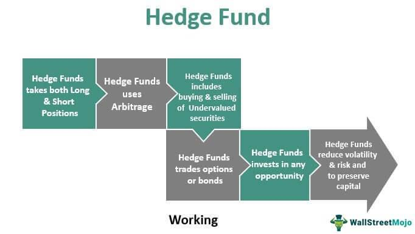

## Table of Contents

## What is a hedge fund?

A hedge fund is a type of investment fund that pools money from investors to invest in a variety of assets. The goal is to make money for the investors, often by using different strategies that can be riskier than those used by regular investment funds. Hedge funds are usually managed by professional investors who can buy and sell many different types of investments, like stocks, bonds, and commodities.

Unlike mutual funds, which many people can invest in easily, hedge funds are often only available to wealthy people or big institutions. This is because they can be riskier and have fewer rules to follow. Hedge fund managers might use strategies like borrowing money to invest more, or betting that certain investments will go down in value. Because of these strategies, hedge funds can sometimes make a lot of money, but they can also lose a lot.

## How do hedge funds differ from mutual funds?

Hedge funds and mutual funds are both ways to invest money, but they have some big differences. Hedge funds are usually only for rich people or big organizations because they can be riskier. They can use special strategies like borrowing money to invest more or betting that some investments will lose value. This means they might make a lot of money, but they could also lose a lot. Hedge funds also have fewer rules to follow, so they can do things that mutual funds can't.

Mutual funds, on the other hand, are easier for regular people to invest in. They follow strict rules and usually invest in a mix of stocks, bonds, and other things. The goal is to grow the money over time, but they don't take as many risks as hedge funds. Because of these rules, mutual funds are seen as safer but might not grow as fast as a successful [hedge fund](/wiki/hedge-fund-trading-strategies). So, if you're thinking about investing, it's important to know these differences to pick what's right for you.

## What are the typical investment strategies used by hedge funds?

Hedge funds use many different strategies to try to make money for their investors. One common strategy is called "long/short equity." This means they buy stocks they think will go up in value (going long) and sell stocks they think will go down in value (going short). By doing both, they hope to make money no matter if the market goes up or down. Another strategy is "market neutral," where they try to balance their investments so that they are not affected by overall market movements. They do this by making sure their long and short positions cancel each other out.

Another popular strategy is "[global macro](/wiki/global-macro-strategy)," where hedge funds bet on big economic trends around the world. They might invest in currencies, commodities, or interest rates based on what they think will happen in the global economy. Hedge funds also use "event-driven" strategies, where they invest based on specific events like mergers, acquisitions, or company restructurings. They try to predict how these events will affect stock prices and make money from the changes.

Some hedge funds use "arbitrage" strategies, looking for price differences between similar assets in different markets. They buy the cheaper asset and sell the more expensive one, hoping to profit when the prices come together. Lastly, "managed futures" is another strategy where hedge funds invest in futures contracts on things like commodities or financial instruments. They use computer models to predict price movements and make trades based on those predictions. Each of these strategies has its own risks and potential rewards, and hedge funds choose them based on what they think will work best for their investors.

## Who can invest in hedge funds and what are the requirements?

Hedge funds are usually only for rich people or big organizations. In the United States, to invest in a hedge fund, you need to be an "accredited investor." This means you need to have a certain amount of money or income. Usually, you need to have a net worth of more than $1 million, not counting your home, or you need to make more than $200,000 a year ($300,000 with your spouse) for the last two years and expect to make the same this year.

The reason for these rules is that hedge funds can be risky. They use strategies that might lose a lot of money, and they don't have to follow the same strict rules as other investments. So, the government wants to make sure only people who can handle the risk and understand what they're doing can invest in them. If you're thinking about investing in a hedge fund, it's important to know these rules and make sure you meet the requirements.

## What are the risks associated with investing in hedge funds?

Investing in hedge funds can be risky because they use strategies that might lose a lot of money. For example, they might borrow money to invest more, which can make their losses bigger if things don't go well. They also might bet that certain investments will go down in value, which can be risky if those bets are wrong. Because hedge funds have fewer rules to follow, they can do things that other investments can't, which adds to the risk.

Another risk is that hedge funds can be hard to understand. They use complicated strategies and invest in many different things, so it can be tough to know exactly what you're investing in. This makes it important to trust the people managing the fund, but even the best managers can make mistakes. If you're thinking about investing in a hedge fund, it's good to know these risks and make sure you're okay with them before you put your money in.

## How are hedge funds regulated?

Hedge funds are not as tightly regulated as other investments like mutual funds. In the United States, they are mostly overseen by the Securities and Exchange Commission (SEC). The SEC makes sure hedge funds follow some basic rules, like registering with them if they manage a certain amount of money. But hedge funds have more freedom than other funds, which means they can do things that might be riskier.

Even though they have more freedom, hedge funds still have to follow some rules. For example, they need to be honest about what they're doing with investors' money and not lie about their performance. They also have to follow rules about who can invest in them, like only letting in accredited investors. These rules are meant to protect investors, but because hedge funds can be complicated and risky, it's important for people to understand what they're getting into before they invest.

## What is the role of a hedge fund manager?

A hedge fund manager is like the captain of a ship. Their main job is to make decisions about where to invest the money that people put into the hedge fund. They use different strategies to try to make more money for the investors. This can include buying and selling stocks, betting on which way the market will go, or investing in things like currencies and commodities. They need to be smart about [picking](/wiki/asset-class-picking) the right investments and managing the risks that come with them.

The hedge fund manager also has to keep the investors happy. They do this by talking to them about how the fund is doing and what they plan to do next. They need to be honest and clear about the risks and rewards of their strategies. It's a big job because they are handling a lot of money and need to make sure they are doing everything they can to grow it, while also following the rules set by regulators like the SEC.

## Can you explain the concept of 'short selling' in hedge funds?

Short selling is a strategy that hedge funds sometimes use to make money when they think a stock's price will go down. Instead of buying a stock and hoping it goes up, they borrow the stock from someone else and sell it right away. Then, they wait for the price to drop. When it does, they buy the stock back at the lower price and give it back to the person they borrowed it from. The difference between the price they sold it at and the price they bought it back at is their profit.

But short selling can be risky. If the stock price goes up instead of down, the hedge fund loses money. They still have to buy the stock back to return it, but now they have to pay more than they got when they sold it. This can lead to big losses if the stock keeps going up. So, hedge funds need to be careful and smart about when they decide to short sell, because it can be a double-edged sword.

## What is the impact of hedge funds on the financial markets?

Hedge funds can have a big effect on financial markets. They trade a lot of money, so when they buy or sell things like stocks or bonds, it can move prices. If many hedge funds think a stock will go up, they might all buy it at the same time, pushing the price higher. On the other hand, if they think a stock will go down, they might sell it or short sell it, which can make the price drop. This can create a lot of ups and downs in the market, making it more exciting but also more risky for everyone.

Hedge funds also help make markets more liquid. This means it's easier for people to buy and sell things because there are more trades happening. When hedge funds are active, it can be easier for regular investors to get in and out of their investments. But sometimes, if hedge funds are making big bets, it can cause big swings in prices that can be hard for the market to handle. So, while hedge funds can bring more action to the markets, they can also make things a bit more unpredictable.

## How do hedge funds use leverage and what are the implications?

Hedge funds use leverage to try to make more money. Leverage means borrowing money to invest more than they have. For example, if a hedge fund has $100, they might borrow another $100 to invest $200 total. This can be good because if their investments go up, they make more money. But it's also risky because if their investments go down, they lose more money than they started with. They have to pay back the borrowed money no matter what happens to their investments.

Using leverage can make big changes in the financial markets. When hedge funds use a lot of leverage, they can move prices a lot because they're trading with more money. This can make the market more exciting but also more unpredictable. If many hedge funds are using leverage and something goes wrong, it can cause big problems, like a sudden drop in prices. So, while leverage can help hedge funds make more money, it also adds a lot of risk for them and the whole market.

## What are some famous hedge funds and their notable strategies?

One famous hedge fund is Bridgewater Associates, started by Ray Dalio. They use a strategy called "global macro," which means they bet on big trends in the world economy. They look at things like interest rates, currencies, and commodities to make their investments. Bridgewater is known for using a lot of computer models to help them make decisions. This strategy has helped them become one of the biggest and most successful hedge funds in the world.

Another well-known hedge fund is Renaissance Technologies, founded by Jim Simons. They use a strategy called "[quantitative trading](/wiki/quantitative-trading)," which means they use math and computer programs to find patterns in the market. They make a lot of trades very quickly, trying to make small profits on each one. This approach has made Renaissance Technologies very successful, and they are known for keeping their strategies a secret.

A third famous hedge fund is Pershing Square Capital Management, run by Bill Ackman. They use an "activist investing" strategy, which means they buy a lot of shares in a company and then try to change how the company is run to make it more valuable. They might push for new management or different business plans. This strategy can be risky but has led to some big wins for Pershing Square.

## What future trends are expected in the hedge fund industry?

In the future, hedge funds might use more computers and technology to make their investment decisions. This is called "quantitative investing," and it means using math and data to find the best investments. More hedge funds might start using this because it can help them make better choices and manage risks. They might also use [artificial intelligence](/wiki/ai-artificial-intelligence) and machine learning to look at a lot of information quickly and find patterns that humans might miss. This could make hedge funds even more successful, but it also means they need people who are good at working with computers and data.

Another trend we might see is hedge funds focusing more on things like climate change and social issues. This is called "sustainable investing," and it means choosing investments that are good for the planet and society. More people want to put their money into companies that are trying to make the world better, so hedge funds might start doing this more to attract investors. This could change the kinds of investments they make and how they make decisions. It's a big shift, but it could help hedge funds stay popular and relevant in the future.

## What is the Role of Investment Finance?

Investment finance is a critical field that examines financial markets, securities, investment strategies, and risk management. Its core purpose is to optimize investment returns while managing potential risks, thereby creating sustainable wealth for investors.

A key component of investment finance is the analysis of financial instruments, which involves both fundamental and technical analyses. Fundamental analysis relies on the examination of economic indicators, financial statements, and industry conditions to ascertain the intrinsic value of securities. This approach evaluates data such as revenue, earnings, future growth, return on equity, and profit margins to assess whether a security is undervalued or overvalued. Technical analysis, on the other hand, focuses on historical trading data and price trends to forecast future price movements. It utilizes chart patterns, [volume](/wiki/volume-trading-strategy) analysis, and technical indicators like moving averages and the relative strength index (RSI) to guide investment decisions.

Investment finance also facilitates the creation of financial models and strategies that serve as the foundation for asset management and trading activities. These models incorporate various inputs such as interest rates, market [volatility](/wiki/volatility-trading-strategies), and economic data to predict asset price movements and optimize portfolio allocation. Quantitative methods, including statistical analysis and [machine learning](/wiki/machine-learning) algorithms, play a significant role in refining these models. For example, models like the Capital Asset Pricing Model (CAPM) evaluate the expected return of an asset relative to its risk, defined by the formula:

$$
E(R_i) = R_f + \beta_i (E(R_m) - R_f)
$$

Where:
- $E(R_i)$ is the expected return on the investment,
- $R_f$ is the risk-free rate,
- $\beta_i$ is the beta of the investment (a measure of the investment's sensitivity to market movements),
- $E(R_m)$ is the expected return of the market.

Furthermore, Monte Carlo simulations are employed to assess the probability of different investment outcomes given a range of variables, making them indispensable for risk management and strategy testing.

The strategic insights and frameworks provided by investment finance enable investors and portfolio managers to make informed decisions. By understanding market dynamics and leveraging quantitative tools, investment finance ultimately drives the development and execution of effective asset management and trading strategies, ensuring that investment objectives are met while minimizing risk.

 to Algorithmic Trading

Algorithmic trading, or algo trading, refers to the use of computer programs to execute trades automatically in financial markets. The key advantage of this approach is its ability to operate at speeds and frequencies that surpass human capabilities. Algo trading leverages predefined algorithms, which are sets of rules dictating how trades are executed based on various parameters such as price, timing, and quantity. These rules can also include complex mathematical models tailored to optimize trading strategies.

The fundamental concept of [algorithmic trading](/wiki/algorithmic-trading) revolves around the idea of taking advantage of small price discrepancies that occur within narrow time frames. By employing high-frequency trading ([HFT](/wiki/high-frequency-trading-strategies)), these algorithms can execute a large number of orders in milliseconds. The high-speed nature of algo trading allows market participants to gain a competitive edge by capturing minor market movements before they vanish.

A key aspect of algorithmic trading is its data-driven approach, which significantly minimizes human errors and emotional biases. This objectivity helps in maintaining consistent trading outcomes, as decisions are made based on data analytics and historical market patterns rather than subjective judgments. Algorithms can backtest trading strategies against historical data to assess their viability, ensuring that only strategies with a proven track record are deployed in live markets.

Algo trading implementations might use a variety of models, including statistical [arbitrage](/wiki/arbitrage), market-making, and trend-following strategies. For instance, a simple moving average crossover strategy can be coded using Python as follows:

```python
import numpy as np
import pandas as pd

# Load market data
data = pd.read_csv('price_data.csv')
close_prices = data['Close']

# Calculate moving averages
fast_ma = close_prices.rolling(window=20).mean()
slow_ma = close_prices.rolling(window=50).mean()

# Generate trading signals
signals = np.where(fast_ma > slow_ma, 1, 0)  # 1 for buy, 0 for sell/hold

# Apply the strategy
data['Signal'] = signals
data['Position'] = data['Signal'].diff()

# Inspect the strategy's signal and position
print(data[['Close', 'Signal', 'Position']].tail())
```

In such an algorithm, the strategy involves buying when the fast moving average crosses above the slow moving average and selling or holding when it crosses below. This strategy exemplifies the use of technical indicators in forming algorithmic trading strategies.

In summary, algorithmic trading is a transformative technology in the finance sector, offering rapid execution, reduced transaction costs, and enhanced decision-making precision. By focusing on data-driven processes, it ensures that trading activities are conducted with a high degree of reliability and efficiency.

## References & Further Reading

[1]: Bergstra, J., Bardenet, R., Bengio, Y., & Kégl, B. (2011). ["Algorithms for Hyper-Parameter Optimization."](https://papers.nips.cc/paper/4443-algorithms-for-hyper-parameter-optimization) Advances in Neural Information Processing Systems 24.

[2]: ["Advances in Financial Machine Learning"](https://www.amazon.com/Advances-Financial-Machine-Learning-Marcos/dp/1119482089) by Marcos Lopez de Prado

[3]: ["Evidence-Based Technical Analysis: Applying the Scientific Method and Statistical Inference to Trading Signals"](https://www.amazon.com/Evidence-Based-Technical-Analysis-Scientific-Statistical/dp/0470008741) by David Aronson

[4]: ["Machine Learning for Algorithmic Trading"](https://github.com/stefan-jansen/machine-learning-for-trading) by Stefan Jansen

[5]: ["Quantitative Trading: How to Build Your Own Algorithmic Trading Business"](https://github.com/LucindaYa/quant-resources/blob/master/Quantitative%20Trading%20How%20to%20Build%20Your%20Own%20Algorithmic%20Trading%20Business.pdf) by Ernest P. Chan