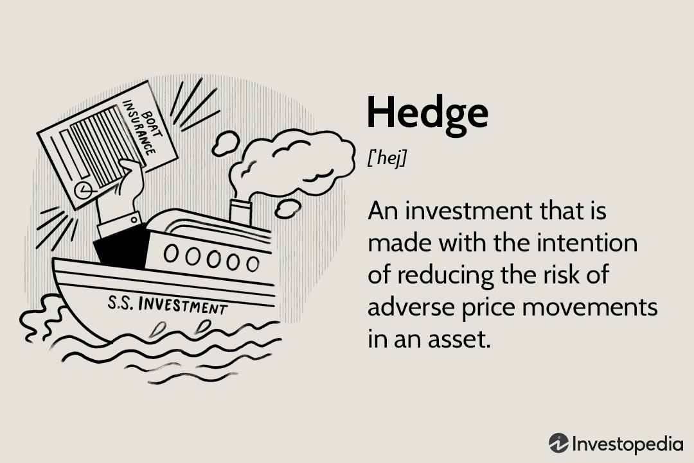

In today's fast-paced financial markets, investors constantly seek ways to optimize their portfolios. Hedge funds, financial strategies, and algorithmic trading have emerged as key components in this pursuit. Investors aim to enhance returns while managing risk effectively. As financial markets grow more complex, understanding how these components interact becomes crucial for gaining a competitive edge and making informed decisions.

Hedge funds, known for their flexibility and diverse strategies, play a pivotal role in today's investment landscape. They employ various techniques, such as derivatives and leverage, to hedge against market volatility and achieve returns irrespective of market conditions. These strategies often focus on reducing risks and maximizing gains, making them attractive to investors seeking absolute returns [1].



Financial strategies like diversification and asset allocation are fundamental in aligning investment portfolios with individual financial goals. By spreading investments across different asset classes, investors can mitigate risks and enhance returns. These strategies form the bedrock of sound portfolio management, ensuring that investors remain resilient in turbulent market conditions [2].

Algorithmic trading, on the other hand, harnesses technology to execute trades with precision and speed. Utilizing pre-programmed algorithms, it minimizes human error and enhances trading efficiency. With the ability to process vast amounts of data quickly, algorithmic trading allows for rapid decision-making and the deployment of sophisticated strategies. As institutional investors increasingly adopt this approach, it transforms how trading occurs in the financial markets [3].

Understanding the interaction of hedge funds, financial strategies, and algorithmic trading is integral to crafting successful investment outcomes. By effectively integrating these elements, investors can better navigate the complexities of modern markets and capitalize on opportunities. This article explores the intricate relationship between these components and the role of financial policy making in shaping investment success, highlighting key strategies and insights essential for investors seeking to optimize their portfolios.

References:
1. Fung, W., & Hsieh, D. A. (1997). Empirical Characteristics of Dynamic Trading Strategies: The Case of Hedge Funds. The Review of Financial Studies, 10(2), 275-302.
2. Markowitz, H. (1952). Portfolio Selection. The Journal of Finance, 7(1), 77-91.
3. Aldridge, I. (2013). High-Frequency Trading: A Practical Guide to Algorithmic Strategies and Trading Systems. John Wiley & Sons.

## Table of Contents

## Understanding Hedge Funds and Financial Strategies

Hedge funds represent a vanguard in financial strategies, employing sophisticated techniques to optimize returns and mitigate risks. Central to their modus operandi is the use of derivatives, which are financial securities deriving their value from an underlying asset. Derivatives, such as options and futures, allow hedge funds to hedge against potential losses by locking in prices or speculating on price movements, thus managing market [volatility](/wiki/volatility-trading-strategies) effectively.

The core objective of a hedge is risk mitigation without significant compromise on potential returns. For instance, if an investor holds a large position in a particular stock and anticipates market instability, they might use options to shield against potential downturns while maintaining exposure to upward movements. This balance between risk and reward is crucial in [hedge fund](/wiki/hedge-fund-trading-strategies) operations.

Moreover, hedge funds employ various financial strategies to align with investors' specific goals. Diversification is a pivotal strategy, which involves spreading investments across different asset classes or geographies to minimize unsystematic risk. By combining a variety of assets, hedge funds can achieve a more stable performance, as the positive performance of some investments may offset the negative performance of others.

Allocation is another fundamental component, determining the distribution of assets within a portfolio according to an investor’s risk tolerance, investment goals, and time horizon. Strategic asset allocation might involve a fixed proportion of different asset classes periodically rebalanced to suit market conditions, while tactical asset allocation allows hedge funds to capitalize on short-term market opportunities by adjusting allocations more dynamically.

Through the integration of these strategies, hedge funds not only aim to achieve absolute returns irrespective of market conditions but also tailor their approach to meet the diverse objectives of their clients, encompassing both risk management and return enhancement. This strategic versatility distinguishes hedge funds as formidable entities within the financial landscape.

## The Rise of Algorithmic Trading

Algorithmic trading represents a transformative approach in financial markets, leveraging technological advancements to enhance trading efficiency and precision. By utilizing pre-programmed sequences or algorithms, traders can execute orders with minimal manual intervention, significantly reducing the risk of human error. This level of automation allows traders to continuously monitor markets and execute trades based on predefined criteria.

A key advantage of [algorithmic trading](/wiki/algorithmic-trading) is its ability to process large volumes of data at unprecedented speeds. Algorithms analyze market information, including price, [volume](/wiki/volume-trading-strategy), and timing, enabling rapid decision-making and the deployment of complex trading strategies. This capability allows traders to capitalize on fleeting market opportunities that might be missed by human counterparts operating manually.

Institutional investors, such as hedge funds and investment banks, have increasingly adopted algorithmic trading, seeking to optimize their trading operations. This adoption enhances market efficiency by increasing [liquidity](/wiki/liquidity-risk-premium) and narrowing bid-ask spreads. However, it also introduces additional complexity into the financial markets, as the sheer speed and volume of algorithmically executed trades can induce volatility and pose systemic risks.

In conclusion, while algorithmic trading has undeniably improved the operational dynamics of financial markets, it necessitates careful consideration of potential risks and regulatory frameworks to ensure stability and fairness.

## Integrating Hedge Strategies with Algorithmic Trading

Combining hedge strategies with algorithmic trading provides investors with a robust toolkit for navigating the complexities of modern financial markets. The integration of derivatives, such as options, into algorithmic frameworks allows for sophisticated risk management and enhanced protection against adverse market movements.

Hedging, fundamentally, is the practice of reducing potential losses by taking an opposing position in a related asset. When integrated with algorithmic trading, hedging becomes more efficient as it benefits from the capabilities of algorithmic systems to process large data sets, identify market trends, and execute trades swiftly. This synergy also enables the continuous adjustment and optimization of hedging positions according to real-time market data.

For instance, options—a prevalent form of derivative used in hedging—can be programmed into trading algorithms to act as a safeguard against downward market trends. By employing algorithms to monitor, purchase, or sell options dynamically, investors can automate the defense of their portfolio against market declines while still capitalizing on upward trends. This automation significantly diminishes the impact of human error and fatigue, which are particularly prevalent in volatile markets.

The mathematical representation of options pricing, often utilizing the Black-Scholes model, illustrates how these financial instruments can be systematically integrated into algorithmic strategies. The model is given by:

$$
C(S, t) = S_0 N(d_1) - X e^{-rt} N(d_2)
$$

Where:
- $C(S, t)$ is the call option price.
- $S_0$ is the spot price of the underlying asset.
- $X$ is the strike price.
- $t$ is the time to expiration.
- $r$ is the risk-free interest rate.
- $N(d)$ is the cumulative distribution function of the standard normal distribution.

Variables such as volatility and changing market conditions can be continuously assessed by algorithms to dynamically adjust positions according to the calculated option prices, thus contributing to sophisticated and responsive risk management strategies.

In addition, the integration of hedging and algorithmic trading allows for the development of complex strategies such as delta-hedging. Delta-hedging focuses on creating a delta-neutral portfolio (where delta, the rate of change of the option price with respect to the underlying asset's price, is close to zero), ensuring minimal sensitivity to small price movements in the underlying asset. Algorithms can be employed to maintain this neutrality by constantly recalibrating the quantities of derivatives and stocks in the portfolio.

As a result, investors benefit from an automated risk management system that not only mitigates market volatility but also operates at a scale and speed that manual systems cannot match. Consequently, integrating hedge strategies with algorithmic trading equips investors with the ability to respond dynamically and efficiently to market fluctuations, while simultaneously optimizing returns.

## Challenges and Risks in Algo Trading and Hedging

Algorithmic trading has revolutionized financial markets with its ability to process vast amounts of data and execute trades at high speeds. However, this technological advantage is accompanied by certain challenges and risks that investors must navigate effectively. 

One of the primary concerns with algorithmic trading is the risk of system failures. Algorithms are dependent on technology infrastructure, and any hardware or software malfunction can result in significant financial losses. For example, a sudden power outage, network disruption, or unexpected software bug could halt trading operations or lead to erroneous trade executions. Such technical glitches were notably observed during the 2010 Flash Crash, where algorithmic trading contributed to extreme market volatility, highlighting the susceptibility of automated systems to technical faults.

Market manipulation is another risk associated with algorithmic trading. High-frequency trading ([HFT](/wiki/high-frequency-trading-strategies)) strategies can be susceptible to manipulative tactics like spoofing, where traders place false orders to manipulate prices in their favor. This can lead to unfair trading environments, disproportionately affecting retail investors and compromising market integrity.

Hedging strategies, while useful in mitigating some risks, introduce their own challenges. Implementing hedging through derivatives such as options or futures can increase management costs and require significant expertise to execute effectively. Additionally, the risk-return trade-off in hedging strategies is complex; while they aim to protect investments against adverse market movements, they can also limit potential returns if not optimally managed.

Investors engaged in algorithmic trading must adapt to evolving market conditions and regulatory frameworks. Regulatory bodies worldwide are increasingly scrutinizing algorithmic trading to prevent market abuse and ensure transparency. Compliance with these regulations, alongside the need to update algorithms in response to market innovations, adds another layer of complexity. Emerging regulations may demand more robust risk management and reporting mechanisms, necessitating continuous monitoring and adaptation of trading algorithms.

To mitigate these risks, investors need to maintain a robust technical infrastructure, employ rigorous testing, and adapt algorithms to align with current market and regulatory conditions. Regular [backtesting](/wiki/backtesting) with historical data can help ensure algorithms perform as expected in live scenarios, while also aiding in the continuous refinement of hedging strategies to balance risk and return effectively.

## How to Start with Algorithmic Trading: A Practical Approach

To begin with algorithmic trading, it is imperative for prospective traders to develop a strong foundation in both programming and finance. Programming skills are necessary because algorithmic trading relies heavily on the development of algorithms that automate trading decisions. Python is often the preferred language due to its rich set of libraries and frameworks that support financial analysis and algorithmic trading.

### Core Skills and Knowledge

1. **Programming Proficiency**: Adequate knowledge of programming languages, particularly Python, is essential. Understanding data manipulation and statistical analysis is crucial. Python libraries such as NumPy, pandas, and Matplotlib are fundamental for handling large datasets, conducting quantitative analysis, and visualizing data. Here is a simple code snippet that demonstrates using Python for calculating moving averages:

   ```python
   import pandas as pd

   def calculate_moving_average(prices, window_size):
       return prices.rolling(window=window_size).mean()

   data = pd.Series([10, 20, 30, 40, 50, 60, 70])
   moving_average = calculate_moving_average(data, window_size=3)
   print(moving_average)
   ```

2. **Financial Market Understanding**: A deep understanding of financial markets is paramount. This encompasses knowledge of different asset classes, market dynamics, trading strategies, and financial instruments like stocks, futures, and options. Recognizing market patterns and integrating them into algorithms is vital for successful trading.

### Key Steps to Start Algorithmic Trading

1. **Selecting a Trading Platform**: Choosing an appropriate trading platform is a critical step. The platform must support algorithmic functions and offer APIs for automated trading. Popular platforms include Interactive Brokers, MetaTrader, and QuantConnect. They provide necessary tools like historical data, backtesting environments, and real-time market access.

2. **Backtesting**: This process involves testing trading algorithms against historical data to evaluate their performance before applying them in live markets. It is vital to ensure that algorithms are robust, reliable, and capable of generating profitable decision-making strategies. Traders typically employ statistical metrics such as Sharpe ratio or maximum drawdown to assess strategy performance.

   ```python
   # Hypothetical example of a backtesting function
   def backtest_strategy(prices, strategy):
       # Analyze the strategy's performance on historical prices
       # Return performance metrics like profit, drawdowns, etc.
       # This is a placeholder for advanced backtesting logic
       pass
   ```

### Practical Considerations

Before implementing algorithms in live scenarios, it is essential to ensure they are adaptable to different market conditions. Moreover, traders should continuously monitor algorithms for potential improvements and adjust them as necessary to align with volatile market trends and regulatory changes. This dynamic nature demands a proactive approach to risk management and strategy optimization.

In summary, algorithmic trading blends programming aptitude with financial acumen. By selecting the appropriate trading platform and thoroughly backtesting strategies, traders can significantly enhance their ability to perform effectively in the competitive landscape of modern finance.

## Future Trends in Investing and Algorithmic Trading

With advancements in [machine learning](/wiki/machine-learning) and [artificial intelligence](/wiki/ai-artificial-intelligence), algorithmic trading is evolving at an unprecedented pace. These technological innovations are enabling traders to develop more sophisticated and adaptive algorithms, capable of processing vast amounts of data in real-time and making more accurate predictions about market movements. Machine learning models, such as neural networks and support vector machines, are increasingly being integrated into trading systems to enhance decision-making processes.

One significant trend is the growing emphasis on sustainable investing through algorithmic mechanisms. This approach involves integrating environmental, social, and governance ([ESG](/wiki/esg-investing)) criteria into the algorithmic trading process, allowing investors to align their portfolios with sustainable and ethical investment principles. Algorithms can be programmed to prioritize companies with strong ESG ratings, thus facilitating the shift towards more responsible investing.

To keep pace with these developments, investors must remain vigilant and informed about technological advancements and regulatory changes. As technology progresses, regulatory bodies continually update frameworks to ensure fair and transparent trading practices. Investors must adapt their strategies and algorithms in response to new regulations to maintain competitiveness. This requires a proactive approach to learning, encompassing programming skills, market analysis, and an understanding of changing legislations.

The future of algorithmic trading lies in the seamless integration of advanced technologies and sustainable practices. By leveraging the capabilities of AI and machine learning, investors can achieve more refined investment strategies that are both profitable and ethically responsible. As the financial landscape continues to evolve, those who are quick to adapt and innovate will be best positioned for success.

## Conclusion

The integration of hedge strategies with algorithmic trading presents a sophisticated avenue for enhancing risk management and optimizing returns in modern financial portfolios. This combination allows for a strategic approach where technology-driven methods are harnessed to automatically execute and adjust hedging tactics in response to market fluctuations. By employing derivatives like options within algorithmic programs, investors can shield their investments from adverse market conditions while simultaneously capitalizing on favorable trends.

Investors who leverage such technological advancements are often better positioned to enhance the resilience and profitability of their portfolios. By integrating sound financial strategies with cutting-edge technology, they can efficiently manage risk, reduce reliance on human intuition, and make data-driven decisions with precision and agility. This balance of technology and strategy not only streamlines operations but also amplifies the potential for achieving superior financial outcomes.

Looking forward, continued success in algorithmic trading and hedge strategies is closely tied to the ability to innovate and adapt in an ever-evolving financial landscape. As machine learning and artificial intelligence continue to advance, they offer promising avenues for even more sophisticated trading techniques. The key for investors lies in remaining vigilant and responsive to technological and regulatory changes, ensuring their strategies remain competitive and compliant within this dynamic environment. Embracing such a forward-thinking mindset will be crucial to maintaining a competitive edge and securing long-term success in the world of investing.

## References & Further Reading

[1]: Fung, W., & Hsieh, D. A. (1997). ["Empirical Characteristics of Dynamic Trading Strategies: The Case of Hedge Funds."](https://people.duke.edu/~dah7/rfs1997.pdf) The Review of Financial Studies, 10(2), 275-302.

[2]: Markowitz, H. (1952). ["Portfolio Selection."](https://onlinelibrary.wiley.com/doi/abs/10.1111/j.1540-6261.1952.tb01525.x) The Journal of Finance, 7(1), 77-91.

[3]: Aldridge, I. (2013). ["High-Frequency Trading: A Practical Guide to Algorithmic Strategies and Trading Systems."](https://www.amazon.com/High-Frequency-Trading-Practical-Algorithmic-Strategies/dp/1118343506) John Wiley & Sons.

[4]: Narang, R. K. (2013). ["Inside the Black Box: A Simple Guide to Quantitative and High-Frequency Trading."](https://onlinelibrary.wiley.com/doi/book/10.1002/9781118662717) John Wiley & Sons.

[5]: Engle, R. F. (2001). ["The Use of ARCH/GARCH Models in Applied Econometrics."](https://www.jstor.org/stable/2696523) Journal of Economic Perspectives, 15(4), 157-168.