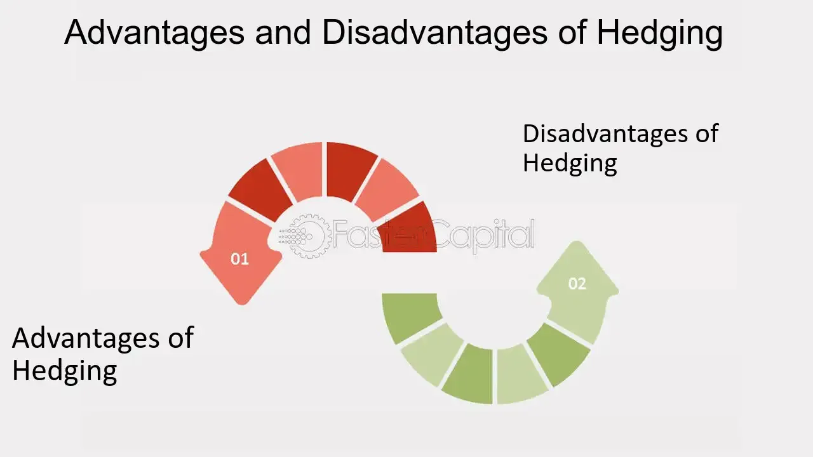

## Table of Contents

## What is hedge purchasing?

Hedge purchasing is a strategy used by people and companies to protect themselves from big changes in prices. Imagine you are a farmer who grows wheat. You might be worried that the price of wheat will go down before you can sell your crop. To avoid losing money, you can use hedge purchasing. This means you make a deal now to sell your wheat at a set price in the future. This way, no matter what happens to the wheat price later, you know how much money you will get.

Hedge purchasing is also used by people who buy things, not just those who sell. For example, an airline company needs a lot of fuel to run its planes. If the price of fuel goes up, it can cost them a lot more money. To avoid this, the airline can use hedge purchasing to buy fuel at a set price now, even if they will use it later. This helps them plan their costs better and avoid big surprises. In both cases, hedge purchasing is like insurance against price changes.

## Why is hedge purchasing important for businesses?

Hedge purchasing is important for businesses because it helps them manage risk. When a business knows it will need to buy or sell something in the future, like fuel or crops, they can use hedge purchasing to set a price now. This means they don't have to worry about prices going up or down later. It's like having a safety net that protects the business from big surprises in the market.

This stability is really helpful for planning. If a business knows how much they will pay for something important, they can make better budgets and plans. It also helps them avoid big losses if prices change a lot. By using hedge purchasing, businesses can focus on growing and improving, instead of worrying about price changes they can't control.

## What are the basic types of hedging instruments?

Hedging instruments are tools that businesses use to protect themselves from price changes. The first common type of hedging instrument is futures contracts. These are agreements to buy or sell something at a set price on a specific future date. For example, a farmer might use a futures contract to sell their wheat at a set price in six months, no matter what the market price is then. This helps them know how much money they will get, even if wheat prices fall.

Another type of hedging instrument is options. Options give the buyer the right, but not the obligation, to buy or sell something at a set price before a certain date. For instance, an airline might buy an option to purchase fuel at today's price, but they don't have to use it if fuel prices drop. This way, they can still benefit if prices go down, but they are protected if prices go up. Swaps are another type of hedging instrument, where two parties agree to exchange cash flows or other financial instruments. For example, a company might swap a variable [interest rate](/wiki/interest-rate-trading-strategies) for a fixed one to protect against interest rate changes.

## How does hedge purchasing help in managing financial risk?

Hedge purchasing helps businesses manage financial risk by giving them a way to lock in prices for things they need to buy or sell in the future. This means they don't have to worry about prices going up or down suddenly. For example, if a company knows it will need to buy a lot of fuel in six months, they can use hedge purchasing to set the price now. This way, if fuel prices go up, the company won't have to pay more than they planned. It's like having a safety net that protects them from big surprises in the market.

This stability is really important for businesses because it helps them plan better. When a company knows how much they will pay for something important, they can make budgets and plans without worrying about price changes. This can help them avoid big losses if prices change a lot. By using hedge purchasing, businesses can focus on growing and improving, instead of worrying about things they can't control. It's a way to manage risk and keep their finances stable.

## What are the key steps involved in implementing a hedge purchasing strategy?

Implementing a hedge purchasing strategy starts with figuring out what risks a business faces. For example, a company might worry about the price of raw materials like oil or wheat going up. They need to understand how much of these materials they will need in the future and how price changes could affect their business. Once they know this, they can decide which hedging instruments, like futures contracts or options, would work best for them. It's like choosing the right tool for a job.

After choosing the right hedging instrument, the next step is to actually make the deal. This means buying a futures contract or an option that locks in the price for the material they need. The company needs to keep track of these deals and make sure they match their future needs. It's important to review these hedges regularly to see if they are still working well or if they need to be changed. By doing this, a business can protect itself from price changes and plan better for the future.

## Can you explain the difference between a forward contract and a futures contract in hedging?

A forward contract and a futures contract are both used for hedging, but they work a bit differently. A forward contract is a private deal between two people or companies. They agree to buy or sell something at a set price on a specific future date. For example, a farmer might make a forward contract with a bakery to sell wheat at a certain price in six months. These contracts are not traded on a public market, so they can be customized to fit the needs of both parties.

On the other hand, a futures contract is a standardized agreement that is traded on a public exchange, like a stock market. This means that anyone can buy or sell these contracts. They are used for things like oil, gold, or wheat. Because they are standardized, everyone knows the terms and they can't be changed. This makes them easier to trade but less flexible than forward contracts. Both types of contracts help businesses lock in prices and manage risk, but they do it in different ways.

## What are the potential costs associated with hedge purchasing?

Hedge purchasing can help businesses avoid big price changes, but it also comes with some costs. One cost is the price of the hedging instrument itself. For example, if a company buys a futures contract or an option, they have to pay for it. This can add up, especially if they need to hedge a lot of their business. Another cost is the time and effort it takes to set up and manage these hedges. Businesses need to keep track of their contracts and make sure they are still working well, which can take a lot of work.

There's also the risk that the hedge might not work out as planned. If prices move in a way that the business didn't expect, they might end up losing money on the hedge. For example, if a company hedges against rising fuel prices but the prices actually go down, they could end up paying more than they needed to. This is called the cost of hedging ineffectiveness. It's important for businesses to think about these costs and weigh them against the benefits of having a hedge in place.

## How do companies determine the right amount of hedging needed?

Companies figure out how much hedging they need by looking at their business risks. They think about what they need to buy or sell in the future, like fuel or crops, and how much those prices might change. They also consider how much money they can lose if prices go up or down a lot. By understanding these risks, they can decide how much of their business to protect with hedging. It's like deciding how much insurance to buy based on how likely it is that something bad will happen.

Once they know their risks, companies use different tools to decide on the right amount of hedging. They might use math and computer models to predict how prices will change and how much hedging will help. They also look at how much it costs to hedge and compare that to how much they might lose without it. It's a balancing act, where they try to protect their business without spending too much on hedging. By doing this, they can find the right amount of hedging that keeps their business safe but doesn't cost too much.

## What are some common mistakes to avoid in hedge purchasing?

One common mistake in hedge purchasing is not understanding the risks well enough. Companies sometimes think they are protecting themselves, but they don't really know how prices might change or how much they could lose. They might hedge too much or too little, which can end up costing them money. It's important to do a lot of research and maybe even talk to experts to make sure they know what they're doing.

Another mistake is not keeping an eye on the hedges once they are set up. Prices can change a lot, and what worked well at the start might not be the best choice later. Companies need to check their hedges regularly and be ready to make changes if needed. If they forget to do this, they might miss out on better options or keep a hedge that's not helping them anymore.

## How does hedge accounting work and why is it important?

Hedge accounting is a way that businesses can match up the gains or losses from their hedging activities with the gains or losses from the thing they are trying to protect. Imagine a company uses a futures contract to lock in the price of fuel. With hedge accounting, they can record the changes in the value of the futures contract in the same place as the changes in the value of the fuel. This makes their financial reports more accurate and easier to understand. It shows how well the hedge is working to protect the company from price changes.

Hedge accounting is important because it helps businesses show a true picture of their financial health. Without it, the profits or losses from hedging might show up in different places on the financial statements, which can make things confusing. By using hedge accounting, companies can make sure that their financial reports tell a clear story about how they are managing risks. This is helpful for investors and other people who want to understand how the company is doing.

## What advanced hedging strategies can be used to optimize a company's financial position?

One advanced hedging strategy is called delta hedging. This is used a lot when dealing with options. The idea is to keep the overall value of a portfolio steady, even when prices move around. A company might own a bunch of options and use delta hedging to buy or sell the underlying asset to balance out any price changes. This way, they can reduce the risk of losing money if the market goes up or down suddenly. It's like fine-tuning a machine to keep it running smoothly no matter what happens.

Another strategy is called dynamic hedging. This means a company keeps changing their hedges as prices move. Instead of setting a hedge and forgetting about it, they watch the market closely and make adjustments all the time. For example, if fuel prices start to go up, a company might add more hedges to protect against even higher prices. This can be more work, but it can also help a company stay protected no matter how the market changes. It's like steering a boat through choppy waters, always ready to adjust the sails to keep on [course](/wiki/best-algorithmic-trading-courses).

## How can technology and data analytics enhance hedge purchasing decisions?

Technology and data analytics can really help companies make better decisions about hedge purchasing. By using computers and special software, businesses can look at a lot of information quickly. They can see how prices have changed in the past and use that to guess what might happen next. This helps them decide when to buy a hedge and how much they need. It's like having a smart helper that can look at a lot of numbers and tell you the best way to protect your business.

Data analytics also lets companies try out different hedging plans without actually doing them. They can use computer models to see how different strategies would work if prices go up or down. This way, they can pick the best plan before they spend any money. It's like playing a game where you can try different moves to see which one wins, but without any real risk. By using technology and data, companies can make smarter choices and keep their business safe from big price changes.

## References & Further Reading

[1]: Benninga, S. (2008). ["Financial Modeling"](https://mzfsir.weebly.com/uploads/6/3/0/5/6305731/financial_modeling.compressed.pdf). MIT Press.

[2]: Hull, J. C. (2018). ["Options, Futures, and Other Derivatives"](https://www.semanticscholar.org/paper/Options%2C-Futures%2C-and-Other-Derivatives-Hull/89bdee500c8623864fc9eb7a471546aa713acc44). Pearson.

[3]: Marcos Lopez de Prado. (2018). ["Advances in Financial Machine Learning"](https://www.amazon.com/Advances-Financial-Machine-Learning-Marcos/dp/1119482089). Wiley.

[4]: Stefan Jansen. (2020). ["Machine Learning for Algorithmic Trading"](https://github.com/stefan-jansen/machine-learning-for-trading). Packt.

[5]: Chan, E. (2009). ["Quantitative Trading: How to Build Your Own Algorithmic Trading Business"](https://github.com/ftvision/quant_trading_echan_book). Wiley.

[6]: Aronson, D. R. (2007). ["Evidence-Based Technical Analysis: Applying the Scientific Method and Statistical Inference to Trading Signals"](https://onlinelibrary.wiley.com/doi/book/10.1002/9781118268315). Wiley.

[7]: Pardo, R. (2008). ["The Evaluation and Optimization of Trading Strategies"](https://onlinelibrary.wiley.com/doi/book/10.1002/9781119196969). Wiley.

[8]: Lazar Janos. (2021). ["Algorithmic Trading Methods"](https://www.sciencedirect.com/book/9780128156308/algorithmic-trading-methods). BookBaby.