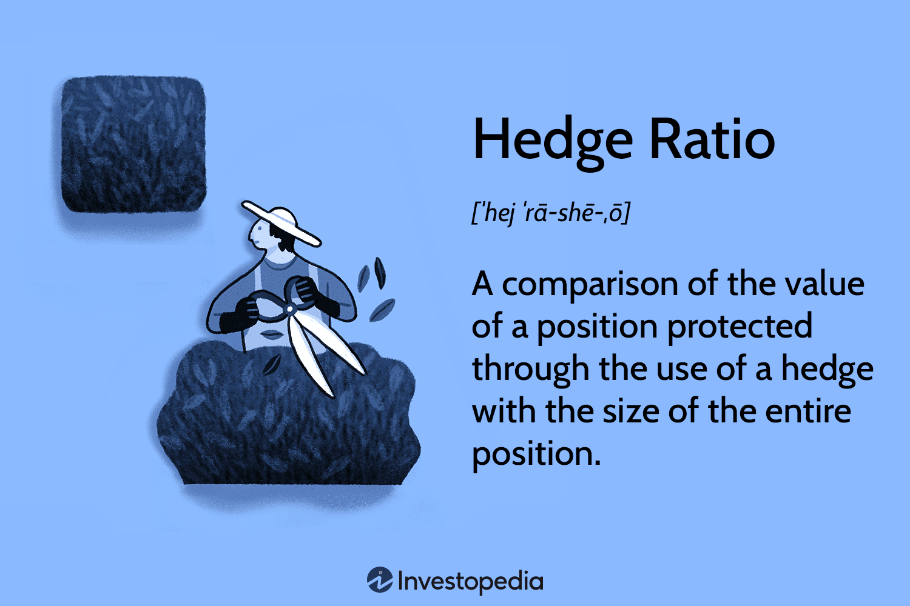

## Table of Contents

## What is a hedge ratio?

A hedge ratio is a number that tells you how much of one thing you need to balance out the risk of another thing. Imagine you own some stocks and you're worried their value might go down. To protect yourself, you might buy something else, like an option or a future, that goes up in value if your stocks go down. The hedge ratio helps you figure out how many of these protective items you need to buy to cover your stocks properly.

For example, if you have 100 shares of a stock and the hedge ratio is 0.5, you would need to buy 50 options to fully hedge your stock position. This ratio is important because if you get it wrong, you might not be fully protected or you might end up spending more than you need to. The hedge ratio can change based on how the market is behaving, so it's something traders and investors keep an eye on to make sure their protection stays effective.

## Why is the hedge ratio important in financial markets?

The hedge ratio is important in financial markets because it helps investors and traders manage their risk. When someone owns an asset, like stocks, they might worry about losing money if the price goes down. By using the hedge ratio, they can figure out exactly how much of another asset, like options or futures, they need to buy to protect themselves. This way, if the stock price drops, the value of the other asset they bought might go up, balancing out their losses.

Getting the hedge ratio right is crucial because if it's off, the protection might not work well. If the ratio is too low, the investor might still lose money because they didn't buy enough of the protective asset. If it's too high, they might spend more than they need to on protection, which can eat into their profits. Because the hedge ratio can change with market conditions, traders need to keep an eye on it and adjust their positions to make sure they stay protected without overspending.

## How is the hedge ratio calculated?

The hedge ratio is calculated by figuring out how much one thing moves compared to another thing. For example, if you want to hedge stocks with options, you look at how much the price of the stock changes when the price of the option changes. A common way to calculate this is by using the delta of an option, which shows how much the option's price will move for every $1 move in the stock price. If a stock goes up $1 and the option goes up $0.50, the delta is 0.50, and that becomes your hedge ratio.

Sometimes, you might use more complex math to calculate the hedge ratio, like regression analysis. This involves looking at past data to see how two things have moved together over time. By doing this, you can find a number that tells you how much of one thing you need to balance out the risk of the other thing. No matter which method you use, the goal is the same: to find the right amount of the protective asset to buy so that you're not too exposed to risk, but also not spending more than you need to on protection.

## What are the different types of hedge ratios?

There are mainly two types of hedge ratios that people talk about: the minimum variance hedge ratio and the delta hedge ratio. The minimum variance hedge ratio is about reducing risk as much as possible. It looks at how two things, like a stock and a futures contract, have moved together in the past. By using math, like regression analysis, you can figure out how much of the futures you need to buy to make your stock less risky. This type of hedge ratio is really useful for people who want to make sure their investments are as safe as they can be.

The delta hedge ratio is simpler and more common, especially when dealing with options. It uses the delta of an option, which tells you how much the option's price will change if the stock's price changes by $1. If a stock goes up $1 and the option goes up $0.50, the delta is 0.50, and that's your hedge ratio. This type of hedge ratio is great for people who want a quick and easy way to protect their investments without needing to do a lot of complicated math. Both types of hedge ratios help people manage risk, but they do it in different ways depending on what the investor needs.

## Can you explain the concept of the minimum variance hedge ratio?

The minimum variance hedge ratio is all about making your investments as safe as possible. Imagine you own some stocks and you're worried about their value going down. To protect yourself, you can buy something else, like futures contracts, that might go up in value if your stocks go down. The minimum variance hedge ratio helps you figure out exactly how many of these futures contracts you need to buy so that your overall risk is as low as it can be. It does this by looking at how the stocks and the futures have moved together in the past, using a math tool called regression analysis to find the perfect balance.

This type of hedge ratio is really helpful for people who want to make sure their investments are super safe. It's a bit more complicated than other ways of hedging because it involves looking at a lot of past data and doing some math. But the payoff is that it can make your investments much less risky. By finding the right number of futures contracts to buy, you can protect yourself from big losses without spending more money than you need to on that protection.

## How does the hedge ratio apply to options trading?

In options trading, the hedge ratio is really important because it helps you protect your investments. Imagine you own some stocks and you're worried about their value going down. You can buy options, like put options, to protect yourself. The hedge ratio tells you how many options you need to buy to balance out the risk of your stocks. For example, if the hedge ratio is 0.5, you would need to buy half as many options as you have shares of stock. This way, if your stock price drops, the value of your options might go up, helping to cover your losses.

The most common way to figure out the hedge ratio in options trading is by using something called the delta. The delta tells you how much the price of an option will change if the price of the stock changes by $1. If a stock goes up $1 and the option goes up $0.50, the delta is 0.50, and that becomes your hedge ratio. This is a simple and quick way to protect your investments without needing to do a lot of complicated math. By using the delta, you can make sure you're not too exposed to risk, but also not spending more than you need to on protection.

## What is the difference between a static and a dynamic hedge ratio?

A static hedge ratio is like setting it and forgetting it. You figure out the hedge ratio once, maybe using the delta of an option or some other method, and then you don't change it. You buy the right amount of options or futures to protect your stocks, and then you leave it alone. This can be easier and less work because you don't have to keep checking and changing things. But the downside is that if the market changes a lot, your protection might not work as well because you're not adjusting it.

A dynamic hedge ratio, on the other hand, is like constantly tweaking your protection. You keep checking the market and recalculating the hedge ratio. If the market moves, you buy or sell more options or futures to make sure you're still protected. This can be more work because you need to keep an eye on things and make changes, but it can also be more effective. By adjusting your hedge ratio as the market changes, you can make sure your protection stays strong no matter what happens.

## How do market conditions affect the hedge ratio?

Market conditions can change the hedge ratio because they affect how prices move. If the stock market is really calm and prices don't change much, the hedge ratio might stay pretty steady. But if the market gets wild and prices start jumping around a lot, the hedge ratio can change quickly. For example, if a stock starts moving a lot more than usual, you might need more options to protect it, which means the hedge ratio goes up. So, keeping an eye on the market and adjusting the hedge ratio can help make sure your investments stay safe.

Sometimes, big news or events can shake up the market and mess with the hedge ratio. If there's a surprise announcement from a company or a big economic report comes out, it can make stock prices move in ways you didn't expect. This can make the hedge ratio you were using not work as well anymore. That's why traders who use a dynamic hedge ratio keep checking the market and changing their protection to match what's happening. By doing this, they can make sure their hedge stays strong even when the market gets crazy.

## What role does correlation play in determining the hedge ratio?

Correlation is really important when figuring out the hedge ratio because it shows how two things move together. Imagine you own some stocks and you want to protect them by buying futures contracts. If the stocks and the futures move in the same way, they have a high correlation. But if they move in opposite ways, they have a low or negative correlation. The hedge ratio helps you find out how many futures you need to buy to balance out the risk of your stocks. If the correlation between the stocks and the futures is strong, you might need fewer futures to protect your stocks because they move together a lot.

But if the correlation is weak or changes a lot, you might need to adjust your hedge ratio more often. For example, if the stocks and the futures start moving differently because of new market conditions, the old hedge ratio might not work as well. You would need to buy more or fewer futures to keep your stocks protected. So, understanding and keeping an eye on the correlation between the things you're trying to hedge can help you set the right hedge ratio and make sure your investments stay safe.

## How can hedge ratios be used to manage portfolio risk?

Hedge ratios help manage portfolio risk by telling you how much of one thing you need to balance out the risk of another thing. Imagine you own some stocks and you're worried about their value going down. By using the hedge ratio, you can figure out how many options or futures you need to buy to protect your stocks. This way, if your stocks lose value, the options or futures you bought might go up in value, helping to cover your losses. It's like having an umbrella when it might rain – it keeps you from getting too wet if the weather turns bad.

The hedge ratio can change based on how the market is behaving, so it's important to keep an eye on it. If the market is calm, your hedge ratio might stay the same, but if things get wild and prices start moving a lot, you might need to adjust it. For example, if your stocks start moving more than usual, you might need to buy more options to keep them protected. By regularly checking and updating your hedge ratio, you can make sure your portfolio stays safe no matter what the market does. It's like adjusting your umbrella to keep the rain out as the wind changes direction.

## What are some common challenges faced when implementing hedge ratios?

One common challenge when using hedge ratios is figuring out the right number. The hedge ratio can change because of market conditions, so you have to keep an eye on it. If you don't adjust it when the market changes, your protection might not work as well. This can be a lot of work because you need to keep checking and maybe buying or selling more options or futures to keep your stocks safe.

Another challenge is understanding how things move together, called correlation. If the stocks and the things you're using to protect them start moving differently, the hedge ratio you were using might not be right anymore. This can happen because of big news or events that shake up the market. So, you have to keep watching the correlation and be ready to change your hedge ratio to make sure your investments stay protected.

## How do advanced statistical methods improve the accuracy of hedge ratio calculations?

Advanced statistical methods can make hedge ratio calculations more accurate by looking at how things have moved together in the past. One common method is regression analysis, which helps figure out the best number of options or futures to buy to protect your stocks. By using a lot of past data, these methods can find patterns that simpler ways might miss. This means you can get a hedge ratio that works better, even when the market is acting differently than usual.

Another way advanced statistics help is by dealing with things that can change the hedge ratio, like how much two things move together, which is called correlation. These methods can keep track of how the correlation changes over time and adjust the hedge ratio to match. This makes sure your protection stays strong, even if the market gets wild. By using these advanced tools, you can feel more confident that your investments are safe, no matter what happens in the market.

## What is the Hedge Ratio and how can it be understood?

The hedge ratio is an essential concept in financial risk management. It measures the degree to which a position is protected against adverse price movements by comparing the value of a hedged position to the total position. Mathematically, the hedge ratio ($HR$) is expressed as:

$$

HR = \frac{\text{Value of Hedged Position}}{\text{Total Position Value}} 
$$

A hedge ratio of 1 indicates full hedging, where the hedged position completely offsets the potential losses of the total position. Values less than 1 suggest partial hedging, where only a portion of the position is protected, while values greater than 1 could imply an over-hedged position potentially exposing the investor to risks from the hedge itself.

In practice, calculating an effective hedge ratio requires an understanding of the underlying asset [volatility](/wiki/volatility-trading-strategies) and the correlation between the asset being hedged and the hedging instrument. For instance, if an investor holds a stock position and wishes to hedge using options, the hedge ratio would help determine the number of options contracts needed to achieve the desired level of protection.

Investors and portfolio managers use the hedge ratio to balance their portfolios by reducing exposure to market volatility. By adjusting the hedge ratio, they can control the level of risk and potential return, tailoring their strategy to current market conditions and their risk tolerance.

Python can be a useful tool to calculate and adjust hedge ratios dynamically. For example, if we want to compute the hedge ratio for a futures contract, we might use historical price data to simulate scenarios and derive the optimal hedge ratio:

```python
import numpy as np

def calculate_hedge_ratio(asset_returns, hedge_instrument_returns):
    correlation_matrix = np.corrcoef(asset_returns, hedge_instrument_returns)
    correlation = correlation_matrix[0, 1]
    std_asset = np.std(asset_returns)
    std_hedge = np.std(hedge_instrument_returns)

    hedge_ratio = correlation * (std_asset / std_hedge)
    return hedge_ratio

# Example usage with hypothetical returns data
asset_returns = np.array([0.02, 0.03, -0.01, 0.01])
hedge_instrument_returns = np.array([0.01, 0.015, -0.005, 0.005])

optimal_hedge_ratio = calculate_hedge_ratio(asset_returns, hedge_instrument_returns)
print(f"Optimal Hedge Ratio: {optimal_hedge_ratio}")
```

This Python code calculates the optimal hedge ratio by considering the correlation and standard deviations of returns for the asset and the hedging instrument, aiding investors in making data-driven hedging decisions.

## How do financial ratios aid investment decisions?

Financial ratios are indispensable tools for investors, offering crucial insights into a company's performance and overall financial health. By analyzing these ratios, investors can make informed decisions regarding potential investments and effectively manage portfolio risk.

One of the most vital financial metrics is the Return on Investment (ROI), which measures the profitability of an investment relative to its cost. Mathematically, ROI is expressed as:

$$
\text{ROI} = \left(\frac{\text{Net Profit}}{\text{Investment Cost}}\right) \times 100
$$

A higher ROI indicates a more favorable return on the investment, guiding investors toward more lucrative opportunities.

Earnings Per Share (EPS) is another key financial ratio, assessing a company's profitability on a per-share basis. It is calculated as:

$$
\text{EPS} = \frac{\text{Net Income} - \text{Dividends on Preferred Stock}}{\text{Average Outstanding Shares}}
$$

EPS serves as a benchmark for evaluating a company's financial performance and can influence investment decisions by indicating the potential for growth and stability.

The debt-to-equity ratio is a pivotal metric for understanding a company's capital structure and financial leverage. This ratio compares the total debt to the total equity, providing insights into the relative proportions of debt and equity financing. The formula is:

$$
\text{Debt-to-Equity Ratio} = \frac{\text{Total Debt}}{\text{Total Equity}}
$$

A lower debt-to-equity ratio suggests a more financially stable company with less reliance on borrowed funds, which might be attractive to risk-averse investors.

These financial ratios, among others, arm investors with essential data for evaluating a company's fiscal health and performance. By analyzing ROI, EPS, and debt-to-equity ratios, investors can better assess potential investments' risks and rewards, aiding in more strategic portfolio management. Such measured assessments help investors optimize their portfolios, balancing risk and return effectively in an ever-evolving financial environment.

## What are Investment Strategies for Balancing Risk and Reward?

Investment strategies aim to optimize returns while effectively balancing risk. These strategies are shaped by an investor's goals, risk tolerance, and market conditions. 

Various strategies cater to different risk appetites. Aggressive growth strategies focus on maximizing capital appreciation by investing in potentially high-reward stocks, favoring companies with high growth prospects, often in emerging sectors like technology or biotech. These strategies, while potentially lucrative, come with heightened volatility and risk. Conversely, conservative income generation strategies prioritize stable returns through fixed-income securities, blue-chip stocks, and other low-risk investments, providing steady income streams with lower risk levels.

Incorporating hedge ratios into investment strategies enhances risk management. The hedge ratio represents the proportion of a position that is hedged to minimize risk. By calculating the optimal hedge ratio, investors can determine the necessary level of exposure to hedge against potential adverse price movements effectively. This calculation typically involves analyzing historical data, predicting future volatility, and considering current market conditions. 

For instance, in an equity portfolio, an investor may use options to hedge against market downturns. By purchasing put options, the investor can set a protective floor for the portfolio's value. If market prices fall, the gains from the puts can offset losses in the equity holdings. The hedge ratio here quantifies the extent of coverage needed, guiding the investor in deciding how many options contracts to buy relative to the value of the underlying assets.

Formulaically, the hedge ratio ($HR$) can be expressed as:

$$
HR = \frac{{\text{Value of Hedge}}}{{\text{Value of Total Position}}}
$$

This calculation assists in ensuring that the investor's exposure aligns with their risk tolerance and market outlook.

Effective risk management through hedge ratios also plays a crucial role in strategic asset allocation, where an investor diversifies across asset classes to optimize the risk-reward balance. Incorporating hedge ratios allows for dynamic adjustments to hedge levels as market conditions change, thus safeguarding investments without entirely sacrificing potential returns.

In summary, blending hedge ratios with diverse investment strategies not only mitigates risks but also allows investors to navigate varying market landscapes with greater confidence. By strategically aligning investment goals with risk management techniques, investors can enhance their ability to achieve desired financial outcomes.

## What is the Role of Algorithmic Trading?

Algorithmic trading, often referred to as 'algo trading,' represents a significant advancement in financial markets, leveraging computer programs to execute a large number of orders at high speed and with minimal human intervention. This technological innovation enables traders to implement strategies that rely on complex models and statistical algorithms to determine the optimal timing, price, and quantity of trade orders. At its core, [algorithmic trading](/wiki/algorithmic-trading) employs predetermined criteria to execute trades, which enhances precision and efficiency, two critical factors in modern financial markets.

Hedge ratios, integral to algorithmic trading strategies, serve a pivotal role in risk management. A hedge ratio determines the proportion of an asset exposed to market risk and is used to offset potential losses due to adverse price movements. In the context of algorithmic trading, these ratios are employed to ensure that the trading portfolio maintains a balanced exposure to desired risk levels, which can be dynamically adjusted in real-time as market conditions fluctuate.

The integration of hedge ratios into algorithmic trading systems involves the use of sophisticated algorithms that continuously monitor market data to adjust these ratios, maintaining an optimal balance between risk and return. For example, a simple algorithmic strategy might involve calculating a hedge ratio using the formula:

$$
\text{Hedge Ratio} = \frac{\text{Value of Position Hedged}}{\text{Total Value of Position}}
$$

Once the hedge ratio is determined, the algorithm can strategically place trades to align the portfolio with the desired risk profile. This process is automated, allowing for immediate recalibration as market volatility demands.

Moreover, algorithmic trading systems benefit from the ability to backtest strategies using historical data, thus refining hedge ratios and trading criteria based on past performance and predictive modeling. Python, among other programming languages, is frequently used in the development of these algorithms due to its robust libraries such as Pandas for data manipulation, NumPy for numerical computation, and libraries like statsmodels for statistical analysis.

In conclusion, algorithmic trading represents a paradigm shift in how financial transactions are executed, offering enhanced precision and risk management capabilities. Hedge ratios, when incorporated into these trading strategies, provide a mechanism to systematically manage and mitigate risk, ensuring that trading portfolios remain aligned with the investor's risk tolerance and market objectives.스

## How can hedge ratios be implemented in algo trading?

Implementing hedge ratios in algorithmic trading requires precision in calculating the level of protection to achieve risk mitigation effectively. Algorithms, integral to modern trading platforms, continuously assess market conditions, allowing for the dynamic adjustment of hedge ratios. This adaptability ensures that portfolios remain balanced even amid market fluctuations.

A hedge ratio is typically calculated by dividing the value of a hedged position by the total value of the position, expressed as a percentage. The purpose of a hedge ratio is to offset risk, particularly market risk, which is the potential for an investment's value to decrease due to changes in the market.

In algorithmic trading, this process begins with defining the parameters that the algorithm will monitor. These include price movements, market volatility, and other relevant financial metrics. Once these parameters are set, the algorithm can calculate the optimal hedge ratio in real-time. For example, the hedge ratio $HR$ can be calculated using the formula:

$$
HR = \frac{\text{Value of Hedged Position}}{\text{Total Value of Position}}
$$

In practice, an algorithm might employ Python to implement such calculations. Here's a basic example of how this could be coded:

```python
def calculate_hedge_ratio(hedged_value, total_position_value):
    if total_position_value == 0:
        return 0  # Avoid division by zero
    return hedged_value / total_position_value

hedged_position = 100000  # Example value
total_position = 500000   # Example value

hedge_ratio = calculate_hedge_ratio(hedged_position, total_position)
print(f"Hedge Ratio: {hedge_ratio:.2%}")
```

In the dynamic environments that algo trading operates, algorithms must adjust these ratios to reflect changes in market conditions such as price swings or shifts in volatility. For instance, if volatility increases, the algorithm might increase the hedge ratio to offer greater protection against potential losses. Conversely, during less volatile periods, the hedge ratio might be reduced to optimize potential returns.

This method of leveraging hedge ratios in algo trading significantly diminishes the impact of market volatility, safeguarding investor assets. By maintaining a balanced portfolio through calculated adjustments, investors can better manage potential losses and stabilize returns, making algorithmic trading a vital component of modern investment strategies.

## What are some practical examples of hedge ratios in case studies?

Case studies provide valuable insights into how hedge ratios are effectively applied by leading financial institutions. Notably, J.P. Morgan and Renaissance Technologies utilize hedge ratios as integral components of their risk management strategies.

**J.P. Morgan**

J.P. Morgan, a global leader in asset management and investment banking, employs precise hedge ratios particularly in its equity derivatives trading. The firm uses these ratios to protect against adverse market movements and maintain portfolio stability. For example, in equity options trading, hedge ratios, often referred to as delta, are used to measure the sensitivity of option prices relative to the underlying asset. By adjusting the delta, J.P. Morgan can appropriately hedge its positions to offset potential losses due to fluctuations in stock prices. This method helps ensure that the exposure of the portfolio is aligned with the anticipated market direction.

In practical terms, if J.P. Morgan holds a portfolio of equity options, the hedge ratio would be calculated as follows:

$$
\text{Hedge Ratio (Delta)} = \frac{\partial V}{\partial S}
$$

where $V$ is the price of the option, and $S$ is the price of the underlying stock. Continuous monitoring and adjusting of these ratios allow J.P. Morgan to dynamically manage risk and optimize its trading positions.

**Renaissance Technologies**

Renaissance Technologies, renowned for its quantitative investment strategies, utilizes hedge ratios to manage risks across various asset classes including equities, commodities, and currencies. The firm, founded by mathematician Jim Simons, is distinguished by its data-driven approach and algorithmically driven decisions. In its flagship Medallion Fund, Renaissance employs complex statistical models and hedge ratios to ensure that their investment positions are sufficiently protected against market volatility.

For multi-asset portfolios, Renaissance might implement hedge ratios in a multi-step approach. Initially, the firm would use historical data to model the expected returns and volatility of each asset class. Based on this analysis, Renaissance adjusts its portfolio's holdings to achieve a target hedge ratio that mitigates risk while seeking to exploit market inefficiencies.

The use of hedge ratios at Renaissance Technologies might include the application of covariance matrices to understand the relationships between different asset classes. This quantitative approach enables the firm to precisely calibrate the hedge ratios required to maintain a balanced and risk-adjusted investment portfolio. Such sophisticated risk management techniques have been a cornerstone of the firm's success, yielding significant returns for its investors over the years.

In summary, both J.P. Morgan and Renaissance Technologies exemplify the effective application of hedge ratios in real-world scenarios, underscoring their importance in contemporary risk management practices. By employing tailored hedge ratios, these firms strategically navigate complex financial landscapes, ensuring protection against market uncertainties while optimizing their investment outcomes.

## References & Further Reading

[1]: Black, F., & Scholes, M. (1973). ["The Pricing of Options and Corporate Liabilities."](https://www.cs.princeton.edu/courses/archive/fall09/cos323/papers/black_scholes73.pdf) The Journal of Political Economy, 81(3), 637-654.

[2]: Hull, J. C. (2017). ["Options, Futures, and Other Derivatives."](https://www.semanticscholar.org/paper/Options%2C-Futures%2C-and-Other-Derivatives-Hull/89bdee500c8623864fc9eb7a471546aa713acc44) Pearson.

[3]: Chan, E. P. (2013). ["Algorithmic Trading: Winning Strategies and Their Rationale."](https://github.com/ftvision/quant_trading_echan_book) Wiley.

[4]: Jorion, P. (2007). ["Value at Risk: The New Benchmark for Managing Financial Risk."](https://link.springer.com/article/10.1007/s11408-007-0057-3) McGraw-Hill.

[5]: Taleb, N. N. (1997). ["Dynamic Hedging: Managing Vanilla and Exotic Options."](https://archive.org/details/dynamichedgingma0000tale) Wiley.

[6]: Lopez de Prado, M. (2018). ["Advances in Financial Machine Learning."](https://www.amazon.com/Advances-Financial-Machine-Learning-Marcos/dp/1119482089) Wiley.

[7]: Jansen, S. (2018). ["Machine Learning for Algorithmic Trading."](https://github.com/stefan-jansen/machine-learning-for-trading) Apress.

[8]: Harvey, C. R., Liu, Y., & Zhu, H. (2016). ["... and the Cross-Section of Expected Returns."](https://people.duke.edu/~charvey/Research/Published_Papers/P118_and_the_cross.PDF) Journal of Finance.