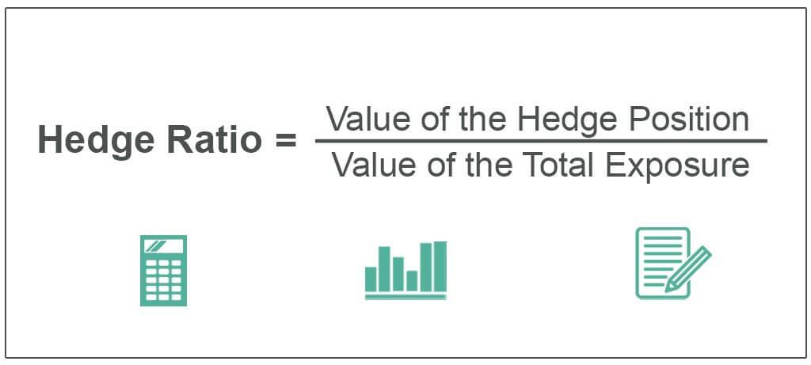

Understanding various financial ratios and strategies is crucial for enhancing decision-making in finance and investment. By employing concepts such as hedge ratios, financial ratios, investment strategies, and algorithmic trading, investors can significantly improve their ability to optimize portfolios and manage risk. 

The hedge ratio is a key component in managing financial risk. It measures the extent of risk offsetting by comparing the value of a hedged position to the total position. Calculating the correct hedge ratio is vital for investors aiming to maintain equilibrium in their investment portfolios.



Financial ratios, including Return on Investment (ROI), Earnings Per Share (EPS), and debt-to-equity ratios, offer valuable insights into a company's performance and financial health. These ratios form the backbone of evaluating investment opportunities and managing potential risks within a portfolio.

Investment strategies are designed to optimize returns while balancing risk, ranging from aggressive growth to conservative income generation. Incorporating concepts such as hedge ratios can provide a structured approach to risk management.

Meanwhile, algorithmic trading—utilizing computer programs to execute trades based on predetermined criteria—allows for precise and efficient transaction execution. Within these strategies, hedge ratios are instrumental in controlling risk.

Together, these elements form a comprehensive framework that supports informed decision-making and effective risk management in financial markets. Staying abreast of emerging trends can provide investors with a competitive edge in navigating these complex environments.

## Table of Contents

## Understanding the Hedge Ratio

The hedge ratio is an essential concept in financial risk management. It measures the degree to which a position is protected against adverse price movements by comparing the value of a hedged position to the total position. Mathematically, the hedge ratio ($HR$) is expressed as:

$$

HR = \frac{\text{Value of Hedged Position}}{\text{Total Position Value}} 
$$

A hedge ratio of 1 indicates full hedging, where the hedged position completely offsets the potential losses of the total position. Values less than 1 suggest partial hedging, where only a portion of the position is protected, while values greater than 1 could imply an over-hedged position potentially exposing the investor to risks from the hedge itself.

In practice, calculating an effective hedge ratio requires an understanding of the underlying asset [volatility](/wiki/volatility-trading-strategies) and the correlation between the asset being hedged and the hedging instrument. For instance, if an investor holds a stock position and wishes to hedge using options, the hedge ratio would help determine the number of options contracts needed to achieve the desired level of protection.

Investors and portfolio managers use the hedge ratio to balance their portfolios by reducing exposure to market volatility. By adjusting the hedge ratio, they can control the level of risk and potential return, tailoring their strategy to current market conditions and their risk tolerance.

Python can be a useful tool to calculate and adjust hedge ratios dynamically. For example, if we want to compute the hedge ratio for a futures contract, we might use historical price data to simulate scenarios and derive the optimal hedge ratio:

```python
import numpy as np

def calculate_hedge_ratio(asset_returns, hedge_instrument_returns):
    correlation_matrix = np.corrcoef(asset_returns, hedge_instrument_returns)
    correlation = correlation_matrix[0, 1]
    std_asset = np.std(asset_returns)
    std_hedge = np.std(hedge_instrument_returns)

    hedge_ratio = correlation * (std_asset / std_hedge)
    return hedge_ratio

# Example usage with hypothetical returns data
asset_returns = np.array([0.02, 0.03, -0.01, 0.01])
hedge_instrument_returns = np.array([0.01, 0.015, -0.005, 0.005])

optimal_hedge_ratio = calculate_hedge_ratio(asset_returns, hedge_instrument_returns)
print(f"Optimal Hedge Ratio: {optimal_hedge_ratio}")
```

This Python code calculates the optimal hedge ratio by considering the correlation and standard deviations of returns for the asset and the hedging instrument, aiding investors in making data-driven hedging decisions.

## How Financial Ratios Aid Investment Decisions

Financial ratios are indispensable tools for investors, offering crucial insights into a company's performance and overall financial health. By analyzing these ratios, investors can make informed decisions regarding potential investments and effectively manage portfolio risk.

One of the most vital financial metrics is the Return on Investment (ROI), which measures the profitability of an investment relative to its cost. Mathematically, ROI is expressed as:

$$
\text{ROI} = \left(\frac{\text{Net Profit}}{\text{Investment Cost}}\right) \times 100
$$

A higher ROI indicates a more favorable return on the investment, guiding investors toward more lucrative opportunities.

Earnings Per Share (EPS) is another key financial ratio, assessing a company's profitability on a per-share basis. It is calculated as:

$$
\text{EPS} = \frac{\text{Net Income} - \text{Dividends on Preferred Stock}}{\text{Average Outstanding Shares}}
$$

EPS serves as a benchmark for evaluating a company's financial performance and can influence investment decisions by indicating the potential for growth and stability.

The debt-to-equity ratio is a pivotal metric for understanding a company's capital structure and financial leverage. This ratio compares the total debt to the total equity, providing insights into the relative proportions of debt and equity financing. The formula is:

$$
\text{Debt-to-Equity Ratio} = \frac{\text{Total Debt}}{\text{Total Equity}}
$$

A lower debt-to-equity ratio suggests a more financially stable company with less reliance on borrowed funds, which might be attractive to risk-averse investors.

These financial ratios, among others, arm investors with essential data for evaluating a company's fiscal health and performance. By analyzing ROI, EPS, and debt-to-equity ratios, investors can better assess potential investments' risks and rewards, aiding in more strategic portfolio management. Such measured assessments help investors optimize their portfolios, balancing risk and return effectively in an ever-evolving financial environment.

## Investment Strategies: Balancing Risk and Reward

Investment strategies aim to optimize returns while effectively balancing risk. These strategies are shaped by an investor's goals, risk tolerance, and market conditions. 

Various strategies cater to different risk appetites. Aggressive growth strategies focus on maximizing capital appreciation by investing in potentially high-reward stocks, favoring companies with high growth prospects, often in emerging sectors like technology or biotech. These strategies, while potentially lucrative, come with heightened volatility and risk. Conversely, conservative income generation strategies prioritize stable returns through fixed-income securities, blue-chip stocks, and other low-risk investments, providing steady income streams with lower risk levels.

Incorporating hedge ratios into investment strategies enhances risk management. The hedge ratio represents the proportion of a position that is hedged to minimize risk. By calculating the optimal hedge ratio, investors can determine the necessary level of exposure to hedge against potential adverse price movements effectively. This calculation typically involves analyzing historical data, predicting future volatility, and considering current market conditions. 

For instance, in an equity portfolio, an investor may use options to hedge against market downturns. By purchasing put options, the investor can set a protective floor for the portfolio's value. If market prices fall, the gains from the puts can offset losses in the equity holdings. The hedge ratio here quantifies the extent of coverage needed, guiding the investor in deciding how many options contracts to buy relative to the value of the underlying assets.

Formulaically, the hedge ratio ($HR$) can be expressed as:

$$
HR = \frac{{\text{Value of Hedge}}}{{\text{Value of Total Position}}}
$$

This calculation assists in ensuring that the investor's exposure aligns with their risk tolerance and market outlook.

Effective risk management through hedge ratios also plays a crucial role in strategic asset allocation, where an investor diversifies across asset classes to optimize the risk-reward balance. Incorporating hedge ratios allows for dynamic adjustments to hedge levels as market conditions change, thus safeguarding investments without entirely sacrificing potential returns.

In summary, blending hedge ratios with diverse investment strategies not only mitigates risks but also allows investors to navigate varying market landscapes with greater confidence. By strategically aligning investment goals with risk management techniques, investors can enhance their ability to achieve desired financial outcomes.

## The Role of Algorithmic Trading

Algorithmic trading, often referred to as 'algo trading,' represents a significant advancement in financial markets, leveraging computer programs to execute a large number of orders at high speed and with minimal human intervention. This technological innovation enables traders to implement strategies that rely on complex models and statistical algorithms to determine the optimal timing, price, and quantity of trade orders. At its core, [algorithmic trading](/wiki/algorithmic-trading) employs predetermined criteria to execute trades, which enhances precision and efficiency, two critical factors in modern financial markets.

Hedge ratios, integral to algorithmic trading strategies, serve a pivotal role in risk management. A hedge ratio determines the proportion of an asset exposed to market risk and is used to offset potential losses due to adverse price movements. In the context of algorithmic trading, these ratios are employed to ensure that the trading portfolio maintains a balanced exposure to desired risk levels, which can be dynamically adjusted in real-time as market conditions fluctuate.

The integration of hedge ratios into algorithmic trading systems involves the use of sophisticated algorithms that continuously monitor market data to adjust these ratios, maintaining an optimal balance between risk and return. For example, a simple algorithmic strategy might involve calculating a hedge ratio using the formula:

$$
\text{Hedge Ratio} = \frac{\text{Value of Position Hedged}}{\text{Total Value of Position}}
$$

Once the hedge ratio is determined, the algorithm can strategically place trades to align the portfolio with the desired risk profile. This process is automated, allowing for immediate recalibration as market volatility demands.

Moreover, algorithmic trading systems benefit from the ability to backtest strategies using historical data, thus refining hedge ratios and trading criteria based on past performance and predictive modeling. Python, among other programming languages, is frequently used in the development of these algorithms due to its robust libraries such as Pandas for data manipulation, NumPy for numerical computation, and libraries like statsmodels for statistical analysis.

In conclusion, algorithmic trading represents a paradigm shift in how financial transactions are executed, offering enhanced precision and risk management capabilities. Hedge ratios, when incorporated into these trading strategies, provide a mechanism to systematically manage and mitigate risk, ensuring that trading portfolios remain aligned with the investor's risk tolerance and market objectives.스

## Implementing Hedge Ratios in Algo Trading

Implementing hedge ratios in algorithmic trading requires precision in calculating the level of protection to achieve risk mitigation effectively. Algorithms, integral to modern trading platforms, continuously assess market conditions, allowing for the dynamic adjustment of hedge ratios. This adaptability ensures that portfolios remain balanced even amid market fluctuations.

A hedge ratio is typically calculated by dividing the value of a hedged position by the total value of the position, expressed as a percentage. The purpose of a hedge ratio is to offset risk, particularly market risk, which is the potential for an investment's value to decrease due to changes in the market.

In algorithmic trading, this process begins with defining the parameters that the algorithm will monitor. These include price movements, market volatility, and other relevant financial metrics. Once these parameters are set, the algorithm can calculate the optimal hedge ratio in real-time. For example, the hedge ratio $HR$ can be calculated using the formula:

$$
HR = \frac{\text{Value of Hedged Position}}{\text{Total Value of Position}}
$$

In practice, an algorithm might employ Python to implement such calculations. Here's a basic example of how this could be coded:

```python
def calculate_hedge_ratio(hedged_value, total_position_value):
    if total_position_value == 0:
        return 0  # Avoid division by zero
    return hedged_value / total_position_value

hedged_position = 100000  # Example value
total_position = 500000   # Example value

hedge_ratio = calculate_hedge_ratio(hedged_position, total_position)
print(f"Hedge Ratio: {hedge_ratio:.2%}")
```

In the dynamic environments that algo trading operates, algorithms must adjust these ratios to reflect changes in market conditions such as price swings or shifts in volatility. For instance, if volatility increases, the algorithm might increase the hedge ratio to offer greater protection against potential losses. Conversely, during less volatile periods, the hedge ratio might be reduced to optimize potential returns.

This method of leveraging hedge ratios in algo trading significantly diminishes the impact of market volatility, safeguarding investor assets. By maintaining a balanced portfolio through calculated adjustments, investors can better manage potential losses and stabilize returns, making algorithmic trading a vital component of modern investment strategies.

## Case Studies: Hedge Ratios in Practice

Case studies provide valuable insights into how hedge ratios are effectively applied by leading financial institutions. Notably, J.P. Morgan and Renaissance Technologies utilize hedge ratios as integral components of their risk management strategies.

**J.P. Morgan**

J.P. Morgan, a global leader in asset management and investment banking, employs precise hedge ratios particularly in its equity derivatives trading. The firm uses these ratios to protect against adverse market movements and maintain portfolio stability. For example, in equity options trading, hedge ratios, often referred to as delta, are used to measure the sensitivity of option prices relative to the underlying asset. By adjusting the delta, J.P. Morgan can appropriately hedge its positions to offset potential losses due to fluctuations in stock prices. This method helps ensure that the exposure of the portfolio is aligned with the anticipated market direction.

In practical terms, if J.P. Morgan holds a portfolio of equity options, the hedge ratio would be calculated as follows:

$$
\text{Hedge Ratio (Delta)} = \frac{\partial V}{\partial S}
$$

where $V$ is the price of the option, and $S$ is the price of the underlying stock. Continuous monitoring and adjusting of these ratios allow J.P. Morgan to dynamically manage risk and optimize its trading positions.

**Renaissance Technologies**

Renaissance Technologies, renowned for its quantitative investment strategies, utilizes hedge ratios to manage risks across various asset classes including equities, commodities, and currencies. The firm, founded by mathematician Jim Simons, is distinguished by its data-driven approach and algorithmically driven decisions. In its flagship Medallion Fund, Renaissance employs complex statistical models and hedge ratios to ensure that their investment positions are sufficiently protected against market volatility.

For multi-asset portfolios, Renaissance might implement hedge ratios in a multi-step approach. Initially, the firm would use historical data to model the expected returns and volatility of each asset class. Based on this analysis, Renaissance adjusts its portfolio's holdings to achieve a target hedge ratio that mitigates risk while seeking to exploit market inefficiencies.

The use of hedge ratios at Renaissance Technologies might include the application of covariance matrices to understand the relationships between different asset classes. This quantitative approach enables the firm to precisely calibrate the hedge ratios required to maintain a balanced and risk-adjusted investment portfolio. Such sophisticated risk management techniques have been a cornerstone of the firm's success, yielding significant returns for its investors over the years.

In summary, both J.P. Morgan and Renaissance Technologies exemplify the effective application of hedge ratios in real-world scenarios, underscoring their importance in contemporary risk management practices. By employing tailored hedge ratios, these firms strategically navigate complex financial landscapes, ensuring protection against market uncertainties while optimizing their investment outcomes.

## Challenges and Future Trends

In the context of hedge ratio implementation, several challenges can impede effective risk management. One significant issue is model risk, which arises from using incorrect or overly simplistic models that fail to capture market complexities. This can lead to inaccurate hedge ratios and, consequently, inadequate hedging strategies. For instance, reliance on historical data that does not account for unprecedented market shifts can result in suboptimal hedging.

Transaction costs are another obstacle. They can erode the benefits of hedging by eating into returns, especially in high-frequency trading environments. Frequent adjustments to hedge ratios require buying and selling of assets, which incurs costs. This necessitates a careful balance between the frequency of rebalancing and the associated costs to ensure profitability.

Looking forward, technological advancements offer promising solutions to these challenges. Artificial intelligence (AI) and [machine learning](/wiki/machine-learning) are poised to revolutionize hedge ratio calculations by enabling more sophisticated modeling and real-time data analysis. These technologies can enhance the precision of hedge ratios by identifying patterns and correlations in vast datasets that are beyond human capability.

Blockchain technology also presents opportunities by providing transparent, secure, and immutable record-keeping. This can streamline the settlement processes and reduce counterparty risks, making the strategies more efficient and less costly.

Adapting to these technologies can unlock new avenues for optimizing returns and managing risks. Leveraging AI to dynamically adjust hedge ratios in response to real-time market changes or employing machine learning algorithms to forecast potential market moves are examples of how investors can enhance their risk management frameworks. Meanwhile, blockchain could simplify transaction processes, lowering costs and increasing the overall efficiency of hedging activities. By staying abreast of these trends, investors and financial institutions can gain competitive advantages, ensuring robust and agile risk management strategies in an ever-evolving financial landscape.

## Conclusion

Understanding and implementing hedge ratios, financial ratios, and algorithmic trading strategies is crucial for investors seeking to optimize risk management and maximize returns. The hedge ratio, a key element in offsetting risk, allows investors to balance their portfolios effectively by comparing the value of hedged positions to the total exposure. This metric is essential in mitigating the impact of market fluctuations.

Financial ratios provide a comprehensive analysis of a company's performance and financial health, supporting investment decision-making. Key ratios such as Return on Investment (ROI), Earnings Per Share (EPS), and debt-to-equity ratios offer insights into potential investment opportunities and help in assessing the risk profile of various financial instruments.

Algorithmic trading, a staple in modern financial markets, utilizes sophisticated computer programs to execute trades with precision and speed. Incorporating hedge ratios into algorithmic trading strategies enhances risk management by continuously monitoring market conditions and adjusting positions in real time to minimize losses from volatility.

Staying informed on emerging trends is vital as the financial landscape evolves with advancements in technology, such as [artificial intelligence](/wiki/ai-artificial-intelligence), machine learning, and blockchain. These innovations promise to refine the precision of hedge ratios, offering new opportunities for risk management and returns optimization. Adapting to these trends not only provides a robust framework for navigating financial markets but also grants competitive advantages to those who harness their potential effectively.

## References & Further Reading

[1]: Black, F., & Scholes, M. (1973). ["The Pricing of Options and Corporate Liabilities."](https://www.cs.princeton.edu/courses/archive/fall09/cos323/papers/black_scholes73.pdf) The Journal of Political Economy, 81(3), 637-654.

[2]: Hull, J. C. (2017). ["Options, Futures, and Other Derivatives."](https://www.semanticscholar.org/paper/Options%2C-Futures%2C-and-Other-Derivatives-Hull/89bdee500c8623864fc9eb7a471546aa713acc44) Pearson.

[3]: Chan, E. P. (2013). ["Algorithmic Trading: Winning Strategies and Their Rationale."](https://github.com/ftvision/quant_trading_echan_book) Wiley.

[4]: Jorion, P. (2007). ["Value at Risk: The New Benchmark for Managing Financial Risk."](https://link.springer.com/article/10.1007/s11408-007-0057-3) McGraw-Hill.

[5]: Taleb, N. N. (1997). ["Dynamic Hedging: Managing Vanilla and Exotic Options."](https://archive.org/details/dynamichedgingma0000tale) Wiley.

[6]: Lopez de Prado, M. (2018). ["Advances in Financial Machine Learning."](https://www.amazon.com/Advances-Financial-Machine-Learning-Marcos/dp/1119482089) Wiley.

[7]: Jansen, S. (2018). ["Machine Learning for Algorithmic Trading."](https://github.com/stefan-jansen/machine-learning-for-trading) Apress.

[8]: Harvey, C. R., Liu, Y., & Zhu, H. (2016). ["... and the Cross-Section of Expected Returns."](https://people.duke.edu/~charvey/Research/Published_Papers/P118_and_the_cross.PDF) Journal of Finance.