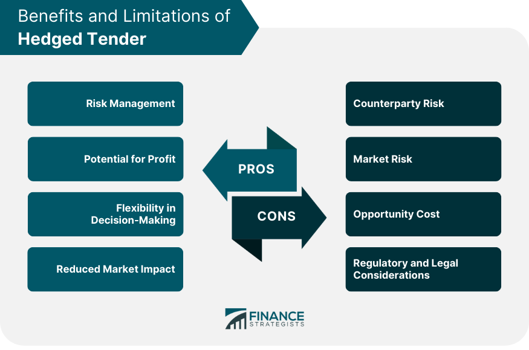

## Table of Contents

## What is a hedged tender offer?

A hedged tender offer is a way for someone to buy a lot of shares in a company without taking too much risk. When someone wants to buy a big part of a company, they might use a tender offer. This means they offer to buy shares from the people who own them at a certain price. But, to make it safer, they can use a hedge. This means they do something to protect themselves if the price of the shares goes down while they are trying to buy them.

To do this, they might buy options or other financial tools that will make money if the share price goes down. This way, if the share price drops, the money they lose on the shares can be made up by the money they make on the hedge. It's like having a backup plan. This makes the person trying to buy the company feel safer about making the offer, because they know they won't lose too much money if things don't go as planned.

## How does a hedged tender offer differ from a regular tender offer?

A regular tender offer is when someone wants to buy a lot of shares in a company and they offer to buy them from the shareholders at a set price. It's pretty straightforward. The person making the offer hopes that enough shareholders will sell their shares so they can get control of the company. But, there's a risk because if the share price goes down while they're trying to buy them, they could lose money.

A hedged tender offer is different because it adds a safety net. The person making the offer uses financial tools, like options, to protect themselves from losing too much money if the share price drops. This means they can feel more secure about making the offer because they have a backup plan. So, the main difference is that a hedged tender offer includes this extra step to manage risk, while a regular tender offer does not.

## What are the main components of a hedged tender offer?

A hedged tender offer has two main parts: the tender offer itself and the hedge. The tender offer part is when someone wants to buy a lot of shares in a company. They offer to buy the shares from the people who own them at a certain price. They hope enough people will sell their shares so they can take control of the company. But, there's a risk because if the share price goes down while they're trying to buy the shares, they could lose money.

The second part is the hedge. This is like a safety net. The person making the offer uses financial tools, like options, to protect themselves from losing too much money if the share price drops. Options are agreements that give them the right to buy or sell shares at a set price in the future. If the share price goes down, the money they lose on the shares can be made up by the money they make on the options. This makes the person feel safer about making the offer because they have a backup plan.

## Why might a company use a hedged tender offer?

A company might use a hedged tender offer when they want to buy a lot of shares in another company but they're worried about the risks. If the share price of the company they're trying to buy goes down while they're making their offer, they could lose a lot of money. By using a hedged tender offer, they can protect themselves from these risks. They do this by buying financial tools, like options, that will make money if the share price goes down. This way, any money they lose on the shares can be made up by the money they make on the options.

Using a hedged tender offer can also make the company feel more confident about making the offer. Knowing they have a safety net in place can make them more willing to go ahead with their plan to buy the other company. This can be important because taking over another company is a big decision, and having a way to manage the risks can help make the process smoother and less stressful.

## What are the risks associated with participating in a hedged tender offer?

When a company participates in a hedged tender offer, there are risks involved. One big risk is that the price of the shares they want to buy might drop a lot. Even though they use a hedge to protect themselves, the hedge might not cover all their losses. This means they could still lose money if the share price falls more than they expected.

Another risk is that the hedge itself can cost money. The company has to pay for the financial tools they use to hedge, like options. If the share price doesn't change much or goes up, the money they spent on the hedge might be wasted. This can make the whole process of buying the shares more expensive than they planned.

Lastly, there's a risk that not enough shareholders will sell their shares. If the company can't buy enough shares to take control of the other company, their plan might fail. Even with a hedge, this can be a big setback and could affect their reputation and future business plans.

## How can investors protect themselves when participating in a hedged tender offer?

Investors can protect themselves when participating in a hedged tender offer by doing their homework first. They should look at the company they want to buy shares from and see how its share price has been moving. They should also think about why the share price might go up or down. This can help them decide if the price they are offering for the shares is a good one. They should also read all the details about the tender offer and the hedge. This way, they can understand how the hedge will work and what it will cost them.

Another way investors can protect themselves is by being ready for different outcomes. They should have a plan for what they will do if the share price goes down a lot, even with the hedge. They might want to set a limit on how much money they are willing to lose. They should also think about what they will do if not enough shareholders sell their shares. By being prepared for these possibilities, investors can make smarter choices and lower their risks.

## What are the legal considerations and regulations surrounding hedged tender offers?

When a company wants to make a hedged tender offer, they need to follow certain rules and laws. In the United States, the Securities and Exchange Commission (SEC) is in charge of these rules. The company has to tell the SEC about their offer and share a lot of information with the public. This includes details about the price they are offering for the shares and how they are planning to hedge their offer. They also need to explain why they are making the offer and what they plan to do with the company they want to buy. This is to make sure everything is done fairly and openly, so shareholders can make good decisions.

There are also rules about how the hedge works. The company has to be careful that their hedge doesn't break any laws about trading or manipulating the market. For example, they can't use the hedge to trick people into thinking the share price will go up or down. They also need to make sure they are not breaking any rules about insider trading, which means using secret information to make money. If they break these rules, they could get into big trouble with the SEC and other regulators. So, it's important for them to work with lawyers and experts to make sure they are doing everything right.

## Can you explain the financial mechanics behind a hedged tender offer?

A hedged tender offer is when a company wants to buy a lot of shares in another company and they use a special way to make it safer. They offer to buy the shares at a set price and hope that enough people will sell them their shares. But, they also use something called a hedge to protect themselves. A hedge is like a backup plan. They might buy options, which are agreements that let them buy or sell shares at a certain price in the future. If the share price goes down while they are trying to buy the shares, the money they lose on the shares can be made up by the money they make on the options.

The financial mechanics behind a hedged tender offer work like this: First, the company figures out how many shares they want to buy and at what price. Then, they decide how to hedge their offer. They might buy put options, which give them the right to sell shares at a set price. If the share price drops, they can sell the shares at the higher price they locked in with the options, which helps them not lose as much money. But, buying these options costs money, so they have to think about whether the cost of the hedge is worth it. If the share price goes up instead, they might lose the money they spent on the hedge, but they will still have to pay the set price for the shares they are buying. This way, they balance the risk of losing money on the shares with the cost of the hedge.

## What are some real-world examples of hedged tender offers?

One real-world example of a hedged tender offer happened in 2013 when Carl Icahn, a famous investor, wanted to buy shares in Dell Inc. Dell was going through a big change and its share price was going up and down a lot. Icahn thought the price was too low, so he offered to buy shares at a higher price. But, to be safe, he used a hedge. He bought options that would make him money if Dell's share price went down. This way, if the price dropped while he was trying to buy the shares, he wouldn't lose as much money. In the end, Icahn's plan didn't work out because not enough people sold their shares to him, but the hedge helped him manage the risk.

Another example was when Pershing Square Capital Management, run by Bill Ackman, made a hedged tender offer for Allergan in 2014. Allergan makes medicine and its share price was also moving a lot. Ackman wanted to buy a lot of shares in Allergan, but he knew the price could go down while he was trying to buy them. So, he used a hedge. He bought options that would pay off if Allergan's share price went down. This helped him feel safer about making the offer. In the end, Allergan was bought by another company, but Ackman's hedge helped him manage the risk during the process.

## How do hedged tender offers impact the stock market and the company's stock price?

When a company makes a hedged tender offer, it can shake things up in the stock market. People who own shares in the company being targeted might start selling their shares or buying more, depending on what they think will happen. This can make the stock price go up and down a lot. If a lot of people think the company making the offer will succeed, the stock price might go up because they believe the company will be worth more. But, if people are worried that the offer won't work out, the stock price might go down. The hedge that the company uses can also affect the stock price. If a lot of people know about the hedge, they might try to guess how it will work and trade the stock based on that.

The company's stock price can also be affected by how the hedged tender offer turns out. If the company making the offer ends up buying a lot of shares, the stock price might go up because they now have more control over the company. But, if the offer fails and not enough people sell their shares, the stock price might drop. The hedge can help the company making the offer feel safer, but it doesn't always work perfectly. If the stock price goes down a lot more than they expected, they might still lose money, even with the hedge. This can make other investors nervous and cause them to sell their shares, which can push the stock price down even more.

## What are the strategic advantages of using a hedged tender offer over other methods of corporate restructuring?

Using a hedged tender offer can give a company a big advantage when they want to take over another company. It helps them feel safer about making the offer because they have a backup plan. If the share price of the company they want to buy goes down while they're trying to buy it, the hedge can help them not lose as much money. This can make them more willing to go ahead with their plan because they know they won't be taking too big of a risk. It also lets them offer a higher price for the shares, which can make more shareholders want to sell and help them get control of the company faster.

Another good thing about hedged tender offers is that they can be quicker than other ways of taking over a company. Sometimes, other methods like a full merger or acquisition can take a long time because they need a lot of talks and agreements. With a hedged tender offer, the company can start buying shares right away and see if they can get enough to take control. If it doesn't work out, the hedge can help them not lose too much money. This makes it a smart choice for companies that want to move fast and still keep their risks under control.

## How does the success of a hedged tender offer influence future corporate strategies and investor relations?

When a hedged tender offer works out well, it can change how a company thinks about taking over other companies in the future. They might decide to use hedged tender offers more often because they see it as a safe and quick way to grow their business. This success can also make them feel more confident about making big moves and trying new things. They might start looking for more companies to buy and use the same strategy again. This can help them grow faster and become a bigger player in their industry.

The success of a hedged tender offer can also make investors feel more positive about the company. When investors see that the company can pull off a big takeover without losing too much money, they might trust the company more. This can make them more likely to buy the company's stock or support its future plans. Good investor relations can help the company raise more money and do even more takeovers. On the other hand, if the hedged tender offer fails, it might make investors worried and less likely to support the company's future moves.

## What are Hedged Tender Strategies and how can they be understood?

A hedged tender is a strategic financial approach designed to manage risk during a company's tender offer for its shares. Tender offers occur when a company or a third party proposes to purchase a certain number of shares from existing shareholders, typically at a premium price. This process often aims at gaining control over the company or consolidating ownership. However, share prices can be volatile during such offers, creating uncertainty for investors.

A key tactic within hedged tenders is the practice of selling short a portion of shares with the anticipation that not all shares tendered will be accepted. The underlying principle is to capitalize on the price difference between the market price and the tender offer price, thereby securing a profit regardless of the offered acceptance level. For example, suppose a shareholder owns 1,000 shares of a company offering a tender at $50 per share, but only a fraction of shares are likely to be accepted. They might choose to sell short 500 shares in anticipation that not all shares will be accepted, thereby locking in a margin of profit from the shares tendered at the offer price.

The mechanics of a hedged tender involve several critical steps:

1. **Identify the Tender Mix:** Determine the likelihood of full, partial, or no acceptance of shares in the tender offer. This assessment helps in deciding the portion of shares to hedge through short selling.

2. **Execute Short Sales:** Sell short the selected fraction of shares to create a buffer against price volatility. This involves borrowing shares to sell at the current market price with the promise to return them, ideally after buying back at a lower price if the market reacts unfavorably.

3. **Calculate Potential Outcomes:** Use projected scenarios to estimate potential gains or losses. This calculation incorporates variables such as the acceptance ratio (percentage of shares likely accepted in the tender), market price fluctuation, and transaction costs. The formula might look something like:
$$
   \text{Net Gain/Loss} = (\text{Tender Price} \times \text{Accepted Shares}) + (\text{Market Price} \times \text{Shorted Shares}) - \text{Transaction Costs}

$$
   This formula helps determine the net financial result from the hedged strategy.

4. **Manage Risks:** Continuously monitor market behavior and adjust the strategy as needed. Factors like changes in acceptance probability and fluctuations in stock price require agile management to safeguard the intended outcome.

By engaging in hedged tenders, investors effectively lock in profits by minimizing the risk associated with tender offer rejections or partial acceptances. This strategy can offer a shield against potential losses, serving as a protective mechanism in a corporate landscape characterized by unexpected shifts in ownership structures. While providing this protection, hedged tenders must be managed with precision to account for market conditions, regulatory frameworks, and transaction intricacies to ensure successful execution.

## References & Further Reading

[1]: Vidyamurthy, G. (2004). ["Pairs Trading: Quantitative Methods and Analysis."](https://www.wiley.com/en-us/Pairs+Trading%3A+Quantitative+Methods+and+Analysis-p-9780471460671) John Wiley & Sons.

[2]: Chan, E. (2009). ["Quantitative Trading: How to Build Your Own Algorithmic Trading Business."](https://github.com/ftvision/quant_trading_echan_book) John Wiley & Sons.

[3]: Jansen, S. (2020). ["Machine Learning for Algorithmic Trading: Second Edition."](https://www.amazon.com/Machine-Learning-Algorithmic-Trading-alternative/dp/1839217715) Packt Publishing.

[4]: Aronson, D. R. (2006). ["Evidence-Based Technical Analysis: Applying the Scientific Method and Statistical Inference to Trading Signals."](https://www.amazon.com/Evidence-Based-Technical-Analysis-Scientific-Statistical/dp/0470008741) Wiley.

[5]: Lopez de Prado, M. (2018). ["Advances in Financial Machine Learning."](https://www.amazon.com/Advances-Financial-Machine-Learning-Marcos/dp/1119482089) Wiley.

[6]: Berger, R. W., & Nadler, J. (2011). ["Hedge Funds: Formation, Operation, and Regulation."](https://www.amazon.com/Hedge-Funds-Formation-Operation-Regulation/dp/1949884759) Wolters Kluwer.